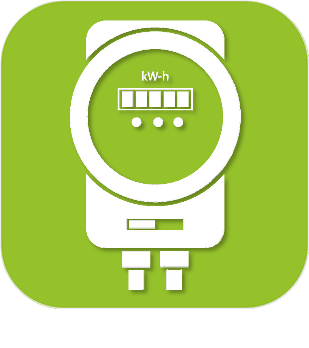

>**Importante**
>Solo los complementos oficiales tienen su documentación aquí. Puede consultar la documentación de los otros complementos directamente desde Jeedom Market. Una vez en el complemento en cuestión, haga clic en la documentación.
>Podéis ver [aquí](https://market.jeedom.com/index.php?v=d&p=market&type=plugin&categorie=energy) todos los complementos oficiales en esta categoría

| | | | |
|--- | --- | --- | ---|
||Deslastre de carga|Complemento para gestionar el desprendimiento de carga. 3 modos de funcionamiento posibles :  - Inteligente  - Jerárquico  - Cascadocyclique|[Documentación estable](delestage/index.md) - [Documentación beta](delestage/beta/index.md) [Mercado](https://market.jeedom.com/index.php?v=d&p=market_display&id=2616) [Registro de cambios estable](delestage/changelog.md) - [Registro de cambios Beta](delestage/beta/changelog.md)|
||Enedis|Recupere la información de consumo de sus contadores de electricidad inteligentes de su cuenta de cliente de Enedis. Todo lo que necesita hacer es autorizar el intercambio de datos con Jeedom e indicar el número de identificación del Punto de Entrega (PDL) en cuestión.   El plugin reporta mediciones horarias, diarias, mensuales, anuales así como la potencia máxima tanto en consumo como en producción.  NB: Los datos más recientes recibidos por Enedis se refieren al día anterior al día actual|[Documentación estable](enedis/index.md) - [Documentación beta](enedis/beta/index.md) [Mercado](https://market.jeedom.com/index.php?v=d&p=market_display&id=4036) [Registro de cambios estable](enedis/changelog.md) - [Registro de cambios Beta](enedis/beta/changelog.md)|
||Energie|Complemento para administrar su consumo de energía|[Documentación estable](energy/index.md) - [Documentación beta](energy/beta/index.md) [Mercado](https://market.jeedom.com/index.php?v=d&p=market_display&id=54) [Registro de cambios estable](energy/changelog.md) - [Registro de cambios Beta](energy/beta/changelog.md)|
||Comptage|Plugin para medición de energía (gas, electricidad y agua)). Le permite hacer un cálculo estimado del DPE.|[Documentación estable](energy2/index.md) - [Documentación beta](energy2/beta/index.md) [Mercado](https://market.jeedom.com/index.php?v=d&p=market_display&id=3591) [Registro de cambios estable](energy2/changelog.md) - [Registro de cambios Beta](energy2/beta/changelog.md)|
||Tablero de energía|Complemento utilizado para mostrar un tablero de energía de la casa (agua, gas, electricidad y producción solar)). Tenga en cuenta que este complemento no admite baterías|[Documentación estable](energy3/index.md) - [Documentación beta](energy3/beta/index.md) [Mercado](https://market.jeedom.com/index.php?v=d&p=market_display&id=4376) [Registro de cambios estable](energy3/changelog.md) - [Registro de cambios Beta](energy3/beta/changelog.md)|
||Enphase Envoy|Complemento para recopilar información fotovoltaica de las puertas de enlace de Envoy|[Documentación estable](envoy/index.md) - [Documentación beta](envoy/beta/index.md) [Mercado](https://market.jeedom.com/index.php?v=d&p=market_display&id=3992) [Registro de cambios estable](envoy/changelog.md) - [Registro de cambios Beta](envoy/beta/changelog.md)|
||Ewattch|Plugin para el supervisor de ewattch|[Documentación estable](ewattch/index.md) [Mercado](https://market.jeedom.com/index.php?v=d&p=market_display&id=1668) [Registro de cambios estable](ewattch/changelog.md)|
||Extel|Plugin para controlar la regleta Extel|[Documentación estable](extel/index.md) [Mercado](https://market.jeedom.com/index.php?v=d&p=market_display&id=2979) [Registro de cambios estable](extel/changelog.md)|
||GRDF|ATENCIÓN complemento solo disponible en versión beta Recupera datos de tus contadores de gas comunicantes desde tu área de clientes de GRDF. Simplemente autorice el intercambio de datos con Jeedom e indique el número de identificación PCE del medidor en cuestión.|[Documentación beta](grdf/beta/index.md) [Mercado](https://market.jeedom.com/index.php?v=d&p=market_display&id=4488) [Registro de cambios Beta](grdf/beta/changelog.md)|
||Contador virtual|ATENCIÓN complemento solo disponible en versión beta Cree contadores de energía a medida (tarifa única u horas punta/valle) a partir de índices brutos (Wh/kWh) y/o potencias (W/kW)). También permite crear contadores por usuario (Personalizado/OCPP).|[Documentación beta](jeeMeter/beta/index.md) [Mercado](https://market.jeedom.com/index.php?v=d&p=market_display&id=4533) [Registro de cambios Beta](jeeMeter/beta/changelog.md)|
||Mpower|Este complemento le permite controlar sus múltiples enchufes Mpower. El widget te permite ver toda la información : estado, potencia, consumo, corriente, voltaje y factor de potencia. Los datos se actualizan cada minuto y después de una acción de jeedom. Solo probado con el modelo de 6 enchufes.|[Documentación estable](mpower/index.md) [Mercado](https://market.jeedom.com/index.php?v=d&p=market_display&id=2181) [Registro de cambios estable](mpower/changelog.md)|
||Ocea|Complemento que le permite recuperar datos de consumo utilizando la API OCEA|[Documentación estable](ocea/index.md) [Mercado](https://market.jeedom.com/index.php?v=d&p=market_display&id=4552) [Registro de cambios estable](ocea/changelog.md)|
||Eco RT2|Complemento para controlar Eco-Devices RT2.|[Documentación estable](rt2/index.md) - [Documentación beta](rt2/beta/index.md) [Mercado](https://market.jeedom.com/index.php?v=d&p=market_display&id=2918) [Registro de cambios estable](rt2/changelog.md) - [Registro de cambios Beta](rt2/beta/changelog.md)|
||Teleinfo PYME-PYME|Complemento utilizado para leer teleinformación de medidores SME-PMI|[Documentación estable](teleinfoPMEPMI/index.md) - [Documentación beta](teleinfoPMEPMI/beta/index.md) [Mercado](https://market.jeedom.com/index.php?v=d&p=market_display&id=4448) [Registro de cambios estable](teleinfoPMEPMI/changelog.md) - [Registro de cambios Beta](teleinfoPMEPMI/beta/changelog.md)|
||Control wes|Toma el control de tu servidor de energía Cartelectronic Wes de Jeedom y podrás multiplicar por diez su funcionalidad. El complemento ofrece la posibilidad de usar un archivo CGX especialmente diseñado para Jeedom y que permite leer más datos que los disponibles por defecto (requiere acceso al servidor Wes en FTP). El complemento en versión estable ofrece compatibilidad total con servidores Wes con firmware inferior a V0.84A10 y la versión beta con firmware superior o igual a V0.84A10.|[Documentación estable](wescontrol/index.md) - [Documentación beta](wescontrol/beta/index.md) [Mercado](https://market.jeedom.com/index.php?v=d&p=market_display&id=4151) [Registro de cambios estable](wescontrol/changelog.md) - [Registro de cambios Beta](wescontrol/beta/changelog.md)|
||WiserLink|Complemento para mostrar datos del módulo Wiser IP. Sube los 5 canales / información de TV / 2 módulos de pulso. En cada caso, los iconos son personalizables, así como los nombres y tenemos el poder y la energía.|[Documentación estable](wiserlink/index.md) [Mercado](https://market.jeedom.com/index.php?v=d&p=market_display&id=2938) [Registro de cambios estable](wiserlink/changelog.md)|
