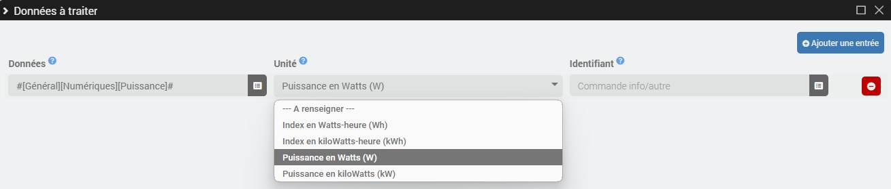

# Complemento de contador virtual

El complemento **Contador virtual** le permite crear medidores de energía en kilovatios-hora a partir de índices sin procesar *(Wh/kWh)* y/o poderes *(Vatios/kW)*, ya sea a tarifa única o en horas punta/valle. Este complemento también te permite crear contadores por usuario *(Personalizado/OCPP)*.

>**INFORMACIÓN**
>
>Información del protocolo **OCPP** solo será visible si el complemento se detecta en la máquina.

# Configuration

## Configuración del complemento

- **Precio predeterminado**: Seleccione el precio predeterminado para medidores virtuales *(tarifa única u horas punta/valle)*.
- **Alternar precios**: En caso de precios predeterminados en horas pico/de menor actividad, seleccione el comando de alternancia de información/binario de precios predeterminados *(1=horas pico/0=horas valle)*.
- **OCPP**:
  - **Creación automática de contadores**: Marque la casilla para crear automáticamente contadores por usuario para cualquier nueva transacción OCPP.

## Configuración del equipo

Para agregar un nuevo contador virtual, haga clic en el botón **+Agregar**.

- **Tipo de medidor**: Seleccione el tipo de medidor *(Estándar/Personalizado (WIP)/OCPP)*.
- **Precios**: Adapte los precios si es necesario.
- **Alternar precios**: En el caso de precios pico/no pico, adapte el comando de alternancia de precios información/precio binario si es necesario.

---

- **Identificador**: Para medidores tipo custom o OCPP indicar el identificador de usuario.

### Datos a procesar

Contadores virtuales de tipo **OCPP** recuperar automáticamente datos de transacciones para cada usuario.

Para otros, debes hacer clic en el botón **Gestionar pedidos** de la sección **Datos a procesar** Entonces **Añadir una entrada**.

- **Contadores estándar**:

  

	- **Datos**: Información/control digital de los datos brutos a procesar.
	- **Unidad**: Seleccione la unidad si no se detecta automáticamente *(Wh/kWh/W/kW)*.

- **Contadores personalizados** *(WIP)*:

  

	- **Datos**: Información/control digital de los datos brutos a procesar.
	- **Unidad**: Seleccione la unidad si no se detecta automáticamente *(Wh/kWh/W/kW)*.
	- **Identificador**: Complete el comando info/other especificando el identificador del usuario actual *(el valor debe corresponder al identificador definido a nivel de equipo para que se registre la transacción)*.

## Commandes

Los siguientes pedidos se crean en función del precio:

- **Precio único**:
  - **Índice** *(Información/numérico en kWh)*.

- **Horas pico/valle**:
  - **Índice de horas pico** *(Información/numérico en kWh)*.
  - **Índice de horas valle** *(Información/numérico en kWh)*.
