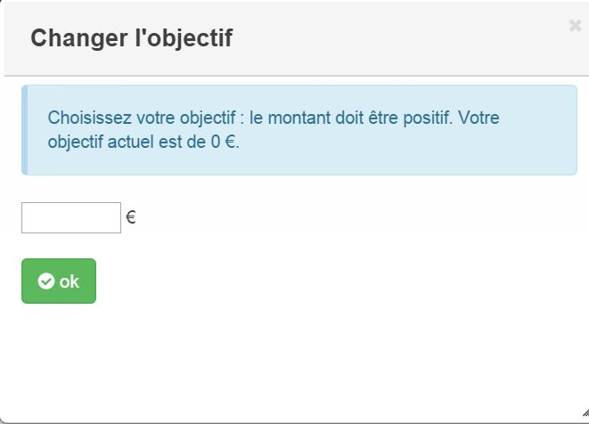

# Complemento Porkfolio 

Este complemento le permite controlar y tener toda la información de su alcancía Porkfolio.

# Configuración 

## Configuración del complemento Jeedom : 

**Instalación / Creación**

Para usar el complemento, debe descargarlo, instalarlo y activarlo como cualquier complemento de Jeedom.

Después de esto, deberá ingresar sus credenciales (cuenta de guiño + API):

Vaya al menú Complementos / Finanzas, encontrará el complemento pigfolio :

Llegará a la página que enumerará su equipo (puede tener varios Porkfolio) y que le permitirá crear algunos

Haga clic en el botón Agregar :

Luego llegará a la página de configuración de su pigfolio:

En esta página encontrarás varias secciones :

**Général**

En esta sección encontrará todas las configuraciones de libertad. Es decir, el nombre de su equipo, el objeto con el que desea asociarlo, la categoría (preferiblemente multimedia), si desea que el equipo esté activo o no, y finalmente si desea que sea visible en el tablero de instrumentos.

**Configuración**

Esta sección es útil si y solo si tiene varios pigfolio. Deberá ingresar el número de equipo (1, 2 o 3, por ejemplo). Puede dejar este campo en blanco si solo tiene un pigfolio, que seguramente será su caso.

**Comandos**

No tienes nada que hacer en esta sección. Los pedidos se crearán automáticamente.

-   Refrescar: botón para actualizar el widget si es necesario
-   Fecha de presentación : Fecha de la última operación
-   Fecha de movimiento : Fecha de la última vez que se detectó un movimiento
-   Fecha de cambio : Fecha de la última vez que se devolvió la cartera
-   Última operación : Importe de la última transacción
-   Nariz : Color de la nariz
-   Objetivo : Cantidad de tu objetivo
-   Suma : Suma actualmente en la cartera

# Las informaciones 

## Información en el tablero : 

-   A las : Cabeza de cerdo que puede cambiar el estado de ánimo. Al dejar el mouse sobre su cabeza, le dirá cuándo se movió por última vez y cuándo fue la última vez
-   B : Botón Actualizar para solicitar valores del servidor
-   C : Importe de la última transacción. Al dejar el mouse encima, tendrá la fecha de la última operación
-   D : Cantidad de tu objetivo
-   E : Color de nariz de tu carne de cerdo
-   F : Barra de progreso para lograr tu objetivo
-   G : Suma actual en tu carne de cerdo

# Las acciones 

## Acciones accesibles en el tablero : 

Hay varias acciones disponibles en el tablero :

-   A las : Al hacer clic en el boleto, puede depositar o retirar una suma de dinero

-   B : Al hacer clic en la bandera puedes cambiar tu objetivo

-   C : Al hacer clic en el pincel puede cambiar el color de la nariz de su cartera

# Preguntas frecuentes 

El sistema recupera información cada hora. Puede hacer clic en el comando Actualizar para actualizar manualmente.

Asegúrese de haber creado el archivo de configuración guardando su información en la configuración general del complemento.
