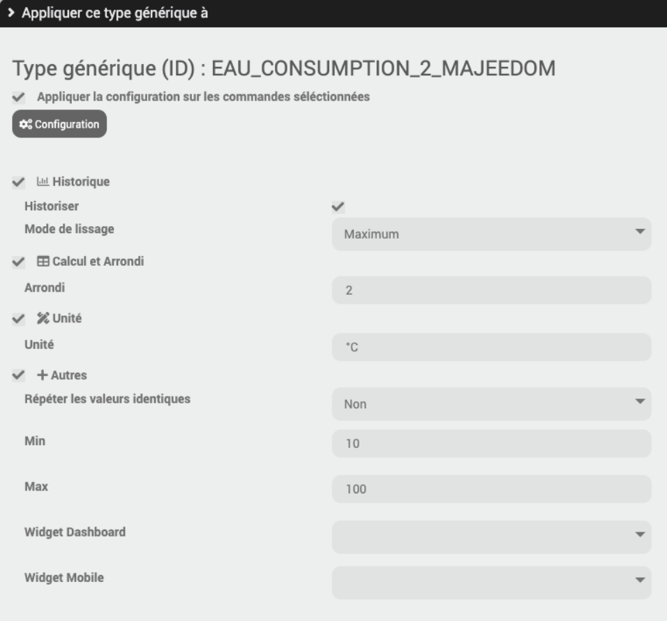

# Tipo genérico de complemento

## Introduction

El complemento de tipo genérico permite a los usuarios crear sus propios tipos genéricos en Jeedom a partir de un archivo Excel, un archivo JSON o manualmente.

## Configuración del complemento

Es necesario ingresar un sufijo de tipos genéricos en la configuración del complemento (ejemplo : MAJEEDOM)


## Gestión de complementos


1. Importar archivo JSON/XLSX : le permite agregar una lista de tipos genéricos desde un archivo xslx


o un archivo JSON

```json
{
    "PUMP_STATE_MAJEEDOM": {
        "name": "Estado de la bomba (MAJEEDOM)",
        "family": "BOMBA (MAJEEDOM)",
        "familyid": "BOMBA _MAJEEDOM",
        "type": "Info",
        "subType": "binary",
        "genTypePerso_tipo": true
    },
    "BOMBA_ON_MAJEEDOM": {
        "name": "Bomba encendida (MAJEEDOM)",
        "family": "BOMBA (MAJEEDOM)",
        "familyid": "BOMBA _MAJEEDOM",
        "type": "Action",
        "subType": "other",
        "genTypePerso_tipo": true
    },
    "PUMP_OFF_MAJEEDOM": {
        "name": "Parada de bomba (MAJEEDOM)",
        "family": "BOMBA (MAJEEDOM)",
        "familyid": "BOMBA _MAJEEDOM",
        "type": "Action",
        "subType": "other",
        "genTypePerso_tipo": true
    }
}
```

2. Importar configuración en JSON : le permite aplicar una lista de configuración a comandos con este tipo genérico. 
### La lista de configuraciones es la siguiente : 

#### Historique
- Historiser
- Modo de suavizado

#### Cálculo y redondeo
- Arrondi

#### Unité
- Unité

#### Autres
- Repetir valores idénticos
- Min
- Max
- Widget de panel
- Widget móvil

### Ejemplo JSON :

```json
{
    "CONSUMO_AGUA_2_MAJEEDOM": {
        "isHistorized": "0",
        "historizeMode": "none",
        "uniteValue": "°C"
    },
    "AGUA_CONSUMPCIÓN_MAJEEDOM": {
        "isHistorized": "0",
        "historizeMode": "avg",
        "historizeRound": "5",
        "uniteValue": "kwh"
    },
    "GAS_CONSUMPTION_MAJEEDOM": {
        "isHistorized": "1",
        "historizeMode": "avg",
        "historizeRound": "10",
        "uniteValue": "m3"
    }
}
```

3. Exportar configuración en JSON : le permite descargar la lista de configuraciones para importarla a otra caja, por ejemplo.

4. Cargue el archivo JSON/XLSX : le permite descargar la lista de archivos XLSX/JSON previamente importados.

5. Borrar todo : le permite eliminar todos los tipos genéricos específicos del cuadro.


## Descripción general de los tipos genéricos asociados con este complemento


1. Agregar : le permite agregar un tipo genérico manualmente.

2. revertir : le permite invertir la selección de tipos genéricos en la tabla.

3. Descargar : le permite descargar los tipos genéricos seleccionados o todos (si no hay selección)).

4. Eliminar : le permite eliminar los tipos genéricos seleccionados).

5. Editar : le permite modificar el tipo genérico

## Aplicar el tipo genérico a los comandos

1. Ingrese la configuración deseada



2. Seleccione la lista de comandos para aplicarles este tipo genérico

