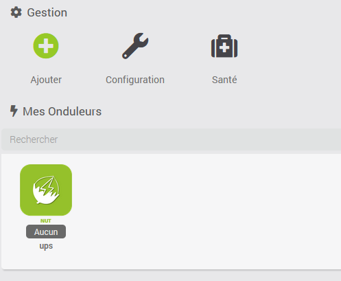

# Nut Plugin

Este complemento le permite recuperar información de un servidor NUT (Network UPS Tools)

# Configuración del plugin 

Después de descargar el complemento, simplemente actívelo y luego haga clic en "Instalar / Actualizar"

# Configuración del equipo 

Se puede acceder a la configuración del equipo NUT desde el menú de complementos :

Así es como se ve la página del complemento NUT (aquí con 1 dispositivo ya) :

Una vez que haces clic en uno de ellos, obtienes :

Aquí encontrarás toda la configuración de tu equipo :

-   **Nombre del equipo inversor** : nombre de su equipo NUT,
-   **Objeto padre** : indica el objeto padre al que pertenece el equipo,
-   **Activar** : activa su equipo,
-   **Visible** : hace que su equipo sea visible en el tablero,
-   **Categoría** : categoría de su equipo NUT
-   **Dirección IP NUT** : La dirección IP del servidor NUT
-   **Nombre de usuario** : Nombre de usuario del servidor NUT (dejar en blanco si no hay ninguno)
-   **Contraseña** : Contraseña del servidor NUT (dejar en blanco si no hay ninguno)
-   **Identificación de ups** : Identificación de ups

> **Nota**
>
> Un servidor NUT puede gestionar varios UPS, entonces es la ID del UPS lo que le permite a Jeedom saber a qué UPS se refiere el equipo

> **Punta**
>
> Si no conoce la ID de sus UPS, deje el campo vacío y luego registre el equipo, Jeedom completará automáticamente el campo de ID de la UPS y creará la cantidad de equipos que tenga UPS en su servidor NUT.

A continuación encontrará la lista de pedidos :

-   **Nombre** : el nombre que se muestra en el tablero,
-   **Mostrar** : permite mostrar los datos en el tablero
-   **Probar** : Se usa para probar el comando,

> **Importante**
>
> Los comandos creados pueden ser diferentes dependiendo de la instalación, depende de lo que envíe el servidor NUT

> **Punta**
>
> Si su servidor NUT está en un NAS de Synology, el nombre de usuario es 'monuser', la contraseña 'secret' y el ID 'ups'. Aunque dejando el área vacía, el complemento lo llena en la mayoría de los casos.
