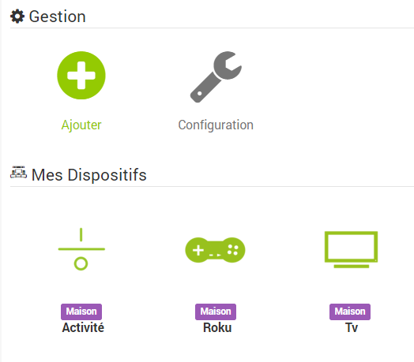

Harmony Hub 
===========

Description 
-----------

Ce plugin permet de controller et de récupérer tous les dispositifs de
son Harmony Hub.

 \

 \

Ce plugin de récupérer vos activités et vos dispositifs. Et ensuite de
pouvoir ajouter automatiquement toutes les commandes associées, pour
pouvoir les controller via scénarios, virtuels, dashboard etc…​.

Configuration 
-------------

### Configuration du plugin Harmony Hub : 

a.  Installation/Création

Afin d’utiliser le plugin, vous devez le télécharger, l’installer et
l’activer comme tout plugin Jeedom.

Suite à cela il vous faudra lancer l’installation des dépendances :

 \

 \

Suite à cela il vous faudra lancer la création de votre premier fichier
de config (à faire pour prendre en compte un éventuel rajout d’activité
ou dispositif) :

 \

 \

…​

Les équipements 
---------------

### Vos dispositifs/Activités : 

a.  Création

Afin de créer vos premiers équipemments, il faut vous rendre dans le
menu plugin:

 \

 \

Ensuite cliquez sur le bouton "+" pour rajouter un équipement :

 \

 \

Vous arriverez sur cette page :

 \

 \

Dans cette page vous pouvez attribuer un objet, activer et/ou rendre
visible votre équipement.

Le menu déroulant vous permet de choisir parmis :

-   Activités : Un équipement regroupant toutes vos activités ainsi que
    le power off général. Et une info de l’activité en cours.

-   Un de vos dispositifs : Un équipement regroupant toutes les
    commandes pour un dispositif donné.

Une fois choisit il vous suffit de cliquer sur sauver pour générer
automatiquement la liste des commandes correspondantes.

 \

 \

Par défaut, toutes les commandes sont en non affichées. Elles sont
cependant toutes disponibles via scénario/ virtuel etc…​ Si vous voulez
en afficher sur votre dashboard, il vous suffit de les réorganiser en
glisser déposer de cliquer sur afficher. Vous pouvez ensuite en jouant
avec les retours à la ligne, des widgets spécifiques ou les icones
proposer vous créer votre simili télécommande.

 \

 \

…​

Information importante
----------------------

Depuis le 19-02-2019 il faut activer une option développeur dans l'application Harmony

Voir ce lien de Logitech :

<https://community.logitech.com/s/question/0D55A00008OsX3CSAV/update-to-accessing-harmony-hubs-local-api-via-xmpp>
FAQ 
---

Avez vous affiché des commandes.
