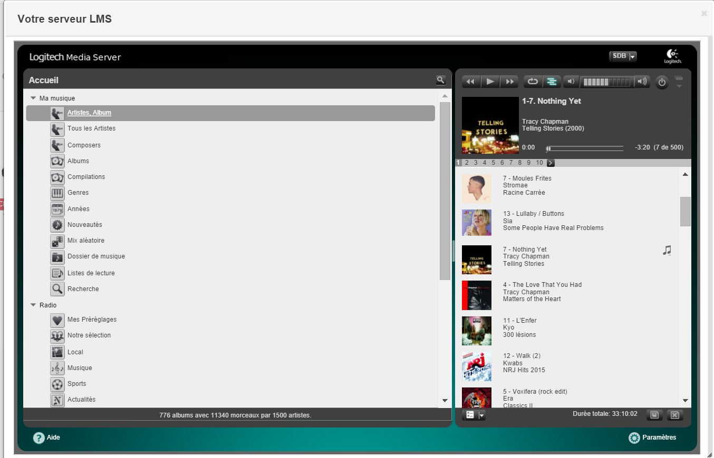

# Complemento de control SqueezeBox 

Este complemento le permite controlar todo su entorno SqueezeBox

Este complemento le permite escanear todos sus SqueezeBoxes, para asignarlos a la parte correcta si es posible. Y para poder controlarlos, sincronizarlos, hacerlos hablar, etc.

# Configuración 

Al igual que cualquier complemento de Jeedom, debe descargar el complemento del mercado y luego activarlo. Después de eso comienza el paso de configuración.

**Atención especial para usuarios de LMS en SINOLOGÍA**

Si usa LMS en su Synology Nas, debe saber que la versión ofrecida por synology es antigua. Pero hay un repositorio para beneficiarse de la última versión de LMS 7.9. Le recomiendo que instale esta versión en su NAS, que corrige muchos errores.

[VERSIÓN 7.9 para Synology](http://forums.slimdevices.com/showthread.php?103636-Test-Repo-for-LMS-7-9-0-on-Synology-DSM-5-*)

**Atención especial a los usuarios del complemento SqueezeBox (el segundo) en el mercado*

Para evitar cualquier riesgo de conflicto si utiliza el otro complemento SqueezeBox, le recomiendo que lo desactive y desinstale la extensión en el servidor LMS.

## Instalación y configuración del complemento LMS

Para beneficiarse de una buena sincronización entre Jeedom y su servidor SqueezeBox, es necesario instalar y configurar un complemento en el servidor SqueezeBox. Para hacer esto, solo necesita agregar el repositorio que se proporciona en la página del complemento de esta manera :

Haga clic en el parámetro :

Luego, en la pestaña Complementos, en la parte inferior, complete el repositorio proporcionado por Jeedom y aplique:

Luego puede instalar el complemento JeedomSBcontrol, el servidor le pedirá que reinicie, tendrá que hacerlo. Después de reiniciar, debe configurar el complemento JeedomSBcontrol haciendo clic en parámetros. Debe ingresar la dirección IP de Jeedom así como la clave API. Si necesita usar / jeedom, este también es el lugar para ingresar.

Una vez que se han ingresado los parámetros, debe reiniciar el servidor LMS por última vez (tenga cuidado si cambia los parámetros, debe reiniciar el servidor LMS para que los cambios se tengan en cuenta

## Instalación y configuración del complemento Jeedom. 

La configuración del complemento Jeedom es bastante simple.

Solo necesita ingresar la dirección IP de su servidor LMS. Si tiene un puerto diferente del puerto 9000, también puede ingresarlo en el campo Puerto. Y finalmente, si ha protegido LMS con una contraseña, también puede ingresarla. En el 90% de los casos solo es necesaria la dirección IP.

Una vez hecho, solo GUARDE. Una vez realizada la copia de seguridad, puede hacer clic en INICIAR para iniciar el autodescubrimiento de sus SqueezeBoxes.

Cuando finalice la exploración, debería ver la versión de su servidor LMS, así como la cantidad de SB detectada.

Para observar el resultado, simplemente vaya a PLugons / Multimedia / SqueezeBox Control:

Llegarás a la siguiente página :

Verás que han aparecido tus squeezeboxes y que los que podrían haber sido asignados a un objeto son.

En esta página, además de su equipo, puede ver tres opciones en la parte superior :

- **Panel** : le permite acceder al panel de control SqueezeBox específico también disponible aquí :

- **Configuración** : le permite acceder a la configuración del servidor
LMS directamente

- **Servidor** : le permite acceder a su servidor LMS directamente

# Los equipos 

Cuando haces clic en un elemento del equipo, llegas a su página :

Encontrará en esta página toda la información de su SqueezeBox, así como todos los comandos y algunas opciones (otras vendrán) :

- **Sin volumen :** le permite ajustar el paso de una acción Volumen + o Volumen-
- **Encendido / apagado automático en sincronización :** si esta opción está activada si se realiza una sincronización en este squeezebox, se encenderá y apagará cuando no esté sincronizado.
- **Jingle Pre TTS :** permite definir si antes de una síntesis de voz habrá un jingle del tipo dingdong.
- **Motor :** le permite elegir el motor de síntesis de voz (picotts, google, voxygen). Un comando de escenario le permite cambiarlo sobre la marcha.
- **Opciones de Tts :** permite elegir la voz o el idioma del texto a voz de acuerdo con el motor elegido. Un comando de escenario le permite cambiarlo sobre la marcha.

# El tablero de instrumentos 

Si muestra su squeezebox en el tablero, esto es lo que obtendrá :

- **A las :** Permite controlar el encendido y apagado de su SqueezeBox y saber de un vistazo si está encendido
- **B :** Le permite sincronizar su SqueezeBox con otro, con todos los demás, desde otro o desincronizarlo (consulte la sección de sincronización para más detalles)
- **C :** Le permite ver la portada de la lectura actual (será en color o en blanco y negro dependiendo del estado de SqueezeBox). Un clic en la chaqueta también permite el acceso directo a su biblioteca multimedia :

- **D :** Muestra el artista y el álbum en progreso (este texto se desplaza más allá de cierta longitud)
- **E :** Muestra el título de la lectura actual (este texto se desplaza más allá de cierta longitud)
- **F :** Panel de control con funciones básicas (Atrás, Retroceso rápido, Reproducir / Pausa, Parar, Avance rápido, Siguiente)
- **G :** Panel de control de volumen (control deslizante y dos botones Vol- y Vol +)

# Panel de sincronización del tablero

Cuando hace clic en el botón de sincronización, se abre una ventana :

En esta ventana puede ver el estado actual de sincronización de su squeezebox. Aquí están las opciones disponibles :

- **Sincronizar desde :** le permite sincronizar este squeezebox desde el squeezebox elegido en el menú desplegable
- **Sincronizar con :** le permite sincronizar este squeezebox con el squeezebox elegido en el menú desplegable
- **Sincronizar con todos :** le permite sincronizar este squeezebox con todos sus squeezeboxs
- **Desincronizar :** solo visible si el squeezebox está sincronizado, y esta acción permite desincronizarlo.

# Pannel SqueezeBox Control

Este panel le permite tener una visión general de todos sus squeezeboxes :

De hecho, puede filtrar su SqueezeBox por objetos con el menú oculto a la izquierda. De un vistazo puedes ver los squeezeboxes activados, desactivados y sincronizados. Obviamente, todas las acciones disponibles en el tablero también están disponibles aquí.

Sin embargo, hay otras opciones disponibles en la parte superior :

- **Enciende todo :** enciende todos los squeezeboxes
- **Apagar todo :** apaga todos los squeezeboxes
- **Servidor LMS :** permite el acceso directo a su servidor LMS
- **Configuración :** permite el acceso directo a la configuración de su servidor LMS
- **Exploración completa :** le permite activar un escaneo completo de su biblioteca de medios en el servidor LMS
- **Escaneo rápido :** le permite activar un escaneo rápido de su biblioteca de medios en el servidor LMS
- **Escanear lista de reproducción :** le permite activar un escaneo de sus listas de reproducción en el servidor LMS
- **Dispositivos :** le permite ir directamente a la página general de su equipo

# Pedidos disponibles por escenario

Muchos comandos están disponibles a través de escenarios (otros vendrán). Aquí está la lista completa :

- **Álbum :** comando de información que contiene el álbum actual
- **Encender :** enciende el squeezebox
- **Enciende todo :** enciende todos los squeezeboxes
- **Artista :** comando de información que contiene el artista en progreso
- **Por adelantado :** Avance rápido
- **Desincronizar :** le permite desincronizar el squeezebox
- **Estado :** Conozca el estado del squeezebox
- **Apagar :** apaga el squeezebox
- **Apagar todo :** apaga todos los squeezeboxes **Reproducir álbum :** comando de mensaje para reproducir el álbum pasado en el parámetro (mensaje) (la función alfa actual funciona pero puede no dar el resultado deseado)
- **Artista de juego :** mensaje de comando que permite reproducir al artista pasado en el parámetro (mensaje) (la función alfa actual funciona pero puede no dar el resultado deseado)
- **Jugar género :** comando de mensaje que permite reproducir el género pasado en el parámetro (mensaje) (la función alfa actual funciona pero puede no dar el resultado deseado)
- **Reproducir lista de reproducción :** comando de mensaje para reproducir la lista de reproducción pasada en el parámetro (mensaje) (la función alfa actual funciona pero puede no dar el resultado deseado)
- **Pieza de juego :** mensaje de comando que permite reproducir la canción pasada en el parámetro (mensaje) (la función alfa actual funciona pero puede no dar el resultado deseado) También dará las canciones que contienen la palabra
- **Jugar favoritos :** mensaje de comando que permite reproducir los favoritos correspondientes a lo que se pasa en el parámetro (mensaje) (esta función se basa en los índices y puede tomar varios índices separados por; . También podemos definir un rango con - .  Ejemplo : 0.0-0.2; 2 jugará un favorito con índice 2 o algo entre 0.0 y 0.2 incluidos. Los índices LMS se basan en una arquitectura de directorio y se explican en el documento LMS)
- **Juega favoritos por nombre :** mensaje de comando que permite reproducir los favoritos correspondientes a lo que se pasa en el parámetro (mensaje) (en función de los nombres que toma en el parámetro un solo nombre y agregará todos los favoritos correspondientes. Ejemplo : radio devolverá todos los favoritos que contienen radio o están en un directorio que contiene radio otro ejemplo : radio / necesariamente dará favoritos que están en un directorio de favoritos que se llama radio. Este comando no distingue entre mayúsculas y minúsculas)
- **Jugar url :** mensaje de comando que permite reproducir una url pasada en parámetro
- **Lectura :** comando para jugar el squeezebox
- **Mudo :** comando para silenciar el squeezebox
- **No mudo :** comando para restaurar el sonido del squeezebox
- **Hablar :** comando de mensaje para que el squeezebox hable
- **Hablar opciones completas :** comando de mensaje para que el squeezebox hable. El mensaje será el texto, el título puede contener varias opciones 

- multi : permite hablar en varios squeezebox al mismo tiempo : multi = inodoros; el dormitorio hará que el squeezebox que inicia el pedido hable, así como los inodoros y el dormitorio
- Volumen : permite definir el volumen que se utilizará para el TTS : volume=70
- voz : solo para TTSwebserver, permite elegir la voz al azar de una lista o entre todas (excepto pico) : Ejemplo : voz = todo o voz = melodina; sorciere
- tintineo : le permite elegir un jingle para jugar antes (o elegir de una lista) ejemplo : jingle = cuckoo o jingle = cuckoo; ten cuidado
- playurl : le permite continuar leyendo una url después del tts (ejemplo playurl=XXXXXXXXXX)
- playfavoris : lo mismo con un índice favorito (ver comando de favoritos)
- playfavorisname : idem pero con las funciones del nombre del comando favoritos
- playalbum : lo mismo con el nombre de un álbum o un final del nombre)
- playista : lo mismo con el nombre de un artista (o parte del nombre)
- playgender : lo mismo con el nombre de un género
- canto de juego : lo mismo con el nombre de una canción (o una parte del nombre)
- lista de reproducción : lo mismo con el nombre de una lista de reproducción
- playtop : con playstop = 1 esto detendrá los squeezeboxes después de tts (de lo contrario, reanudarán su estado inicial)
- playoff : con playoff = 1 esto detendrá los squeezeboxes después de tts (de lo contrario, reanudarán su estado inicial)

- **Configurar TTS :** opción muy interesante que permite en un escenario cambiar la configuración del motor TTS sobre la marcha (ver sección El TTS en el escenario)
- **Pausa :** comando para pausar el squeezebox
- **Anterior :** ordenar canción anterior
- **Retroceder :** comando de retorno rápido
- **Escanear rápido :** comando para activar un escaneo rápido de su biblioteca de medios en el servidor LMS (ideal para programar escaneos regulares)
- **Exploración completa :** comando para activar un escaneo completo de su biblioteca de medios en el servidor LMS (ideal para programar escaneos regulares)
- **Escanear lista de reproducción :** comando para activar un escaneo de sus listas de reproducción en el servidor LMS (ideal para programar escaneos regulares)
- **Detener :** comando para detener el squeezebox (no apagarlo)
- **Próximo :** siguiente comando de canción
- **Sincronizar con :** comando info que permite saber con quién se sincroniza el squeezebox
- **Sincronizar desde :** comando de mensaje que permite sincronizar el squeezebox del squeezebox pasado en el parámetro (mensaje) El valor puede ser la dirección mac del squeezebox o el nombre exacto que tiene en Jeedom
- **Sincronizar con :** comando de mensaje que permite sincronizar el squeezebox con el squeezebox pasado en el parámetro (mensaje) El valor puede ser la dirección mac del squeezebox o el nombre exacto que tiene en Jeedom
- **Sincronizar con todos :** comando para sincronizar el squeezebox con todos sus squeezeboxes
- **Titulo actual :** comando de información que contiene el título actual
- **Volumen :** control para ajustar el volumen
- **Estado del volumen :** comando de información con el volumen actual
- **Volumen + :** control de volumen
- **Volume- :** control para bajar el volumen

# TTS en escenario 

El tts en el escenario es simple. Puede hacer que su squeezebox hable de acuerdo con los parámetros predefinidos en el equipo. Pero también puede venir en sus escenarios y cambiar los parámetros para hacer notificaciones con diferentes voces o motores dependiendo del anuncio que se haga:

Para hacer esto, use la función "Configurar TTS"". Permite definir el motor y la voz antes de iniciar la síntesis, ejemplos :

Las opciones posibles para el motor son (atención respecto a las letras mayúsculas minúsculas)

+ ------------------ + ------------------------------ --------------------------- +
| Motor           | Posibles opciones                                       |
+ ================== + =============================== ============================ +
| **picottts**     | fr-FR, de-DE, en-US, en-GB, es-ES, it-IT                |
+ ------------------ + ------------------------------ --------------------------- +
| **google**       | fr, af, sq, ar, hy, ca, zh-CN, zh-TW, hr, cs, da, nl,   |
|                  | en, en-us, en-au, eo, fi, de, el, ht, hola, hu, es, id,   |
|                  | it, ja, ko, la, lv, mk, no, pl, pt, ro, ru, sr, sk, es, |
|                  | sw, sv, ta, th, tr, vi, cy                              |
+ ------------------ + ------------------------------ --------------------------- +
| **voxygen**      | Agnes, Bicool, Hush, Damien, DarkVadoor, Electra, Emma, |
|                  | Eva, Fabienne, Guy, Helene, JeanJean, John, Loic,       |
|                  | Ludovic, Matteo, Melodine, Michel, Papi, Philippe,      |
|                  | Ramboo, Robot, Sidoo, Bruja, Yeti, Zozo, Adel,       |
|                  | Matthias, Sylvia, Bibi, Bronwen, Elizabeth, Paul,       |
|                  | Amanda, Phil, Marta, Pedro, Sonia                       |
+ ------------------ + ------------------------------ --------------------------- +

Si el motor ingresado no es válido, no se cambiará nada. Si la opción no es válida por defecto, se asignará el primero de la lista

# Escenario de ejemplo

