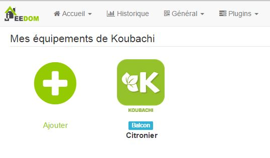
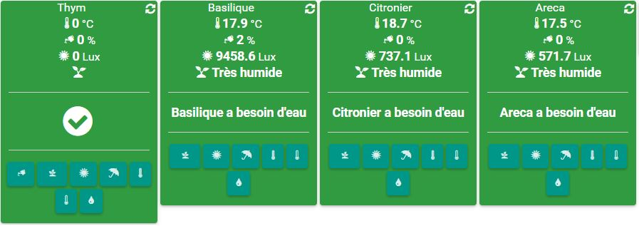

# Complemento Koubachi

Complemento para dispositivos Koubachi. Permite recuperar información de humedad, temperatura, brillo y consejos para sus plantas. También puede indicar que una planta ha sido regada, vaporizada, que se ha agregado fertilizante

# Configuración del plugin 

Una vez que se instala el complemento koubachi, debe vincularlo a su cuenta Koubachi, para eso vaya a su cuenta Koubachi : [aquí](https://labs.koubachi.com/login?locale=en)

Indique sus detalles de inicio de sesión y haga clic en iniciar sesión, luego en la parte inferior de la página que tiene :

Obtenga el valor de "user\_credentials" y póngalo en el campo "Nombre de usuario"". Haga lo mismo con el valor de "app\_key" en el campo "Clave de aplicación"" :

Luego haga clic en "Sincronizar mi equipo".

# Configuración del equipo 

Luego encontrará la lista de sus plantas aquí :

Debería ver aquí la lista de sus plantas registradas en Koubachi :

Al hacer clic en uno de ellos obtienes :

-   Nombre de la planta : el nombre de tu planta
-   Objeto padre : el objeto al que está unida la planta
-   Activar / Visible : La posibilidad de activar el equipo (no olvide hacerlo la primera vez) y hacerlo visible
-   Para pedidos :
    -   Guardar historial : permite registrar el comando
    -   Avanzado (ruedas con muescas pequeñas) : muestra la configuración avanzada del comando
    -   Probar : permite probar el comando para ver su valor
    -   Eliminar (botón "-") : para eliminar el pedido

# Reproductor 

Aquí está el resultado en el tablero :

Y en el móvil :

