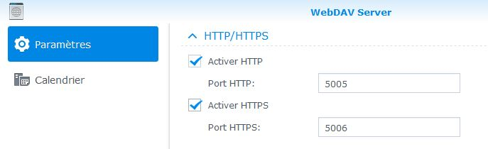

# Complemento de Caldav

# Description

El complemento **Agenda de Caldav** le permite recuperar eventos de un calendario caldav. Gestiona múltiples eventos separándolos con una coma (``,``). Todo lo que queda es probar la presencia del evento en un escenario para desencadenar una acción (ahí está el operador ``~`` o ``matches`` para averiguar si una cadena de caracteres contiene otra).

# Configuration

Para configurarlo es muy sencillo, solo hay que crear un dispositivo por diario y luego asociarlo a patrones de aislamiento de eventos.

Debes ingresar una URL, una cuenta y una contraseña para acceder a la agenda. Una vez guardado, puede elegir el calendario que desea usar.

En el cuadro de patrón, es posible poner un patrón para filtrar / extraer un evento.

Patrón de ejemplo : ``!^Arrière-cuisine (.*)$!``

Si el evento es "Lavadero 15", el valor devuelto será 15. Esto hace posible gestionar las temperaturas para la programación.

http://perldoc.perl.org/perlre.html

>**Importante**
>
>El nombre del calendario solo se puede elegir después de guardar el equipo con la información correcta. Puede que tarde un poco en aparecer.

## Configuración con Webdav en Synology

Primero debe configurar el paquete Webdav. Tienes que saber si quieres usar http o https (recomiendo https). Una vez activado, observe el puerto activado para https (5006 por defecto).

Tienes que saber dónde se guardarán los calendarios :

Por tanto, será necesario especificar en libertad lo siguiente :

## Configuración con Webdav en Framagenda

Primero debe crear una cuenta en Framagenda. Il faut ensuite aller sur https://framagenda.org/index.php/apps/calendar/.

Debe recuperar la URL de Framagenda que se utiliza para la configuración del complemento.

# FAQ

>**Ningún evento se remonta**
>¿Ha seleccionado y guardado una agenda? ?

>**¿Podemos tener eventos futuros?**
>No, no es posible que el complemento solo proporcione los eventos actuales.

>**¿Con qué frecuencia se actualiza la información? ?**
>Por defecto es cada minuto.
