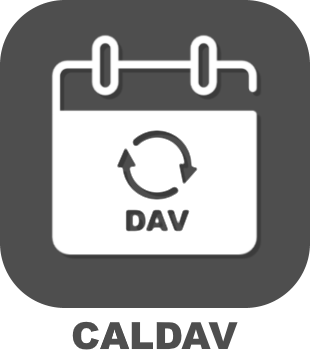
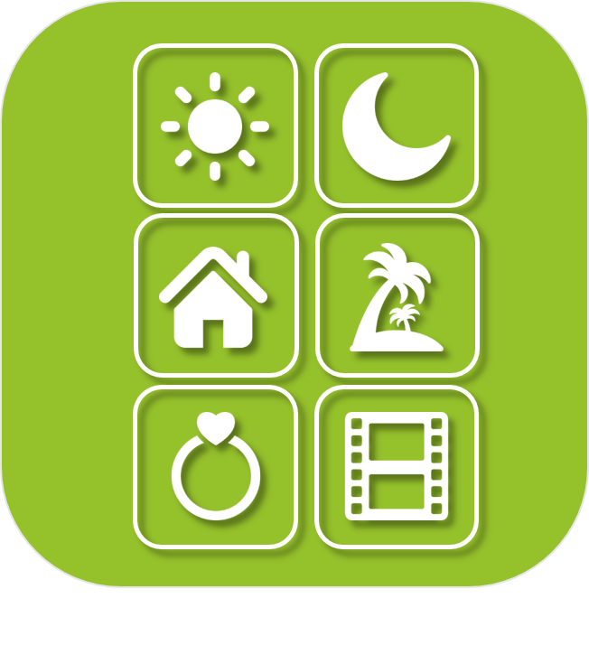

>**IMPORTANTE**
>Solo los complementos oficiales tienen su documentación aquí. Puede consultar la documentación de los otros complementos directamente desde Jeedom Market. Una vez en el complemento en cuestión, haga clic en la documentación.
>Podéis ver [aquí](https://market.jeedom.com/index.php?v=d&p=market&type=plugin&categorie=organization) todos los complementos oficiales en esta categoría

| | | | |
|--- | --- | --- | ---|
||Agenda de Caldav|Autor del complemento : Thomas Guenneguez. Atención : no es un complemento oficial de Jeedom sino un complemento desarrollado por un tercero y cuya evolución ha sido abandonada. El equipo técnico de Jeedom proporcionará asistencia con este complemento sin obligación de resultado. Complemento para leer eventos de un calendario Caldav. Con una expresión regular podemos, por ejemplo, extraer una temperatura de un evento.|[Documentación estable](caldav/index.md) - [Documentación beta](caldav/beta/index.md) [Mercado](https://market.jeedom.com/index.php?v=d&p=market_display&id=1149) [Registro de cambios estable](caldav/changelog.md) - [Registro de cambios Beta](caldav/beta/changelog.md)|
||Agenda|Complemento para administrar calendarios y realizar acciones automáticamente al comienzo y / o al final de un evento.|[Documentación estable](calendar/index.md) - [Documentación beta](calendar/beta/index.md) [Mercado](https://market.jeedom.com/index.php?v=d&p=market_display&id=57) [Registro de cambios estable](calendar/changelog.md) - [Registro de cambios Beta](calendar/beta/changelog.md)|
||Exportación de datos|Complemento que permite archivar exportaciones históricas o estadísticas a un archivo CSV. Es posible automatizar la recepción de archivos de exportación en el canal de su elección a través de escenario o programación.  El complemento también le permite importar datos a Jeedom desde un archivo CSV a un control de tipo de información.|[Documentación estable](dataexport/index.md) - [Documentación beta](dataexport/beta/index.md) [Mercado](https://market.jeedom.com/index.php?v=d&p=market_display&id=4057) [Registro de cambios estable](dataexport/changelog.md) - [Registro de cambios Beta](dataexport/beta/changelog.md)|
||DomoGeek|Complemento para recuperar información del sitio DomoGeek. El complemento permite recuperar mucha información :  - Día feriado  - Fin de semana  - Vacaciones escolares  - Duración del día (sol)  - Hora del amanecer  - Hora Zenith - hora del atardecer  - EDF Tempo color  - EDF color Tempo del mañana - Vigilance Météo France Flood  - Vigilancia Météo Francia Météo  - Alerta meteorológica Francia Tipo de perturbación  - EDF WCY  - Dirección IP  - Temporada  - Santo del dia  - Santo del día siguiente|[Documentación estable](domogeek/index.md) - [Documentación beta](domogeek/beta/index.md) [Mercado](https://market.jeedom.com/index.php?v=d&p=market_display&id=250) [Registro de cambios estable](domogeek/changelog.md) - [Registro de cambios Beta](domogeek/beta/changelog.md)|
||Calendario de Google|Complemento para recuperar eventos de Google Calendar. Es capaz de interpretar los títulos de los eventos como interacción. IMPORTANTE : este complemento requiere tener una cuenta de desarrollo con Google (todos pueden tenerlo, es gratis y sin impacto). El proceso se explica en la documentación.|[Documentación estable](gCalendar/index.md) - [Documentación beta](gCalendar/beta/index.md) [Mercado](https://market.jeedom.com/index.php?v=d&p=market_display&id=3318) [Registro de cambios estable](gCalendar/changelog.md) - [Registro de cambios Beta](gCalendar/beta/changelog.md)|
||Geoloc|Complemento que permite a Jeedom administrar la geolocalización (solo para Android a través de la aplicación Tasker).|[Documentación estable](geoloc/index.md) - [Documentación beta](geoloc/beta/index.md) [Mercado](https://market.jeedom.com/index.php?v=d&p=market_display&id=12) [Registro de cambios estable](geoloc/changelog.md) - [Registro de cambios Beta](geoloc/beta/changelog.md)|
||Misterbooking|ATENCIÓN complemento solo disponible en versión beta Gestor de reservas Misterbooking|[Documentación beta](misterbooking/beta/index.md) [Mercado](https://market.jeedom.com/index.php?v=d&p=market_display&id=4463) [Registro de cambios Beta](misterbooking/beta/changelog.md)|
||Mode|Plugin que permite crear y gestionar diferentes modos (casa / apartamento, alarma, presencia, etc ...) y realizar acciones de forma automática al entrar y / o salir de un modo.|[Documentación estable](mode/index.md) - [Documentación beta](mode/beta/index.md) [Mercado](https://market.jeedom.com/index.php?v=d&p=market_display&id=1929) [Registro de cambios estable](mode/changelog.md) - [Registro de cambios Beta](mode/beta/changelog.md)|
