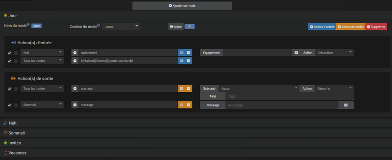

# Plugin de moda

El complemento **Moda** le permitirá crear modos para administrar fácilmente diferentes funciones *(vivienda, alarma, presencia, etc...)* y realizar acciones automáticamente al cambiar de modo.

# Configuration

Este complemento no requiere ninguna configuración especial y simplemente debe activarse después de la instalación.

## Configuración del equipo

Para acceder a los diferentes equipos **Moda**, tienes que ir al menú **Complementos → Organización → Moda**.

>**INFORMACIÓN**
>
>El botón + Agregar le permite agregar un nuevo equipo **Moda**.

Haga clic en un dispositivo **Moda** para acceder a su página de gestión. La primera pestaña da acceso a las opciones de configuración del equipo :

- **Nombre del equipo** : Nombre del equipo Modo.
- **Objeto padre** : Indica el objeto padre al que pertenece el equipo.
- **Categoría** : Permite elegir la categoría del equipo.
- **Opciones** :
    - **Activar** : Permite activar el equipo.
    - **Visible** : Hace que el equipo sea visible.

- **Comando de bloqueo** : Casilla de verificación para mostrar el comando de bloqueo en el widget.

La segunda pestaña nos permitirá definir los diferentes modos del equipo así como las acciones asociadas en caso de ser necesario :

- **Añadir modo** : Haga clic en el botón para crear un nuevo modo en el equipo.

A continuación, encontrará la lista de modos existentes :

Pulsa sobre la línea de un modo para desplegar su configuración y acceder a la gestión de acciones de entrada/salida. La ejecución de estas acciones puede estar condicionada por el modo desde el que se llega *(modo anterior)* por acciones de entrada o por el modo que vas a *(siguiente modo)* para acciones de salida (ver [los ejemplos](#Exemples)).

>**INFORMACIÓN**
>
>Haga clic en el nombre del modo para cambiarlo. Atención, en caso de modificación del nombre de un modo, será necesario revisar todos los escenarios/equipos que hacían referencia a él bajo su antiguo nombre.

# Commandes

La lista de pedidos se puede consultar haciendo clic en el botón **Configuración avanzada** de un equipo **Moda**. Cada modo creado en un dispositivo generará el comando de acción correspondiente además de los comandos existentes :

- **Cierre** :
    - **Bloqueo y desbloqueo** : Le permite bloquear el termostato para evitar cualquier cambio de modo.
    - **Desbloquear** : Desbloquea el termostato.
>La caja **Comando de bloqueo** debe estar marcado para que este comando se muestre en el widget.

- **Moda** : Modo actual.
- **Modo anterior** : Modo anterior *(comando no visible por defecto)*.
- **Volver al modo anterior** : Le permite volver al modo previamente activo.
- **Ir al siguiente modo** : Le permite ir al siguiente modo en la lista.

# Exemples

## Modos de panel

Ejemplo de equipo sin acciones de entrada o salida en los modos. Los equipos de este tipo pueden ser útiles como disparadores de un escenario o para condicionar acciones en un escenario :

## Modos de presencia

Ejemplo de equipo con acciones definidas al cambiar de modo. En este equipo crearemos 3 modos desde la pestaña **Modos** equipo :

- **Regalo**
- **Ausente**
- **Vacaciones**

Al cambiar al modo **Regalo**, queremos que la alarma se desactive y la calefacción pase a *Confort (2 acciones de entrada)* :

Al salir del modo **Regalo** para cambiar al modo **Ausente** o **Vacaciones**, queremos que se active la alarma *(1 acción de salida)* :

Acerca de los modos **Ausente** y **Vacaciones**, simplemente crearemos en cada acción de entrada 1 para administrar la calefacción, *Respetuoso del medio ambiente* por la moda **Ausente** y *Protección contra las heladas* por la moda **Vacaciones** :

### Operación Presencia

- Cuando salimos de modo **Regalo** en la moda **Ausente**, la alarma está activada (acción para salir **Regalo**) y la calefacción cambia a *Respetuoso del medio ambiente* (acción de entrada de modo **Ausente**).  
- Cuando salimos de modo **Regalo** en la moda **Vacaciones**, la alarma está activada (acción para salir **Regalo**) y la calefacción cambia a *Protección contra las heladas* (acción de entrada de modo **Vacaciones**).
- Cuando salimos de modo **Ausente** en la moda **Regalo**, la alarma está desactivada (acción de entrada del **Regalo**) y la calefacción cambia a *Comodidad* (acción de entrada de modo **Regalo**).
- Cuando salimos de modo **Ausente** en la moda **Vacaciones**, la calefacción cambia a *Protección contra las heladas* (acción de entrada de modo **Vacaciones**).
- Cuando salimos de modo **Vacaciones** en la moda **Regalo**, la alarma está desactivada (acción de entrada del **Regalo**) y la calefacción cambia a *Comodidad* (acción de entrada de modo **Regalo**).
- Cuando salimos de modo **Vacaciones** en la moda **Ausente**, la calefacción cambia a *Respetuoso del medio ambiente* (acción de entrada de modo **Ausente**).

## Modos Presencia bis

Modificamos ligeramente el ejemplo anterior para ilustrar el filtrado de acciones :

Para hacer esto, la alarma ya no se activará al salir del modo **Regalo** pero en la entrada de modos **Ausente** y **Vacaciones**. Después de la modificación obtenemos el siguiente resultado :

>**INFORMACIÓN**
>
>en los modos **Ausente** y **Vacaciones**, la alarma solo se activa si vienes del modo **Regalo**. Si pasamos de **Ausente** a **Vacaciones** *(O viceversa)*, la alarma ya está activada, por lo que no es necesario rehacer la acción.

### Operación Presencia bis

- Cuando salimos de modo **Regalo** en la moda **Ausente**, la alarma está activada (acción de entrada de modo **Ausente**) y la calefacción cambia a *Respetuoso del medio ambiente* (acción de entrada de modo **Ausente**).  
- Cuando salimos de modo **Regalo** en la moda **Vacaciones**, la alarma está activada (acción de entrada de modo **Vacaciones**) y la calefacción cambia a *Protección contra las heladas* (acción de entrada de modo **Vacaciones**).
- Cuando salimos de modo **Ausente** en la moda **Regalo**, la alarma está desactivada (acción de entrada del **Regalo**) y la calefacción cambia a *Comodidad* (acción de entrada de modo **Regalo**).
- Cuando salimos de modo **Ausente** en la moda **Vacaciones**, la calefacción cambia a *Protección contra las heladas* (acción de entrada de modo **Vacaciones**). La alarma no esta activada.
- Cuando salimos de modo **Vacaciones** en la moda **Regalo**, la alarma está desactivada (acción de entrada del **Regalo**) y la calefacción cambia a *Comodidad* (acción de entrada de modo **Regalo**).
- Cuando salimos de modo **Vacaciones** en la moda **Ausente**, la calefacción cambia a *Respetuoso del medio ambiente* (acción de entrada de modo **Ausente**). La alarma no esta activada.
