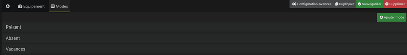
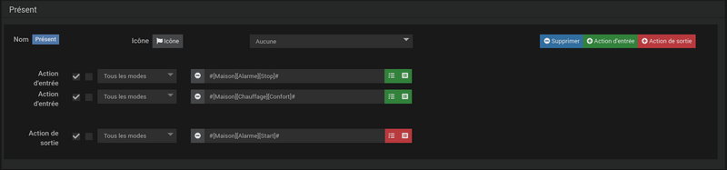
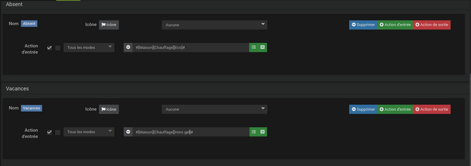

# Plugin de moda

Complemento para gestionar diferentes modos de un apartamento / casa / habitación, pero también atmósferas.

## Configuración del plugin

Después de descargar el complemento, solo necesita activarlo, no hay configuración en este nivel.

## Configuración del equipo

Se puede acceder a la configuración del equipo de modo desde el menú de complementos y luego desde la organización :

Aquí encontrarás toda la configuración de tu equipo :

- **Nombre del equipo Modo** : nombre de su equipo Modo,
- **Objeto padre** : indica el objeto padre al que pertenece el equipo,
- **Activar** : activa su equipo,
- **Visible** : hace que su equipo sea visible en el tablero,
- **Categoría** : categorías de equipos (puede pertenecer a varias categorías).
- **Añadir modo** : botón para agregar un nuevo modo

A continuación encontrarás la lista de modos, al hacer clic en ella podrás elegir las acciones a realizar al entrar y / o salir de este modo.

>**Importante**
>
>Tenga cuidado al cambiar el nombre de un modo, es esencial revisar los escenarios / equipos que usaron el nombre anterior para cambiarlos al nuevo.

## Creación de equipos

- Haga clic en *Agregar*
- Dame un nombre
- Seleccione l'*Objeto padre*
- Activar el
- Seleccionar pestaña *Modos* para agregar los modos (ver [los ejemplos](#exemples))

## Exemples

### Modo de obturador

Ejemplo de un dispositivo sin acción de entrada o salida en los modos. Los equipos de este tipo pueden ser útiles como disparadores de un escenario o para condicionar acciones en un escenario.

### Modo presencia

Ejemplo de un dispositivo con acciones definidas al cambiar de modo.

En este equipo crearemos 3 modos desde la pestaña *Modos* equipo:

- Regalo
- Absent
- Vacances

Al cambiar al modo *Regalo*, queremos que se desactive la alarma y que la calefacción cambie al modo confort (2 acciones de entrada).

Al salir del modo *Regalo* para cambiar al modo *Ausente* o *Vacaciones*, queremos que se active la alarma (1 acción de salida).

Para modos *Ausente* y *Vacaciones*, sólo vamos a crear en cada uno de estos modos 1 acción de entrada para gestionar la calefacción (Eco para el *Ausente*, Protección contra heladas para el modo *Vacaciones*).

#### Fonctionnement

- Cuando salimos de modo *Regalo* en la moda *Ausente*, la alarma está activada (acción para salir *Regalo*) y la calefacción cambia a eco (acción de entrada de modo *Ausente*).  
- Cuando salimos de modo *Regalo* en la moda *Vacaciones*, la alarma está activada (acción para salir *Regalo*) y la calefacción cambia a protección antihielo (acción de entrada del *Vacaciones*).
- Cuando salimos de modo *Ausente* en la moda *Regalo*, la alarma está desactivada (acción de entrada del *Regalo*) y la calefacción cambia a confort (entrada de modo *Regalo*).
- Cuando salimos de modo *Ausente* en la moda *Vacaciones*, la calefacción entra en protección contra heladas (acción de entrada del *Vacaciones*).
- Cuando salimos de modo *Vacaciones* en la moda *Regalo*, la alarma está desactivada (acción de entrada del *Regalo*) y la calefacción cambia a confort (entrada de modo *Regalo*).
- Cuando salimos de modo *Vacaciones* en la moda *Ausente*, la calefacción cambia a eco (acción de entrada del *Ausente*).

### Modo de presencia dos veces

Modificamos ligeramente el ejemplo anterior para ilustrar el filtrado de acciones.

Para hacer esto, la alarma ya no se activará al salir del modo *Regalo* pero en la entrada de modos *Ausente* y *Vacaciones*. Después de la modificación obtenemos eso :

Nota : en los modos *Ausente* y *Vacaciones*, la alarma solo se activa si vienes del modo *Regalo*. Si pasamos de *Ausente* a *Vacaciones* (y viceversa), la alarma ya está activada, por lo que no es necesario rehacer la acción.

#### Operación bis

- Cuando salimos de modo *Regalo* en la moda *Ausente*, la alarma está activada (acción de entrada de modo *Ausente*) y la calefacción cambia a eco (acción de entrada de modo *Ausente*).  
- Cuando salimos de modo *Regalo* en la moda *Vacaciones*, la alarma está activada (acción de entrada de modo *Vacaciones*) y la calefacción cambia a protección antihielo (acción de entrada del *Vacaciones*).
- Cuando salimos de modo *Ausente* en la moda *Regalo*, la alarma está desactivada (acción de entrada del *Regalo*) y la calefacción cambia a confort (entrada de modo *Regalo*).
- Cuando salimos de modo *Ausente* en la moda *Vacaciones*, la calefacción entra en protección contra heladas (acción de entrada del *Vacaciones*). La alarma no esta activada.
- Cuando salimos de modo *Vacaciones* en la moda *Regalo*, la alarma está desactivada (acción de entrada del *Regalo*) y la calefacción cambia a confort (entrada de modo *Regalo*).
- Cuando salimos de modo *Vacaciones* en la moda *Ausente*, la calefacción cambia a eco (acción de entrada del *Ausente*).  La alarma no esta activada.
