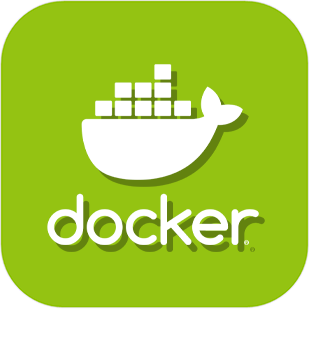

>**Importante**
>Solo los complementos oficiales tienen su documentación aquí. Puede consultar la documentación de los otros complementos directamente desde Jeedom Market. Una vez en el complemento en cuestión, haga clic en la documentación.
>Podéis ver [aquí](https://market.jeedom.com/index.php?v=d&p=market&type=plugin&categorie=programming) todos los complementos oficiales en esta categoría

| | | | |
|--- | --- | --- | ---|
||Atlas|ATENCIÓN complemento solo disponible en versión beta Complementos especializados para Atlas|[Documentación beta](atlas/beta/index.md) [Mercado](https://market.jeedom.com/index.php?v=d&p=market_display&id=4195) [Lista de cambios beta](atlas/beta/changelog.md)|
||Haga clic en el enlace|Este complemento permite la gestión de enlaces y eventos directamente en la interfaz de Jeedom. Puede, por ejemplo, crear un comando que abra un modal (ventana de diálogo) con una vista que contenga sus cámaras. Esto permite que cuando alguien toca el timbre de la puerta se muestre la cámara de entrada en su Jeedom.|[Documentación estable](clink/index.md) - [Documentación beta](clink/beta/index.md) [Mercado](https://market.jeedom.com/index.php?v=d&p=market_display&id=1867) [Registro de cambios estable](clink/changelog.md) - [Lista de cambios beta](clink/beta/changelog.md)|
||DataService|ATENCIÓN complemento solo disponible en versión beta Complemento para la recuperación de varios datos (ejp, vacante, santo del día ...) y el envío de varios datos (sms, correo), así como el intercambio de datos en la comunidad (temperatura, humedad...)|[Documentación beta](dataservice/beta/index.md) [Mercado](https://market.jeedom.com/index.php?v=d&p=market_display&id=3886) [Lista de cambios beta](dataservice/beta/changelog.md)|
||Gestión de Docker|Complemento Docker para administrar contenedores en Jeedom.|[Documentación estable](docker2/index.md) - [Documentación beta](docker2/beta/index.md) [Mercado](https://market.jeedom.com/index.php?v=d&p=market_display&id=4204) [Registro de cambios estable](docker2/changelog.md) - [Lista de cambios beta](docker2/beta/changelog.md)|
||Dyndns|Complemento para actualizar dinámicamente DNS|[Documentación estable](dyndns/index.md) - [Documentación beta](dyndns/beta/index.md) [Mercado](https://market.jeedom.com/index.php?v=d&p=market_display&id=1928) [Registro de cambios estable](dyndns/changelog.md) - [Lista de cambios beta](dyndns/beta/changelog.md)|
||Visualización HTML|Complemento para poner código html en un widget de equipo (por ejemplo, para crear su propio menú para diseños).|[Documentación estable](htmldisplay/index.md) - [Documentación beta](htmldisplay/beta/index.md) [Mercado](https://market.jeedom.com/index.php?v=d&p=market_display&id=3843) [Registro de cambios estable](htmldisplay/changelog.md) - [Lista de cambios beta](htmldisplay/beta/changelog.md)|
||Jeeasy|Complemento para configurar fácilmente Jeedom|[Documentación estable](jeeasy/index.md) - [Documentación beta](jeeasy/beta/index.md) [Mercado](https://market.jeedom.com/index.php?v=d&p=market_display&id=3828) [Registro de cambios estable](jeeasy/changelog.md) - [Lista de cambios beta](jeeasy/beta/changelog.md)|
||LNS|Complemento utilizado para instalar Chirpstack V3 en Jeedom Luna Lora|[Documentación estable](lns/index.md) - [Documentación beta](lns/beta/index.md) [Mercado](https://market.jeedom.com/index.php?v=d&p=market_display&id=4408) [Registro de cambios estable](lns/changelog.md) - [Lista de cambios beta](lns/beta/changelog.md)|
||Gerente de MQTT|Complemento que sirve como base para complementos que utilizan MQTT|[Documentación estable](mqtt2/index.md) - [Documentación beta](mqtt2/beta/index.md) [Mercado](https://market.jeedom.com/index.php?v=d&p=market_display&id=4213) [Registro de cambios estable](mqtt2/changelog.md) - [Lista de cambios beta](mqtt2/beta/changelog.md)|
||Script|Complemento para agregar soporte de script en Jeedom. Los scripts son programas en Python / PHP / Shell / Ruby, etc ... que permiten agregar funciones a Jeedom|[Documentación estable](script/index.md) - [Documentación beta](script/beta/index.md) [Mercado](https://market.jeedom.com/index.php?v=d&p=market_display&id=20) [Registro de cambios estable](script/changelog.md) - [Lista de cambios beta](script/beta/changelog.md)|
||Simulación de presencia|Plugin para simulación de presencia|[Documentación estable](simupre/index.md) - [Documentación beta](simupre/beta/index.md) [Mercado](https://market.jeedom.com/index.php?v=d&p=market_display&id=3762) [Registro de cambios estable](simupre/changelog.md) - [Lista de cambios beta](simupre/beta/changelog.md)|
||Virtuel|Complemento para crear equipos virtuales en Jeedom.|[Documentación estable](virtual/index.md) - [Documentación beta](virtual/beta/index.md) [Mercado](https://market.jeedom.com/index.php?v=d&p=market_display&id=21) [Registro de cambios estable](virtual/changelog.md) - [Lista de cambios beta](virtual/beta/changelog.md)|
||Widget|Complemento para aplicar / modificar / crear widgets|[Documentación estable](widget/index.md) [Mercado](https://market.jeedom.com/index.php?v=d&p=market_display&id=9) [Registro de cambios estable](widget/changelog.md)|
