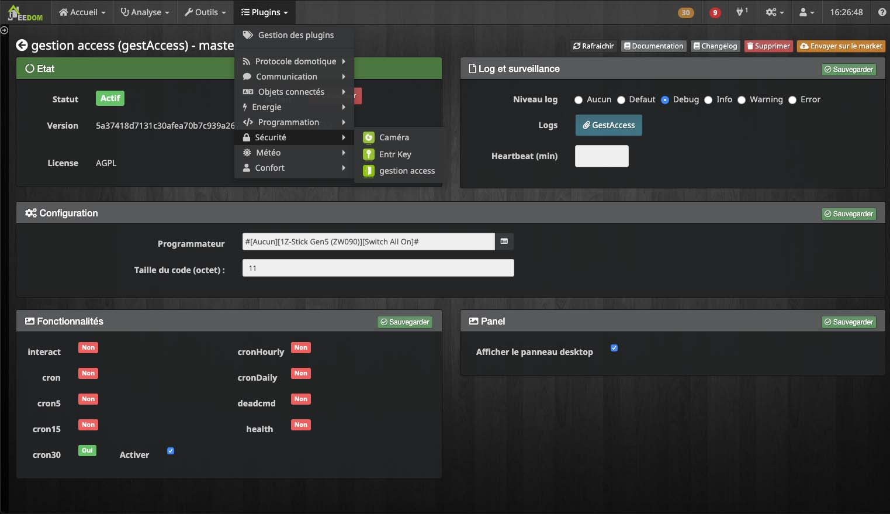

# Complemento de gestión de acceso

# Description

Este complemento se utiliza para la gestión avanzada de un sistema de acceso, utilizando las siguientes funcionalidades :

- Activación y presentación del complemento
- Creación y gestión de puertas
- Creación y gestión de usuarios
- Creación y gestión de grupos
- Creación y gestión de franjas horarias
- Búsqueda de la historia

>**Información**
>
>Todas las capturas de pantalla se toman bajo un tema, si la apariencia de su Jeedom no es exactamente la misma, no se preocupe.

## Activación y presentación del complemento de gestión de acceso

### Activation
Después de instalar su complemento, debe activarlo.

>**CONSEJO**
>
>Si usa KNX, en el grupo **Configuración** rellena los campos.

Después de activar el complemento, debería verlo en  **Plugins** → **Seguridad** → **Gestión de acceso**. Si este no es el caso, no dude en actualizar su página (``Ctrl+F5`` o ``Cmd+R``).

### Presentación

En la vista predeterminada del complemento, puede agregar una bolsa, un usuario, un intervalo de tiempo o una puerta.

A continuación, diferentes pestañas le permiten encontrar fácilmente cada uno de los elementos.
La barra de búsqueda ayudará a ordenar cada categoría para encontrar un elemento más fácilmente.

Sobre **Tablero de instrumentos** un historial de los últimos 20 eventos está disponible.

## Creación y gestión de puertas

### Creación de la puerta

**Añadir** para crear una puerta.
El campo le permite definir el nombre de la puerta.

En la lista *Tipo*, seleccione **Puerta / Lector**.

### Configuración de la puerta

**Configuración del equipo** permite configurar la puerta.

### Derechos de equipo

**Derechos de equipo** se usa para asignar franjas horarias específicas a la puerta durante las cuales los usuarios no necesitarán sus pases para pasar.

**Agregar derechos** le permite seleccionar un intervalo de tiempo ya existente para asignarlo a su puerta.

>**Importante**
>
>Todos los usuarios conectados a la zona horaria seleccionada podrán pasar por esta puerta durante los horarios establecidos.

El botón **-** elimina el intervalo de tiempo.

## Creación y gestión de usuarios

### Creación de usuarios

**Añadir** usado para crear un usuario.
El campo le permite definir el nombre de usuario.

En la lista *Tipo*, indicar **Usuario**.

### Configuración del usuario

**Configuraciones de usuario** se usa para configurar.

Varios campos son personalizables.
Puedes indicar :

- una identificación de usuario (correspondiente a los números de identificación del usuario),
- el apellido,
- el nombre,
- foto de perfil de usuario,
- la fecha de inicio, que es el primer día de su nuevo usuario,
- la fecha de finalización, que es el último día de su nuevo usuario,
- estado del usuario :
    - En servicio _ (estado predeterminado) _,
    - Volé,
    - Perdu,
- Cuatro campos en los que puedes agregar notas.

El botón **Copia** toma el valor de **Nombre de usuario**, del **Nombre de usuario** y de'**ID de usuario** para asignarlos a **Nombre del equipo**, que puedes ver en la pestaña **Dispositivos**.

El botón **Enviar** le permite transmitir la foto de perfil que desea para su usuario.

El botón **Descargar** subir foto de usuario.
El archivo se nombrará de acuerdo con los valores indicados en los campos **Nombre de usuario** y **Nombre de usuario** (separado por un guión).

### Configurar grupos para un usuario

 **Configuración de grupos** usado para asignar su usuario a un grupo.

>**Nota**
>
>Marque una casilla para seleccionar el grupo correspondiente.

### Derechos de usuario

La pestaña **Derechos de usuario** utilizado para asignar derechos específicos al usuario.

**Agregar derechos**, permite seleccionar una puerta y un rango de tiempo que se asignará al usuario seleccionado.
Hay dos opciones disponibles : **Rechazar** y **Aceptar** para la acción.

Los nuevos derechos asignados son visibles en la pestaña **Derechos de usuario**. El botón menos (**-**) elimina derechos.

## Creación y gestión de grupos

### Creación de un grupo
Usa el botón **Añadir** para crear un grupo.
El campo le permite definir el nombre del grupo.

En la lista de tipos, seleccione **Grupo**.

#### Derechos de un grupo

La pestaña **Derechos de grupo** usado para asignar derechos específicos a su grupo.

**Agregar derechos**, le permite seleccionar una puerta y un rango de tiempo que se asignará al grupo seleccionado.
Hay dos opciones disponibles **Rechazar** y **Aceptar** para la acción.

En la pestaña **Derechos de grupo** los nuevos derechos afectados serán visibles. El botón **-** elimina derechos.

## Creación y gestión de franjas horarias

### Creación de un horario
Usa el botón **Añadir** para crear un rango de tiempo.
El campo le permite definir el nombre del intervalo de tiempo.

En la lista de tipos, seleccione **Ranura de tiempo**.

### Configuración de rango de tiempo

La pestaña **Configuración de intervalo de tiempo** permite configurar un nuevo horario.

>**Información**
>
> - Para configurar una franja horaria, haga clic izquierdo en las casillas que le interesen según el día y la hora.   
Un cuadro se vuelve azul cuando está activo.    
>Por defecto, los cuadros están activos todos los días de 10:30 a.m. a 7:00 p.m.
>Para desactivar un cuadro, haga clic derecho sobre él. Esto se volverá transparente.
> - Por defecto, los días festivos se tienen en cuenta, asegúrese de anular la selección de los cuadros azules en la línea **"Días feriados"**.
> - Deslice la barra de desplazamiento hacia la derecha en la parte inferior de la tabla para ver más horarios.

## Búsqueda de la historia

**Paso importante** : Para acceder a esta parte, es importante realizar un ajuste aguas arriba. Ir a **Plugins** → **Gestión de plugins**, DENTRO **Mis plugins**, Haga clic en **Gestión de acceso**.

En el juego **Panel** comprobar **Vista del panel de escritorio** luego haga clic en **Guardar**.

Una vez que se ha realizado el cambio, una nueva sección en el menú **Inicio** está disponible.
Sin embargo, si no aparece, asegúrese de actualizar su página.

**Inicio** → **gestión de acceso** para acceder a la búsqueda avanzada. La vista predeterminada muestra los últimos 20 eventos grabados.

La parte de la izquierda le permite determinar los criterios de búsqueda.

 - **Lista de usuarios :** Nombres de usuarios buscados. Puedes seleccionar múltiples usuarios.
 - **Lista de equipos :** Nombres de equipos buscados. Puedes seleccionar múltiples dispositivos.
 - **Lista de franjas horarias :** Nombres de pistas buscadas. Puede seleccionar múltiples franjas horarias.
 - **Fecha de inicio :** Ingrese una fecha y hora de inicio para su búsqueda.
 - **Fecha de fin** Indique una fecha de finalización y una hora para su búsqueda.
 - **Lista de grupos** Nombres de grupos buscados. Puedes seleccionar múltiples grupos.
 - **Lista de acciones** Seleccione el resultado de una acción, puede elegir entre : **Todas**, **Rechazar** y **Permitir**.

>**Importante**
>
>En la parte superior de la tabla, debajo del título de cada columna, los diferentes campos le permiten realizar una segunda búsqueda que ordenará los resultados.
