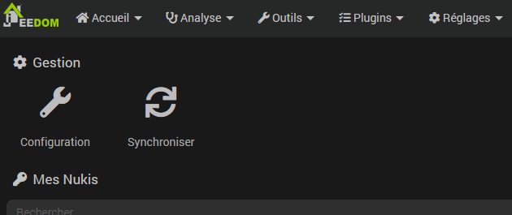

# Complemento Nuki

Este complemento le permite controlar las cerraduras conectadas de Nuki utilizando el puente.

## Configuración del plugin

Después de descargar el complemento, solo necesita activarlo, luego configurar la información del puente.

Esta información está disponible en la aplicación móvil al configurar el puente después de activar el acceso a la API en él.

Luego es necesario hacer clic en el botón "Configurar el puente" para indicarle al puente la dirección de Jeedom para la retroalimentación.

## Configuración del equipo

Se puede acceder a la sincronización de bloqueos desde el menú Complementos > Seguridad > Nuki:

> **Nota**
>
> Los pedidos se crean automáticamente, no es necesario agregarlos manualmente.

## Posibles valores para el comando *Estado*

|     | **cerradura inteligente**             | **abierto**  | **sensor de puerta** |
|-----|---------------------------|-------------|----------------|
| 0   | No calibrado               | No calibrado | -              |
| 1   | Bloqueado               | En línea    | Desactivado     |
| 2   | Desbloquear            | -           | Cerrado         |
| 3   | Desbloqueado             | activo  | Abrió        |
| 4   | Confinamiento              | -           | Desconocida       |
| 5   | Desbloqueado (pestillo)    | Abierto      | Calibración      |
| 6   | Desbloqueado (bloquear y listo)) | -           | -              |
| 7   | Desbloquear (pestillo)   | Apertura   | -              |
| 16  | -                         | -           | No calibrado    |
| 240 | -                         | -           | Eliminado       |
| 253 | -                         | Puesta en marcha   | -              |
| 254 | Motor atascado             | -           | -              |
| 255 | Desconocido                   | Desconocido     | -              |
