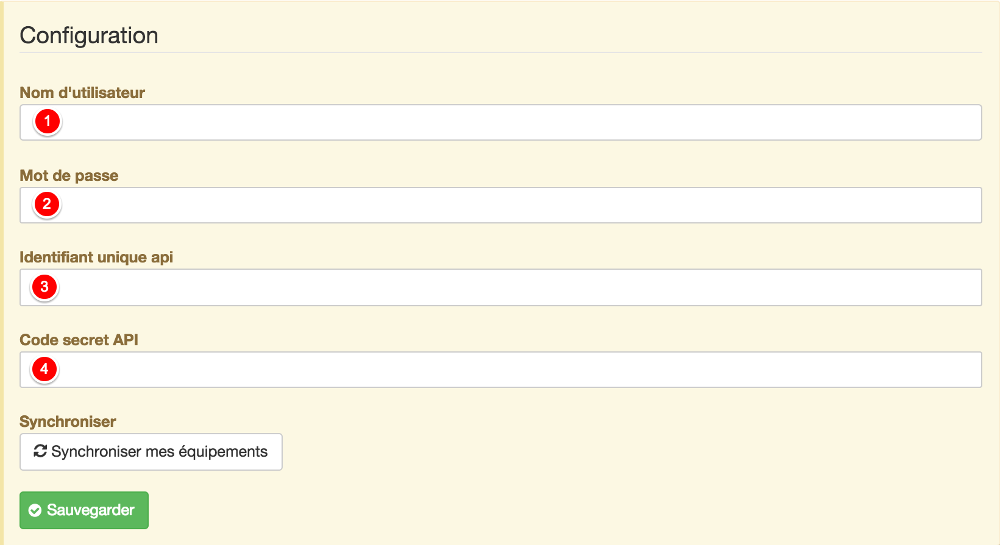
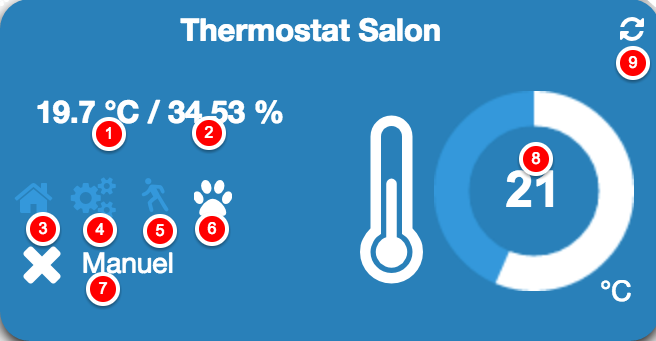

# Complemento Greenmomit

Plugin para comunicarse y controlar su termostato Green Momit

# Descripción 

## Descripción de marketing

El termostato inteligente Momit ST le permite administrar la comodidad de su hogar, esté donde esté, desde un teléfono inteligente, tableta o computadora, mientras lo ayuda a reducir su factura de energía 20%.

Alimentado desde la red eléctrica, el termostato se conecta a la caldera a través de un contacto de cambio sin potencial. Conectado a la red WiFi de su hogar, puede acceder a su sistema de calefacción desde cualquier computadora, teléfono inteligente o tableta. El termostato inteligente Momit ST destaca entre sus competidores al ofrecer varias características innovadoras :

-   Moniteur
    -   Guarde todos sus datos de consumo de energía.
-   Calendrier
    -   Le permite ajustar fácilmente su termostato.
-   Presencia
    -   Tiene un sensor que reduce el consumo excesivo de energía cuando estás lejos. La calefacción incluso se puede apagar automáticamente.
-   Control
    -   Le permite administrar la comodidad de su alojamiento desde cualquier lugar y en cualquier momento desde su teléfono inteligente, tableta o PC.
-   Temps
    -   Calcule el tiempo promedio que tarda cada alojamiento en alcanzar la temperatura indicada optimizando el período de anticipación necesario para alcanzar la temperatura correcta.
-   Economies
    -   Indicador visual que se muestra cuando se hacen ahorros.
-   Vacances
    -   Durante las vacaciones, el termostato inteligente Momit detiene el aprendizaje.
    -   A diferencia de los termostatos tradicionales, el termostato inteligente Momit ST tiene un diseño elegante e innovador que le permitirá integrarlo armoniosamente en su decoración. Con acabado de cristal y pantalla táctil.
    -   Con una aplicación gratuita (iOS y Android), su teléfono inteligente y una simple conexión a Internet, puede acceder a todas las funcionalidades del termostato inteligente Momit ST en tiempo real, desde cualquier lugar.

**Funciones**

-   Termostato WiFi IP
-   Programable y controlable remotamente
-   Compatible con sistemas de caldera convencionales o combinados
-   Reemplaza cualquier termostato de contacto seco estándar (relé)
-   Pantalla táctil capacitiva
-   Diferentes sensores integrados (temperatura, humedad, brillo, proximidad)
-   Programar programación
-   Función de vacaciones
-   Diseño elegante e innovador
-   Acabado de vidrio
-   Diferentes diseños de pantalla disponibles
-   Aplicación gratuita para iPhone
-   Aplicación gratuita de Android
-   API disponible a pedido de Green Momit Support

**Características técnicas**

-   Suministro : 230 V CA 50..60 Hz
-   Salir : Sin potencial
-   Potencia máxima :
    -   5 A para carga resistiva
    -   2 A para una carga inductiva (cosÎ † = 0.4)
-   Wifi : IEEE 802.11 b / g
-   Sensores :
    -   Pantalla táctil capacitiva
    -   Sensor de temperatura NTC 100k @ 25 ° C
    -   Sensor de humedad 0-99%
    -   Sensor de brillo
    -   Sensor de proximidad hasta 5 m
-   Protección de IP : IP20
-   Dimensiones : 94 x 94 x 32 mm
-   Peso : 225g
-   Normas :
    -   ETSI EN 300328 V1.7.1 (2006-10)
    -   ETSI-EN 301 489-1 V1.9.2 (2011-09)
    -   ETSI EN 301 489-17 V2.2.1 (2012-09)
    -   EN 62479:2010
    -   EN 60730-2-9; EN 60730-1

# Configuración 

## Instala el complemento 

Continuar con la instalación del complemento

Haga clic en "General", luego Complementos

Haga clic en el icono "Market" para acceder al contenido de los complementos disponibles en Jeedom Market.

Explore el mercado hasta la categoría "Confort" o use el cuadro de búsqueda con la palabra clave "Green Momit". Haga clic en el complemento.

Podrás instalar el complemento en su versión  estable o  Beta La versión estable se recomienda para la mayoría de los usuarios.

## Configuración del plugin 

Configurar el complemento. Vous aurez besoin de vos identifiants qui vous permettent d'accéder au portail Green Momit (<https://st.greenmomit.com/>) Le site du constructeur (<http://greenmomit.com/>) 

Avant de configurer le plugin, vous devez valider que votre compte est fonctionnel sur le portail Green Momit. (<https://st.greenmomit.com/>)

Y pedirle apoyo a Green Momit

-   Identificador único API 
-   Código secreto API

enviando un correo electrónico a ( <support@greenmomit.es>) o
(( <support@momit.zendesk.com> ).

 Nom d'utilisateur : spécifier l'adresse email utilisée pour accéder au site <https://st.greenmomit.com/>  

Contraseña : su contraseña asociada 

 

Identificador único API : recibido por correo electrónico luego de una solicitud del soporte de Green Momit

 

Código secreto API : idem Luego haga clic en "Guardar" y "Sincronice su equipo"

## Configuración del complemento

Configurar el complemento

Haga clic en "Complementos" ⇒ "Bienestar" ⇒ "Momit verde"

Su termostato está configurado, todo lo que tiene que hacer es :

-   Especificar objeto primario,
-   l'activer,
-   y hacerlo visible.

La opcion : "El control del termostato no lo realiza Jeedom ", dejemos la prioridad de la aplicación Green Momit sobre Jeedom.

##  Configuración del widget

Le widget du thermostat est déjà en place et disponible dans l'objet parent définit dans la configuration précédente.

Température actuelle (sonde du thermostat). 

Hydrométrie actuelle (sonde du thermostat).

Eteint le thermostat si le thermostat détecte que c'est la nuit.

Le thermostat apprend tout seul vos habitudes.

Le thermostat s'arrête automatiquement s'il ne détecte pas de présence.  

Mettre le thermostat en mode Manuel ou Automatique.  

Etat du thermostat.  

Consigne du thermostat. Modification de la consigne avec la roue.  

Rafraîchir l'état. En survolant, affichage de la dernière synchronisation. 

