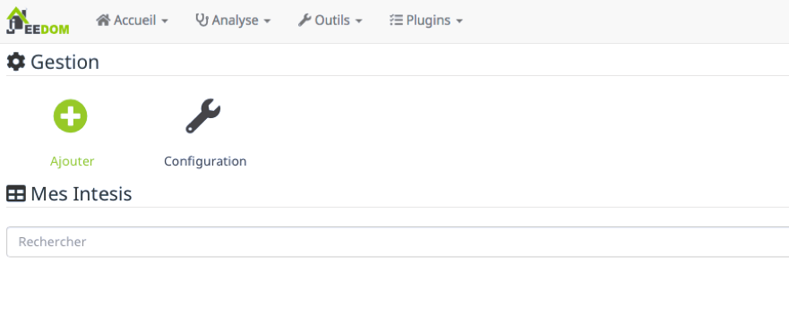
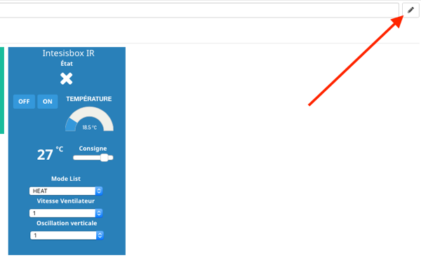

# Intesis

#Description

Plugin para controlar **les passerelles « Intesis Wifi (ASCII) AC Interfaces » (anciennement dénommées Intesisbox).**  basado en el protocolo WMP.

Les passerelles « Intesis Wifi (ASCII) AC Interfaces » sont des box qui permettent de domotiser des systèmes de climatisation gainables (interface Intesis à connecter en filaire sur le bus du climatisateur) ou à split avec télécommande infrarouge (interface Intesis IR).

Este complemento es compatible con todos los modelos de interfaces de CA Intesis Wifi (ASCII) (tanto cableadas como IR), pero **no es compatible con las puertas de enlace IntesisHome** (y en particular no con las puertas de enlace Intesis del rango IntesisHome).

Las puertas de enlace de las interfaces de CA Intesis Wifi (ASCII) son [disponible para la venta aquí.](https://www.domadoo.fr/fr/323_intesis-unites-ac-domestiques-daikin-vers-une-interface-wi-fi-rac)

# Configuración del plugin

Después de descargar el complemento, primero debe activarlo, como cualquier complemento de Jeedom :

Luego, se recomienda encarecidamente iniciar la instalación de dependencias (incluso si aparecen bien)) :

Finalmente, comienza el demonio :

Finalmente, debes verificar que todo esté verde y que esté bien :

No hay nada mas que hacer.

Rien n'est à modifier dans le champ « Port socket interne » de la section « Configuration ».

# Cómo declarar una nueva interfaz wifi intesis en Jeedom

Rendez-vous dans le menu « Plugins → Confort → Intesis » :

Llegas a la página siguiente, que consta de dos secciones :

- **Gestión** con las siguientes opciones : « Ajouter » et « Configuration » (cette option vous renvoie à la page de configuration du plugin, décrite au point précédent).
- **Mi síntesis** : Aquí es donde se muestran las puertas de enlace wifi Intesis administradas por Jeedom.

Vous devez donc cliquer sur l'option « Ajouter » et renseigner le nom de l'équipement (Climatisation Salon, par exemple) :

Vous devez ensuite compléter les autres champs de la page de configuration du nouvel équipement Intesis, dont l'objet, la catégorie, cocher « Activer » et « Visible », puis vous devez **ingrese la dirección IP** su puerta de enlace Wifi Intesisbox :

>**Importante**
>
>Debe asegurarse de que su puerta de enlace Wifi Intesisbox tenga una IP fija en su red local, de lo contrario, su IP podría cambiar, en cuyo caso Jeedom ya no podría controlar la puerta de enlace.

Todo lo que tienes que hacer es guardar.

# Las órdenes

Rendez-vous dans l'onglet « Commandes » de la page de configuration du nouvel équipement Intesis.

Ici vous pouvez masquer et rendre visibles les différentes commandes de type « action » et « info » disponibles (les commandes de type « info » peuvent également être historisées) :

El complemento ofrece un total de 14 comandos.

Las órdenes de type « action » (actionneurs) disponibles sont les suivantes :

- Uno : Para encender el aire acondicionado
-	Apagado : Para apagar el aire acondicionado
- Consigna : Para cambiar el punto de ajuste de temperatura del aire acondicionado
- Modo de lista : Para cambiar el modo de funcionamiento del acondicionador de aire (automático, calor, seco, ventilador, frío))
- Columpio arriba-abajo : Para cambiar el modo de oscilación de las palas verticales de orientación del flujo de aire (1, 2, 3 y Swing)
- Swing izquierda-derecha : Para modificar el modo de oscilación de las palas horizontales de orientación del flujo de aire (1, 2, 3 y Swing)
- Velocidad del ventilador : Para modificar la velocidad de rotación del ventilador (de 1 a 4)

Las órdenes de type « info» (capteurs) disponibles sont les suivantes :

-	Estado : Retroalimentación de estado de ENCENDIDO / APAGADO del aire acondicionado
-	Información del punto de ajuste : Retroalimentación del estado del punto de ajuste de temperatura
-	Modo : Retroalimentación de estado del modo de operación del aire acondicionado (Auto, Heat, Dry, Fan, Cool)
-	Información de oscilación alta-baja : Retroalimentación de estado del modo de oscilación de las palas verticales del aire acondicionado.
-	Información de oscilación izquierda-derecha : Retroalimentación de estado del modo de oscilación de las palas horizontales del aire acondicionado.
-	Información de velocidad del ventilador : Feedback del estado de la velocidad del ventilador
-	Temperatura : Temperatura ambiente

Puedes ocultar comandos que no te son útiles. Este puede ser el caso, por ejemplo, si su aire acondicionado no tiene paletas de orientación de flujo de aire.

À l'inverse, vous pouvez rendre visibles les commandes de type « info » qui vous sont utiles.

# El widget Intesis

Como se indica en el punto 3) anterior, los comandos que aparecen en el widget son solo aquellos que ha hecho visibles antes.

>**Observación**
>
>Pour les commandes de type « info », le retour d'état se fait toutes les 5 minutes. Entonces, si usa el control remoto del aire acondicionado para modificar el punto de ajuste (u otro), Jeedom refleja este estado en el widget dentro de un período máximo de 5 minutos.

Al igual que con cualquier widget de Jeedom, puede reorganizar los controles en el widget utilizando el modo de edición (para hacer esto, haga clic en el lápiz en la esquina superior izquierda) :

Algunos ejemplos de widgets de Intesis con diferentes comandos visibles (en Jeedom V3) :

Ejemplo de widget Intesis en Jeedom V4 :

