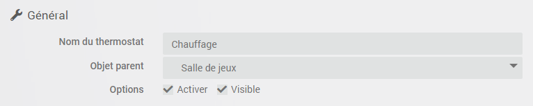
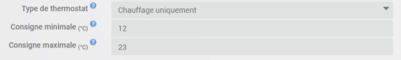
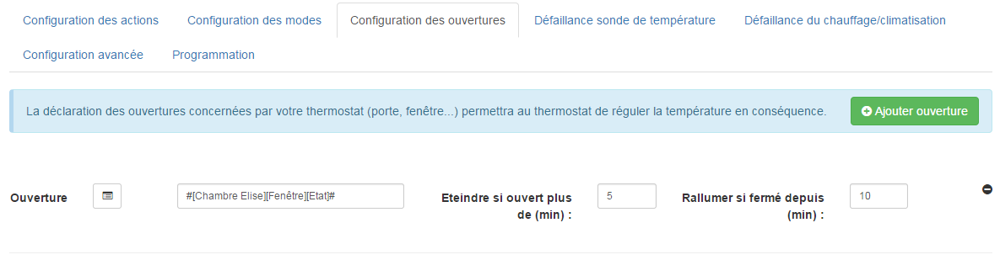
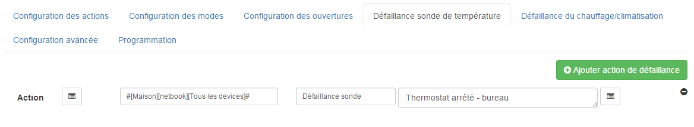
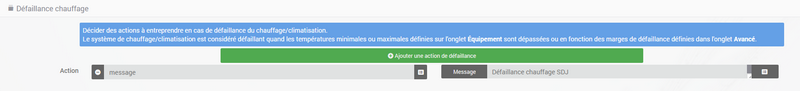
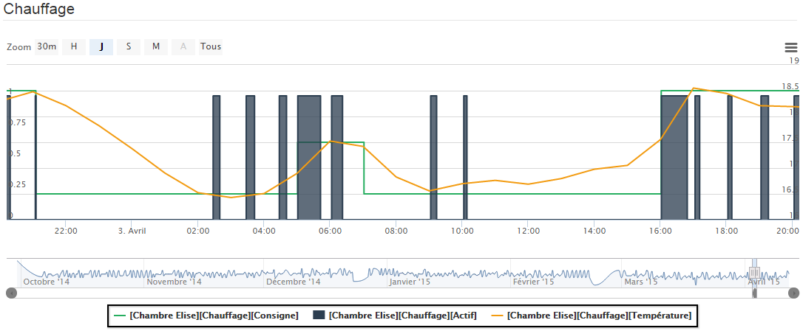

# Plugin de termostato

# Description

Este complemento le permite crear y administrar termostatos para controlar el calentamiento de su hogar. Funciona en 2 modos, tu eliges :

-   el modo **histéresis** corresponde a encender y apagar la calefacción en función de la temperatura interior, en relación con un umbral correspondiente al punto de ajuste. La histéresis permite evitar cambios muy frecuentes cuando la temperatura está alrededor del punto de ajuste.
-   el modo **temporal** calcula un porcentaje de calefacción durante un ciclo de tiempo predefinido, teniendo en cuenta las diferencias entre el punto de ajuste y las temperaturas interior y exterior (aislamiento). Este modo es más preciso, tiene una función de aprendizaje que permite el ajuste automático de los coeficientes, pero puede requerir algunos ajustes manuales para adaptarlo a su instalación. Importante para que funcione el modo horario, necesita absolutamente un sensor de temperatura interior y exterior.

# Configuration

Este complemento es para crear termostatos en Jeedom. Puede controlar calefacción, aire acondicionado o ambos.

La ventaja en comparación con un termostato convencional es que podrá integrarse completamente en la instalación de su domótica. Además de la regulación de la temperatura, porque esto es lo que se pide primero, el termostato puede interactuar con todos los equipos de la casa.

Entre sus características están :

-   teniendo en cuenta la temperatura exterior, por lo tanto, el coeficiente de aislamiento de la casa,
-   un sistema regulatorio que aprende a optimizar la regulación,
-   la posibilidad de manejar las puertas para desconectar el termostato,
-   gestión de fallas de equipos, sensores de temperatura y calentadores,
-   programación completa con el plugin diario, en particular la posibilidad de anticipar el cambio de setpoint para que la temperatura se alcance a la hora programada (Smartstart)

Primero, le mostraremos la implementación, luego detallaremos las diferentes configuraciones de la configuración del termostato y finalmente, a través de algunos casos de uso, cómo podemos enriquecerlo en combinación con otros complementos o utilizando escenarios.

## Configuración en unos pocos clics

El termostato Jeedom es muy potente pero para uso tradicional, su implementación es realmente simple y rápida, desde el momento en que comprendemos los pasos esenciales :

-   definición del motor del termostato (histéresis o tiempo). Es la elección del algoritmo de regulación.
-   configuración y rango operativo : solo calefacción, aire acondicionado o ambos, temperaturas mínimas y máximas de uso.
-   Definir las acciones que el termostato debe tomar para calentar, enfriar o apagar.

Luego hay diferentes pestañas :

-   La configuración del modo define temperaturas predeterminadas. Por ejemplo, modo confort a 20 ° C, eco a 18 ° C. También puede haber día, noche, vacaciones, ausencias, etc ... aquí empiezas a ver las posibilidades de personalización del plugin.
-   Para refinar el modo de funcionamiento del termostato, también podrá configurar aberturas que interrumpirán temporalmente la regulación (por ejemplo, una ventana abierta puede detener el calentamiento). La definición de esta interrupción se realiza aquí simplemente.
-   La gestión de los modos de falla para sensores de temperatura o para calefacción permite definir acciones a ejecutar para un modo degradado.
-   La pestaña Configuración avanzada le permite ajustar los parámetros de regulación de calefacción.
-   Si, además, tiene el complemento Agenda, los cambios en el modo de programación son posibles directamente desde la pestaña de programación.

Su termostato ahora está operativo y al usar escenarios o combinarlo con otros complementos (agenda, virtual, presencia, ...), se integrará perfectamente en su instalación de automatización del hogar. Esto es lo que obtenemos de forma predeterminada en el panel :

El bloqueo en el widget le permite bloquear el termostato en un punto de ajuste dado, luego de un evento imprevisto : vacaciones, invitados, ...

## La creación de un termostato en detalle

Para crear un nuevo termostato, vaya a la página de configuración abriendo el menú **Complementos → Confort** y seleccione **Termostato**. Haga clic en el botón **Añadir** ubicado en la parte superior izquierda e ingrese el nombre deseado para su termostato.

Primero, informaremos los parámetros generales del termostato. Se encuentran en la parte superior izquierda, sección general y es necesario especificar aquí el objeto principal, la activación y la visibilidad del termostato, información habitual para cualquier usuario de libertad.

## La elección del algoritmo de termostato

En esta imagen, se destaca el motor de operación del termostato. Hay 2 algoritmos posibles para la regulación de la temperatura.

Cuando seleccionas el modo **Histéresis**, su calefacción se pone en marcha tan pronto como la temperatura es inferior al punto de ajuste menos la histéresis y se apaga tan pronto como la temperatura supera el punto de ajuste más la histéresis.

Por ejemplo, si la histéresis se establece en 1 ° C y el valor establecido es 19 ° C, el calentamiento se activa cuando la temperatura cae por debajo de 18 ° C y se detiene tan pronto como llega a 20 ° C.

Los parámetros a suministrar son el valor de histéresis en ° C y el comando que permite recuperar la medida de temperatura. La histéresis se ajustará de acuerdo con la precisión del sensor, por ejemplo, para una sonda precisa a 0.5 ° C, una histéresis de 0.2 ° C es un buen compromiso.

Es posible tener en cuenta solo la histéresis positiva marcando la casilla **Histéresis positiva**. En el modo "Calefacción", el termostato se encenderá tan pronto como la temperatura interior sea inferior al punto de ajuste o, en el modo "Aire acondicionado", cuando la temperatura interior sea superior al punto de ajuste.

> **INFORMACIÓN**
>
> Los parámetros relacionados con la histéresis se pueden encontrar en la pestaña **Por adelantado**.

En el caso del modo **Temporal**, el comando de calefacción o aire acondicionado se define en un ciclo predefinido y el tiempo de ejecución del comando depende de la diferencia entre el punto de ajuste y la temperatura medida por el sensor. El algoritmo también calculará el tiempo de calentamiento (o enfriamiento) durante un ciclo de acuerdo con la inercia y el aislamiento de la habitación.

Finalmente, cuanto más largo sea el tiempo del ciclo, más lenta será la regulación. Por el contrario, un tiempo demasiado corto provocará un cambio frecuente de su sistema de calefacción que puede no tener tiempo para calentar el volumen de la habitación de manera efectiva. Se recomienda no reducir demasiado este tiempo de ciclo (los valores aceptables son entre 30 y 60 minutos).

Este tipo de regulación está más optimizada, mejora la comodidad y permite ahorros sustanciales de energía.

## La configuración general

Además del modo de funcionamiento del termostato, puede decidir si el termostato se utiliza en modo calefacción, refrigeración o en ambos. Luego indicas su rango de uso : los puntos de ajuste mínimo y máximo definirán los posibles valores de punto de ajuste accesibles en el widget.

Luego, debes especificar los comandos que te permiten medir las temperaturas. Tenga en cuenta que el modo de hora absolutamente necesita conocer la temperatura exterior. Si no tiene un sensor exterior, puede proporcionarlo el complemento "Clima"".

> **CONSEJO**
>
> Los campos `` Temperatura mínima '' y `` Temperatura máxima '' definen el rango de funcionamiento del termostato fuera del cual se activa una falla del sensor *(Vea el párrafo sobre acciones predeterminadas a continuación*).

También es posible indicar el consumo por día en kWh de su calefacción *(facultatif)* que mostrará una indicación del rendimiento de su calefacción haciendo el cálculo **consumo / DJU** *(grado-día unificado)*. También puede mostrar cualquier comando de su elección en el termostato ingresándolo en el campo **Pedido personal**.

## Las acciones

Todo lo relacionado con los controles del radiador o del aire acondicionado se describe en la pestaña **Acciones**. Allí se pueden definir varias acciones, lo que le da a nuestro termostato la posibilidad de controlar diferentes equipos (caso de funcionamiento por zona por ejemplo o control de otro termostato)

Las acciones son aquellas que permiten calentar, enfriar (aire acondicionado), deteniendo el comando. Se puede prever una acción adicional en cada cambio de punto de ajuste, ya sea en modo manual o automático. Você pode usar #slider# na opção para passar o setpoint para a ação.

## Las modas : el punto de partida para la automatización

Los modos (definidos en la pestaña **Modos**) son pautas predeterminadas del termostato que se adaptan a su estilo de vida. Por ejemplo, el modo *Noche* o *Eco* dale la temperatura que quieras cuando todos estén dormidos. El modo *Día* o *Confort* determina el comportamiento del termostato para tener una temperatura agradable cuando estás presente en casa. Aquí no hay nada congelado. Puede definir tantos modos como desee usarlos a través de escenarios (Volveremos a esto más adelante)).

En la imagen de abajo, el modo *Confort* tiene un punto de ajuste de 19 ° C y para el modo *Eco*, el termostato se ajusta a 17 ° C. El modo *Vacaciones* programa el termostato a 15 ° C en caso de ausencia prolongada. No es visible en el tablero, ya que es un escenario que programa todo el equipo en *Vacaciones* y así posicionar el termostato en este modo.

Para definir un modo, proceda de la siguiente manera :

-   Haga clic en el botón *Añadir modo*,
-   asigne un nombre a este modo, por ejemplo, `Eco`,
-   agrega una acción y elige el comando *Termostato* de su equipo de termostato,
-   ajustar la temperatura deseada para este modo,
-   marca la casilla **Visible** para mostrar este modo en el widget del termostato en el Tablero.

>**Importante**
>
>Atención durante el cambio de nombre de un modo es absolutamente necesario revisar los escenarios / equipos que usan el nombre antiguo para pasarlos al nuevo

## Las aberturas : para interrumpir temporalmente el termostato

Imagine que desea detener temporalmente su calefacción o aire acondicionado, por ejemplo, para ventilar la habitación para la que está activo el termostato. Para detectar la apertura de la ventana, utilizará un sensor ubicado en la apertura de su ventana, lo que le permitirá llevar a cabo esta interrupción agregándola en la pestaña de configuración de las aberturas. Aquí se pueden configurar dos parámetros adicionales; los tiempos de apertura y cierre de la ventana harán que el termostato se detenga y reanude la operación.

Puede definir el envío de una alerta si una de las puertas ingresadas en esta página permanece abierta por más de `XX` minutos.

Para configurar la operación cuando se abre la ventana :

-   seleccione la información del sensor de apertura en el campo `Apertura`
-   ajuste el tiempo antes de que el termostato se apague después de abrir en `Apagar si está abierto más de (min.) :``
-   ajuste el tiempo después de cerrar la ventana permitiendo que el termostato se reinicie en `Encender si está cerrado desde (min.) :``
-   Haga clic en el botón *Guardar* para registrar la inclusión de aperturas

> **CONSEJO**
>
> Es posible definir varias aberturas, esto es necesario cuando el termostato controla un área compuesta por varias habitaciones.

## Predecir un modo degradado gracias a la gestión de fallos

Las fallas pueden provenir de los sensores de temperatura o del control de calefacción. El termostato puede detectar una falla durante una desviación prolongada de la temperatura desde el punto de ajuste.

### Falla de la sonda de temperatura

Si los sensores utilizados por el termostato no devuelven un cambio de temperatura, por ejemplo, en el caso de desgaste de la batería, el termostato inicia acciones de falla. Cuando ocurre la falla, es posible poner el dispositivo en un modo de operación predeterminado, por ejemplo forzando el orden de un radiador de alambre piloto. Más simplemente enviando un mensaje de texto o una notificación le permite ser advertido e intervenir manualmente.

> **Importante**
>
> El parámetro que permite al termostato decidir sobre una falla de la sonda se encuentra en la pestaña *Por adelantado*. Este es el `tiempo máximo entre 2 cambios de temperatura`.

Para definir una acción de falla :

-   Click en la pestaña *Falla de la sonda*,
-   Haga clic en el botón *Agregar una acción de falla*
-   seleccione una acción y complete los campos asociados

Puede ingresar varias acciones, que se ejecutarán en secuencia y en el caso de acciones más complejas, invocar un escenario *(escriba "escenario" sin acento en el campo de acción y luego haga clic en otro lugar para poder ingresar el nombre del escenario)*.

### Falla de calefacción / aire acondicionado

El buen funcionamiento de la calefacción o del aire acondicionado está condicionado por un buen seguimiento de las instrucciones. Por lo tanto, si la temperatura se desvía del rango operativo del termostato, inicia acciones de falla de calefacción / aire acondicionado. Este análisis se lleva a cabo durante varios ciclos.

> **Importante**
>
> El parámetro que permite al termostato decidir sobre una falla de la sonda se encuentra en la pestaña *Por adelantado*. Estos son el 'Margen de falla en caliente' para calefacción y el 'Margen de falla en frío' para aire acondicionado.

Para definir una acción de falla :

-   Click en la pestaña *Falla de calefacción / aire acondicionado*,
-   Haga clic en el botón *Agregar una acción de falla*
-   seleccione una acción y complete los campos asociados

Puede ingresar varias acciones, que se ejecutarán en secuencia y en el caso de acciones más complejas, invocar un escenario *(escriba "escenario" sin acento en el campo de acción y luego haga clic en otro lugar para poder ingresar el nombre del escenario)*.

## Gestione casos especiales con la configuración avanzada del termostato

Esta pestaña contiene todos los parámetros para ajustar el termostato en modo horario. En la mayoría de los casos, no es necesario modificar estos valores, ya que el autoaprendizaje calculará automáticamente los coeficientes. Sin embargo, incluso si el termostato puede adaptarse a la mayoría de los casos, es posible ajustar los coeficientes para una configuración optimizada para su instalación.

Los coeficientes son los siguientes :

-   **Coeficiente de calentamiento / coeficiente de enfriamiento** : esta es la ganancia del sistema regulatorio. Este valor se multiplica por la diferencia entre el punto de ajuste y la temperatura interior medida para deducir el tiempo de calentamiento / enfriamiento.
-   **Aprendizaje en caliente / aprendizaje en frío** : este parámetro indica el progreso del aprendizaje. Un valor de 1 indica el inicio del aprendizaje, el algoritmo realiza un ajuste aproximado de los coeficientes. Luego, a medida que este parámetro aumenta, el ajuste se vuelve más refinado. Un valor de 50 indica el final del aprendizaje.
-   **Aislamiento de calefacción / aislamiento de aire acondicionado** : este coeficiente se multiplica por la diferencia entre el punto de ajuste y la temperatura exterior medida para deducir el tiempo de calefacción / aire acondicionado. Representa la contribución de la temperatura exterior al tiempo de calentamiento / enfriamiento y su valor es normalmente más bajo que el coeficiente de calentamiento / enfriamiento, en el caso de una habitación bien aislada.
-   **Aprenda aislamiento en caliente / Aprenda aislamiento en frío** : misma función que la anterior, pero para los coeficientes de aislamiento.
-   **Compensación de calefacción (%) / Compensación de aire acondicionado (%)** : La compensación de calefacción permite tener en cuenta *contribuciones internas*, normalmente no debería repararse, pero suponemos que el aprendizaje integra la parte dinámica en los otros 2 coeficientes. El *contribuciones internas*, Es, por ejemplo, una computadora que provocará un aumento de la temperatura cuando se enciende, pero también puede ser individual (1 persona = 80 W en promedio), el refrigerador en la cocina. En una habitación al sur, es una fachada soleada que puede proporcionar energía adicional. En teoría, este coeficiente es negativo.
- **Desplazamiento a aplicar si el radiador se considera caliente (%)** : para usar si su sistema de control de calefacción tiene una inercia significativa, ya sea debido a los radiadores, la configuración de la habitación (distancia entre el radiador y la sonda de temperatura) o la propia sonda de temperatura ( Dependiendo del modelo, su reactividad es más o menos). La consecuencia visible de esta inercia es un sobreimpulso temporal del punto de ajuste durante aumentos significativos de temperatura (punto de ajuste que va de 15 ° C a 19 ° C, por ejemplo). Este parámetro corresponde a la diferencia observada entre el período de calentamiento (= el calentamiento está encendido) y el período en que aumenta la temperatura medida por la sonda, dividida por la duración del ciclo configurado. Por ejemplo, si hay una diferencia de 30 minutos entre el inicio del calentamiento y el inicio del aumento de la temperatura, y la duración de los ciclos de calentamiento se establece en 60 minutos, podemos establecer este parámetro en un 50%. Por lo tanto, cuando un ciclo de calentamiento al 100% es seguido por otro calentamiento, este parámetro hace posible tener en cuenta el calor generado por el radiador en el primer ciclo pero aún no medido por la sonda para el cálculo del segundo ciclo, reduciendo d '' su potencia de calentamiento. La potencia del segundo ciclo se reducirá en un 50% en comparación con el cálculo realizado de acuerdo con la temperatura medida por la sonda.
-   **Autoaprendizaje** : casilla de verificación para activar / desactivar el aprendizaje de los coeficientes.
-   **Inicio inteligente** : Esta opción le permite proporcionar inteligencia al termostato, anticipando el cambio del punto de ajuste para que la temperatura se alcance a la hora programada. Esta opción requiere tener el complemento de agenda. Tenga en cuenta que para que el inicio inteligente funcione, es esencial que el aprendizaje sea superior a 25. Otro punto que solo toma el evento más cercano para venir
-   **ciclo (min)** : este es el ciclo de cálculo del termostato. Al final del ciclo y de acuerdo con la diferencia entre las temperaturas y el punto de ajuste, el termostato calcula el tiempo de calentamiento para el siguiente ciclo.
-   **Tiempo mínimo de calentamiento (% de ciclo)** : Si el cálculo resulta en un tiempo de calentamiento inferior a este valor, entonces el termostato considera que no es necesario calentar / enfriar, el comando pasará al siguiente ciclo. Esto evita dañar ciertos dispositivos como las estufas, pero también logra una eficiencia energética real.
-   **Margen de falla en caliente / Margen de falla en frío** : este valor se utiliza para detectar un mal funcionamiento de calefacción / aire acondicionado. Cuando la temperatura excede este margen en comparación con el punto de ajuste durante más de 3 ciclos consecutivos, el termostato cambia al modo de falla de calefacción.
- **Limita los ciclos de encendido / apagado incesante (pellet, gas, fuel oil) y PID** : Esta opción le permite regular con diferentes niveles de calefacción. El retorno de energía del siguiente ciclo debería dar el nuevo punto de ajuste del nivel de calefacción al calentador. Los ciclos terminan al 100%, por lo tanto, tenga un tiempo de ciclo corto.
- **Punto de ajuste Delta: temperatura exterior para dirección frío / calor** : el termostato elige la dirección (calefacción o aire acondicionado) de acuerdo con el punto de ajuste y la temperatura exterior (por razones de ahorro, se supone que la temperatura interior tiende hacia la temperatura exterior). Con estos parámetros puedes cambiar el umbral. Ex : si desea 25 y está 22 afuera por defecto, el termostato entrará en modo de calefacción (solo entrar en este modo para el cálculo no significa que se calentará), al configurar el delta caliente en 4 ya no se calentará porque 25-22 = 3 y 3 <4, por lo tanto, entrará en modo de enfriamiento (si la temperatura interior está por encima del punto de ajuste)

> **A saber**
>
> El autoaprendizaje sigue activo. Sin embargo, la fase de inicialización puede ser relativamente larga *(cuenta unos 3 días)*. Durante esta fase, es necesario tener períodos suficientemente largos durante los cuales el punto de ajuste no cambia.

## Controles del termostato

No se puede acceder a todos los comandos en la programación, algunos son información de estado devuelta por el complemento. En los escenarios, encontramos :

-   **Las modas** : es posible realizar cambios de modo, ejecutando directamente los comandos (aquí, Confort, Confort mañana, Eco, Vacaciones)
-   **Apagado** : Este comando corta el termostato, la regulación ya no está activa, la calefacción / aire acondicionado se detiene
-   **Termostato** : este es el punto de ajuste del termostato
-   **cerradura** : comando de bloqueo, no es posible modificar el estado del termostato (cambio de modo, punto de ajuste)
-   **desbloquear** : desbloquea el termostato para cambiar su estado
-   **Solo calefacción** : la regulación solo interviene al calor
-   **Solo aire acondicionado** : la regulación solo está activa para enfriar
-   **Compensación de calentamiento** : modifica el coeficiente de compensación del calentamiento correspondiente a las contribuciones internas : un escenario puede modificar este parámetro de acuerdo con un detector de presencia, por ejemplo
-   **Compensación en frío** : como arriba pero para aire acondicionado
-   **Permitir todo** : modifica el comportamiento del termostato para actuar tanto en calefacción como en aire acondicionado
-   **Potencia** : solo disponible en modo horario, este comando indica el porcentaje de tiempo de calentamiento / enfriamiento durante el tiempo del ciclo.
-   **Rendimiento** : solo está disponible si tiene un control de temperatura exterior y un control de consumo (en kWh, restablezca a 0 todos los días a las 00:00). Esto le muestra el rendimiento de su sistema de calefacción en comparación con el día de grado unificado.
-   **Punto de ajuste delta** : solo disponible en modo horario, este comando le permite ingresar un delta de cálculo en el punto de ajuste. Si> 0, entonces el termostato buscará si debe calentarse (punto de ajuste - delta / 2) si es así, buscará calentarse a (punto de ajuste + delta / 2). La ventaja es calentar más tiempo pero con menos frecuencia.

> **Punta**
>
> El uso del termostato en modo `Solo calefacción` requiere haber definido los controles *Para calentar tengo que ?* y *Para detener todo lo que tengo que ?* En modo `Solo aire acondicionado`, se requieren controles *Para enfriar tengo que ?* y *Para detener todo lo que tengo que ?*. Y en el modo `Todos autorizados`, es necesario haber ingresado los 3 comandos.

## Un ejemplo concreto del uso del termostato

Cuando su termostato está configurado, debe realizar la programación. El mejor método para explicarlo es tomar un caso de uso. Entonces, queremos programar nuestro termostato de acuerdo con las horas de presencia de los ocupantes de la casa.

Primero, usaremos 2 escenarios para poner la calefacción en modo **Confort** (punto de ajuste 20 ° C) todas las mañanas de la semana entre las 5 a.m. y las 7:30 a.m., luego en la noche entre las 5 p.m. y las 9 p.m. El modo **Confort** También se activará el miércoles por la tarde de 12 p.m. a 9 p.m. y los fines de semana de 8 a.m. a 10 p.m. El resto del tiempo, la calefacción cambia a **Eco**, con un punto de ajuste de 18 ° C.

Entonces creamos el escenario ***Calefacción de confort***, en modo programado :

y el código :

Sobre el mismo principio, el escenario "Ecocalentamiento"" :

y su código :

Tenga en cuenta que en los escenarios, el control del termostato está completo, ya que podemos actuar sobre el modo de funcionamiento (solo calefacción o aire acondicionado), los modos, el valor establecido y el bloqueo (bloqueo, desbloqueo).

Si la creación de escenarios a veces es complicada, para la programación de un termostato, la combinación de acciones del termostato con el calendario del complemento de agenda hace posible hacer esto simplemente.

El complemento de agenda le permite ir más allá en la programación y, sobre todo, presenta menos riesgo de equivocarse. De hecho, en comparación con la programación anterior, el calendario aparecerá claramente en la pantalla y podremos tener en cuenta las vacaciones, las vacaciones ... En resumen, controlar el termostato según su estilo de vida.

## Programación con el complemento de agenda

No presentamos aquí el complemento Agenda, el objetivo es acoplarlo con la programación del termostato. Tenga en cuenta que si tiene el complemento de agenda, una pestaña *Programación* aparece en la configuración del termostato, lo que permite el acceso directo al calendario asociado.

Entonces vamos a crear una nueva agenda llamada **Programación de calefacción**, a lo que se agregarán los eventos de cambio de modo del termostato.
Una vez que se haya creado el calendario, agregaremos los eventos de la mañana (lunes a viernes de 5 a.m. a 7:30 a.m.), tarde (lunes, martes, jueves y viernes de 5 p.m. a 9 p.m.), miércoles (miércoles de 12 p.m. a 9 p.m.), Fin de semana (8 a.m. a 10 p.m.), días festivos. Todos estos eventos tienen como acción inicial la selección del modo **Confort** del termostato y como acción final el modo **Eco** :

Para la programación del evento vespertino :

Simplemente repita para cada evento para obtener esta colorida agenda mensual :

Volviendo a la configuración del termostato, puede acceder a los eventos del calendario directamente desde la pestaña de programación :

## Visualización del funcionamiento del termostato

Una vez configurado el termostato, es importante verificar su eficiencia.

En el menú `Inicio`, está el submenú` Termostato`. La ventana que aparece cuando selecciona este menú se divide en tres áreas :

-   El *Reproductor* termostato, para ver el estado instantáneo del termostato,
-   un gráfico que representa el tiempo de calentamiento acumulado por día (en número de horas),
-   otro gráfico que muestra las curvas de consigna, temperatura interior y estado de calefacción.

*Gráfico de tiempo de calentamiento acumulado*

*Gráfico de curva del termostato*

# FAQ

>**¿Podemos usar el termostato con un piso calentado, que tiene una alta inercia ?**
>
>El termostato se adapta prácticamente a todos los casos, pero esto requiere un análisis en profundidad de su instalación para ajustar los coeficientes, si se encuentra en una situación particular. Ver la sección sobre *Configuración avanzada* para ajustar los coeficientes, especialmente en el caso de un piso calentado. Varios temas en el foro tratan sobre el uso del termostato para diferentes tipos de calefacción (estufa, caldera de piso, etc.))

>**Mis coeficientes siguen moviéndose**
>
>   Es normal, el sistema corrige constantemente sus coeficientes gracias al sistema de autoaprendizaje

>**¿Cuánto tiempo lleva, en el modo de tiempo, aprender ?**
>
>El sistema tarda un promedio de 7 días en aprender y regular de manera óptima

>**No puedo programar mi termostato**
>
>La programación del termostato se puede hacer por un escenario o con el uso del complemento de agenda.

>**Mi termostato nunca parece entrar en modo de calefacción o aire acondicionado**
>
>Si el termostato no tiene un control correspondiente a calefacción y / o aire acondicionado, no puede cambiar a estos modos.

>**No importa cómo cambie la temperatura o el modo, el termostato siempre vuelve al estado anterior**
>
>Verifique que su termostato no esté bloqueado

>**En el modo de histéresis, mi termostato nunca cambia de estado**
>
>Es que las sondas de temperatura no aumentan automáticamente su valor, es recomendable configurar un "Cron de control"

>**Las curvas del termostato (en particular el punto de ajuste) no parecen ser correctas**
>
>Mire el lado suavizado del historial de pedidos en cuestión. De hecho, para ganar en eficiencia, Jeedom promedia los valores durante 5 minutos y luego durante una hora.

>**La pestaña de modo / acción está vacía y cuando hago clic en los botones Agregar no hace nada**
>
>Intente deshabilitar Adblock (o cualquier otro bloqueador de anuncios), por alguna razón desconocida, estos bloquean el javaScript de la página sin ningún motivo.
