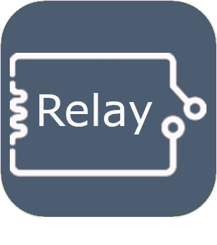
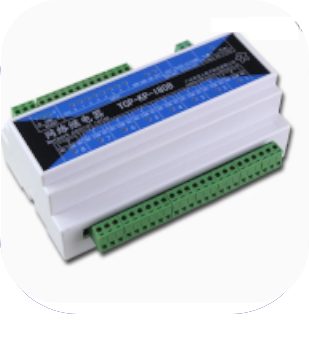

# Protocolo de domótica

>**Importante**
>Solo los complementos de contribuyentes tienen su documentación aquí. Puede consultar la documentación de los complementos oficiales directamente desde Jeedom Market. Una vez en el complemento en cuestión, haga clic en la documentación.
>Podéis ver [aquí](https://market.jeedom.com/index.php?v=d&p=market&type=plugin&categorie=automation+protocol) todos los complementos oficiales en esta categoría

| | | | |
|--- | --- | --- | ---|
||Descubrimiento MQTT|Complemento para el descubrimiento automático de equipos MQTT basado en el principio de 'MQTT Auto Discovery' (o 'HA Discovery') que existe en el asistente doméstico. Cela permet d'utiliser Open MQTT Gateway (https://docs.openmqttgateway.com/) sur esp32 ou l'équivalent Theengs gateway (https://gateway.theengs.io/) en pi. Resulta muy fácil gestionar la presencia de etiquetas bluetooth, como tuercas, o integrar una gran lista de hardware compatible con BLEA. Pero también es compatible con cualquier equipo que admita 'MQTT Discovery' como zwave, zigbee, Nuki, Switchbot, Sonos...|[Documentación estable](https://mips2648.github.io/jeedom-plugins-docs/MQTTDiscovery/es_ES/) - [Documentación beta](https://mips2648.github.io/jeedom-plugins-docs/MQTTDiscovery/es_ES/) [Mercado](https://market.jeedom.com/index.php?v=d&p=market_display&id=4429) [Registro de cambios estable](https://mips2648.github.io/jeedom-plugins-docs/MQTTDiscovery/es_ES/changelog) - [Registro de cambios Beta](https://mips2648.github.io/jeedom-plugins-docs/MQTTDiscovery/es_ES/changelog)|
||Estufa Agua IOT Micronova ombligo 2.0|Complemento PoeleAgua para la gestión de estufas de leña y pellets mediante la plataforma iot micronova aqua (navel 2.0) ex: Jolly Mec / Piazzetta / superior / MCZ y mucho más. Consulte la documentación para conocer los modelos compatibles|[Documentación estable](https://lefilliatre.github.io/lefilliatre-documentation/PoeleAgua/es_ES/) - [Documentación beta](https://lefilliatre.github.io/lefilliatre-documentation/PoeleAgua/es_ES/) [Mercado](https://market.jeedom.com/index.php?v=d&p=market_display&id=4251) [Registro de cambios estable](https://lefilliatre.github.io/lefilliatre-documentation/PoeleAgua/es_ES/changelog) - [Registro de cambios Beta](https://lefilliatre.github.io/lefilliatre-documentation/PoeleAgua/es_ES/changelog)|
||dht22|Plugin que permite la lectura de sondas DHT11, DHT22, AM2302 conectadas al GPIO de una frambuesa|[Documentación estable](https://linura.github.io/dht22/es_ES/) [Mercado](https://market.jeedom.com/index.php?v=d&p=market_display&id=4010) [Registro de cambios estable](https://linura.github.io/dht22/es_ES/changelog)|
||BEI - KNX|Conecte Jeedom con su sistema de domótica KNX y Jeedom se convertirá en un participante en su instalación|[Documentación estable](http://mika-nt28.github.io/Documentations/eibd/es_ES/) [Mercado](https://market.jeedom.com/index.php?v=d&p=market_display&id=203) [Registro de cambios estable](https://mika-nt28.github.io/Documentations/eibd/es_ES/changelog)|
||Caché global|Este complemento le permite conectar todos los dispositivos de caché global a Jeedom|[Documentación estable](https://mika-nt28.github.io/Documentations/globalcache/es_ES/) [Mercado](https://market.jeedom.com/index.php?v=d&p=market_display&id=2932) [Registro de cambios estable](https://mika-nt28.github.io/Documentations/globalcache/es_ES/changelog)|
||Control de dispositivos de red Homekit|Este complemento le permite controlar sus dispositivos de red Homekit en jeedom (no BLE). El propósito de este complemento es permitir el control de dispositivos que solo son compatibles con el protocolo Homekit y ningún otro protocolo. Entonces, por ejemplo, no Philips Hue, al que se puede acceder a través de un complemento dedicado !|[Documentación estable](https://nebzhb.github.io/jeedom_docs/plugins/hkControl/es_ES/) - [Documentación beta](https://nebzhb.github.io/jeedom_docs/plugins/hkControl/es_ES/) [Mercado](https://market.jeedom.com/index.php?v=d&p=market_display&id=3919) [Registro de cambios estable](https://nebzhb.github.io/jeedom_docs/plugins/hkControl/es_ES/changelog) - [Registro de cambios Beta](https://nebzhb.github.io/jeedom_docs/plugins/hkControl/es_ES/changelog)|
||Jeedouino|Complemento Jeedouino para administrar tarjetas Arduino (a través de Ethernet o USB), GPI R.PI, tarjetas PiFace (piRack), tarjetas RPI IO Plus 32e / s, MCP23017 (en RPI) o ESP8266 / NodeMCU / Wemos.|[Documentación estable](https://revlysj.github.io/jeedouino/es_ES/index) [Mercado](https://market.jeedom.com/index.php?v=d&p=market_display&id=2064) [Registro de cambios estable](https://revlysj.github.io/jeedouino/es_ES/changelog)|
||Mochad - X10|Complemento para administrar dispositivos X10 a través del demonio Mochad y una interfaz de computadora CM15|[Documentación estable](https://mika-nt28.github.io/Documentations/mochad/es_ES/) [Mercado](https://market.jeedom.com/index.php?v=d&p=market_display&id=359) [Registro de cambios estable](https://mika-nt28.github.io/Documentations/mochad/es_ES/changelog)|
||Modbus2MQTT|Permite leer y escribir en dispositivos modbus TCP desde y hacia MQTT|[Documentación estable](https://mips2648.github.io/jeedom-plugins-docs/modbus2mqtt/es_ES/) - [Documentación beta](https://mips2648.github.io/jeedom-plugins-docs/modbus2mqtt/es_ES/) [Mercado](https://market.jeedom.com/index.php?v=d&p=market_display&id=4309) [Registro de cambios estable](https://mips2648.github.io/jeedom-plugins-docs/modbus2mqtt/es_ES/changelog) - [Registro de cambios Beta](https://mips2648.github.io/jeedom-plugins-docs/modbus2mqtt/es_ES/changelog)|
||Servidor Modbus TCP|Complemento que transforma su Jeedom en un servidor modbus TCP|[Documentación estable](https://mips2648.github.io/jeedom-plugins-docs/modbustcp/es_ES/) [Mercado](https://market.jeedom.com/index.php?v=d&p=market_display&id=4320) [Registro de cambios estable](https://mips2648.github.io/jeedom-plugins-docs/modbustcp/es_ES/changelog)|
||MyModbus|Plugin para la gestión de materiales que dispongan del protocolo ModBus|[Documentación estable](https://bebel27a.github.io/jeedom-mymobdus.github.io/es_ES/) [Mercado](https://market.jeedom.com/index.php?v=d&p=market_display&id=3858) [Registro de cambios estable](https://bebel27a.github.io/jeedom-mymobdus.github.io/es_ES/changelog)|
||Módulo de relé|Complemento para controlar módulos de relé ethernet|[Documentación estable](http://fobsoft.github.io/jeedom-plugins-documentation/relayModule/fr_FR) - [Documentación beta](http://fobsoft.github.io/jeedom-plugins-documentation/relayModule/fr_FR) [Mercado](https://market.jeedom.com/index.php?v=d&p=market_display&id=4382) [Registro de cambios estable](http://fobsoft.github.io/jeedom-plugins-documentation/relayModule/es_ES/changelog) - [Registro de cambios Beta](http://fobsoft.github.io/jeedom-plugins-documentation/relayModule/es_ES/changelog)|
||Niren TcpKpI8O8|Complemento tcpkp para administrar las tarjetas de E/S Niren tcpkp|[Documentación estable](https://lefilliatre.github.io/tcpkp/es_ES/) - [Documentación beta](https://lefilliatre.github.io/tcpkp/es_ES/) [Mercado](https://market.jeedom.com/index.php?v=d&p=market_display&id=4256) [Registro de cambios estable](https://lefilliatre.github.io/tcpkp/es_ES/changelog) - [Registro de cambios Beta](https://lefilliatre.github.io/tcpkp/es_ES/changelog)|
