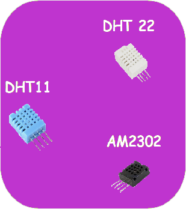
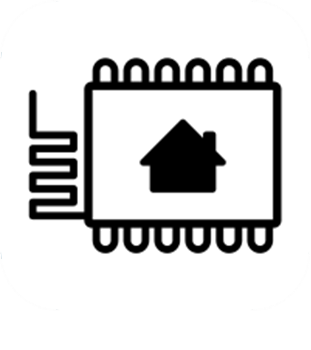
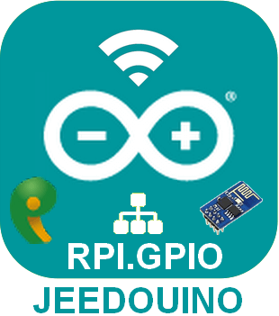
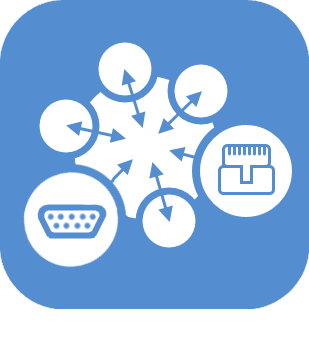
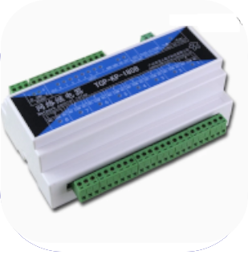
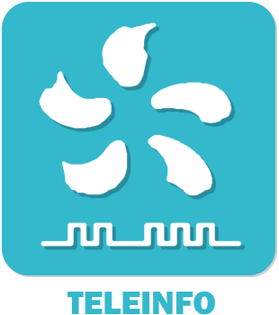

# 

>****
>. . .
>  

| | | | |
|--- | --- | --- | ---|
||||  |
|||. Cela permet d'utiliser Open MQTT Gateway (https://docs.openmqttgateway.com/) sur esp32 ou l'équivalent Theengs gateway (https://gateway.theengs.. . ...| -    - |
||.0|.: . | -    - |
||dht22||  |
||X||  |
||ESPHome|.|  |
||||  |
|||). .  !| -    - |
||Jeedouino|.|  |
||||  |
|||| -    - |
||||  |
||MyModbus||  |
||Relay Module|Plugin pour piloter des modules de relais ethernet<ul><li><a href='https://fr.aliexpress.com/item/4000999069820.html?spm=a2g0o.productlist.main.1.4be8486f3Ic93qDingtian'>IOT Relay</a></li><li><a href='https://fr.aliexpress.com/item/32914881766.html?> | -    - |
|||| -    - |
|||. )| -    - |
