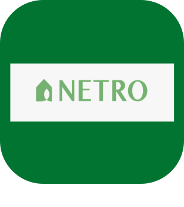
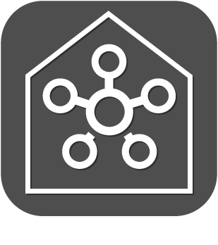
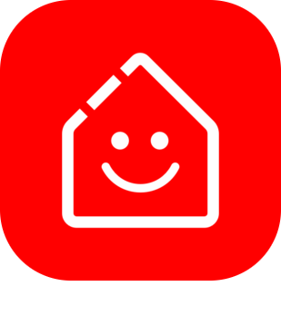
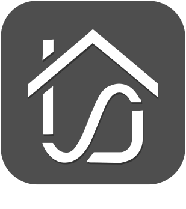

# Objetos conectados

>**Importante**
>Solo los complementos de contribuyentes tienen su documentación aquí. Puede consultar la documentación de los complementos oficiales directamente desde Jeedom Market. Una vez en el complemento en cuestión, haga clic en la documentación.
>Podéis ver [aquí](https://market.jeedom.com/index.php?v=d&p=market&type=plugin&categorie=devicecommunication) todos los complementos oficiales en esta categoría

| | | | |
|--- | --- | --- | ---|
||Bosch Indego|Plugin para cortadoras de césped robóticas Bosch Indego|[Documentación estable](https://jpty.github.io/jeedom/plugins/BoschIndego/es_ES/index.html) [Mercado](https://market.jeedom.com/index.php?v=d&p=market_display&id=3937) [Registro de cambios estable](https://jpty.github.io/jeedom/plugins/BoschIndego/es_ES/changelog.html)|
||Energía del asistente del hogar|Este complemento le permite mostrar datos de dispositivos HomeWizard Energy y controlar sus enchufes conectados. Descubrimiento de dispositivos mediante DNS multicast (mDNS) en la misma red.|[Documentación estable](https://nebzhb.github.io/jeedom_docs/plugins/HomeWizard/es_ES/) - [Documentación beta](https://nebzhb.github.io/jeedom_docs/plugins/HomeWizard/es_ES/) [Mercado](https://market.jeedom.com/index.php?v=d&p=market_display&id=4500) [Registro de cambios estable](https://nebzhb.github.io/jeedom_docs/plugins/HomeWizard/es_ES/changelog) - [Registro de cambios Beta](https://nebzhb.github.io/jeedom_docs/plugins/HomeWizard/es_ES/changelog)|
||Mercedes Me|Plugin arrété car Mercedes arrête l'API BYOC: https://developer.mercedes-benz.com/news/bringyourowncar-sundown Plugin para recuperar información de tu Mercedes.  Basado en la API oficial.|[Documentación estable](https://mguyard.github.io/Jeedom-Documentations/es_ES/Mercedes_me/documentation) - [Documentación beta](https://mguyard.github.io/Jeedom-Documentations/es_ES/Mercedes_me/documentation) [Mercado](https://market.jeedom.com/index.php?v=d&p=market_display&id=4046) [Registro de cambios estable](https://mguyard.github.io/Jeedom-Documentations/es_ES/Mercedes_me/changelog) - [Registro de cambios Beta](https://mguyard.github.io/Jeedom-Documentations/es_ES/Mercedes_me/changelog)|
||MyTado|Este complemento le permite administrar objetos conectados a Tado. También proporciona acceso al tiempo de Tado.|[Documentación estable](https://eperche-fr.github.io/docs/MyTado/es_ES/index) - [Documentación beta](https://eperche-fr.github.io/docs/MyTado/es_ES/index_beta) [Mercado](https://market.jeedom.com/index.php?v=d&p=market_display&id=4502) [Registro de cambios estable](https://eperche-fr.github.io/docs/MyTado/es_ES/changelog) - [Registro de cambios Beta](https://eperche-fr.github.io/docs/MyTado/es_ES/changelog_beta)|
||AirthingsX|Integración con la API de Airthings: registra las mediciones de los equipos Airthings para la calidad del aire. Attention: requiere PHP 7.3 y una clave API de Airthings que debe crear usted mismo (la operación es gratuita).|[Documentación estable](https://www.xypii.be/projects/jeedom-airthingsx/es_ES/) [Mercado](https://market.jeedom.com/index.php?v=d&p=market_display&id=4268) [Registro de cambios estable]()|
||Alexa-Smart Home|El complemento ha sido completamente rediseñado y rediseñado para aceptar el equipo detectado por la aplicación Alexa. El enlace establecido por los complementos entre Jeedom y el servidor de Amazon permite rastrear los estados del equipo y enviarles comandos. El enlace entre el servidor de Amazon (Alexa) y el equipo está asegurado por las habilidades de cada fabricante (Xiaomi, SmartLife, Tuya, Netatmo, Wemo, Somfy, eWelink, etc.), lo que hace que las posibilidades sean totalmente infinitas.|[Documentación estable](http://jeedom.sigalou-domotique.fr/alexa-amazon-smarthome-documentation) [Mercado](https://market.jeedom.com/index.php?v=d&p=market_display&id=3914) [Registro de cambios estable](http://jeedom.sigalou-domotique.fr/alexa-amazon-smarthome-changelog)|
||Arenti|Complemento que le permite recuperar información y controlar dispositivos sincronizados con la API de Arenti|[Documentación estable](https://flobul-domotique.fr/presentation-et-documentation-du-plugin-arenti-pour-jeedom/) [Mercado](https://market.jeedom.com/index.php?v=d&p=market_display&id=4420) [Registro de cambios estable](https://flobul-domotique.fr/liste-des-versions-du-plugin-arenti-pour-jeedom/)|
||FordCar|Complemento que permite esta conexión con Ford Pass y recuperar toda la información de su Vehículo. Le permite bloquear/desbloquear su vehículo y, dependiendo de la región del mundo, encender su vehículo.|[Documentación estable](https://cddu33.github.io/fordcar/es_ES/) - [Documentación beta](https://cddu33.github.io/fordcar/es_ES/) [Mercado](https://market.jeedom.com/index.php?v=d&p=market_display&id=4319) [Registro de cambios estable](https://cddu33.github.io/fordcar/es_ES/changelog) - [Registro de cambios Beta](https://cddu33.github.io/fordcar/es_ES/changelog_beta)|
||Govee|Complemento que le permite controlar los equipos Govee (gratis desde el 07/04/2024)|[Documentación estable](https://youdom.net/plugin-govee-with-youdom/) - [Documentación beta](https://youdom.net/plugin-govee-with-youdom/) [Mercado](https://market.jeedom.com/index.php?v=d&p=market_display&id=4371) [Registro de cambios estable](https://youdom.net/plugin-govee-changelog/) - [Registro de cambios Beta](https://youdom.net/plugin-govee-changelog/)|
||Home Connect|Complemento para recuperar información de electrodomésticos compatibles|[Documentación estable](https://jmvedrine.github.io/homeconnect/es_ES/) [Mercado](https://market.jeedom.com/index.php?v=d&p=market_display&id=3894) [Registro de cambios estable](https://jmvedrine.github.io/homeconnect/es_ES/changelog)|
||Información y ubicación|Gestión de la presencia, geolocalización y otra información de un teléfono|[Documentación estable](https://jeremie-c.github.io/plugin-InfoLoc/es_ES/index) [Mercado](https://market.jeedom.com/index.php?v=d&p=market_display&id=4020) [Registro de cambios estable](https://jeremie-c.github.io/plugin-InfoLoc/es_ES/changelog)|
||iopool - EcO|Plugin Jeedom pour collecter les informations de la sonde <a href='https://iopool.com'>iopool EcO de iopool Cloud (API). Para más detalles no dudes en consultar la documentación que es muy completa.|[Documentación estable](https://mguyard.github.io/Jeedom-Documentations/es_ES/iopool_EcO/documentation) - [Documentación beta](https://mguyard.github.io/Jeedom-Documentations/es_ES/iopool_EcO/documentation) [Mercado](https://market.jeedom.com/index.php?v=d&p=market_display&id=4189) [Registro de cambios estable](https://mguyard.github.io/Jeedom-Documentations/es_ES/iopool_EcO/changelog) - [Registro de cambios Beta](https://mguyard.github.io/Jeedom-Documentations/es_ES/iopool_EcO/changelog)|
||Kia-UVO|Complemento de gestión de vehículos compatibles con KIA-UVO|[Documentación estable](https://neopix.github.io/jeedom-kiauvo-documentation/fr_FR) [Mercado](https://market.jeedom.com/index.php?v=d&p=market_display&id=4076) [Registro de cambios estable](https://neopix.github.io/jeedom-kiauvo-documentation/es_ES/changelog)|
||iRobot|Plugin para el control de robots aspiradores (Roomba) y fregadoras de suelo (Braava) de la marca iRobot.|[Documentación estable](https://mips2648.github.io/jeedom-plugins-docs/kroomba/es_ES/) - [Documentación beta](https://mips2648.github.io/jeedom-plugins-docs/kroomba/es_ES/) [Mercado](https://market.jeedom.com/index.php?v=d&p=market_display&id=2776) [Registro de cambios estable](https://mips2648.github.io/jeedom-plugins-docs/kroomba/es_ES/changelog) - [Registro de cambios Beta](https://mips2648.github.io/jeedom-plugins-docs/kroomba/es_ES/changelog)|
||LG inteligente Thinq|Plugin para Objetos Conectados de la marca LG compatible 'Smart Thinq APIv1'|[Documentación estable](https://pifou25.github.io/jeedom-lgthinq-plugin/es_ES/) - [Documentación beta](https://pifou25.github.io/jeedom-lgthinq-plugin/es_ES/index_beta) [Mercado](https://market.jeedom.com/index.php?v=d&p=market_display&id=4080) [Registro de cambios estable](https://pifou25.github.io/jeedom-lgthinq-plugin/es_ES/changelog) - [Registro de cambios Beta](https://pifou25.github.io/jeedom-lgthinq-plugin/es_ES/changelog_beta)|
||LG ThinQ|Complemento para recuperar información y controlar dispositivos sincronizados con la API LG ThinQ|[Documentación estable](https://flobul-domotique.fr/presentation-et-documentation-du-plugin-lgthinq2-pour-jeedom/) [Mercado](https://market.jeedom.com/index.php?v=d&p=market_display&id=4485) [Registro de cambios estable](https://flobul-domotique.fr/liste-des-versions-du-plugin-lgthinq2-pour-jeedom/)|
||Miele|Complemento para integrar todos los electrodomésticos de la gama Miele@Home. Es posible acceder a los datos del dispositivo, monitorearlos y realizar ciertas acciones (dependiendo del dispositivo))|[Documentación estable](https://mips2648.github.io/jeedom-plugins-docs/miele/es_ES/) - [Documentación beta](https://mips2648.github.io/jeedom-plugins-docs/miele/es_ES/) [Mercado](https://market.jeedom.com/index.php?v=d&p=market_display&id=3950) [Registro de cambios estable](https://mips2648.github.io/jeedom-plugins-docs/miele/es_ES/changelog) - [Registro de cambios Beta](https://mips2648.github.io/jeedom-plugins-docs/miele/es_ES/changelog)|
||Netatmo Pro|Integración del universo Netatmo|[Documentación estable](https://thanaus.github.io/jeedom_docs/plugins/netatmopro/es_ES/) - [Documentación beta](https://thanaus.github.io/jeedom_docs/plugins/netatmopro/es_ES/) [Mercado](https://market.jeedom.com/index.php?v=d&p=market_display&id=2950) [Registro de cambios estable](https://thanaus.github.io/jeedom_docs/plugins/netatmopro/es_ES/changelog) - [Registro de cambios Beta](https://thanaus.github.io/jeedom_docs/plugins/netatmopro/es_ES/changelog)|
||Riego neto|Complemento basado en el sistema de riego automático Netro Smart Garden|[Documentación estable](https://kcofoni.github.io/jeedom-docs/plugin-netroarrosage/docs/es_ES/) - [Documentación beta](https://kcofoni.github.io/jeedom-docs/plugin-netroarrosage/docs/es_ES/beta/) [Mercado](https://market.jeedom.com/index.php?v=d&p=market_display&id=4354) [Registro de cambios estable](https://kcofoni.github.io/jeedom-docs/plugin-netroarrosage/docs/es_ES/changelog) - [Registro de cambios Beta](https://kcofoni.github.io/jeedom-docs/plugin-netroarrosage/docs/es_ES/beta/changelog)|
||openHASP|Complemento para gestionar pantallas multifunción bajo openHASP|[Documentación estable](https://jbbeauf.github.io/openhasp/fr_FR) [Mercado](https://market.jeedom.com/index.php?v=d&p=market_display&id=4550) [Registro de cambios estable](https://jbbeauf.github.io/openhasp/es_ES/changelog) - [Registro de cambios Beta](https://jbbeauf.github.io/openhasp/es_ES/changelog_beta)|
||SmartThings|Este complemento le permite crear equipos para cada dispositivo identificado en su cuenta SmartThings. La comunicación se realiza solo a través de la API SmartThings, no se realiza ninguna conexión directa entre Jeedom y el dispositivo. Los comandos generados durante la sincronización dependen del dispositivo (cada dispositivo proporciona su lista de comandos), también dependen de la información reportada a través de la API (si el valor es 'null', el comando no se crea porque no se actualiza a través de la API o no administrado). Todavía dejé una opción para crear todos los comandos por si acaso. Les commandes disponibles varient et peuvent être très nombreuses : mostrar el estado del dispositivo, su programa, encenderlo/apagarlo, cambiar de canal, lanzar un programa...  Implementé un widget para los dispositivos más comunes, para otros, eres libre de crear el tuyo propio y, por qué no, compartirlo.|[Documentación estable](https://flobul-domotique.fr/documentation-du-plugin-smartthings-pour-jeedom) - [Documentación beta](https://flobul-domotique.fr/documentation-du-plugin-smartthings-pour-jeedom) [Mercado](https://market.jeedom.com/index.php?v=d&p=market_display&id=4099) [Registro de cambios estable](https://flobul-domotique.fr/liste-des-versions-du-plugin-smartthings-pour-jeedom/) - [Registro de cambios Beta](https://flobul-domotique.fr/liste-des-versions-du-plugin-smartthings-pour-jeedom/)|
||Sure PetCare|Plug-in para objetos conectados a animales Sure Petcare para animales (Sureflap)|[Documentación estable](https://jmvedrine.github.io/jeedom-surepetcare/es_ES/) - [Documentación beta](https://jmvedrine.github.io/jeedom-surepetcare/es_ES/) [Mercado](https://market.jeedom.com/index.php?v=d&p=market_display&id=3718) [Registro de cambios estable](https://jmvedrine.github.io/jeedom-surepetcare/es_ES/changelog) - [Registro de cambios Beta](https://raw.githubusercontent.com/jmvedrine/jeedom-surepetcare/beta/docs/es_ES/changelog.md)|
||Switchbotcloud|Este complemento le permite controlar el equipo Switchbot a través de Jeedom.|[Documentación estable](https://jeremyarnoux.github.io/jeedom/plugins/switchbotcloud/index.html) [Mercado](https://market.jeedom.com/index.php?v=d&p=market_display&id=4369) [Registro de cambios estable](https://jeremyarnoux.github.io/jeedom/plugins/switchbotcloud/changelog.html)|
||Tesla|Aquí está el complemento para monitorear su(s) Tesla(s) ! Accede a tu Tesla desde Jeedom y controla calefacción, carga, cristales,... desde escenarios.  Este complemento también contiene una herramienta de seguimiento que le permite seguir el historial de sus viajes, sus cargos y sus tiempos de estacionamiento.  Encuentra las estadísticas de los viajes realizados. Establezca favoritos en el mapa con un rango y cuando su Tesla entre o salga de este favorito, active escenarios, ...   Haz de tu Tesla un objeto conectado !  Sin nube, sus datos se almacenan en casa. Sin suscripción, sin costes adicionales|[Documentación estable](http://tesla.jeedom.free.fr/documentation) - [Documentación beta](http://tesla.jeedom.free.fr/documentation) [Mercado](https://market.jeedom.com/index.php?v=d&p=market_display&id=3486) [Registro de cambios estable](http://tesla.jeedom.free.fr/changelog) - [Registro de cambios Beta](http://tesla.jeedom.free.fr/changelog)|
||Velux|Complemento para coordinar los movimientos de una ventana y una persiana enrollable Velux.   Tenga en cuenta que este complemento requiere el complemento hkControl!|[Documentación estable](https://ktn001.github.io/es_ES/velux/) - [Documentación beta](https://ktn001.github.io/es_ES/velux/beta.html) [Mercado](https://market.jeedom.com/index.php?v=d&p=market_display&id=4453) [Registro de cambios estable](https://ktn001.github.io/es_ES/velux/changelog) - [Registro de cambios Beta](https://ktn001.github.io/es_ES/velux/changelog)|
||VeSync|Complemento para recuperar información y controlar dispositivos sincronizados en la API de VeSync|[Documentación estable](https://flobul-domotique.fr/presentation-et-documentation-du-plugin-vesync-pour-jeedom/) - [Documentación beta](https://flobul-domotique.fr/presentation-et-documentation-du-plugin-vesync-pour-jeedom/) [Mercado](https://market.jeedom.com/index.php?v=d&p=market_display&id=4362) [Registro de cambios estable](https://flobul-domotique.fr/liste-des-versions-du-plugin-vesync-pour-jeedom/) - [Registro de cambios Beta](https://flobul-domotique.fr/liste-des-versions-du-plugin-vesync-pour-jeedom/)|
||Wall|Complemento para la gestión de tabletas|[Documentación estable](https://barre35.github.io/jeedom-plugin-doc/es_ES/wall_documentation) [Mercado](https://market.jeedom.com/index.php?v=d&p=market_display&id=3634) [Registro de cambios estable](https://barre35.github.io/jeedom-plugin-doc/es_ES/wall_changelog)|
||wifilightV2|Pilote de nombreux périphériques wifi en local avec internet coupé : lampes, leds, prises, interrupteurs, thermostat, de marques diverses. Tapo, Kasa, Govee, Philips Wiz, Meross, Mystrom, MagicHome, Gateway Tuya/Zigbee incluyendo SilverCrest Lidl, Smartlife, Tuya, Ewelink, Sonoff, Sonoff DIY, Mi.Light (Milight), Yeelight, Xiaomi Philips, TP-Link, Nanoleaf, H801, iHomma, arilux, Revogi, etc. Consulter la documentation pour connaitre la liste exacte des matériels compatibles.|[Documentación estable](https://bcaro.github.io/wifilightV2-doc/es_ES/) - [Documentación beta](https://bcaro.github.io/wifilightV2-doc/es_ES/) [Mercado](https://market.jeedom.com/index.php?v=d&p=market_display&id=2793) [Registro de cambios estable](https://bcaro.github.io/wifilightV2-doc/es_ES/changelog) - [Registro de cambios Beta](https://bcaro.github.io/wifilightV2-doc/es_ES/changelog)|
||WLED|Plugin Jeedom servant à contrôler le pilote de led adressables WLED (voir https://github.com/Aircoookie/WLED et https://github.com/Aircoookie/WLED/wiki)|[Documentación estable](https://jmvedrine.github.io/jeedom-wled/es_ES/) - [Documentación beta](https://jmvedrine.github.io/jeedom-wled/es_ES/) [Mercado](https://market.jeedom.com/index.php?v=d&p=market_display&id=4129) [Registro de cambios estable](https://jmvedrine.github.io/jeedom-wled/es_ES/changelog) - [Registro de cambios Beta](https://jmvedrine.github.io/jeedom-wled/es_ES/changelog)|
||worxLandroidS|Complemento Jeedom para los modelos de cortacéspedes robot Worx Landroid versión S / M / L en la nube|[Documentación estable](https://mips2648.github.io/jeedom-plugins-docs/worxLandroidS/es_ES/) - [Documentación beta](https://mips2648.github.io/jeedom-plugins-docs/worxLandroidS/es_ES/) [Mercado](https://market.jeedom.com/index.php?v=d&p=market_display&id=3396) [Registro de cambios estable](https://mips2648.github.io/jeedom-plugins-docs/worxLandroidS/es_ES/changelog) - [Registro de cambios Beta](https://mips2648.github.io/jeedom-plugins-docs/worxLandroidS/es_ES/changelog)|
