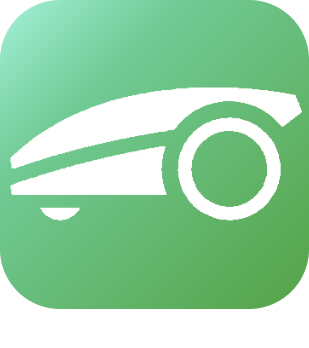

# Objetos conectados

>**IMPORTANT**
>Solo los complementos de contribuyentes tienen su documentación aquí. Puede consultar la documentación de los complementos oficiales directamente desde Jeedom Market. Una vez en el complemento en cuestión, haga clic en la documentación.
>Podéis ver [aquí](https://market.jeedom.com/index.php?v=d&p=market&type=plugin&categorie=devicecommunication) todos los complementos oficiales en esta categoría

| | | | |
|--- | --- | --- | ---|
||Bosch Indego|Plugin para cortadoras de césped robóticas Bosch Indego|[Documentación](https://jpty.github.io/jeedom/plugins/BoschIndego/es_ES/index.html) - [Mercado](https://market.jeedom.com/index.php?v=d&p=market_display&id=3937)|
||JPI Plugin||[Documentación](https://NextDom.github.io/plugin-jpi/es_ES/) - [Mercado](https://market.jeedom.com/index.php?v=d&p=market_display&id=2850)|
||SmartLife / Tuya objetos|Complemento de administración de objetos conectados SmartLife o Tuya|[Documentación](https://sabinus52.github.io/jeedom-smartlife/es_ES/) - [Mercado](https://market.jeedom.com/index.php?v=d&p=market_display&id=3724)|
||XeeCloud|Complemento XeeCloud para mostrar la información del automóvil conectado|[Documentación](https://fgmx85.github.io/plugin-XeeCloud/es_ES/) - [Mercado](https://market.jeedom.com/index.php?v=d&p=market_display&id=1925)|
||Alexa - SmartHome|Interfaz SmartHome para Alexa-API|[Documentación](http://sigalou-domotique.fr/plugin-jeedom-alexa-api/92-alexa-amazon-smarthome-documentation-2) - [Mercado](https://market.jeedom.com/index.php?v=d&p=market_display&id=3914)|
||Flipr|Complemento para recuperar información del objeto conectado Flipr (www.goflipr.com)|[Documentación](https://tof32.github.io/docPluginFlipr/es_ES/) - [Mercado](https://market.jeedom.com/index.php?v=d&p=market_display&id=3981)|
||Sistema inteligente de Gardena||[Documentación](https://xlec.github.io/jeedom-gardenasmartsystem/es_ES/) - [Mercado](https://market.jeedom.com/index.php?v=d&p=market_display&id=3367)|
||Heatzy|Complemento para gestionar módulos conectados Heatzy|[Documentación](https://l3flo.github.io/jeedom-heatzy/es_ES/) - [Mercado](https://market.jeedom.com/index.php?v=d&p=market_display&id=3111)|
||Home Connect|Complemento para recuperar información de electrodomésticos compatibles|[Documentación](https://jmvedrine.github.io/homeconnect/es_ES/) - [Mercado](https://market.jeedom.com/index.php?v=d&p=market_display&id=3894)|
||kKasa|Complemento Kasa T-Link|[Documentación](https://kavod.github.io/kkasa/es_ES/) - [Mercado](https://market.jeedom.com/index.php?v=d&p=market_display&id=3489)|
||K Roomba|Complemento para controlar las aspiradoras Roomba|[Documentación](https://jmvedrine.github.io/kroomba/es_ES/) - [Mercado](https://market.jeedom.com/index.php?v=d&p=market_display&id=2776)|
||Nissan Leaf Connect||[Documentación]() - [Mercado](https://market.jeedom.com/index.php?v=d&p=market_display&id=2383)|
||Sonoff DIY|Sonoff DIY|[Documentación](http://sigalou-domotique.fr/sonoff-diy/83-plugin-sonoff-diy-documentation) - [Mercado](https://market.jeedom.com/index.php?v=d&p=market_display&id=3890)|
||Sure PetCare|Plug-in para objetos conectados a animales Sure Petcare para animales (Sureflap)|[Documentación](https://jmvedrine.github.io/jeedom-surepetcare/es_ES/) - [Mercado](https://market.jeedom.com/index.php?v=d&p=market_display&id=3718)|
||Switchbot|Complemento para controlar el equipo switch-bot (actuadores, sondas).Uso de una clave Bluetooth obligatoria. No requiere que el hub funcione.Lea la documentación y los requisitos previos antes de usar|[Documentación](https://zyg0m4t1k.github.io/switchbot/es_ES/) - [Mercado](https://market.jeedom.com/index.php?v=d&p=market_display&id=3892)|
||Tesla|Plugin para monitorear un Tesla|[Documentación](http://tesla.jeedom.free.fr) - [Mercado](https://market.jeedom.com/index.php?v=d&p=market_display&id=3486)|
||Twinkly|Complemento Twinkly para pedir guirnaldas tkinkly|[Documentación](https://koleos6.github.io/twinkly/es_ES/) - [Mercado](https://market.jeedom.com/index.php?v=d&p=market_display&id=3541)|
||Wall|Complemento para la gestión de tabletas|[Documentación](https://barre35.github.io/jeedom-plugin-wall/es_ES/index) - [Mercado](https://market.jeedom.com/index.php?v=d&p=market_display&id=3634)|
||wifilightV2||[Documentación](https://bcaro.github.io/wifilightV2-doc/es_ES/) - [Mercado](https://market.jeedom.com/index.php?v=d&p=market_display&id=2793)|
||worxLandroidS||[Documentación](https://sebsst.github.io/worxLandroidS/es_ES/) - [Mercado](https://market.jeedom.com/index.php?v=d&p=market_display&id=3396)|
||Renault ZE|Complemento para conexión con vehículos Renault ZE|[Documentación](https://anto35.github.io/jeedom_docs/plugins/ze/index) - [Mercado](https://market.jeedom.com/index.php?v=d&p=market_display&id=3067)|
