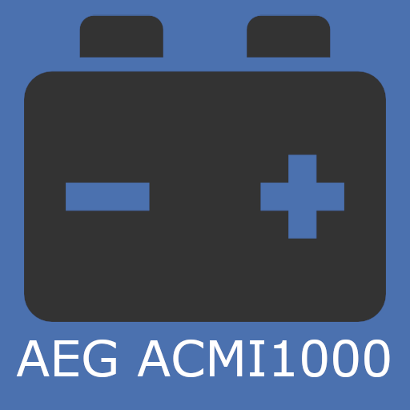
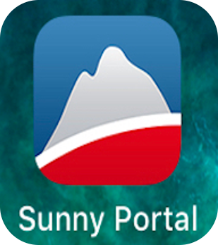
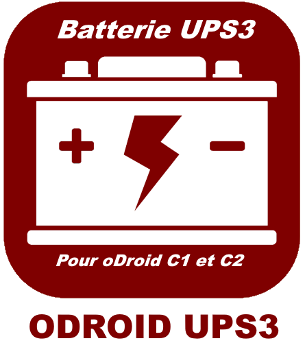
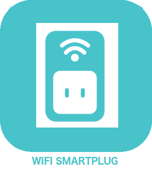

# Energie

>**IMPORTANT**

>Solo los complementos de contribuyentes tienen su documentación aquí. Puede consultar la documentación de los complementos oficiales directamente desde Jeedom Market. Una vez en el complemento en cuestión, haga clic en la documentación.
>Podéis ver [aquí](https://market.jeedom.com/index.php?v=d&p=market&type=plugin&categorie=energy) todos los complementos oficiales en esta categoría

| | | | |
|--- | --- | --- | ---|
||AEG acmi1000 snmp|Complemento para recuperar información y alarmas snmp de fuentes de alimentación AEG gracias al módulo ACMI1000|[Documentación](https://linuxnico.github.io/pluginAEGacmi1000/es_ES/) - [Mercado](https://market.jeedom.com/index.php?v=d&p=market_display&id=3697)|
||AEG nrc50 snmp|Plugin para recuperar información y alarmas snmp de fuentes de alimentación AEG gracias al módulo nrc50|[Documentación](https://linuxnico.github.io/pluginAEGnrc50/es_ES/) - [Mercado](https://market.jeedom.com/index.php?v=d&p=market_display&id=3719)|
||SunnyPortal|Complemento para integrar interfaces SunnyPortal|[Documentación](http://www.domoticadavinci.com/fr/developpement-de-plugins/sunny-web-portal-plugin-pour-jeedom/) - [Mercado](https://market.jeedom.com/index.php?v=d&p=market_display&id=3976)|
||Seguimiento del consumo|Complemento de monitoreo del consumidor|[Documentación](https://mickeys27.github.io/Docs/conso/es_ES/) - [Mercado](https://market.jeedom.com/index.php?v=d&p=market_display&id=1805)|
||Conso Widget Tracking||[Documentación](https://trmaud.github.io/SuiviConsoWidget/) - [Mercado](https://market.jeedom.com/index.php?v=d&p=market_display&id=3916)|
||Eco-2 vatios|Plugin que informa la información de Ecowatt y EJP|[Documentación](https://github.com/jeedom/plugin-ecowatt/blob/stable/doc/es_ES/index.asciidoc) - [Mercado](https://market.jeedom.com/index.php?v=d&p=market_display&id=1864)|
||eeSmart|Complemento para recuperar los datos que el módulo ERL D2L de eeemart envía al servidor de tracking.consopy.|[Documentación](https://caelion.github.io/jeedom-plugins-documentation/eeSmart/es_ES/) - [Mercado](https://market.jeedom.com/index.php?v=d&p=market_display&id=3933)|
||Enphase|Conéctese a una puerta de enlace Enphase|[Documentación](https://kahowane.github.io/jeedom_enphase) - [Mercado](https://market.jeedom.com/index.php?v=d&p=market_display&id=3638)|
||Evohome|Complemento EVOHOME|[Documentación](https://ctwins.github.io/evohome4jeedom/fr_FR) - [Mercado](https://market.jeedom.com/index.php?v=d&p=market_display&id=3538)|
||ODROID UPS3||[Documentación]() - [Mercado](https://market.jeedom.com/index.php?v=d&p=market_display&id=3161)|
||Producción de energía|El autoconsumo es el objetivo en la producción de energía.. Este complemento está ahí para ayudarte controlando las activaciones|[Documentación](http://mika-nt28.github.io/Documentations/prosommateur/fr_FR) - [Mercado](https://market.jeedom.com/index.php?v=d&p=market_display&id=3829)|
||REEspaña|Tarifa de la luz por horas de Red Electrica Española|[Documentación](https://jeedom.github.io/plugin-template/es_ES/) - [Mercado](https://market.jeedom.com/index.php?v=d&p=market_display&id=3651)|
||Monitoreo de CO2|Complemento para monitorear las emisiones de CO2 vinculadas a su electricidad, gas, combustible u otro consumo|[Documentación](https://agp42.github.io/suiviCO2/fr_FR) - [Mercado](https://market.jeedom.com/index.php?v=d&p=market_display&id=3929)|
||Wifi Smartplug|Complemento para controlar el equipo TpLink wifi smartplug|[Documentación]() - [Mercado](https://market.jeedom.com/index.php?v=d&p=market_display&id=2898)|
