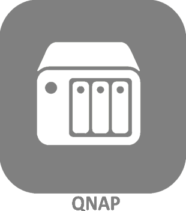
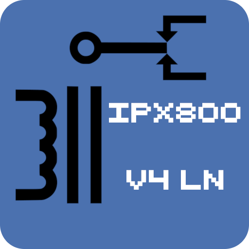
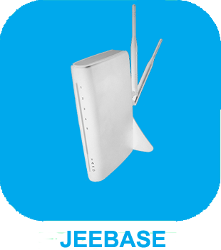

# Monitoring

>**IMPORTANT**

>Solo los complementos de contribuyentes tienen su documentación aquí. Puede consultar la documentación de los complementos oficiales directamente desde Jeedom Market. Una vez en el complemento en cuestión, haga clic en la documentación.
>Podéis ver [aquí](https://market.jeedom.com/index.php?v=d&p=market&type=plugin&categorie=monitoring) todos los complementos oficiales en esta categoría

| | | | |
|--- | --- | --- | ---|
||Jailbreak|Complemento para monitorear dispositivos iOS|[Documentación](https://flobul.github.io/Jailbreak/es_ES/) - [Mercado](https://market.jeedom.com/index.php?v=d&p=market_display&id=3928)|
||Monitoring|Complemento para monitorizar equipos|[Documentación](https://surveillancestation.github.io/surveillancestation/monitoring/es_ES/) - [Mercado](https://market.jeedom.com/index.php?v=d&p=market_display&id=282)|
||Libre de nueces|Complemento gratuito de UPS|[Documentación](https://megastorage.github.io/Nut_Free) - [Mercado](https://market.jeedom.com/index.php?v=d&p=market_display&id=2855)|
||Bomba de calor Hayward|Complemento para controlar la bomba de calor de su piscina|[Documentación](https://yostone.github.io/Pac_Hayward/) - [Mercado](https://market.jeedom.com/index.php?v=d&p=market_display&id=3615)|
||QNAP|Plugin pour la supervision de NAS QNAP|[Documentación](https://tux1c0.github.io/plugin-qnap/#language#/) - [Mercado](https://market.jeedom.com/index.php?v=d&p=market_display&id=3327)|
||Onduleur SMA Sunny Boy|Plugin pour récupérer les valeurs d'un onduleur SMA SunnyBoy|[Documentación](https://sattaz.github.io/Jeedom_SMA_Sunny_Boy/#language#/) - [Mercado](https://market.jeedom.com/index.php?v=d&p=market_display&id=3760)|
||BBox Sagemcom|Plugin pour monitorer la BBox de Sagemcom|[Documentación](https://alucard29.github.io/bbox_sagemcom/#language#/) - [Mercado](https://market.jeedom.com/index.php?v=d&p=market_display&id=1487)|
||Onduleur Fronius|Plugin pour récupérer les valeurs d'un onduleur Fronius|[Documentación](https://sattaz.github.io/Jeedom_Fronius/#language#/) - [Mercado](https://market.jeedom.com/index.php?v=d&p=market_display&id=3761)|
||fullyKiosK|Plugin fullyKiosK|[Documentación](https://sebsst.github.io/fullyKiosK/#language#/) - [Mercado](https://market.jeedom.com/index.php?v=d&p=market_display&id=3406)|
||Graphique Netatmo|Plugin qui permet de visualiser les graphiques des différentes sondes Netatmo|[Documentación](https://zyg0m4t1k.github.io/graphs/#language#/) - [Mercado](https://market.jeedom.com/index.php?v=d&p=market_display&id=2101)|
||Groupe|Plugin permettant la création d'un widget avec l'état d'un groupe|[Documentación](https://zyg0m4t1k.github.io/groupe/#language#/) - [Mercado](https://market.jeedom.com/index.php?v=d&p=market_display&id=2854)|
||Huawei 4G|Plugin pour la supervision de routeur 4G Huawei|[Documentación](https://tux1c0.github.io/plugin-huawei4g/#language#/) - [Mercado](https://market.jeedom.com/index.php?v=d&p=market_display&id=3891)|
||ipx800v4 client|Plugin de récupération d'informations d'un ipx800v4|[Documentación](https://linuxnico.github.io/pluginIPX800V4/#language#/) - [Mercado](https://market.jeedom.com/index.php?v=d&p=market_display&id=3715)|
||Jeebase|Plugin pour récuperer et utiliser les données de Zibase|[Documentación](https://zyg0m4t1k.github.io/jeebase/#language#/) - [Mercado](https://market.jeedom.com/index.php?v=d&p=market_display&id=367)|
||JeeLog|Complemento de registro de actividades para equipos, escenarios y archivos de registro|[Documentación](https://kiboost.github.io/jeedom_docs/plugins/jeelog/es_ES/) - [Mercado](https://market.jeedom.com/index.php?v=d&p=market_display&id=3362)|
||LibreNMS|LibreNMS est une AutoDiscovery PHP/MySQL/SNMP réseau de surveillance qui comprend la prise en charge d'une large gamme de matériel réseau et les systèmes d'exploitation, y compris Cisco, Linux, FreeBSD, Juniper, Brocade, Foundry, HP et beaucoup plus.|[Documentación](https://mika-nt28.github.io/Documentations/libreNMS/#language#/) - [Mercado](https://market.jeedom.com/index.php?v=d&p=market_display&id=3446)|
||piHole|Complemento para activar o desactivar su servidor pi-Hole. Un interrupteur pour le désactiver et quelques chiffres, laissez-moi savoir si vous avez besoin de plus (en fonction de ce que l'API permet)|[Documentación](https://nebzhb.github.io/plugin-piHole/#language#/) - [Mercado](https://market.jeedom.com/index.php?v=d&p=market_display&id=3420)|
||rikaha|Plugin de monitoring poêles Rika|[Documentación](https://openhautomation.github.io/rikaha/#language#/) - [Mercado](https://market.jeedom.com/index.php?v=d&p=market_display&id=3432)|
||Client snmp|Plugin de récupération d'informations SNMP|[Documentación](https://linuxnico.github.io/pluginSNMP/#language#/) - [Mercado](https://market.jeedom.com/index.php?v=d&p=market_display&id=3705)|
||Onduleur Solax|Plugin pour récupérer les valeurs d'un onduleur Solax|[Documentación](https://sattaz.github.io/Jeedom_Solax/#language#/) - [Mercado](https://market.jeedom.com/index.php?v=d&p=market_display&id=3767)|
||Speedtest|Plugin permettant de contrôler sa connexion internet|[Documentación](https://zyg0m4t1k.github.io/speedtest/#language#/) - [Mercado](https://market.jeedom.com/index.php?v=d&p=market_display&id=2876)|
||Timeline|Plugin  pour la création de timeline|[Documentación](https://zyg0m4t1k.github.io/timeline/#language#/) - [Mercado](https://market.jeedom.com/index.php?v=d&p=market_display&id=2896)|
||Ubiquiti Unifi|Ubiquiti Unifi - Conexión a un controlador
Listado de dispositivos
Liste des Clients + bloquer et débloquer|[Documentación](https://nebzhb.github.io/jeedom_docs/plugins/unifi/#language#/) - [Mercado](https://market.jeedom.com/index.php?v=d&p=market_display&id=3433)|
||Agua Veolia|Plugin para encontrar la encuesta remota de agua Veolia / Todo sobre mi agua / Agua en línea / Agua del Gran Lyon|[Documentación](https://NextDom.github.io/plugin-veolia_eau/fr_FR) - [Mercado](https://market.jeedom.com/index.php?v=d&p=market_display&id=2568)|
||Vmware|Complemento para controlar su ESXi para enumerar las máquinas virtuales y varios atributos. Gestion des snapshots, Gestion du stop/start, etc|[Documentación](https://taggou91.github.io/jeedom_docs/plugins/vmware/#language#/) - [Mercado](https://market.jeedom.com/index.php?v=d&p=market_display&id=3816)|
||Watchdog|Complemento de vigilancia|[Documentación](http://sigalou-domotique.fr/plugin-jeedom-watchdog/68-watchdog-documentation) - [Mercado](https://market.jeedom.com/index.php?v=d&p=market_display&id=3716)|
