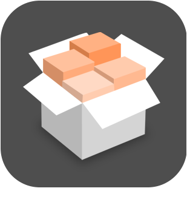
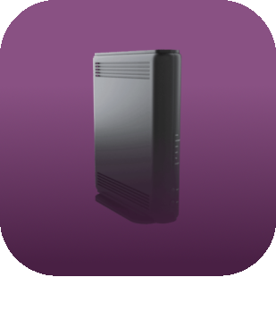

# Monitoring

>****
>. . .
>  

| | | | |
|--- | --- | --- | ---|
|||.  !!| -    - |
||Freebox|. ).| -    - |
||Jailbreak|. Il permet d'intéragir avec Jeedom pour remonter des informations, lancer Application, exécuter des actions... Plus d'informations sur la présentation du plugin : https://flobul-domotique.fr/presentation-du-plugin-jailbreak-pour-jeedom/|  |
|||. |  |
||archiplus| :  -  -  -  -  -   .| -    - |
||||  |
|||. ). .| -    - |
||fullyKiosK||  |
||||  |
||||  |
||Groupe|.|  |
||Ha-Bridge|. .|  |
|||.|  |
||HistoLisse|. .   ***  : .   ***  : ).|  |
||InfluxDB|. .| -    - |
||JeeLog||  |
||| .  ! ). .|  |
|||.).| -    - |
|||.| -    - |
||Portainer|..| -    - |
||Proxmox|. ...). . .| -    - |
||sfrBox||  |
||||  |
||Speedtest by Ookla|Ce plugin permet de tester la bande passante internet à l'aide de https://www.speedtest.net| -    - |
|||. )     : | -    - |
