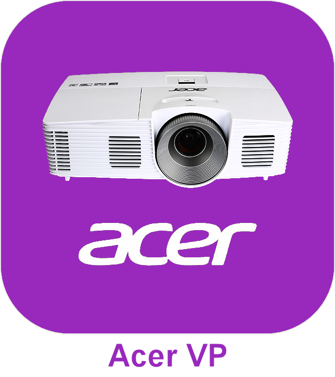
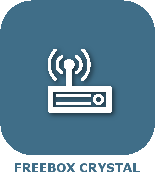

# Multimedia

>**IMPORTANT**

>Solo los complementos de contribuyentes tienen su documentación aquí. Puede consultar la documentación de los complementos oficiales directamente desde Jeedom Market. Una vez en el complemento en cuestión, haga clic en la documentación.
>Podéis ver [aquí](https://market.jeedom.com/index.php?v=d&p=market&type=plugin&categorie=multimedia) todos los complementos oficiales en esta categoría

| | | | |
|--- | --- | --- | ---|
||Acer Video Projecteur|Plugin pour piloter les videoprojecteurs Acer|[Documentación](https://github.com/Cricri67/Jeedom-AcerVP/blob/master/docs/#language#/index.md) - [Mercado](https://market.jeedom.com/index.php?v=d&p=market_display&id=3501)|
||AndroidRemoteControl|Complemento para controlar Android TV y otros dispositivos Android|[Documentación](https://NextDom.github.io/plugin-AndroidRemoteControl/) - [Mercado](https://market.jeedom.com/index.php?v=d&p=market_display&id=3360)|
||Bose SoundTouch|Plugin pour piloter les enceintes Bose SoundTouch.|[Documentación](https://sabinus52.github.io/jeedom-bose-soundtouch/#language#/) - [Mercado](https://market.jeedom.com/index.php?v=d&p=market_display&id=3565)|
||Télécommande Freebox mini4K|Télécommande pour votre Freebox mini4K|[Documentación](http://mika-nt28.github.io/Documentations/FreeboxMini4k/#language#) - [Mercado](https://market.jeedom.com/index.php?v=d&p=market_display&id=3756)|
||JeeOrangeTv|Plugin pour piloter le décodeur TV Orange par IP|[Documentación](https://totoff974.github.io/JeeOrangeTv/#language#/) - [Mercado](https://market.jeedom.com/index.php?v=d&p=market_display&id=2706)|
||NB LaBox||[Documentación]() - [Mercado](https://market.jeedom.com/index.php?v=d&p=market_display&id=2428)|
||Alexa - Amazon Music|Interfaz de Amazon Music|[Documentación](http://sigalou-domotique.fr/plugin-jeedom-alexa-api/90-alexa-amazon-music-documentation) - [Mercado](https://market.jeedom.com/index.php?v=d&p=market_display&id=3910)|
||Alexa - Deezer|Interfaz Deezer|[Documentación](http://sigalou-domotique.fr/plugin-jeedom-alexa-api/98-alexa-deezer-documentation) - [Mercado](https://market.jeedom.com/index.php?v=d&p=market_display&id=3911)|
||Alexa - Spotify|Interfaz de Spotify|[Documentación](http://sigalou-domotique.fr/plugin-jeedom-alexa-api/97-alexa-sportify-documentation) - [Mercado](https://market.jeedom.com/index.php?v=d&p=market_display&id=3913)|
||Diaporama|Diaporama|[Documentación](http://sigalou-domotique.fr/diaporama/82-plugin-diaporama-documentation) - [Mercado](https://market.jeedom.com/index.php?v=d&p=market_display&id=3870)|
||Freebox Crystal|Récupère les informations de votre Freebox Crystal|[Documentación](https://mika-nt28.github.io/Documentations/freeCrystal/#language#/) - [Mercado](https://market.jeedom.com/index.php?v=d&p=market_display&id=1139)|
||Google Cast|Complemento de administración de equipos compatible con Google Cast|[Documentación](https://github.com/guirem/plugin-googlecast/blob/develop/docs/es_ES/index.md) - [Mercado](https://market.jeedom.com/index.php?v=d&p=market_display&id=3350)|
||HomepTalk|TTS a un Apple HomePod|[Documentación](https://nebzhb.github.io/jeedom_docs/plugins/homepTalk/es_ES/) - [Mercado](https://market.jeedom.com/index.php?v=d&p=market_display&id=3825)|
||Marantz Denon|Complemento para controlar los amplificadores Denon / Marantz|[Documentación](https://github.com/guirem/plugin-marantzdenon/blob/master/docs/es_ES/index.md) - [Mercado](https://market.jeedom.com/index.php?v=d&p=market_display&id=3342)|
||MusicCast controller|Plugin de controle de Yamaha MusicCast|[Documentación](https://granddam.github.io/plugin-musiccast/#language#/ index) - [Mercado](https://market.jeedom.com/index.php?v=d&p=market_display&id=3099)|
||onkyo|Complemento para controlar los amplificadores de la marca Onkyo|[Documentación](http://dough29.github.io/Jeedom-Onkyo/es_ES/) - [Mercado](https://market.jeedom.com/index.php?v=d&p=market_display&id=1107)|
||TV Panasonic|Description|[Documentación]() - [Mercado](https://market.jeedom.com/index.php?v=d&p=market_display&id=2882)|
||philips|Plugin pour le pilotage des TV philips|[Documentación](https://barre35.github.io/jeedom-plugin-philips/#language#/ index) - [Mercado](https://market.jeedom.com/index.php?v=d&p=market_display&id=3875)|
||Plex||[Documentación](https://mika-nt28.github.io/Documentations/plex/#language#/) - [Mercado](https://market.jeedom.com/index.php?v=d&p=market_display&id=1380)|
||Sony Bravia|Contrôle et monitoring des TV Sony bravia|[Documentación](https://NextDom.github.io//plugin-sonybravia/#language#/) - [Mercado](https://market.jeedom.com/index.php?v=d&p=market_display&id=3100)|
||Spotify|Plugin pour le pilotage spotify connect|[Documentación](https://barre35.github.io/jeedom-plugin-spotify/#language#/ index) - [Mercado](https://market.jeedom.com/index.php?v=d&p=market_display&id=3700)|
||Syno Audio Station|Plugin pour Synology Audio Station|[Documentación](https://nexus79000.github.io/synoaudio/#language#/) - [Mercado](https://market.jeedom.com/index.php?v=d&p=market_display&id=2063)|
||Syno Download|Plugin pour Synology Download Station.|[Documentación](https://nexus79000.github.io/synodownload/#language#/) - [Mercado](https://market.jeedom.com/index.php?v=d&p=market_display&id=2624)|
||Syno Video Station|Plugin pour Synology Video Station|[Documentación](https://nexus79000.github.io/synovideo/#language#/) - [Mercado](https://market.jeedom.com/index.php?v=d&p=market_display&id=2887)|
||Freebox Révolution|Plugin pour piloter le Freebox Player de la Freebox Revolution|[Documentación](https://mika-nt28.github.io/Documentations/telecfree/#language#/) - [Mercado](https://market.jeedom.com/index.php?v=d&p=market_display&id=2032)|
||WebOS TV|Plugin pour commander les TVs LG WebOs.|[Documentación](https://zyg0m4t1k.github.io/webosTv/#language#/) - [Mercado](https://market.jeedom.com/index.php?v=d&p=market_display&id=3301)|
