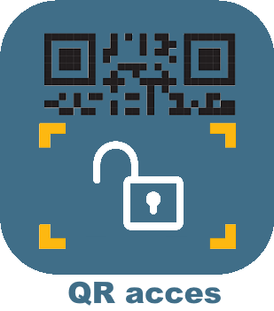

# Seguridad

>**Importante**
>Solo los complementos de contribuyentes tienen su documentación aquí. Puede consultar la documentación de los complementos oficiales directamente desde Jeedom Market. Una vez en el complemento en cuestión, haga clic en la documentación.
>Podéis ver [aquí](https://market.jeedom.com/index.php?v=d&p=market&type=plugin&categorie=security) todos los complementos oficiales en esta categoría

| | | | |
|--- | --- | --- | ---|
||Myfox v2|Estoy reanudando el complemento que fue abandonado. Plugin V2 para utilizar la centralita Myfox, Evology, Easybox, permite recuperar información del sensor de temperatura, luminosidad, congelador, humo, calefacción, eventos, estado de alarma, y activar/desactivar la alarma y el equipo, escenarios de reproducción|[Documentación estable]() [Mercado](https://market.jeedom.com/index.php?v=d&p=market_display&id=4471)|
||Diagral eOne|Complemento para administrar alarmas Diagral eOne|[Documentación estable](https://mguyard.github.io/Jeedom-Diagral_eOne/es_ES/) [Mercado](https://market.jeedom.com/index.php?v=d&p=market_display&id=3820) [Registro de cambios estable](https://mguyard.github.io/Jeedom-Diagral_eOne/es_ES/changelog)|
||Acceso por código QR|Administre el acceso a su casa por código QR.|[Documentación estable](http://mika-nt28.github.io/Documentations/QRacces/fr_FR) [Mercado](https://market.jeedom.com/index.php?v=d&p=market_display&id=3758) [Registro de cambios estable](https://mika-nt28.github.io/Documentations/QRacces/es_ES/changelog)|
||Arlo|Complemento que permite el control de equipos de la gama Arlo como cámaras, estación base y sirena integrada. Es posible controlar el modo, la activación y desactivación de las cámaras, ver el directo de las cámaras, activar capturas y grabaciones de vídeo, activar la sirena... Todos los modelos actuales compatibles con la aplicación Arlo (web o móvil) son compatible con el complemento: Arlo, Arlo Pro, Pro2, Pro3, Pro4, Ultra, Arlo Floodlight, Arlo Essential, Arlo Q, Arlo Go, Arlo Baby, Arlo Doorbell y Video Doorbell...|[Documentación estable](https://mips2648.github.io/jeedom-plugins-docs/arlo/es_ES/) - [Documentación beta](https://mips2648.github.io/jeedom-plugins-docs/arlo/es_ES/) [Mercado](https://market.jeedom.com/index.php?v=d&p=market_display&id=3708) [Registro de cambios estable](https://mips2648.github.io/jeedom-plugins-docs/arlo/es_ES/changelog) - [Registro de cambios Beta](https://mips2648.github.io/jeedom-plugins-docs/arlo/es_ES/changelog)|
||Reconocimiento facial|Este complemento permite usar OpenCv para detectar su visión y reconocerlo.Atención, lo mismo que autorizaste con este plugin porque es bastante simple engañar al sistema (gemelos, fotos)|[Documentación estable](http://mika-nt28.github.io/Documentations/facerecognition/es_ES/) [Mercado](https://market.jeedom.com/index.php?v=d&p=market_display&id=3863) [Registro de cambios estable](https://mika-nt28.github.io/Documentations/facerecognition/es_ES/changelog)|
||jeezviz|Complemento para controlar cámaras y videoteléfonos EZVIZ|[Documentación estable](https://famille-ozaer.github.io/jeezviz/es_ES/index.md) [Mercado](https://market.jeedom.com/index.php?v=d&p=market_display&id=4063) [Registro de cambios estable](https://famille-ozaer.github.io/jeezviz/es_ES/changelog.html)|
||OpenALPR|Complemento permanente para reconocer la matrícula con nuestras cámaras|[Documentación estable](https://mika-nt28.github.io/Documentations/openalpr/fr_FR) [Mercado](https://market.jeedom.com/index.php?v=d&p=market_display&id=1613) [Registro de cambios estable](https://mika-nt28.github.io/Documentations/openalpr/es_ES/changelog)|
||Senior Care - Botón de alerta|Complemento para asistencia a personas mayores - Gestión de botones de alerta|[Documentación estable](https://agp42.github.io/seniorcarealertbt/es_ES/) [Mercado](https://market.jeedom.com/index.php?v=d&p=market_display&id=3948) [Registro de cambios estable](https://agp42.github.io/seniorcarealertbt/es_ES/changelog)|
||Senior Care - Comodidad y seguridad|Plugin de asistencia a personas mayores - Gestión de la comodidad y seguridad de la vivienda|[Documentación estable](https://agp42.github.io/seniorcarecomfortsecurity/es_ES/) [Mercado](https://market.jeedom.com/index.php?v=d&p=market_display&id=3972) [Registro de cambios estable](https://agp42.github.io/seniorcarecomfortsecurity/es_ES/changelog)|
||Senior Care - Detección de inactividad|Complemento para asistencia a personas mayores - Función de detección de inactividad|[Documentación estable](https://agp42.github.io/seniorcareinactivity/es_ES/) [Mercado](https://market.jeedom.com/index.php?v=d&p=market_display&id=3947) [Registro de cambios estable](https://agp42.github.io/seniorcareinactivity/es_ES/changelog)|
||Alarma Verisure|Complemento Verisure para Jeedom|[Documentación estable](https://xav-74.github.io/verisure/es_ES/) [Mercado](https://market.jeedom.com/index.php?v=d&p=market_display&id=3997) [Registro de cambios estable](https://xav-74.github.io/verisure/es_ES/changelog)|
