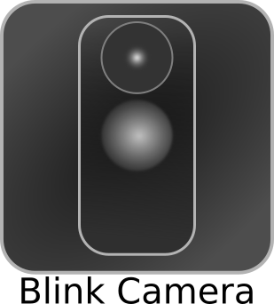
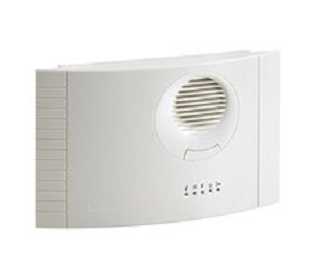
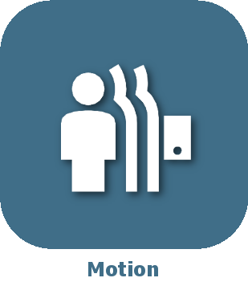
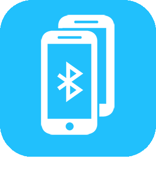

# Sécurité

>**IMPORTANT**

>Seuls les plugins de contributeur ont leur documentation ici. Vous pouvez consulter les documentations des plugins officiels directement depuis le Market Jeedom. Une fois sur le plugin en question, cliquez sur documentation.
>Vous pouvez voir [ici](https://market.jeedom.com/index.php?v=d&p=market&type=plugin&categorie=security) tous les plugins officiels de cette catégorie

| | | | |
|--- | --- | --- | ---|
||Diagral eOne|Plugin pour gérer les alarmes Diagral eOne|[Documentation](https://mguyard.github.io/Jeedom-Diagral_eOne/#language#/) - [Market](https://market.jeedom.com/index.php?v=d&p=market_display&id=3820)|
||Acces par QR code|Gerer les acces de votre maison par QR code.|[Documentation](http://mika-nt28.github.io/Documentations/QRacces/#language#) - [Market](https://market.jeedom.com/index.php?v=d&p=market_display&id=3758)|
||RTSP|Auteur du plugin : Slobberbone. ATTENTION, il ne s’agit pas d’un plugin Officiel Jeedom mais d’un plugin développé par une tierce personne et dont l’évolution a été abandonnée. L’équipe technique Jeedom assurera l’assistance sur ce plugin sans obligation de résultat. Plugin de compatibilité RTSP avec le plugin Caméra.|[Documentation](https://jeedom.github.io/plugin-RTSP/#language#/) - [Market](https://market.jeedom.com/index.php?v=d&p=market_display&id=2177)|
||Alarme IMA|Gestion de l'alarme IMA téléassistance|[Documentation](https://lplancke.github.io/jeedom_alarme_IMA/#language#/) - [Market](https://market.jeedom.com/index.php?v=d&p=market_display&id=3184)|
||Blink Camera|Plugin for Blink Camera|[Documentation](https://d9-197.github.io/blink_camera/#language#) - [Market](https://market.jeedom.com/index.php?v=d&p=market_display&id=3776)|
||Digicode Plugin||[Documentation](https://jmz84.github.io/plugin-digicode/#language#/) - [Market](https://market.jeedom.com/index.php?v=d&p=market_display&id=3436)|
||Domonial|Plugin pour recevoir les notifications d'une alarme Domonial|[Documentation](https://apages2.github.io/pluginjeedom-domonial/#language#/) - [Market](https://market.jeedom.com/index.php?v=d&p=market_display&id=2857)|
||Reconnaissance facial|Ce plugin permet utilise OpenCv pour détecter votre visiage et vous reconnaitre.Attention, toute de meme a ce que vous autorisé avec ce plugin car il est assez simple de tromper le systeme (Jumeaux, photos)|[Documentation](http://mika-nt28.github.io/Documentations/facerecognition/#language#/) - [Market](https://market.jeedom.com/index.php?v=d&p=market_display&id=3863)|
||Ftpd|Auteur du plugin : Thomas Guenneguez ATTENTION, il ne s’agit pas d’un plugin Officiel Jeedom mais d’un plugin développé par une tierce personne et dont l’évolution a été abandonnée. L’équipe technique Jeedom assurera l’assistance sur ce plugin sans obligation de résultat. Plugin permettant de creer un serveur ftp qui notifiera jeedom lorsqu'un fichier est déposé. Très utile pour les cameras IP qui peuvent sur détection de mouvement envoyer un fichier par ftp.|[Documentation](https://jeedom.github.io/documentation/third_plugin/ftpd/#language#/index.html) - [Market](https://market.jeedom.com/index.php?v=d&p=market_display&id=2843)|
||GDS 3710|Plugin permetant l'intégration du portier GrandStream GDS3710|[Documentation](https://ripleyxlr8.github.io/jeedom-plugin-gds3710/#language#/) - [Market](https://market.jeedom.com/index.php?v=d&p=market_display&id=3487)|
||GeoRide|{{Plugin afin d'utiliser l'api ouvert de GeoRide}}|[Documentation](https://github.com/ImoucheG/GeoRide-Jeedom-Source) - [Market](https://market.jeedom.com/index.php?v=d&p=market_display&id=3714)|
||Motion|Plugin permettant de configurer et d'utiliser le logiciel Motion. Celui-ci permet de streamer nos webcams et de faire de la détection de mouvement sur nos caméras|[Documentation](https://mika-nt28.github.io/Documentations/motion/#language#/) - [Market](https://market.jeedom.com/index.php?v=d&p=market_display&id=1542)|
||Multi Requests|Plugin pour gérer des équipements virtuels|[Documentation](https://github.com/KiwiHC16/multi-requests/tree/beta/docs) - [Market](https://market.jeedom.com/index.php?v=d&p=market_display&id=3441)|
||OpenALPR|Plugin permanent de faire de la reconnaissance de plaque d'immatriculation avec nos camera|[Documentation](https://mika-nt28.github.io/Documentations/openalpr/#language#) - [Market](https://market.jeedom.com/index.php?v=d&p=market_display&id=1613)|
||Détection de téléphone (Bluetooth)|Ping à intervals réguliers un téléphone pour en déterminer sa présence|[Documentation](https://github.com/sebmafate/phone_detection) - [Market](https://market.jeedom.com/index.php?v=d&p=market_display&id=3852)|
||Somfy alarme||[Documentation](https://fdp1nm.github.io/plugin-protexiom/#language#/) - [Market](https://market.jeedom.com/index.php?v=d&p=market_display&id=510)|
||Surveillance Station|Plugin pour Synology Surveillance Station|[Documentation](https://surveillancestation.github.io/surveillancestation/surveillancestation/fr_FR/) - [Market](https://market.jeedom.com/index.php?v=d&p=market_display&id=1303)|
