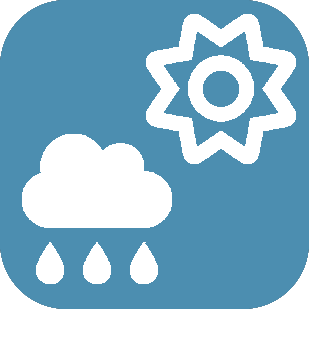

# 

>****
>. . .
>  

| | | | |
|--- | --- | --- | ---|
||LunarPhase|. : | -    - |
|||)| -    - |
|||)| -    - |
|||. .|  |
|||. Basé sur le site https://www.terre-net.fr/|  |
||| ) ?  <strong>Récupèrer leurs données pour votre Jeedom</strong> (température, pression, pluie, vent...) et gratuitement.   .   : -  - Pression - ) - ) -  )    :  !|  |
||Previsy|. .|  |
||| : .  Le point de givrage ainsi que l'alerte ne se calculent uniquement dans le cas où la température < 5°C.  | -    - |
|||| -    - |
||VigiEau|Ce plugin permet de remonter les informations du site de l'information sécheresse du Gouvernement VigiEau https://vigieau.gouv.fr/ via l'API du site https://api.vigieau.beta.gouv.fr/swagger/#/.| -    - |
|||. . .| -    - |
