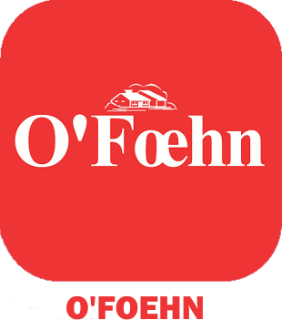
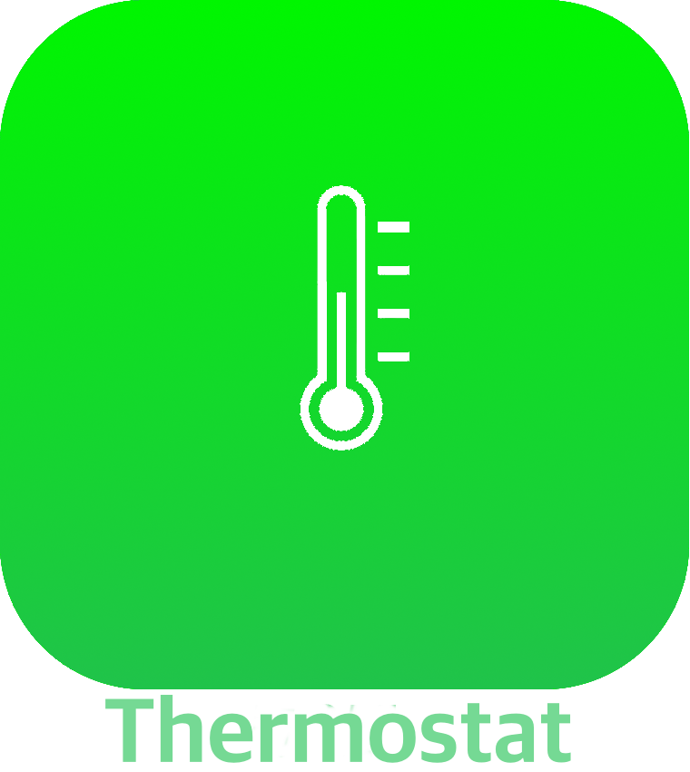
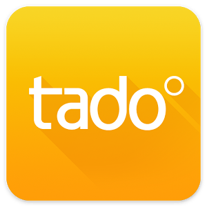

# Confort

>**IMPORTANT**

>Solo los complementos de contribuyentes tienen su documentación aquí. Puede consultar la documentación de los complementos oficiales directamente desde Jeedom Market. Una vez en el complemento en cuestión, haga clic en la documentación.
>Podéis ver [aquí](https://market.jeedom.com/index.php?v=d&p=market&type=plugin&categorie=wellness) todos los complementos oficiales en esta categoría

| | | | |
|--- | --- | --- | ---|
||Airzone|Complemento para integrar interfaces AirzoneWeb|[Documentación](http://www.domoticadavinci.com/desarrollo-de-plugins/airzone-web-plugin-para-jeedom/) - [Mercado](https://market.jeedom.com/index.php?v=d&p=market_display&id=3926)|
||IntesisBox|Complemento para integrar interfaces IntesisBox|[Documentación](https://nooblenabot.github.io/jeedom-plugin-IntesisBoxWMP/es_ES/) - [Mercado](https://market.jeedom.com/index.php?v=d&p=market_display&id=3853)|
||Balboa SPA|Este complemento le permite conectarse y recuperar información de su Balboa SPA|[Documentación](https://mika-nt28.github.io/Documentations/balboa/es_ES/) - [Mercado](https://market.jeedom.com/index.php?v=d&p=market_display&id=3712)|
||ELM Touch|Plugin para regulación de caldera de gas Elm Leblanc con termostato conectado ELM Touch|[Documentación](https://jmvedrine.github.io/jeedom-elmtouch/es_ES/) - [Mercado](https://market.jeedom.com/index.php?v=d&p=market_display&id=3281)|
||Heta|Complemento de control de estufa de pellets Heta equipado con caja WiRCU|[Documentación](https://edeweerdt.github.io/jeedom_heta/es_ES/) - [Mercado](https://market.jeedom.com/index.php?v=d&p=market_display&id=3646)|
||horoscope||[Documentación]() - [Mercado](https://market.jeedom.com/index.php?v=d&p=market_display&id=2727)|
||Hottoh||[Documentación](https://peofofo.github.io/jeedom_hottoh/es_ES/) - [Mercado](https://market.jeedom.com/index.php?v=d&p=market_display&id=3670)|
||Gestión de la humedad|Complemento para la gestión de la humedad gracias a un humidificador o deshumidificador de aire|[Documentación](https://agp42.github.io/humidity/es_ES/) - [Mercado](https://market.jeedom.com/index.php?v=d&p=market_display&id=3978)|
||Jolly Dude|Complemento para controlar su estufa Jolly Mec|[Documentación](https://d-kalck.github.io/plugin-jollymec/es_ES/) - [Mercado](https://market.jeedom.com/index.php?v=d&p=market_display&id=3773)|
||terapia de luz||[Documentación](https://mika-nt28.github.io/Documentations/luminotherapie/es_ES/) - [Mercado](https://market.jeedom.com/index.php?v=d&p=market_display&id=3095)|
||MelCloud|Le permite gestionar su calefacción y aire acondicionado de forma remota. |[Documentación]() - [Mercado](https://market.jeedom.com/index.php?v=d&p=market_display&id=2315)|
||PAC O'Foehn|Plugin para controlar una bomba de calor O'Foehn|[Documentación](https://sattaz.github.io/Jeedom_OFoehn/es_ES/) - [Mercado](https://market.jeedom.com/index.php?v=d&p=market_display&id=3769)|
||Piscine||[Documentación](https://scadinot.github.io/pool/es_ES/) - [Mercado](https://market.jeedom.com/index.php?v=d&p=market_display&id=1801)|
||Qivivo|Integración del termostato Qivivo|[Documentación](https://kiboost.github.io/jeedom_docs/plugins/qivivo/es_ES/) - [Mercado](https://market.jeedom.com/index.php?v=d&p=market_display&id=3551)|
||Thermostat|Termostato SSA|[Documentación](https://stephdocs.github.io/jeedomThermostat/) - [Mercado](https://market.jeedom.com/index.php?v=d&p=market_display&id=2636)|
||Tado|Complemento para interactuar con un termostato Tado|[Documentación](https://rosnoun.github.io/jeedom-plugins-docs/tado/es_ES/) - [Mercado](https://market.jeedom.com/index.php?v=d&p=market_display&id=3939)|
