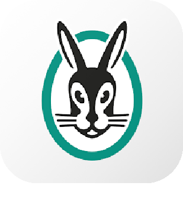
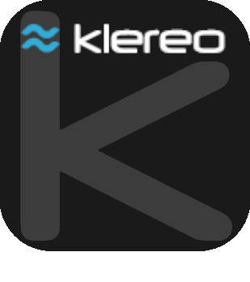
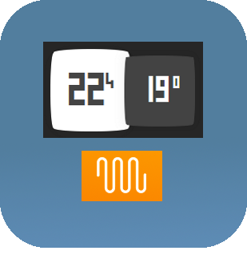
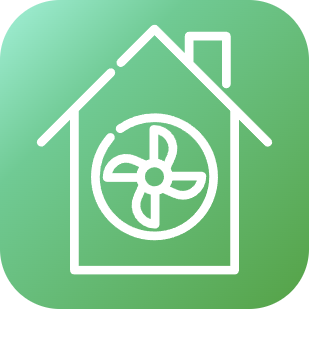

# Confort

>**Importante**
>Solo los complementos de contribuyentes tienen su documentación aquí. Puede consultar la documentación de los complementos oficiales directamente desde Jeedom Market. Una vez en el complemento en cuestión, haga clic en la documentación.
>Podéis ver [aquí](https://market.jeedom.com/index.php?v=d&p=market&type=plugin&categorie=wellness) todos los complementos oficiales en esta categoría

| | | | |
|--- | --- | --- | ---|
||MyVaillant| Plugin para integrar equipos Vaillant/Saunier-Duval (senso/MiSet, MiPro Sense, gama multiMATIC, etc.) asociados a una pasarela sensoNET VR92x, VR7xx o MiLink V3.   Este complemento solo afecta a los equipos que funcionan con la aplicación MyVaillant o MigoLink.   El complemento le permite adquirir información sobre su instalación y ejecutar la mayoría de las acciones disponibles (Configuración, Horarios, Modos...).   La actualización se realiza a través de API. El complemento funciona en PHP/JS sin dependencias externas ni demonios.|[Documentación estable](https://limad.github.io/plugins-docs/plugin-MyVaillant/es_ES/) - [Documentación beta](https://limad.github.io/plugins-docs/plugin-MyVaillant/es_ES/) [Mercado](https://market.jeedom.com/index.php?v=d&p=market_display&id=4404) [Registro de cambios estable](https://limad.github.io/plugins-docs/plugin-MyVaillant/es_ES/changelog) - [Registro de cambios Beta](https://limad.github.io/plugins-docs/plugin-MyVaillant/es_ES/changelog)|
||Control valiente| Complemento para integrar termostatos Vaillant/Saunier-Duval (gama senso/MiSet, MiPro Sense) asociados a una pasarela VR92x o MiLink V3.  Estos son generalmente dispositivos que funcionan con la aplicación sensoApp o MiControl.  El complemento permite la adquisición de información de su instalación y ejecutar la mayoría de las acciones disponibles (Instrucciones, Horarios...). La actualización se realiza a través de API .|[Documentación estable](https://limad.github.io/plugins-docs/plugin-VaillantControl/es_ES/) - [Documentación beta](https://limad.github.io/plugins-docs/plugin-VaillantControl/es_ES/) [Mercado](https://market.jeedom.com/index.php?v=d&p=market_display&id=4299) [Registro de cambios estable](https://limad.github.io/plugins-docs/plugin-VaillantControl/es_ES/changelog) - [Registro de cambios Beta](https://limad.github.io/plugins-docs/plugin-VaillantControl/es_ES/changelog)|
||Balboa SPA|Este complemento le permite conectarse y recuperar información de su Balboa SPA. También incorpora la posibilidad de crear modos de funcionamiento para avanzar con todo el poder de Jeedom|[Documentación estable](https://mika-nt28.github.io/Documentations/balboa/es_ES/) [Mercado](https://market.jeedom.com/index.php?v=d&p=market_display&id=3712) [Registro de cambios estable](https://mika-nt28.github.io/Documentations/balboa/es_ES/changelog)|
||Clage|El complemento le permite recuperar toda la información de su servidor HSX de Cage. El servidor HSX recupera información de sus calentadores de agua conectados entre MCX 3-7, CEX/CFX, DEX, DSX, DSX Touch, DSX Twin. La información que se remonta a la aplicación Smart Control (iOS, Android) también se remonta al complemento. No se requiere conexión a Internet para recuperar esta información, todo es local.|[Documentación estable](https://flobul-domotique.fr/presentation-et-documentation-du-plugin-clage-pour-jeedom/) [Mercado](https://market.jeedom.com/index.php?v=d&p=market_display&id=4303) [Registro de cambios estable](https://flobul-domotique.fr/liste-des-versions-du-plugin-clage-pour-jeedom/)|
||CVC|Este complemento le permite crear y administrar termostatos para controlar un sistema de calefacción central en su hogar. Podrá gestionar cada zona de tu hogar según sus solicitudes y realizar la solicitud al dispositivo adecuado según la temperatura exterior.|[Documentación estable](http://fobsoft.github.io/jeedom-plugins-documentation/cvc/fr_FR) - [Documentación beta](http://fobsoft.github.io/jeedom-plugins-documentation/cvc/fr_FR) [Mercado](https://market.jeedom.com/index.php?v=d&p=market_display&id=4273) [Registro de cambios estable](http://fobsoft.github.io/jeedom-plugins-documentation/cvc/es_ES/changelog) - [Registro de cambios Beta](http://fobsoft.github.io/jeedom-plugins-documentation/cvc/es_ES/changelog)|
||ELM Touch|Plugin para regulación de caldera de gas Elm Leblanc con termostato conectado ELM Touch|[Documentación estable](https://jmvedrine.github.io/jeedom-elmtouch/es_ES/) - [Documentación beta](https://jmvedrine.github.io/jeedom-elmtouch/es_ES/) [Mercado](https://market.jeedom.com/index.php?v=d&p=market_display&id=3281) [Registro de cambios estable](https://jmvedrine.github.io/jeedom-elmtouch/es_ES/changelog) - [Registro de cambios Beta](https://raw.githubusercontent.com/jmvedrine/jeedom-elmtouch/beta/docs/es_ES/changelog.md)|
||Heta|Complemento de control para Heta, estufas de pellets AustroFlamm equipadas con la caja WiRCU|[Documentación estable](https://edeweerdt.github.io/jeedom_heta/es_ES/) [Mercado](https://market.jeedom.com/index.php?v=d&p=market_display&id=3646) [Registro de cambios estable](https://edeweerdt.github.io/jeedom_heta/es_ES/changelog)|
||Hitachi AirCloud|Complemento que permite la gestión y recuperación de información de bombas de calor gestionadas por la aplicación HITACHI AirCloud Go.|[Documentación estable](https://taggou91.github.io/jeedom_docs/plugins/hitachiaircloud/es_ES/) [Mercado](https://market.jeedom.com/index.php?v=d&p=market_display&id=4497) [Registro de cambios estable](https://taggou91.github.io/jeedom_docs/plugins/hitachiaircloud/changelog.html)|
||Horoscope|Complemento para generar una oración (según diferentes temas) todos los días según los diferentes signos astrológicos. Muy bonito dar el horóscopo de la mañana a una persona a través de TTS (por ejemplo con la cámara de Netatmo que reconoce caras) o por SMS.|[Documentación estable](https://jealg.github.io/documentation/plugin-horoscope/es_ES/) - [Documentación beta](https://jealg.github.io/documentation/plugin-horoscope/es_ES/) [Mercado](https://market.jeedom.com/index.php?v=d&p=market_display&id=2727) [Registro de cambios estable](https://jealg.github.io/documentation/plugin-horoscope/es_ES/changelog) - [Registro de cambios Beta](https://jealg.github.io/documentation/plugin-horoscope/es_ES/changelog_beta)|
||Gestión de la humedad|Complemento para la gestión de la humedad gracias a un humidificador o deshumidificador de aire|[Documentación estable](https://agp42.github.io/humidity/es_ES/) [Mercado](https://market.jeedom.com/index.php?v=d&p=market_display&id=3978) [Registro de cambios estable](https://agp42.github.io/humidity/es_ES/changelog)|
||Klereo|Communication avec le module Klereo connect pour gérer votre piscine|[Documentación estable](https://mrwaloo.github.io/jeedom-plugins-doc/es_ES/klereo_doc) - [Documentación beta](https://mrwaloo.github.io/jeedom-plugins-doc/es_ES/klereo_doc) [Mercado](https://market.jeedom.com/index.php?v=d&p=market_display&id=4435) [Registro de cambios estable](https://mrwaloo.github.io/jeedom-plugins-doc/es_ES/klereo_changelog) - [Registro de cambios Beta](https://mrwaloo.github.io/jeedom-plugins-doc/es_ES/klereo_changelog)|
||terapia de luz|Este complemento le permite administrar y crear sus atmósferas de Luz / Color.|[Documentación estable](https://mika-nt28.github.io/Documentations/luminotherapie/es_ES/) [Mercado](https://market.jeedom.com/index.php?v=d&p=market_display&id=3095) [Registro de cambios estable](https://mika-nt28.github.io/Documentations/luminotherapie/es_ES/changelog)|
||Migo Termostato| Complemento para integrar equipos MiGo (Saunier-Duval) y eRelax/Vsmart (Vaillant) en Jeedom.   El complemento permite la adquisición de información de su instalación y ejecutar la mayoría de las acciones disponibles (Instrucciones, Horarios...).   La actualización se realiza a través de API.   Compatible con el complemento móvil|[Documentación estable](https://limad.github.io/plugins-docs/plugin-migoThermostat/es_ES/) - [Documentación beta](https://limad.github.io/plugins-docs/plugin-migoThermostat/es_ES/) [Mercado](https://market.jeedom.com/index.php?v=d&p=market_display&id=3447) [Registro de cambios estable](https://limad.github.io/plugins-docs/plugin-migoThermostat/es_ES/changelog) - [Registro de cambios Beta](https://limad.github.io/plugins-docs/plugin-migoThermostat/es_ES/changelog)|
||MyUplink API|Ce plugin permet de récupérer les informations des pompes à chaleur NiBe depuis le site https://myUplink.com. Ce plugin ne fonctionne pas avec l'ancienne API http://www.nibeuplink.com.|[Documentación estable](https://flobul-domotique.fr/documentation-du-plugin-myuplink-pour-jeedom) [Mercado](https://market.jeedom.com/index.php?v=d&p=market_display&id=4236) [Registro de cambios estable](https://flobul-domotique.fr/liste-des-versions-du-plugin-myuplink-pour-jeedom/)|
||MyUplink Internal API|Ce plugin permet de récupérer les informations des pompes à chaleur NiBe depuis l'API internal du site https://myUplink.com. Ce plugin ne fonctionne pas avec l'ancienne API http://www.nibeuplink.com. En plus des commandes de base, le plugin permet de générer des commandes depuis l'interface console (consommations, durées...)|[Documentación estable](https://flobul-domotique.fr/documentation-du-plugin-myuplink-internal-pour-jeedom) [Mercado](https://market.jeedom.com/index.php?v=d&p=market_display&id=4239) [Registro de cambios estable](https://flobul-domotique.fr/liste-des-versions-du-plugin-myuplink-internal-pour-jeedom/)|
||Energía Netatmo| Complemento para integrar equipos Netatmo Energy (Termostato, Válvulas, Termostato OpenTherm) y Netatmo Weather en Jeedom. El complemento permite la adquisición de información de su instalación y ejecutar la mayoría de las acciones disponibles (Instrucciones, Horarios...). La actualización se realiza a través de API y retornos de webhook. Compatible con el complemento móvil|[Documentación estable](https://limad.github.io/plugins-docs/plugin-naEnergie/es_ES/) - [Documentación beta](https://limad.github.io/plugins-docs/plugin-naEnergie/es_ES/) [Mercado](https://market.jeedom.com/index.php?v=d&p=market_display&id=3958) [Registro de cambios estable](https://limad.github.io/plugins-docs/plugin-naEnergie/es_ES/changelog) - [Registro de cambios Beta](https://limad.github.io/plugins-docs/plugin-naEnergie/es_ES/changelog)|
||Qivivo|Integración del termostato Qivivo|[Documentación estable](https://kiboost.github.io/jeedom_docs/plugins/qivivo/es_ES/) [Mercado](https://market.jeedom.com/index.php?v=d&p=market_display&id=3551) [Registro de cambios estable](https://kiboost.github.io/jeedom_docs/plugins/qivivo/es_ES/changelog.html)|
||Cielo sensibo|Plugin para controlar el módulo Sensibo Sky|[Documentación estable](https://rombautsdidier.github.io/sensibosky/es_ES/) [Mercado](https://market.jeedom.com/index.php?v=d&p=market_display&id=4015) [Registro de cambios estable](https://rombautsdidier.github.io/sensibosky/es_ES/changelog)|
||myVaillant|Complemento que permite conectarse a un sistema myVaillant, que sustituye en particular a sensoApp y multiMATIC (compatible con las marcas Bulex, Saunier Duval, Vaillant) a través de su gateway de Internet. Es posible rastrear en Jeedom el estado de todos los equipos conectados y controlarlos: definir el modo (On, Off, Auto...), definir las temperaturas de consigna, activar un modo rápido, activar un funcionamiento forzado... También se gestionan las válvulas y termostatos de la gama ambiSENSE conectados al sistema.|[Documentación estable](https://mips2648.github.io/jeedom-plugins-docs/vaillantmultimatic/es_ES/) - [Documentación beta](https://mips2648.github.io/jeedom-plugins-docs/vaillantmultimatic/es_ES/) [Mercado](https://market.jeedom.com/index.php?v=d&p=market_display&id=4164) [Registro de cambios estable](https://mips2648.github.io/jeedom-plugins-docs/vaillantmultimatic/es_ES/changelog) - [Registro de cambios Beta](https://mips2648.github.io/jeedom-plugins-docs/vaillantmultimatic/es_ES/changelog)|
||CMV (Zehnder/Storkair))|Complemento que permite conectar un VMC de la marca Zehnder, también conocida con el nombre de Storkair, ComfoAir, Wernig. Modelos: ComfoAir/ComfoD 250/350/450/550, WHR 920/930/950/960|[Documentación estable](https://mips2648.github.io/jeedom-plugins-docs/vmczehnder/es_ES/) - [Documentación beta](https://mips2648.github.io/jeedom-plugins-docs/vmczehnder/es_ES/) [Mercado](https://market.jeedom.com/index.php?v=d&p=market_display&id=3605) [Registro de cambios estable](https://mips2648.github.io/jeedom-plugins-docs/vmczehnder/es_ES/changelog) - [Registro de cambios Beta](https://mips2648.github.io/jeedom-plugins-docs/vmczehnder/es_ES/changelog)|
