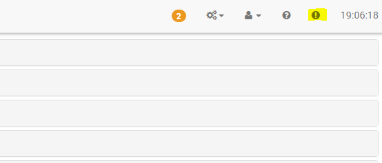

Bienvenido a esta documentación de primeros pasos, este será
ayuda a configurar tu Jeedom.

> **Punta**
>
> Esta guía no pretende reemplazar la documentación completa
> disponible en el sitio web de Jeedom [aquí](https:// jeedom.fr/doc).

Registro en el mercado 
=========================

Lo primero que debe hacer es crear una cuenta en el mercado para
poder registrar su Jeedom en este, haga clic
[aquí](https://www.jeedom.com/market) pour commencer

Haga clic en el botón "Registrarse" en la esquina superior derecha:

Rellene los diferentes campos y valide. Entonces te encontrarás
esta página:

Aquí está su cuenta Mercado creada, para más detalles sobre el mercado
haga clic
[aquí](https://www.jeedom.fr/doc/documentation/core/es_ES/doc-core-market.html)

Agregar su código de paquete de servaquío 
================================

Si compró una caja Jeedom, entonces debería haber recibido un correo electrónico
que contiene un código para su paquete de servaquío.

> **Importante**
>
> Es importante completarlo porque este código le da acceso a
> ciertos complementos de forma gratuita, así como servaquíos exclusivos.

> **Importante**
>
> Si compra un paquete de servaquío en el mercado Jeedom, no tiene
> nada que hacer, se te asigna automáticamente.

Una vez que se recupera el código en el correo, solo necesita ir al
[Mercado de la libertad](https://market.jeedom.fr) et de vous identifier.

Luego ve a tu página de perfil:

Luego haga clic en la pestaña "Mis Jeedoms""

Ingrese su número de paquete de servaquío y valide:

Aquí está su paquete de servaquío registrado. Para más detalles sobre el
Clic de mercado
[aquí](https://github.com/jeedom/core/blob/stable/doc/es_ES/market.asciidoc)

> **Punta**
>
> Si compró una caja ofaquíal de Jeedom, el número de servaquío
> el paquete debería haberte enviado por correo electrónico. Si no has recibido nada, gracias
> ponerse en contacto con la tienda donde compró su caja.

Encuentra tu Jeedom en la red 
==================================

Una vez que Jeedom esté conectado eléctricamente y conectado a su red local,
He aquí cómo conectarse a él.

Encontrar Jeedom 
--------------

### A través del mercado 

La solución más simple (pero no funciona en el 100% de los casos en
dependiendo de la configuración de su acceso a internet), debe comenzar
la caja, espere unos 10 minutos (tenga cuidado si usa un
imagen del tipo de instalación neta, será más bien 30 minutos) y listo
[aquí](https://www.jeedom.com/market/index.php?v=d&p=find)

> **Punta**
>
> Atención, debe estar en la misma red que el cuadro Jeedom para
> este método funciona.

> **Importante**
>
> Dependiendo de su cuadro ADSL, esta funcionalidad puede no funcionar.
> Si es así, nada serio, solo inaquíe sesión en
> su caja ADSL y encuentre la IP de la libertad en ella. Este paso
> no hace más que darle la IP local de su Jeedom.
> No es entonces cuando agrega su Jeedom a su cuenta
> el mercado está hecho.

### Por su caja de internet 

-   Vaya a la interfaz de Administraciónistración de su caja de internet y
    busca Jeedom en tus dispositivos de red.

-   Consigue su IP.

-   Pon esta IP en tu navegador de internet. Deberías ser
    en la interfaz Jeedom.

Primera conexión 
------------------

Cualquiera que sea el método utilizado, llegarás a la página de
inaquíar sesión Por defecto, el nombre de usuario y la contraseña son "Administración".

Enlace mi Jeedom a mi cuenta de mercado 
===================================

Veremos aquí cómo vincular su Jeedom a su cuenta de Mercado.

-   Una vez conectado a su libertad, debe ir a
    Administración → Configuración

-   Click en la pestaña **Actualizaciones**

-   A continuación, haga clic en la pestaña **Mercado**

-   Marca la casilla **Activar**

-   Complete la direccion : `https://www.jeedom.com/market`

-   Rellene también los campos "Nombre de usuario" y "Contraseña"."
    basado en sus identificadores (identificadores de mercado y no
    Jeedom)

-   Puede probar para verificar que la conexión
    se hace correctamente.

-   No olvides guardar !

Para más detalles sobre la página de configuración, haga clic en
[aquí](https://github.com/jeedom/core/blob/stable/doc/es_ES/Administraciónistration.asciidoc)
.

Obtener mi URL de acceso directo 
==============================

Si tiene un Service Pack, Jeedom le proporcionará una URL
acceso directo a su Jeedom sin tener que abrir los puertos en
su caja u otra.

Para configurarlo, solo ve a
General → Administración → Configuración

Luego vaya a la sección "Configuración de red""

Una vez aquí, solo necesita activar "Usar Jeedom DNS" y luego
en la línea "Administración" para hacer "Reinaquíar" y su URL aparecerá en
Nivel de estado HTTP, por supuesto, puede personalizarlo desde
la página de perfil del mercado

> **Importante**
>
> Si acaba de vincular su Jeedom a su cuenta de Mercado, debe
> espere de 24 a 48 horas antes de poder usar el servaquío DNS

Cambiar la contraseña predeterminada de Jeedom 
============================================

Uno de los pasos importantes es cambiar la contraseña predeterminada de
su cuenta Jeedom, para eso haga clic en Administración → Usuarios
(arriba a la derecha):

Una vez en él, solo tiene que elegir la línea con el usuario
**Administración** y haga clic en **Cambiar contraseña** :

Una ventana le pedirá la contraseña. Presta atención a la
recuerde, de lo contrario ya no podrá acceder a su Jeedom :

Aquí ha cambiado la contraseña de la cuenta de Administraciónistrador, para más
haga clic en la información de esta página
[aquí](https://github.com/jeedom/core/blob/stable/doc/es_ES/user.asciidoc).

Crear mi primer objeto 
=======================

Creará su primer objeto, pero primero necesita saber qué
que es un objeto.

En Jeedom, puede ser cualquier cosa, pero es
recomendado hacerlo de acuerdo a tus partes.

> **Punta**
>
> Es posible definir relaciones entre objetos, ejemplo:
> la sala de estar pertenece al objeto de la planta baja que pertenece
> al objeto de la casa.

Nada podría ser más simple para crear un objeto :

-   Vaya a Herramientas → Objetos

-   Haga clic en el botón Agregar.:

-   Jeedom te preguntará el nombre:

-   Validar. Este es tu primer objeto creado :

Para obtener más información sobre esta parte, haga clic en
[aquí](https://github.com/jeedom/core/blob/stable/doc/es_ES/object.asciidoc)

Instalar mi primer complemento 
============================

Un complemento permite agregar funcionalidad a Jeedom. Hay algunos
cientos. Muchos son gratuitos, otros pueden ser de pago.
Para acceder a la página de complementos, vaya a Complementos → Administrar
plugins.

Luego solo haga clic en Mercado:

Luego tendrá la lista de todos los complementos posibles
para instalar.

> **Importante**
>
> Tenga en cuenta que algunos son ofaquíales y otros no. En caso de preocupación
> con un complemento no ofaquíal, el equipo de Jeedom no puede ser retenido
> responsable.

Al hacer clic en un complemento obtienes su archivo:

Entonces encuentras : 

- botones para instalar el complemento : la versión estable es muy recomendable, 
- un botón para eliminar el complemento, 
- una breve descripcion, 
- un enlace a la documentación del complemento, 
- un enlace al registro de cambios (las últimas modificaciones realizadas), 
- compatibilidad con diferentes plataformas, 
- opiniones de usuarios, 
- cómo usar el complemento, 
- información adaquíonal como el autor, el enlace a la discusión del foro sobre este complemento, la fecha de la última actualización, etc..

Para obtener más información sobre complementos, haga clic en [aquí](https:// jeedom.github.io/core/es_ES/plugin).

Apoyo 
=======

Jeedom aborda campos muy amplios y evoluciona día a día..
Sin embargo, hay muchas maneras de encontrar
ayuda y haz tus preguntas.

Documentación de Jeedom 
--------------------------

Encontrará una documentación completa [aquí](https:// jeedom.fr / doc):

Este consta de varias categorías:

-   Núcleo : una parte para el "corazón" de Jeedom,

-   Primeros pasos : Una sección (donde estás actualmente) para
    primeras cosas que debes saber,

-   Instalación : Todo sobre la instalación de Jeedom,

-   Howto : Tutoriales para progresar en varios campos.,

-   Plugins : La documentación de los diferentes complementos ofaquíales de
    Jeedom,

-   los otros : Varias páginas sobre los diferentes protocolos utilizados
    en Jeedom, la presentación de Jeedom, listas de
    compatibilidad, etc..

También encontrará a continuación la lista de documentación para
complementos de terceros.

Siéntase libre de usar la función **Buscar** arriba a la derecha de
página para encontrar páginas basadas en una palabra específica.

El foro 
--------

Lo encontrarás [aquí](https:// jeedom.com / forum) .

El foro es muy activo y contiene mucha información.. Si usted
tiene una pregunta, siéntase libre de preguntar. Tendrás una respuesta en
menos de una hora (en promedio). Tenga en cuenta que el foro es
mantenida por la comunidad Jeedom, compuesta por voluntarios, y no por el
Empresa Jeedom.

Solaquítudes de soporte (o tickets) 
------------------------------------

> **Importante**
>
> Tenga en cuenta que cualquier solaquítud de soporte debe tener
> una cuenta en el mercado.

Si no ha encontrado una solución a su problema, último
recurso, puede solaquítar apoyo del equipo de Jeedom.
Esta solaquítud pasa por un ticket. Es posible abrir uno de
muchas maneras:

-   Directamente de Jeedom (método recomendado): donde sea que tu
    estar en Jeedom, hay un signo de exclamación en la esquina superior derecha
    que le permite solaquítar soporte :

-   Si por alguna razón no tiene acceso a su
    Jeedom, siempre puedes abrir un boleto del mercado :

    -   ya sea con el signo de exclamación en la esquina superior derecha,

    -   ya sea yendo a su perfil (luego haga clic en el botón
        "Abrir una solaquítud de soporte ").

Todos los intercambios posteriores serán por correo electrónico..

> **Punta**
>
> Si, al abrir un ticket, obtiene un error que indica
> que has alcanzado tu cuota es que estás limitado a uno
> cantidad de solaquítudes de soporte por mes, dependiendo de su
> Servaquío pack.

Los diferentes paquetes de servaquío son : \ * Comunidad (gratis): 2
tickets / mes (solo en complementos pagos) \ * Power: 10 entradas / mes
\ * Pro: 100 entradas / mes

Puede encontrar el detalle de los paquetes de servaquío.
[aquí](https://www.jeedom.com/site/fr/soft.html#obtenir)
