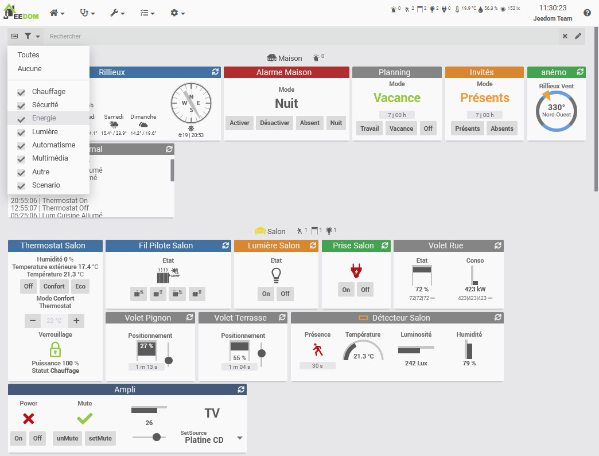
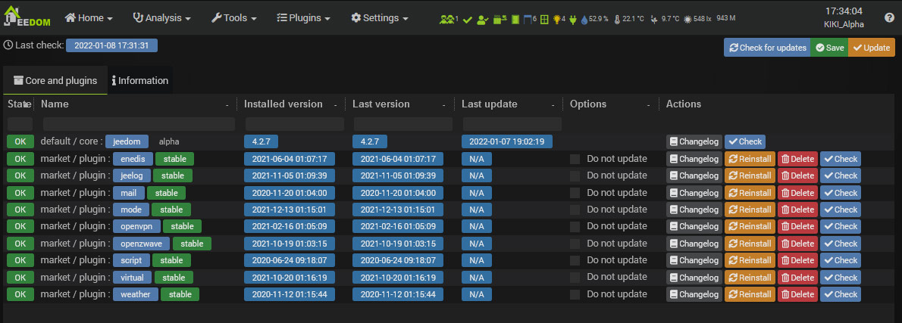

# Presentación

Jeedom es un software gratuito de código abierto que se puede instalar en cualquier sistema Linux. Se basa en un núcleo con múltiples funcionalidades : gestión de escenarios, interacción con el sistema domótico en texto y sonido, visualización del historial y generación de curvas y gráficos, vinculación de todos los equipos y objetos conectados, personalización de la interfaz ... Su interfaz clara y intuitivo permite configurar una solución completa sin conocimiento en desarrollo.

Jeedom no requiere acceso a servidores externos para operar. Toda su instalación se gestiona localmente y, por lo tanto, usted es el único que tiene acceso a ella para garantizar una total confidencialidad.

Gracias a su flexibilidad y numerosos parámetros de personalización, cada usuario puede crear su propia automatización del hogar Jeedom. Usando widgets, vistas y diseños, tiene total libertad para imaginar su propia interfaz si lo desea.

Jeedom permite muchas posibilidades, incluyendo :

- Gestionar la seguridad de bienes y personas,
- Automatice la calefacción para una mayor comodidad y ahorro de energía,
- Visualice y gestione el consumo de energía, anticipe los gastos y reduzca el consumo,
- Comunícate por voz, SMS, correos electrónicos o aplicaciones móviles,
- Gestiona todas las automatizaciones de la casa, persianas, portones, luces, etc.,
- Administre dispositivos multimedia de audio y video y objetos conectados.

Jeedom se basa en el núcleo, integrando la estructura y las funciones centrales.

Diferentes [plugins](https://market.jeedom.com) puede proponer nuevas funciones.

The Core incluye entre otros :

## Panel de control / Resumen

*El equipo, incluidos los actuadores o sensores, está organizado por objetos. Los objetos pueden, por ejemplo, representar partes físicas*.

[Síntesis](/es_ES/core/4.1/overview)

[Dashboard](/es_ES/core/4.1/dashboard)

## Historiques

*Toda la información se puede guardar (curva de temperatura, consumo, aperturas de puertas, etc.) y accesible en Análisis → Historial o desde los mosaicos del Tablero.*

[Historial](/es_ES/core/4.1/history)

## Escenarios

*Los escenarios le permiten automatizar todo o parte de su equipo. Están construidos con diferentes bloques. Bloques condicionales (si entonces, de lo contrario), acciones, programación (IN x minutos o A hhmm), bucle, comentario o código php. Todos los bloques se pueden encajar entre sí, ofreciendo infinitas posibilidades.*

[Mi primer escenario](/es_ES/concept/#tocAnchor-4)

## Creación de widgets

*Jeedom ofrece un motor de creación de widgets para pedidos de equipos. De este modo, puede crear sus propios widgets, además de los widgets básicos. Los widgets también se pueden crear directamente desde el código, para usuarios avanzados.*

## Interactions

*El sistema de interacción en Jeedom le permite realizar acciones desde texto o comandos de voz.*

## Centro de actualizaciones

*El centro de actualizaciones le permite actualizar todas las funciones de Jeedom, incluido el software principal y sus complementos. Hay otras funciones de administración de extensiones disponibles (eliminar, reinstalar, verificar, etc.).*

# Market

Alrededor de este núcleo hay complementos, que pueden ser de todo tipo :

-   Protocolo de automatización del hogar (Z-Wave, RFXcom, EnOcean),
-   Protocolo IP (KNX, xPL),
-   Objeto comunicante (Nest, Netatmo),
-   Nivel alto (alarma, termostato),
-   Organización (calendario, calendario de Google),
-   Desarrollo (guión).

Estos complementos se pueden instalar desde Market y le permiten ampliar las posibilidades de Jeedom.

Jeedom permite que cualquier complemento chatee con otro de forma estandarizada. Esto permite, por ejemplo, usar el termostato o los complementos de alarma con cualquier protocolo de automatización del hogar o incluso un complemento IP u objeto de comunicación

