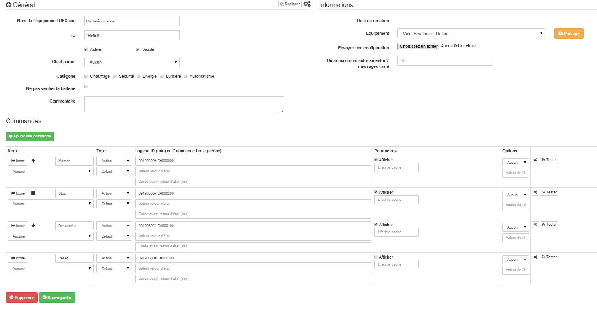

Encontrar la identificación del control remoto 
====================================

Vaya a "Complementos", "Gestión de complementos", "RFX COM" 
------------------------------------------------------

En "Gestión de protocolos RFXcom", 
-------------------------------------

verifique el Protocolo 8, BlindsT1, Guardar y salir.

Activar, "Iniciar en modo de depuración" 
-------------------------------

Espere a que se abra la ventana, luego presione el botón Abrir
su control remoto Ematronic.

    MainThread - rfxcmd:2765 - DEPURACIÓN - Mensaje de prueba: 09 19 03 01 1F 84 B9 01 01 60
    MainThread - rfxcmd:2805 - DEPURACIÓN - Mensaje OK
    MainThread - rfxcmd:328 - DEPURACIÓN - Verificado OK
    MainThread - rfxcmd:334 - DEPURACIÓN - Tipo de paquete: 19
    MainThread - rfxcmd:338 - DEPURACIÓN - Subtipo: 03
    MainThread - rfxcmd:342 - DEPURACIÓN - SeqNbr: 01
    MainThread - rfxcmd:346 - DEPURACIÓN - Id1: 1F
    MainThread - rfxcmd:350 - DEPURACIÓN - Id2: 84
    MainThread - rfxcmd:359 - DEPURACIÓN - Verifique la longitud correcta del paquete
    MainThread - rfxcmd:556 - DEPURACIÓN - Guardar paquete en log_msgfile

Buscar ID de control remoto 
-------------------------------------

Remarque: Los controles remotos de Ematronic siempre comienzan con : 09 19 03
entonces el área que nos interesa comienza desde "Mensaje de prueba" : 09 19 03.

Identificar : Id1 e Id2 y agregue el siguiente hexadecimal : en mi ejemplo
Id1 = 1F e Id2 = 84. así que debes ubicarlos en la línea "Prueba
mensaje "y extraer Id3, aquí Id3 = B9, nuestro control remoto tiene
como ID ⇒ 1F84B9.

Detenga el modo de depuración con el botón "Detener / reiniciar el demonio" 
-----------------------------------------------------------------

Creación del control remoto bajo JeeDom 
=======================================

Vaya a Complementos, Protocolo de inicio, RFXcom.

Haga clic en "Agregar" e ingrese un nombre para su control remoto
virtuelle.

Elija la plantilla de la lista de equipos : "Obturador ematronic -
Por defecto".

Reemplace la identificación automática con la que extrajo anteriormente
y marque "Activar" y "Visible" :

Haga clic en "Guardar" para guardar su configuración y
cargar la plantilla "Componente Ematronic - Predeterminado".

Aquí está su control remoto listo, debería verse así :

Asocia tu control remoto virtual JeeDom con tu motor Ematronic: 
======================================================================

Reinicio del motor: 
---------------------------

-   Desconectar eléctricamente el motor.

-   En el control remoto original, deje el botón "Arriba" presionado 3 o 4
    segundos, el LED se vuelve rojo sólido.

-   Conectar eléctricamente el motor.

-   Suelte el botón en el control remoto.

-   El motor emitirá 5 pitidos.

-   Presione rápidamente el "micro botón" con un clip
    la parte posterior del control remoto.

-   El motor emitirá 3 pitidos.

Asociación del control remoto virtual JeeDom con el motor Ematronic: 
====================================================================

-   Desconectar eléctricamente el motor.

-   En el control remoto original, deje el botón "Arriba" Presione 3 o 4
    segundos, el LED se vuelve rojo sólido.

-   Conectar eléctricamente el motor.

-   Suelte el botón en el control remoto.

-   El motor emitirá 5 pitidos.

-   Presione el comando "Montar" en el control remoto virtual de
    JeeDom. foto::images / shutter.ematronic / image09.png \ [\]

-   El motor emitirá un pitido 3 veces para anunciar que su JeeDoom está asociado
    !!

