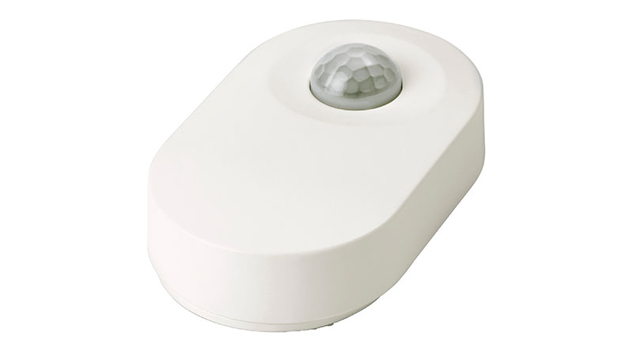

# Compatibilidad de los módulos Zigbee

# Legrand

|Image|Marque|Nom|Type|Remarque|Lien|
|---|---|---|---|---|---|
||Legrand|Salida de cable Legrand||||
||Legrand|Micro módulo Legrand||||
||Legrand|Toma móvil Legrand Céliane||||

# TYZB01

|Image|Marque|Nom|Type|Remarque|Lien|
|---|---|---|---|---|---|
||TYZB01|VALVULA GR-SMARTHOME 1/4 DE VUELTA|||[Comprar](https://www.domadoo.fr/fr/peripheriques/5264-gr-smarthome-motorisation-zigbee-30-pour-vanne-14-de-tour.html)|

# Danalock

|Image|Marque|Nom|Type|Remarque|Lien|
|---|---|---|---|---|---|
||Danalock|Danalock V3 Zigbee||||

# Danfoss

|Image|Marque|Nom|Type|Remarque|Lien|
|---|---|---|---|---|---|
||Danfoss|Danfoss eTRV0100||Para restablecer la válvula, retire las baterías y vuelva a colocarlas presionando el botón hasta que la pantalla se encienda nuevamente.|[Comprar](https://www.domadoo.fr/fr/peripheriques/5156-danfoss-tete-electronique-ally-zigbee-30-5702425245008.html)|

# Generic

|Image|Marque|Nom|Type|Remarque|Lien|
|---|---|---|---|---|---|
||Generic|Luz RGB||Equipo genérico para una luz RGB||
||Generic|Encendido / apagado||Equipo genérico para un enchufe o cualquier módulo On / Off||
||Generic|Apertura / Movimiento||Equipo genérico para sensor de apertura o movimiento||

# Ikea

|Image|Marque|Nom|Type|Remarque|Lien|
|---|---|---|---|---|---|
||Ikea|Repetidor de Ikea||||
||Ikea|Mando a distancia de 2 botones Ikea||||
||Ikea|Tienda Ikea control remoto 2 botones||||
||Ikea|Control remoto Ikea de 5 botones||||
||Ikea|Ikea fyrtur||Para la inclusión, es recomendable resetear la persiana (presionando los 2 botones hasta que se encienda el diodo), luego poner Jeedom en modo inclusión, quitar la betarie y reemplazar la batería de la persiana||
||Ikea|Ikea Kadrilj||Para la inclusión, es recomendable resetear la persiana (presionando los 2 botones hasta que se encienda el diodo), luego poner Jeedom en modo inclusión, quitar la betarie y reemplazar la batería de la persiana||
||Ikea|Sensor de movimiento ikea||||

# Philips

|Image|Marque|Nom|Type|Remarque|Lien|
|---|---|---|---|---|---|
||Philips|Movimiento Philips||||

# Sonoff

|Image|Marque|Nom|Type|Remarque|Lien|
|---|---|---|---|---|---|
||Sonoff|Sonoff Basic ZBR3|||[Comprar](https://www.domadoo.fr/fr/peripheriques/5258-sonoff-module-commutateur-10a-zigbee-30.html)|
||Sonoff|Sonoff viste||Si hay un error en el firmware que lo hace subir como módulo de temperatura y humedad, es necesario, después de la inclusión, restablecer el modelo correcto y eliminar los controles de temperatura y humedad|[Comprar](https://www.domadoo.fr/fr/peripheriques/5261-sonoff-detecteur-de-mouvement-zigbee-30.htm)|
||Sonoff|Movimiento Sonoff|||[Comprar](https://www.domadoo.fr/fr/peripheriques/5261-sonoff-detecteur-de-mouvement-zigbee-30.html)|
||Sonoff|Sonoff Temperatura / humedad|||[Comprar](https://www.domadoo.fr/fr/peripheriques/5260-sonoff-capteur-de-temperature-et-d-humidite-zigbee-30.html)|
||Sonoff|Botón Sonoff|||[Comprar](https://www.domadoo.fr/fr/peripheriques/5259-sonoff-interrupteur-sans-fil-zigbee-30.html)|

# Sunricher

|Image|Marque|Nom|Type|Remarque|Lien|
|---|---|---|---|---|---|
||Sunricher|Controlador de motor Sunricher||||
||Sunricher|Sunricher RGB-CCT||||
||Sunricher|Sunricher ZG2858A||||

# Xiaomi

|Image|Marque|Nom|Type|Remarque|Lien|
|---|---|---|---|---|---|
||Xiaomi|Xioami doble interruptor|||[Comprar](https://www.domadoo.fr/fr/peripheriques/4517-xiaomi-interrupteur-mural-double-sans-fil-zigbee-aqara-6970504210042.html)|
||Xiaomi|Xioami Aquara vibración|||[Comprar](https://www.domadoo.fr/fr/peripheriques/4667-xiaomi-capteur-de-vibration-zigbee-aqara-192784000113.html)|
||Xiaomi|Xiaomi aquara lleva|||[Comprar](https://www.domadoo.fr/fr/peripheriques/4514-xiaomi-detecteur-d-ouverture-portefenetre-zigbee-aqara.html)|
||Xiaomi|Xmovimiento iaomi aquara|||[Comprar](https://www.domadoo.fr/fr/peripheriques/4518-xiaomi-detecteur-de-mouvement-zigbee-aqara-192784000090.html)|
||Xiaomi|Xiaomi aquara inundación|||[Comprar](https://www.domadoo.fr/fr/peripheriques/4519-xiaomi-capteur-d-eau-zigbee-aqara-6970504210257.html)|

Esta lista se basa en los comentarios de los usuarios, por lo que el equipo de Jeedom no puede garantizar que todos los módulos de esta lista sean 100% funcionales
2020-09-24 15:17:28
