# Compatibilidad de los módulos Zigbee

# Casa inteligente 3A DE

|Image|Marque|Nom|Type|Remarque|Lien|
|---|---|---|---|---|---|
||Casa inteligente 3A DE|Balasto inalámbrico SFLS-PP lp||||
|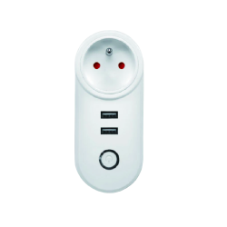|Casa inteligente 3A DE|Enchufe inteligente + 2 puertos USB||||
||Casa inteligente 3A DE|Zigbee 3.0 luz ZLL RGB||||
||Casa inteligente 3A DE|ZW-EC-01 Tienda Zemismart||||

# ADUROLIGHT

|Image|Marque|Nom|Type|Remarque|Lien|
|---|---|---|---|---|---|
|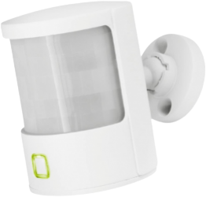|ADUROLIGHT|Confíe en ZPIR-8000||||

# Video de Bitron

|Image|Marque|Nom|Type|Remarque|Lien|
|---|---|---|---|---|---|
|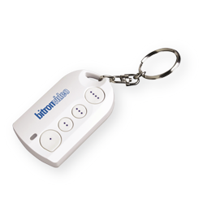|Video de Bitron|SMABIT - Mando a distancia de 4 botones|||[Comprar](https://www.domadoo.fr/fr/peripheriques/5551-smabit-telecommande-zigbee-4-boutons-8023874395814.html)|
||Video de Bitron|SMABIT - Enchufe inteligente ON / OFF 16A|||[Comprar](https://www.domadoo.fr/fr/peripheriques/5563-smabit-prise-intelligente-zigbee-onoff-16a-8023874395852.html)|
|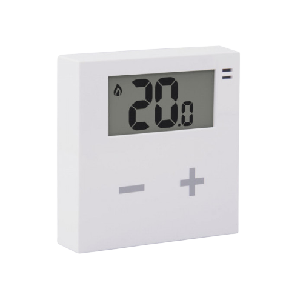|Video de Bitron|SMABIT - Termostato inteligente con relé integrado|||[Comprar](https://www.domadoo.fr/fr/peripheriques/5565-smabit-thermostat-intelligent-zigbee-avec-relais-8023874395883.html)|
|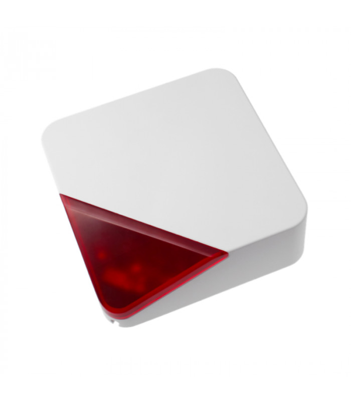|Video de Bitron|Sirena||||
|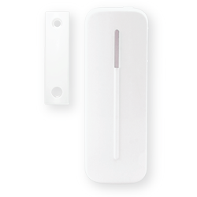|Video de Bitron|SMABIT - Detector de apertura + Entrada de sensor cableado|||[Comprar](https://www.domadoo.fr/fr/peripheriques/5546-smabit-detecteur-d-ouverture-zigbee-entree-capteurs-filaires-8023874396651.html)|
||Video de Bitron|SMABIT - Detector de movimiento de diseño|||[Comprar](https://www.domadoo.fr/fr/peripheriques/5549-smabit-detecteur-de-mouvement-design-zigbee-8021156061013.html)|
||Video de Bitron|SMABIT - Detector de humo|||[Comprar](https://www.domadoo.fr/fr/peripheriques/5555-smabit-detecteur-de-fumee-optique-zigbee-avec-fonction-sirene-8023874396644.html)|
||Video de Bitron|SMABIT - Enchufe inteligente ON / OFF 16A||||
||Video de Bitron|SMABIT - Enchufe inteligente con atenuador de 2.5A|||[Comprar](https://www.domadoo.fr/fr/peripheriques/5561-smabit-prise-intelligente-zigbee-variateur-25a-8023874395845.html)|
||Video de Bitron|SMABIT - Detector de movimiento de cortinas|||[Comprar](https://www.domadoo.fr/fr/peripheriques/5540-smabit-detecteur-de-mouvement-de-rideau-zigbee-8021156062300.html)|
||Video de Bitron|SMABIT - Relé de pared con dimmer 2.5A|||[Comprar](https://www.domadoo.fr/fr/peripheriques/5543-smabit-relais-mural-variateur-25a-zigbee-8023874397122.html)|
||Video de Bitron|SMABIT - Interruptor relé de pared 10A|||[Comprar](https://www.domadoo.fr/fr/peripheriques/5544-smabit-relais-mural-commutateur-10a-zigbee-8023874397139.html)|
||Video de Bitron|SMABIT - Detector de apertura extraplano|||[Comprar](https://www.domadoo.fr/fr/peripheriques/5547-smabit-detecteur-d-ouverture-de-porte-ou-fenetre-ultra-plat-zigbee-8023874397658.html)|
||Video de Bitron|SMABIT - Interruptor de pared con pilas|||[Comprar](https://www.domadoo.fr/fr/peripheriques/5568-smabit-interrupteur-mural-zigbee-avec-piles-8021156061037.html)|
||Video de Bitron|SMABIT - Detector de inundaciones + sirena|||[Comprar](https://www.domadoo.fr/fr/peripheriques/5569-smabit-detecteur-de-fuite-d-eau-avec-sirene-zigbee-8021156063291.html)|
||Video de Bitron|SMABIT - Detector de movimiento para exteriores|||[Comprar](https://www.domadoo.fr/fr/peripheriques/5550-smabit-detecteur-de-mouvement-exterieur-zigbee-8023874397665.html)|

# Eurotronic

|Image|Marque|Nom|Type|Remarque|Lien|
|---|---|---|---|---|---|
||Eurotronic|Cabezal termosático||Válvula que tiende a no aceptar más órdenes (cambio de setpoint) a menos que se retiren las baterías y se vuelvan a colocar. Por otro lado, esto siempre retroalimenta la información de temperatura y el cambio manual del punto de ajuste|[Comprar](https://www.domadoo.fr/fr/peripheriques/5188-eurotronic-tete-thermostatique-zigbee-4260012711233.html)|

# Frient

|Image|Marque|Nom|Type|Remarque|Lien|
|---|---|---|---|---|---|
||Frient|Medidor de consumo de electricidad óptico|||[Comprar](https://www.domadoo.fr/fr/peripheriques/5424-frient-compteur-optique-de-consommation-d-electricite-zigbee-ha-5713594002583.html)|
|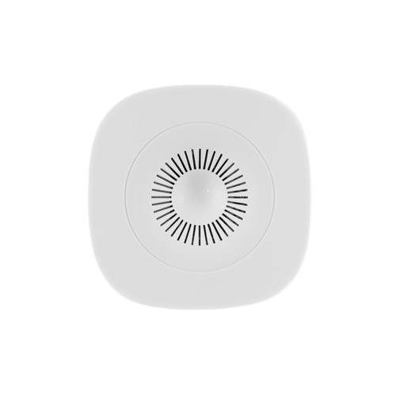|Frient|Sensor de calidad del aire|||[Comprar](https://www.domadoo.fr/fr/peripheriques/5408-frient-capteur-de-qualite-d-air-zigbee-ha-5713594002392.html)|
|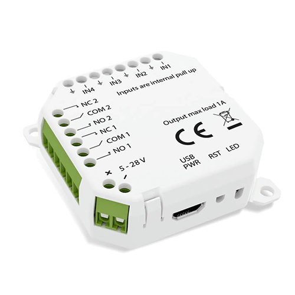|Frient|Módulo IO||||
|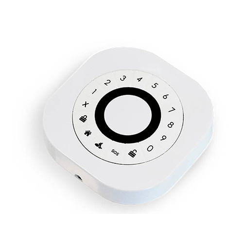|Develco|Teclado inteligente||Para el comando Info SOS, el significado es : 2 SOS (pulsación larga del botón), 7 alguien lo ha pasado delante del teclado||
|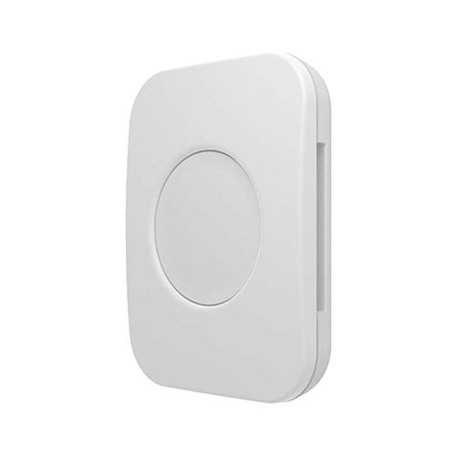|Develco|Botón de pánico||Parece haber un problema con el firmware, solo la desactivación de la alerta (presione el botón durante 5 segundos después de activar el modo de pánico) se envía a las redes zigbee||
|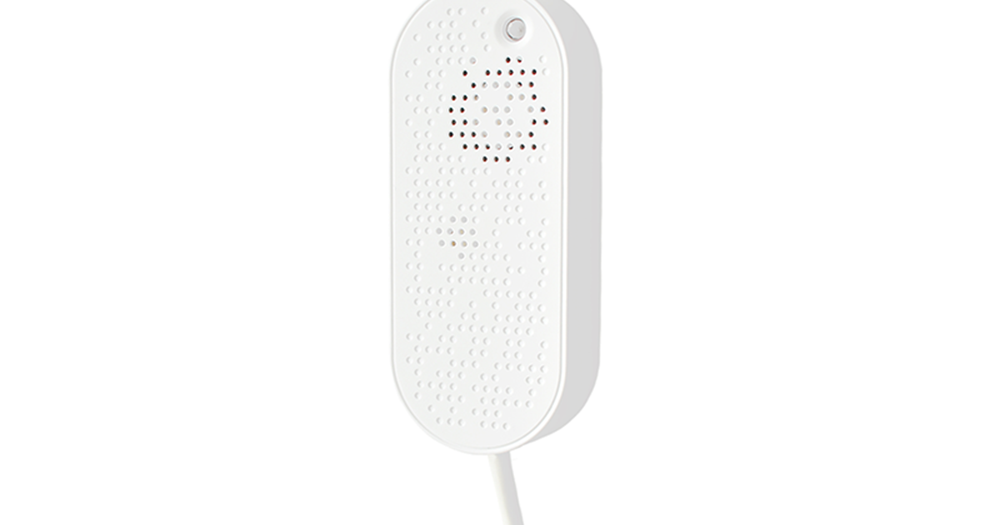|Frient|Sirena inteligente||||
|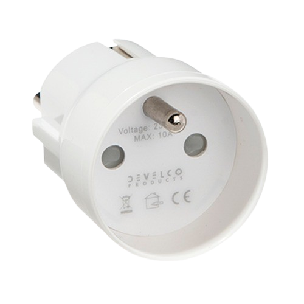|Frient|Enchufe inteligente|||[Comprar](https://www.domadoo.fr/fr/peripheriques/5412-frient-prise-intelligente-mini-avec-mesure-de-consommation-zigbee-ha-version-fr-5713594002514.html)|
||Frient|Sensor de calidad del aire|||[Comprar](https://www.domadoo.fr/fr/peripheriques/5408-frient-capteur-de-qualite-d-air-zigbee-ha-5713594002392.html)|
||Frient|Detector de inundaciones inteligente|||[Comprar](https://www.domadoo.fr/fr/peripheriques/5427-frient-detecteur-d-inondation-zigbee-30-5713594002453.html)|
||Frient|Detector de calor|||[Comprar](https://www.domadoo.fr/fr/peripheriques/5411-frient-detecteur-de-chaleur-intelligent-zigbee-30-din-en-14604-et-din-14676-5713594002446.html)|
||Frient|Sensor de temperatura y humedad|||[Comprar](https://www.domadoo.fr/fr/peripheriques/5407-frient-capteur-de-temperature-et-humidite-intelligent-zigbee-30-5713594002385.html)|
|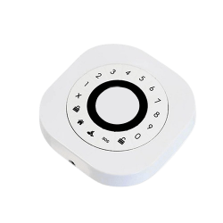|Frient|Teclado inteligente||Para el comando Info SOS, el significado es : 2 SOS (pulsación larga del botón), 7 alguien lo ha pasado delante del teclado||
||Frient|Detector de movimiento y sensor de temperatura y luz|||[Comprar](https://www.domadoo.fr/fr/peripheriques/5404-frient-detecteur-de-mouvement-zigbee-30-capteur-de-temperature-et-luminosite-5713594002361.html)|
|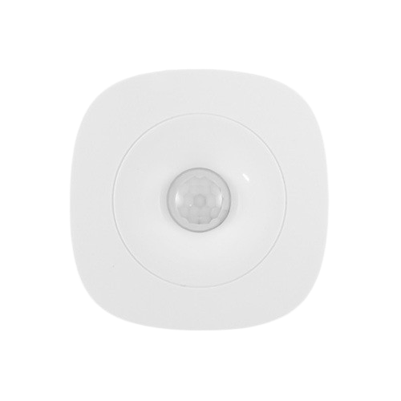|Frient|Detector de movimiento|||[Comprar](https://www.domadoo.fr/fr/peripheriques/5403-frient-detecteur-de-mouvement-zigbee-30-5713594002835.html)|
|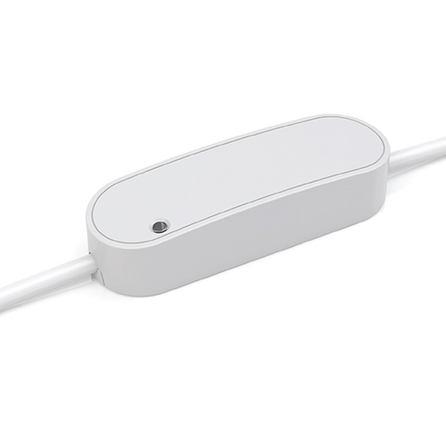|Frient|Interruptor de cable inteligente|||[Comprar](https://www.domadoo.fr/fr/peripheriques/5421-frient-interrupteur-sur-cordon-zigbee-30-5713594002408.html)|
||Frient|Detector de humo inteligente DIN EN 14604 Y DIN 14676|||[Comprar](https://www.domadoo.fr/fr/peripheriques/5409-frient-detecteur-de-fumee-intelligent-zigbee-30-5713594002330.html)|
||Frient|Enchufe inteligente de formato Schuko|||[Comprar](https://www.domadoo.fr/fr/peripheriques/5420-frient-prise-intelligente-mini-avec-mesure-de-consommation-zigbee-ha-version-schuko-5713594002347.html)|
|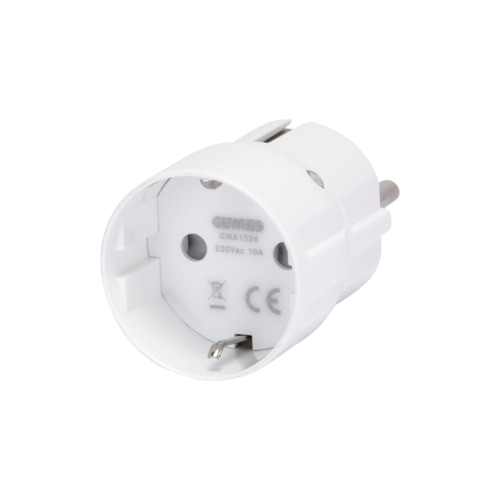|Frient|Toma inteligente de formato FR|||[Comprar](https://www.domadoo.fr/fr/peripheriques/5412-frient-prise-intelligente-mini-avec-mesure-de-consommation-zigbee-ha-version-fr-5713594002514.html)|
||Frient|Sirena inteligente||||
||Frient|Detector de apertura de puertas o ventanas y sensor de temperatura|||[Comprar](https://www.domadoo.fr/fr/peripheriques/5402-frient-detecteur-d-ouverture-de-porte-ou-fenetre-zigbee-30-capteur-de-temperature-5713594002354.html)|
|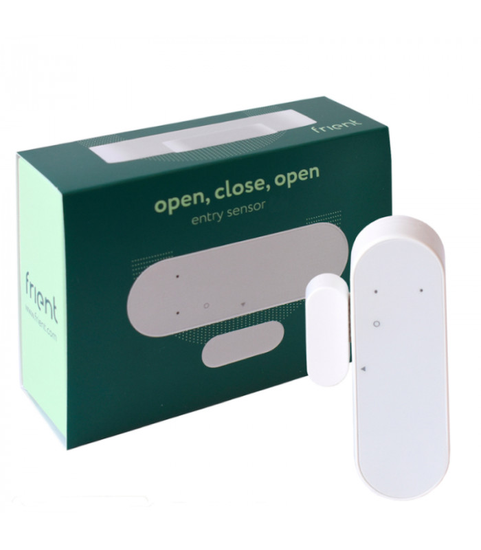|Frient|Detector de movimiento inteligente|||[Comprar](https://www.domadoo.fr/fr/peripheriques/5401-frient-detecteur-d-ouverture-de-porte-ou-fenetre-zigbee-30-5713594002545.html)|
||Frient|Botón inteligente||||

# GR-SMARTHOME

|Image|Marque|Nom|Type|Remarque|Lien|
|---|---|---|---|---|---|
|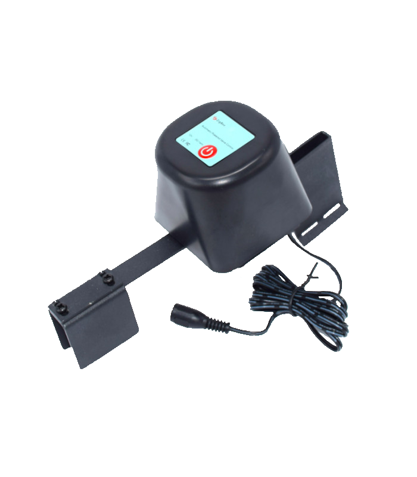|GR-SMARTHOME|Motorización para válvula de 1/4 de vuelta|Vanne||[Comprar](https://www.domadoo.fr/fr/peripheriques/5264-gr-smarthome-motorisation-zigbee-30-pour-vanne-14-de-tour.html)|
||GR-SMARTHOME|Motorización para válvula de 1/4 de vuelta|Vanne||[Comprar](https://www.domadoo.fr/fr/peripheriques/5264-gr-smarthome-motorisation-zigbee-30-pour-vanne-14-de-tour.html)|

# GreenPower

|Image|Marque|Nom|Type|Remarque|Lien|
|---|---|---|---|---|---|
||GreenPower|Equipo genérico GreenPower||||
||GreenPower|Equipo GreenPower On / Off||||
||GreenPower|Manilla para ventana de equipamiento GreenPower||||

# Groupes

|Image|Marque|Nom|Type|Remarque|Lien|
|---|---|---|---|---|---|
||Groupes|Blanco - Brillo - Encendido - Apagado||||
||Groupes|Color - Blanco - Brillo - Encendido - Apagado||||
||Groupes|Brillo - Encendido - Apagado||||
||Groupes|Encendido apagado||||
||Groupes|Volet||||

# Halemeier

|Image|Marque|Nom|Type|Remarque|Lien|
|---|---|---|---|---|---|
||Halemeier|HA-ZGMW2-E||||
||Halemeier|HA-ZGMW2-E||||

# Insta

|Image|Marque|Nom|Type|Remarque|Lien|
|---|---|---|---|---|---|
||Insta|Control remoto||||

# JunYu

|Image|Marque|Nom|Type|Remarque|Lien|
|---|---|---|---|---|---|
|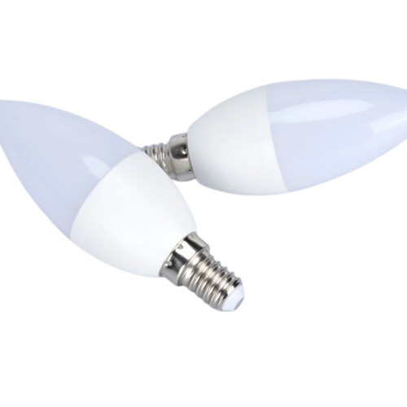|JunYu|LED RGBW||Tenga en cuenta que la información sobre el estado de este modelo no es en tiempo real (ya sea siguiendo un comando o solicitando explícitamente una actualización del mismo)||

# LIVOLO

|Image|Marque|Nom|Type|Remarque|Lien|
|---|---|---|---|---|---|
|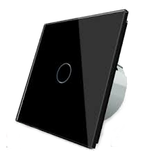|LIVOLO|Interrupteur||||

# LS Deutschland GmbH

|Image|Marque|Nom|Type|Remarque|Lien|
|---|---|---|---|---|---|
||LS Deutschland GmbH|||||

# Legrand

|Image|Marque|Nom|Type|Remarque|Lien|
|---|---|---|---|---|---|
|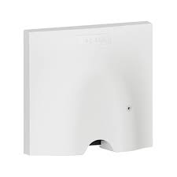|Legrand|Salida de cable conectada||Solo se puede emparejar en el canal 11||
|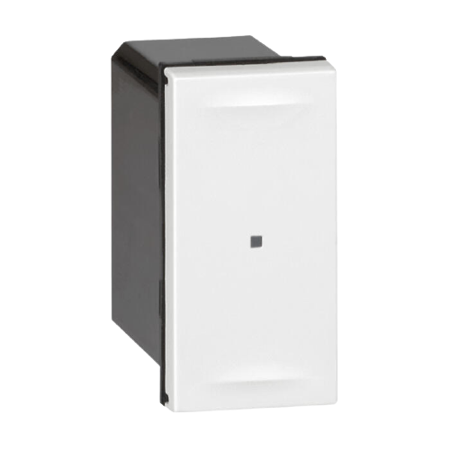|Legrand|Módulo Micro VMC||Solo se puede emparejar en el canal 11||
|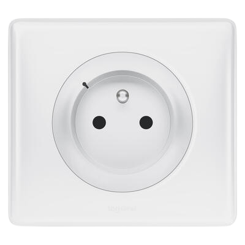|Legrand|Toma conectada||Solo se puede emparejar en el canal 11||
||Legrand|Contactor conectado DRIVIA||Solo se puede emparejar en el canal 11||
||Legrand|Módulo de consumo de energía DIN||Solo se puede emparejar en el canal 11||
|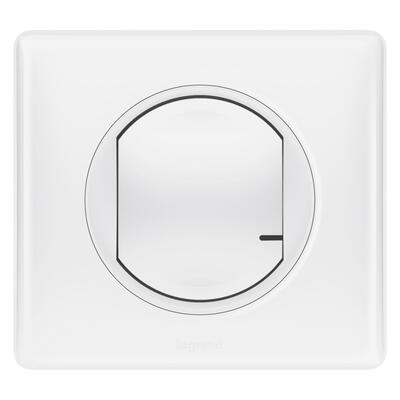|Legrand|Interruptor cableado conectado con opción de atenuador sin neutro||Solo se puede emparejar en el canal 11, 13 o 15||
||Legrand|Interruptor conectado con neutral con opción de atenuador||Solo se puede emparejar en el canal 11, 13 o 15||
|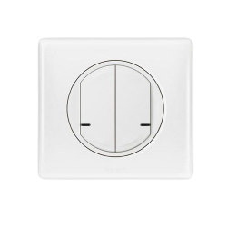|Legrand|Control dual inalámbrico||Solo se puede emparejar en el canal 11||
||Legrand|GreenPower En casa / Ausente||||
||Legrand|GreenPower día / noche||||
||Legrand|Verde Encendido / Apagado||||
||Legrand|Obturador eléctrico GreenPower||||
||Legrand|Módulo para iluminación conectada||Solo se puede emparejar en el canal 11 o 15||
|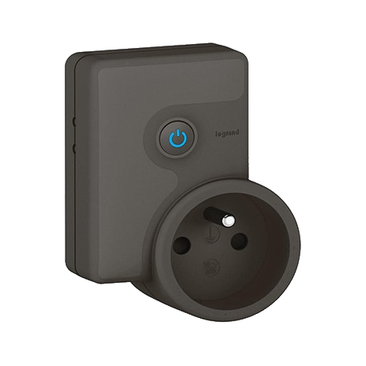|Legrand|Toma móvil Céliane||Solo se puede emparejar en el canal 11||
|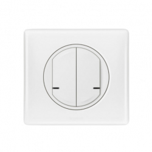|Legrand|Interruptor doble conectado con neutro||Solo se puede emparejar en el canal 11 o 15||
||Legrand|Interruptor de ventilador||Solo se puede emparejar en el canal 11||
|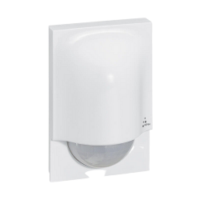|Legrand|Detector de movimiento||Solo se puede emparejar en el canal 11||
||Legrand|Control inalámbrico simple||Solo se puede emparejar en el canal 11||
||Legrand|Control inalámbrico Sunrise Sunset||Solo se puede emparejar en el canal 11||
||Legrand|Comando de alternancia||Solo se puede emparejar en el canal 11||
|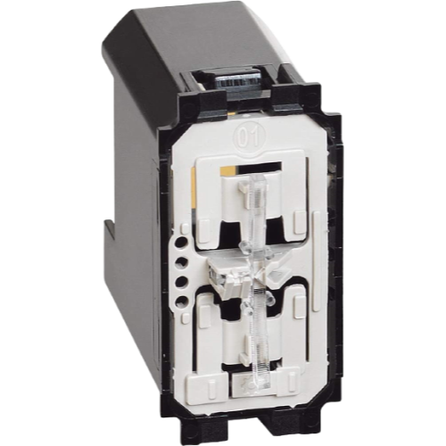|Legrand|BTICINO - Interruptor cableado para persianas enrollables con posicionamiento||Solo se puede emparejar en el canal 11||
|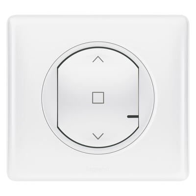|Legrand|Interruptor cableado conectado para persiana enrollable||Solo se puede emparejar en el canal 11||
||Legrand|Control inalámbrico para persiana enrollable||Solo se puede emparejar en el canal 11||
|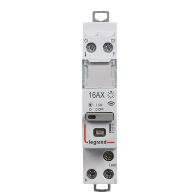|Legrand|Interruptor remoto||Solo se puede emparejar en el canal 11||
|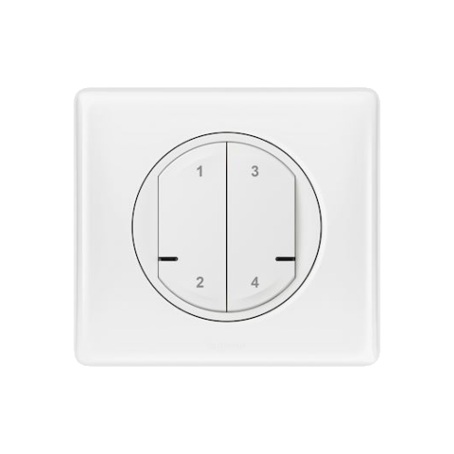|Legrand|Comando de escena||Solo se puede emparejar en el canal 11||

# LiXee

|Image|Marque|Nom|Type|Remarque|Lien|
|---|---|---|---|---|---|
||LiXee|TIC||||

# MLI

|Image|Marque|Nom|Type|Remarque|Lien|
|---|---|---|---|---|---|
||MLI|MLI - ZBT remoto todo RGBW||||

# NIKO NV

|Image|Marque|Nom|Type|Remarque|Lien|
|---|---|---|---|---|---|
|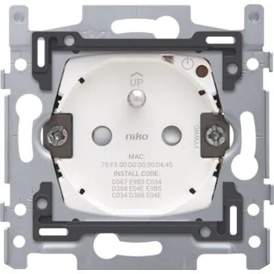|NIKO NV|Enchufe inteligente||||

# Oeeone

|Image|Marque|Nom|Type|Remarque|Lien|
|---|---|---|---|---|---|
|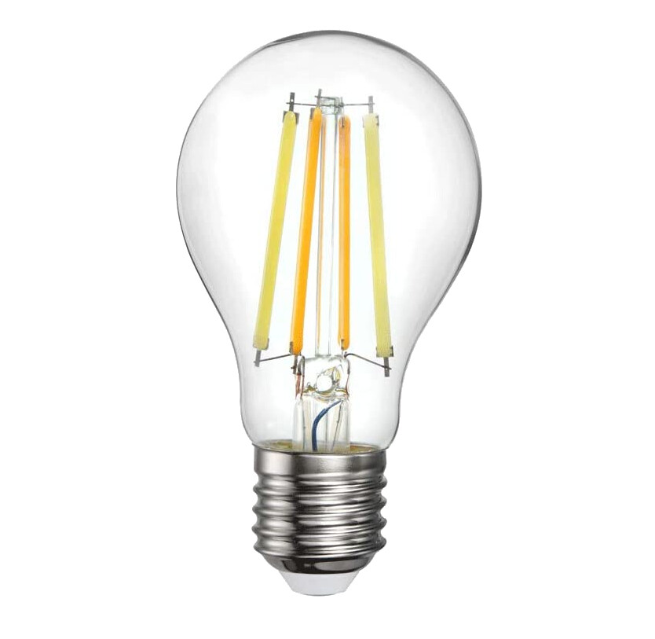|Oeeone|Bombilla de filamento LED inteligente Oeeone E27||||

# Paul Neuhaus

|Image|Marque|Nom|Type|Remarque|Lien|
|---|---|---|---|---|---|
|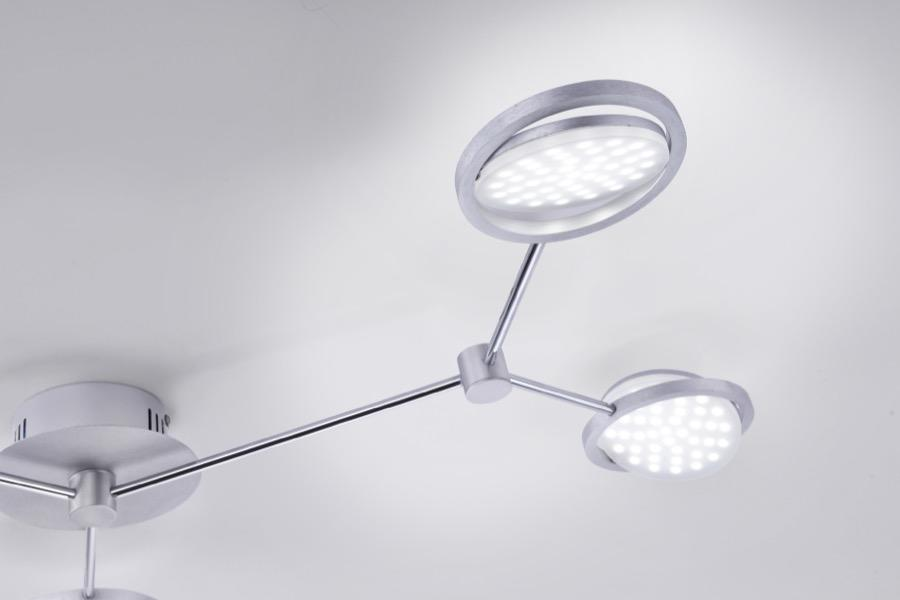|Paul Neuhaus|Q-Orbit||||
|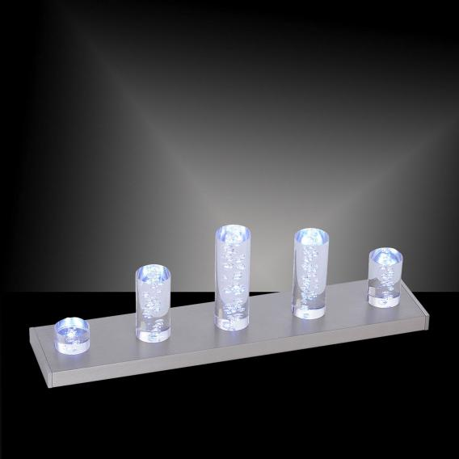|Paul Neuhaus|Q-SKYLINE||||
||Paul Neuhaus|Q-Miran||||
||Paul Neuhaus|NLG-remote||||
||Paul Neuhaus|Neuhaus remoto||||

# Philio

|Image|Marque|Nom|Type|Remarque|Lien|
|---|---|---|---|---|---|
||Philio|Sensor múltiple 4 en 1||||

# SZ

|Image|Marque|Nom|Type|Remarque|Lien|
|---|---|---|---|---|---|
||SZ|Controlador Zigbee On / Off||||

# Samjin

|Image|Marque|Nom|Type|Remarque|Lien|
|---|---|---|---|---|---|
||Samjin|Bouton||||

# Samotech

|Image|Marque|Nom|Type|Remarque|Lien|
|---|---|---|---|---|---|
||Samotech|SAMOTEK SM309||||

# Tecnologías Sinope

|Image|Marque|Nom|Type|Remarque|Lien|
|---|---|---|---|---|---|
||Ouellet|Ouellet OTH3600-GA-ZB|Cabezal termostático|||

# Terncy

|Image|Marque|Nom|Type|Remarque|Lien|
|---|---|---|---|---|---|
||Terncy|Balasto inalámbrico SFLS-PP lp||||

# Titan Products Ltd

|Image|Marque|Nom|Type|Remarque|Lien|
|---|---|---|---|---|---|
||Titan Products Ltd|Sensores inalámbricos de CO2, temperatura y humedad TPZ-Net|Temperatura, Humedad, Calidad del aire, CO2|||

# Confianza Internacional

|Image|Marque|Nom|Type|Remarque|Lien|
|---|---|---|---|---|---|
||Confianza Internacional|Trust International ZLL-DimmableLigh||||

# Ysrai

|Image|Marque|Nom|Type|Remarque|Lien|
|---|---|---|---|---|---|
|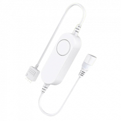|Ysrai|YSRSAI - ZB-CL01||||

# ZB Ajax en línea

|Image|Marque|Nom|Type|Remarque|Lien|
|---|---|---|---|---|---|
|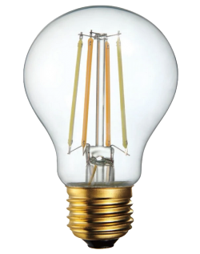|ZB Ajax en línea|Luz CCT||||

# Zemismart

|Image|Marque|Nom|Type|Remarque|Lien|
|---|---|---|---|---|---|
||Zemismart|Zigbee 3.0 control remoto RGB||||
|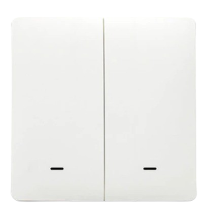|Zemismart|Interruptor inteligente de carga única sin neutro||||
||Zemismart|Interruptor inteligente de carga única sin neutro||||
||Zemismart|Store|Volets|||

# Acova

|Image|Marque|Nom|Type|Remarque|Lien|
|---|---|---|---|---|---|
||Acova|ACOVA Alcantara2|Chauffage||[Documentación](https://acova.fr/sites/default/files/PIM/documents/Notice_utilisation_Alcantara_2.pdf) [Comprar](https://www.leroymerlin.fr/produits/chauffage-plomberie/chauffage-electrique/radiateur-electrique/radiateur-a-inertie/radiateur-electrique-connecte-a-inertie-fluide-1000w-acova-alcantara2-horizontal-82646764.html)|
||Acova|ACOVA Percale2|Chauffage||[Documentación](https://acova.fr/radiateur-electrique/percale-2-connecte-156865) [Comprar](https://www.leroymerlin.fr/produits/chauffage-plomberie/chauffage-electrique/radiateur-electrique/radiateur-a-inertie/radiateur-electrique-connecte-a-inertie-fluide-1000w-acova-percale2-horizontal-82646753.html)|

# Adeo

|Image|Marque|Nom|Type|Remarque|Lien|
|---|---|---|---|---|---|
||Adeo|LEXMAN ENKI - Toma conectada 16A|||[Comprar](https://www.leroymerlin.fr/produits/electricite-domotique/domotique-et-objets-connectes/domotique/solutions-de-commande/prise-connectee-16a-3680w-repeteur-lexman-82428895.html)|
||Adeo|Detector de movimiento|Mouvement|||
||Adeo|LEXMAN ENKI - Bombilla inteligente||||
||Adeo|LEXMAN ENKI - Bombilla inteligente||||
|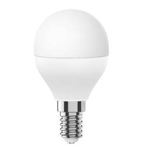|Adeo|LEXMAN ENKI - Bombilla inteligente||||
||Adeo|LEXMAN ENKI - Bombilla inteligente||||
||Adeo|LEXMAN ENKI - Mando a distancia para bombillas RGB conectadas||||
||Adeo|LEXMAN ENKI - Bombilla inteligente||||

# Alfawise

|Image|Marque|Nom|Type|Remarque|Lien|
|---|---|---|---|---|---|
|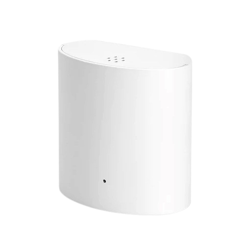|Alfawise|Temperatura / humedad Alfawise||||
|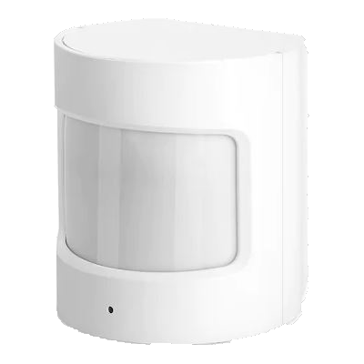|Alfawise|Alfawise lleva||||
||Alfawise|Alfawise lleva||||

# Awox

|Image|Marque|Nom|Type|Remarque|Lien|
|---|---|---|---|---|---|
|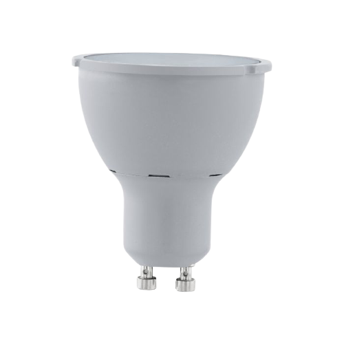|Awox|EGLO Crosslink-Z / Awox TLSR82||||

# Casaia

|Image|Marque|Nom|Type|Remarque|Lien|
|---|---|---|---|---|---|
||Casaia|Relé Rail-Din 32A y contador de energía Zigbee|Contactor, contador||[Documentación](https://casaia.fr/product/relais-rail-din-et-compteur-denergie-zigbee/?attachment_id=2554&download_file=pciir2fcqcjiz) [Comprar](https://www.domadoo.fr/fr/peripheriques/5578-casaia-relais-rail-din-32a-et-compteur-d-energie-zigbee-3770021021175.html)|
|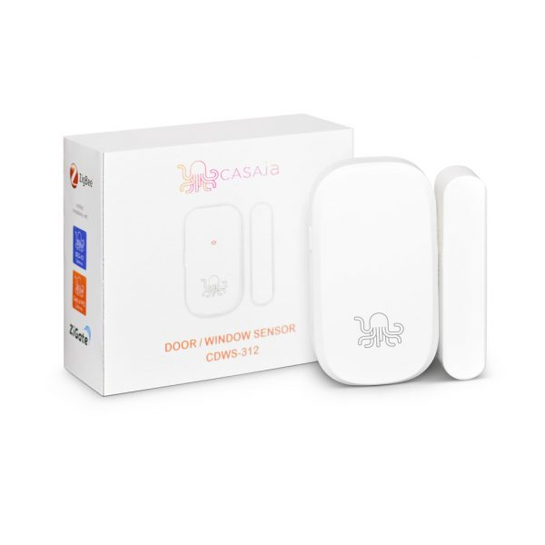|Casaia|Detector de puerta inteligente|Ouverture|IMPORTANTE : incluido pero no reporta ninguna información||
||Casaia|Mando a distancia de 4 botones||Solo funcionan los botones + y menos|[Comprar](https://www.domadoo.fr/fr/peripheriques/5580-casaia-telecommande-keyfob-4-boutons-zigbee-3770021021205.html)|
|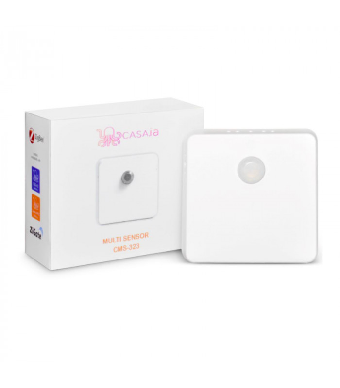|Casaia|Movimientos multisensor / vibraciones / temperatura / humedad|||[Comprar](https://www.domadoo.fr/fr/peripheriques/5571-casaia-multi-sensor-zigbee-mouvements-vibrations-temperature-humidite-3770021021045.html)|
|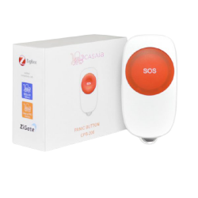|Casaia|Botón SOS||||
|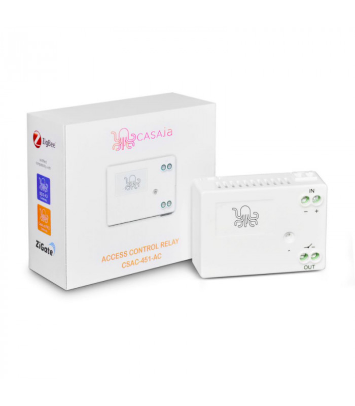|Casaia|Módulo de control de acceso Zigbee (6-24V DC) - Contacto seco y retardado a 2 segundos|Contacteur||[Documentación](https://casaia.fr/product/module-de-controle-dacces-zigbee/?attachment_id=2539&download_file=nalg5m9bkxv0a) [Comprar](https://www.domadoo.fr/fr/peripheriques/5574-casaia-module-de-controle-d-acces-zigbee-6-24v-dc-contact-sec-et-temporise-a-2-secondes-3770021021120.html)|
||Casaia|MÓDULO RELÉ CONTACTO SECO ZIGBEE (230V - 10A)|Contacteur||[Documentación](https://casaia.fr/product/module-relais-contact-sec-zigbee-2/?attachment_id=2531&download_file=sot05ddz1k2wn) [Comprar](https://www.domadoo.fr/fr/peripheriques/5573-casaia-module-relais-contact-sec-zigbee-230v-10a-3770021021113.html)|
||Casaia|Módulo de relé triple Zigbee|Contacteur||[Documentación](https://casaia.fr/product/module-triple-relais-zigbee/?attachment_id=2518&download_file=c2digfwrhtylk) [Comprar](https://www.domadoo.fr/fr/peripheriques/5577-casaia-module-triple-relais-zigbee-3770021021151.html)|
|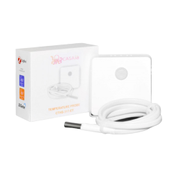|Casaia|Sonda de temperatura remota en cable|||[Comprar](https://www.domadoo.fr/fr/peripheriques/5572-casaia-sonde-de-temperature-deportee-sur-cable-zigbee-3770021021052.html)|

# Danalock

|Image|Marque|Nom|Type|Remarque|Lien|
|---|---|---|---|---|---|
|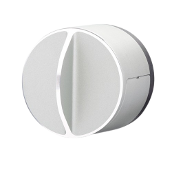|Danalock|Cerradura inteligente V3|||[Comprar](https://www.domadoo.fr/fr/controle-acces/4540-danalock-serrure-connectee-bluetooth-et-zigbee-danalock-v3-5712560000493.html)|

# Danfoss

|Image|Marque|Nom|Type|Remarque|Lien|
|---|---|---|---|---|---|
||Danfoss|Aliado de Danfoss (2)|Cabezal termostático||[Documentación](https://assets.danfoss.com/documents/DOC353849556547/DOC353849556547.pdf) [Comprar](https://www.domadoo.fr/fr/peripheriques/5156-danfoss-tete-electronique-ally-zigbee-30-5702425245008.html)|
||Danfoss|Controlador de piso Icon de Danfoss|Controlador de piso calefactado|||
|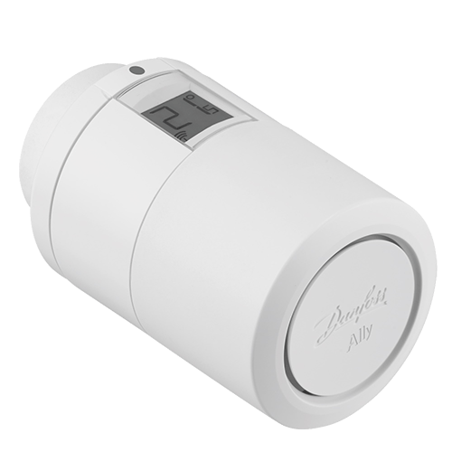|Danfoss|Aliado de Danfoss|Cabezal termostático||[Documentación](https://assets.danfoss.com/documents/DOC353849556547/DOC353849556547.pdf) [Comprar](https://www.domadoo.fr/fr/peripheriques/5156-danfoss-tete-electronique-ally-zigbee-30-5702425245008.html)|
||Danfoss|Sonda de temperatura y humedad|||[Comprar](https://www.domadoo.fr/fr/peripheriques/5930-danfoss-sonde-de-temperature-et-d-humidite-zigbee-30-5715162289013.html)|

# Dresde elektronik

|Image|Marque|Nom|Type|Remarque|Lien|
|---|---|---|---|---|---|
||Dresde elektronik|Balasto inalámbrico FLS-PP lp||||

# EWeLink

|Image|Marque|Nom|Type|Remarque|Lien|
|---|---|---|---|---|---|
||eWeLight|Controlador LED inteligente RGBCW MR16||||
||EWeLink|Controlador OnOff||||
|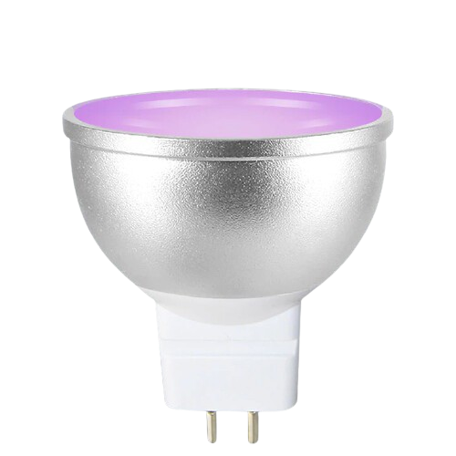|EWeLink|Bombilla LED inteligente RGBCW MR16||||
||EWeLink|Interruptor de relé inteligente ZigBee de 1 canal||||
||EWeLink|Controlador OnOff||||

# Ecodim

|Image|Marque|Nom|Type|Remarque|Lien|
|---|---|---|---|---|---|
||Ecodim|CONTROLADOR DE PARED INALÁMBRICO DE 8 BOTONES||||
|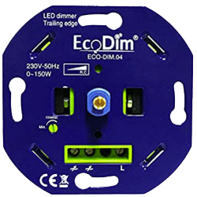|Ecodim|Regulador de intensidad giratorio|Interruptor, atenuador||[Comprar](https://www.domadoo.fr/fr/eclairage/5369-ecodim-interrupteur-variateur-rotatif-zigbee-30-200w-8719322371263.html)|

# Evology

|Image|Marque|Nom|Type|Remarque|Lien|
|---|---|---|---|---|---|
||Evology|Sirena inteligente||||

# Feller

|Image|Marque|Nom|Type|Remarque|Lien|
|---|---|---|---|---|---|
||Feller|Amigos de boo 4 botones||||

# Gledopto

|Image|Marque|Nom|Type|Remarque|Lien|
|---|---|---|---|---|---|
|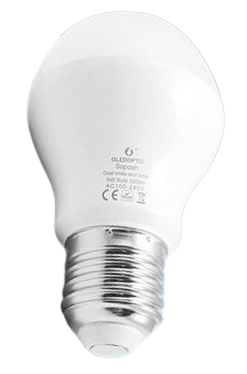|Gledopto|GL-B-007Z||||
||Gledopto|GL-B-008Z||||
|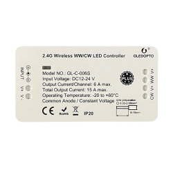|Gledopto|Controlador inteligente de tira de LED blanco cálido y frío||||
||Gledopto|GL-C-007||||
||Gledopto|GL-C-008P||||
||Gledopto|GL-C-008S||||
||Gledopto|GL-G-001ZS||||
||Gledopto|Cinta Gledopto RGBCCT||||
||Gledopto|Cinta Gledopto RGBCCT||||
||Gledopto|GL-S-004Z||||
||Gledopto|GL-S-007Z||||

# Heiman

|Image|Marque|Nom|Type|Remarque|Lien|
|---|---|---|---|---|---|
||Heiman|Sensor inteligente de monóxido de carbono||||
||Heiman|Detector de monóxido de carbono||||
||Heiman|Mando a distancia a color de 5 botones||||
||Heiman|ColorLight E27||||
||Heiman|Timbre conectado||||
||Heiman|Sensor inteligente de gas combustible||||
|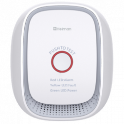|Heiman|Detector de gas||||
||Heiman|Monitor inteligente de la calidad del aire||||
||Heiman|Mando a distancia de 4 botones||||
||Heiman|Botón SOS||||
||Heiman|Mando a distancia de 4 botones||||
||Heiman|Detector de humo||||
|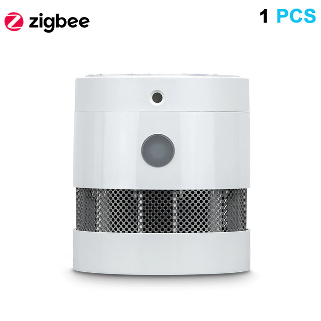|Heiman|Detector de humo||||
|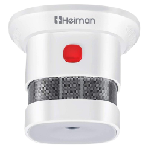|Heiman|Detector de humo||||
|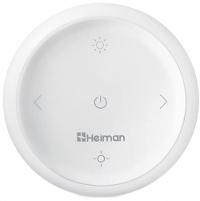|Heiman|Control remoto de 5 botones||||
||Heiman|||||
|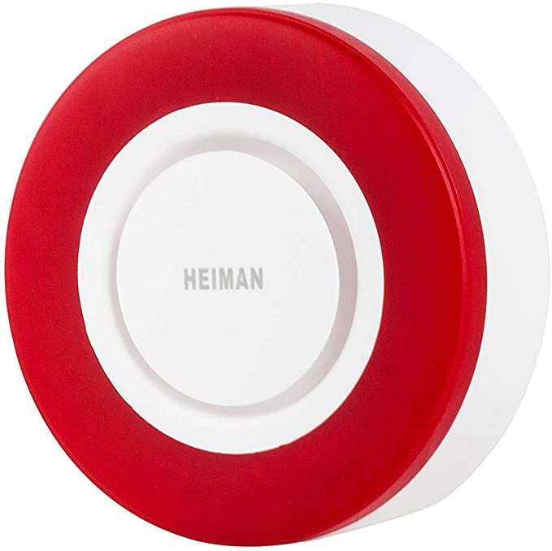|Heiman|Sirena inteligente||||
|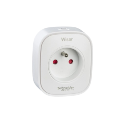|Schneider|Toma y repetidor conectados Wiser|Zócalo, medidor, potencia, repetidor||[Comprar](https://www.domadoo.fr/fr/eclairage/5499-schneider-electric-prise-connectee-et-repeteur-zigbee-30-wiser-3606489917883.html)|
||Heiman|Sirena al aire libre|||[Comprar](https://www.domadoo.fr/fr/peripheriques/5564-smabit-sirene-exterieure-zigbee-104-db-8023874397641.html)|

# Icasa

|Image|Marque|Nom|Type|Remarque|Lien|
|---|---|---|---|---|---|
||Icasa|Bombilla Filamant||||
||Icasa|Atenuador de CA||||
|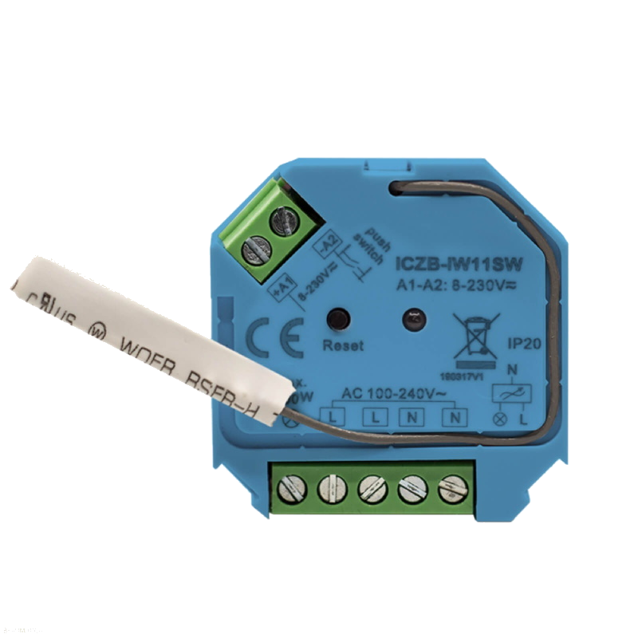|Icasa|Interruptor de CA||||
|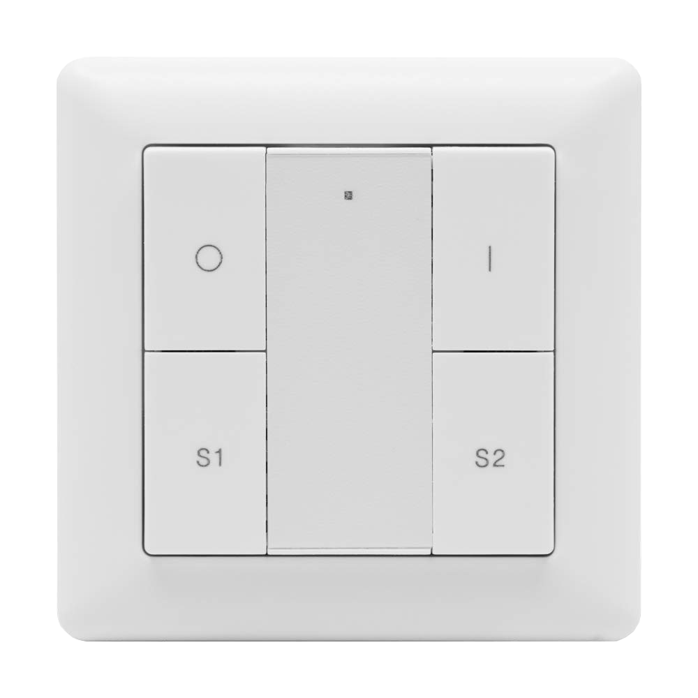|Icasa|Controlador de pared Pulse 4S||||
||Icasa|Atenuador giratorio||||
||Icasa|Icasa RGB||||

# Idinio

|Image|Marque|Nom|Type|Remarque|Lien|
|---|---|---|---|---|---|
|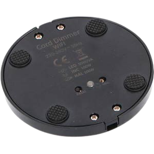|Idinio|Atenuador a pie|Interruptor, atenuador|||

# Ikea

|Image|Marque|Nom|Type|Remarque|Lien|
|---|---|---|---|---|---|
||Ikea|Panel FLOALT WS 30x30||||
||Ikea|Panel FLOALT WS 30x90||||
||Ikea|Fyrtur - estor enrollable||||
||Ikea|Panel GUNNARP redondo||||
||Ikea|Kadrilj - estor enrollable||||
||Ikea|Mando a distancia STYRBAR|Control remoto|||
||Ikea|Purificador de aire IKEA Starkvind||||
||Ikea|Controlador de sonido Symfonisk|Control remoto|||
|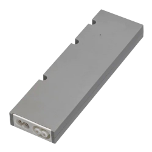|Ikea|Controlador de 10W||||
||Ikea|Conductor 30W||||
||Ikea|Botón de ACCESO DIRECTO|Control remoto|||
||Ikea|Bombilla E14 CWS 470lm||||
|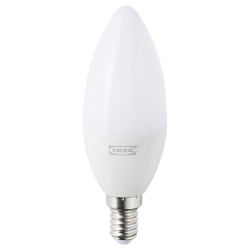|Ikea|Bombilla E14 CWS opal 600lm||||
||Ikea|Bombilla E14 WS 470lm||||
||Ikea|Bombilla E14 WS opal 600lm||||
|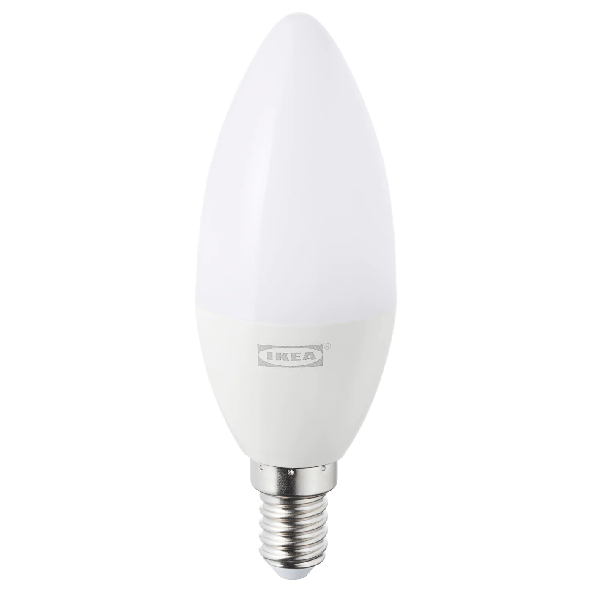|Ikea|Bombilla E14 W opch 400lm||||
|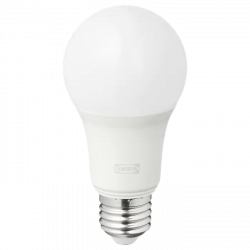|Ikea|Bombilla E27 CWS 806lm||||
||Ikea|Bombilla E27 CWS opal 600lm||||
|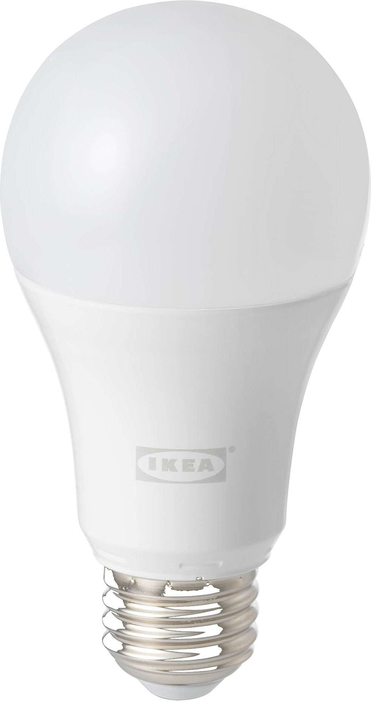|Ikea|Bombilla E27 WS opal 1000lm||||
||Ikea|Bombilla E27 WS opal 980lm||Tenga en cuenta que la información sobre el estado de este modelo no es en tiempo real (ya sea siguiendo un comando o solicitando explícitamente una actualización del mismo)||
|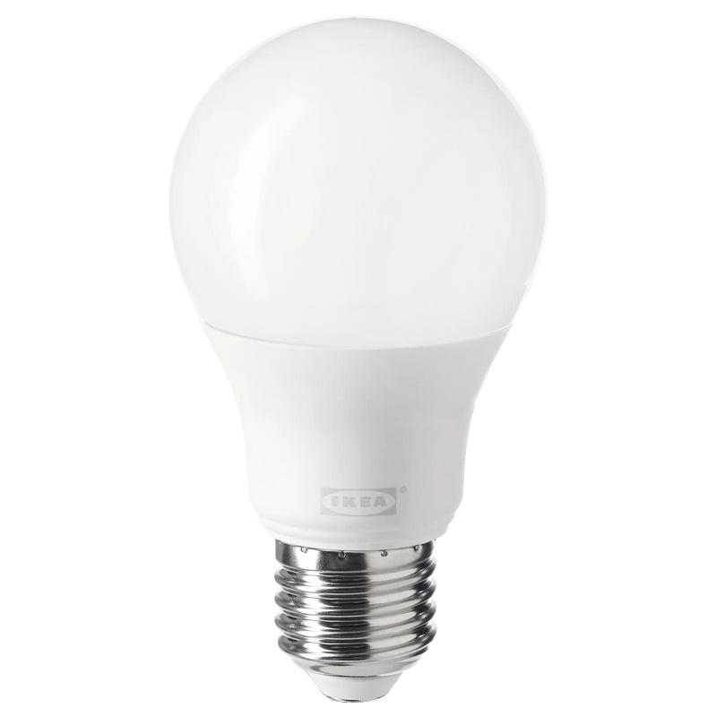|Ikea|Bombilla E27 WW 806lm||||
||Ikea|Bombilla TRADFRI E27 WW transparente 250lm||||
||Ikea|Bombilla E27 W opal 1000lm||||
||Ikea|Bombilla GU10 WS 400lm||||
||Ikea|Bombilla GU10 WW 400lm||||
|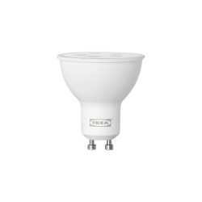|Ikea|Bombilla GU10 W 400lm||||
|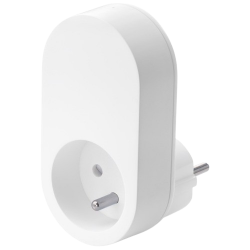|Ikea|Toma conectada|||[Documentación](https://www.ikea.com/fr/fr/manuals/tradfri-wireless-control-outlet__AA-2106602-1_pub.pdf) |
|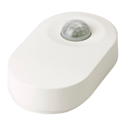|Ikea|Detector de movimiento|||[Documentación](https://www.ikea.com/fr/fr/manuals/tradfri-wireless-motion-sensor__AA-2145280-2_pub.pdf) |
|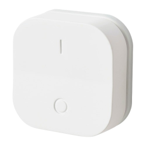|Ikea|Mando a distancia de 2 botones|Control remoto||[Documentación](https://www.ikea.com/fr/fr/assembly_instructions/tradfri-wireless-dimmer-white__AA-2175106-3_pub.pdf) |
||Ikea|Control remoto de 5 botones|Control remoto||[Documentación](https://www.ikea.com/fr/fr/manuals/tradfri-remote-control__AA-2144014-1_pub.pdf) |
|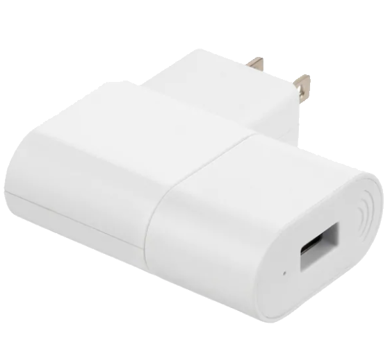|Ikea|Repetidor de Ikea||||
||Ikea|Bombilla E27 1055lm||||
||Ikea|Mando a distancia para persianas de 2 botones||||

# Iluminize

|Image|Marque|Nom|Type|Remarque|Lien|
|---|---|---|---|---|---|
||Iluminize|Zigbee 3.0 de alto voltaje, actuador atenuador||||

# Innr

|Image|Marque|Nom|Type|Remarque|Lien|
|---|---|---|---|---|---|
||Innr|INR AE 260||||
||Innr|CINTA INNR FLEXIBLE INTERIOR RGBW|||[Comprar](https://www.domadoo.fr/fr/peripheriques/5455-innr-ruban-flexible-indoor-couleur-4m-couleur-et-blanc-variable-2000k-a-6500k-8718781552725.html)|
||Innr|INNR Outdoor Flex Color de luz||||
||Innr|OSL 130 C||||
|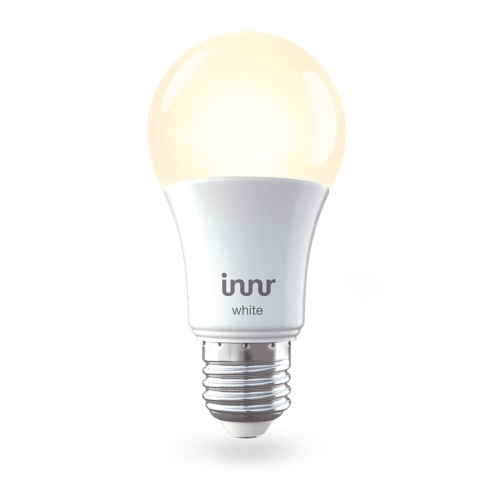|Innr|INNR RB 165||||
||Innr|INNR E14 RGBW|||[Comprar](https://www.domadoo.fr/fr/peripheriques/5349-innr-ampoule-connectee-type-e14-zigbee-30-multicolor-rgbw-blanc-reglable-2200k-a-6500k-8718781552060.html)|
||Innr|Innr RB 265||||
||Innr|RB278T||||
||Innr|INNR E27 Multicolor RGBW + Blanco||||
||Innr|INNR RF 263||||
||Innr|INNR GU10 RGBW||||
||Innr|INNR TOMADO||||
||Innr|Botón inteligente INNR||||
||Innr|Prise|||[Comprar](https://www.domadoo.fr/fr/peripheriques/5362-innr-prise-connectee-super-slim-zigbee-30-8718781552657.html)|

# Konke

|Image|Marque|Nom|Type|Remarque|Lien|
|---|---|---|---|---|---|
||Konke|Sonda de temperatura y humedad||||
||Konke|Sensor de movimiento Konke||||

# Ledvance

|Image|Marque|Nom|Type|Remarque|Lien|
|---|---|---|---|---|---|
||Ledvance|Clásico E27 Multicolor||||
||Ledvance|Classic E27 Tunable blanco||||
||Ledvance|FLEX RGBW Z3||||
||Ledvance|Gardenpole RGBW Z3||||
||Ledvance|Exterior FLEX RGBW Z3||||
||Ledvance|ENCHUFE LEDVANCE SMART + BT PARA EXTERIORES UE||||
||Ledvance|Zócalo inteligente + Enchufe Z3||||

# Lellki

|Image|Marque|Nom|Type|Remarque|Lien|
|---|---|---|---|---|---|
||Lellki|Regleta de alimentación inteligente||||

# Lexman

|Image|Marque|Nom|Type|Remarque|Lien|
|---|---|---|---|---|---|
||Lexman|LEXMAN ENKI - Toma conectada 16A|||[Comprar](https://www.leroymerlin.fr/produits/electricite-domotique/domotique-et-objets-connectes/domotique/solutions-de-commande/prise-connectee-16a-3680w-repeteur-lexman-82428895.html)|

# Lidl

|Image|Marque|Nom|Type|Remarque|Lien|
|---|---|---|---|---|---|
||Lidl|Control remoto inteligente con atenuador||||
||Lidl|Detector de movimiento inteligente||||
||Lidl|Bombilla inteligente E27||||
|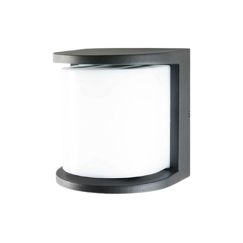|Lidl|Aplique LED de exterior conectado||||
|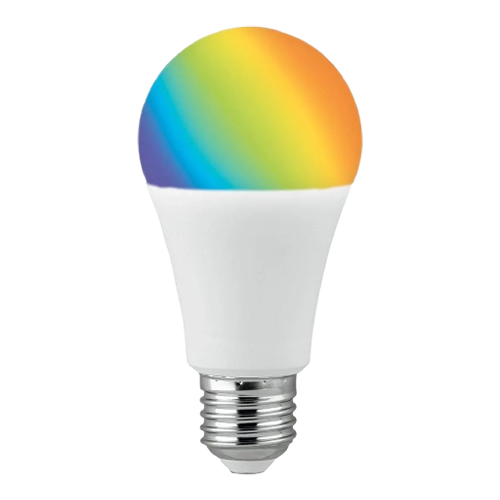|Lidl|Bombilla conectada E27 RGB||||
||Lidl|Bombilla LED conectada GU10||||
||Lidl|Tira de LED conectada||||
||Lidl|Bombilla inteligente GU10 RGB||||
||Lidl|Bombilla LED conectada E14||||
||Lidl|Bombilla conectada E14 RGB||||
||Lidl|Tira de LED inteligente||||
||Lidl|Regleta de enchufes conectada 4 enchufes y 2 puertos USB||||
||Lidl|Toma conectada ON / OFF||||
||Lidl|Controlador de riego||||

# Loratap

|Image|Marque|Nom|Type|Remarque|Lien|
|---|---|---|---|---|---|
|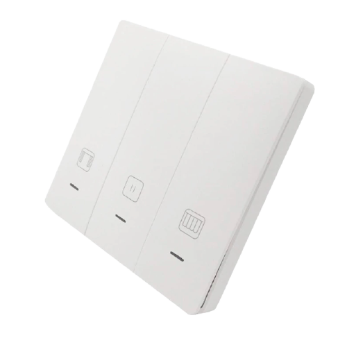|Loratap|Módulo de persiana enrollable||||
|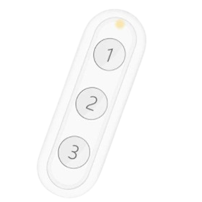|Loratap|LORATAP - Mando a distancia de 3 botones||||
|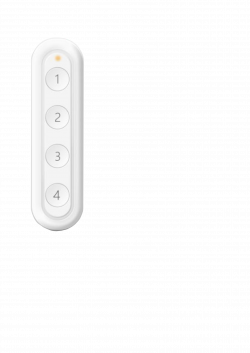|Loratap|LORATAP - Mando a distancia de 4 botones||||

# Nodon

|Image|Marque|Nom|Type|Remarque|Lien|
|---|---|---|---|---|---|
||Nodon|Interruptor de ENCENDIDO / APAGADO de carga única 16A||||
||Nodon|Interruptor de encendido/apagado de carga única 16A PRO||||
||Nodon|Módulo interruptor de doble carga ON / OFF 2x3A||||
||Nodon|Módulo interruptor ON/OFF doble carga 2x3A PRO||||
||Nodon|Módulo de persiana enrollable||||
||Nodon|Módulo de persiana enrollable PRO||||
|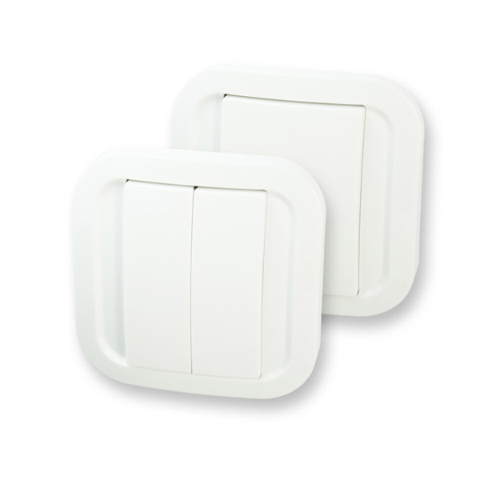|Nodon|PTM 216 Z||||

# Orvibo

|Image|Marque|Nom|Type|Remarque|Lien|
|---|---|---|---|---|---|
|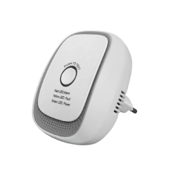|Orvibo|Sensor de gas|Sensor, gas||[Documentación](https://www.domadoo.fr/fr/index.php?controller=attachment&id_attachment=2475) [Comprar](https://www.domadoo.fr/fr/peripheriques/5337-orvibo-detecteur-de-gaz-zigbee.html)|
|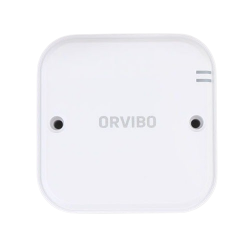|Orvibo|Controlador RGB||||
||Orvibo|Relé multifuncional|Contacteur|A partir del 15/12/2020, volver al estado no funcional|[Documentación](https://www.domadoo.fr/fr/index.php?controller=attachment&id_attachment=2461) [Comprar](https://www.domadoo.fr/fr/peripheriques/5340-orvibo-module-commutateur-contact-sec-zigbee.html)|
|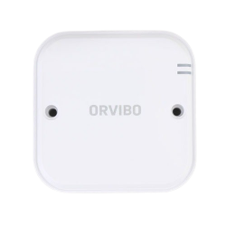|Orvibo|Conector del sensor|Capteur|||
||Orvibo|Boton de emergencia|Botón, control remoto||[Comprar](https://www.domadoo.fr/fr/peripheriques/5335-orvibo-bouton-d-urgence-sos-zigbee.html)|
|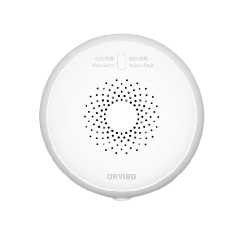|Orvibo|Sensor de gas|Sensor, gas|||
|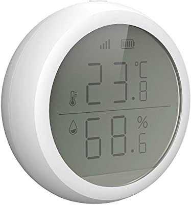|Orvibo|Sensor de temperatura / humedad|Sensor, temperatura, humedad||[Documentación](https://www.domadoo.fr/fr/index.php?controller=attachment&id_attachment=2455) [Comprar](https://www.domadoo.fr/fr/peripheriques/5334-orvibo-capteur-de-temperature-et-humidite-zigbee.html)|
|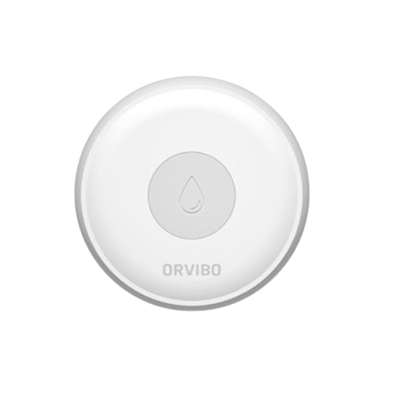|Orvibo|Gotera de agua|Sensor, fuga, inundación||[Documentación](https://www.domadoo.fr/fr/index.php?controller=attachment&id_attachment=2458) [Comprar](https://www.domadoo.fr/fr/peripheriques/5338-orvibo-detecteur-d-inondation-zigbee.html)|
|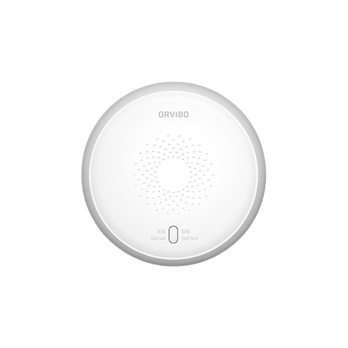|Orvibo|Detector de humo||||

# Osram

|Image|Marque|Nom|Type|Remarque|Lien|
|---|---|---|---|---|---|
||Osram|Bombilla LED OSRAM Smart + Connected - Base E27||||
||Osram|Osram Smart + Tunable white E27 peana||Tenga en cuenta que la información sobre el estado de este modelo no es en tiempo real (ya sea siguiendo un comando o solicitando explícitamente una actualización del mismo)||
||Osram|OSRAM Techo TW OSRAM||Tenga en cuenta que la información sobre el estado de este modelo no es en tiempo real (ya sea siguiendo un comando o solicitando explícitamente una actualización del mismo)||
||Osram|Bombilla LED OSRAM Smart + E14||Tenga en cuenta que la información sobre el estado de este modelo no es en tiempo real (ya sea siguiendo un comando o solicitando explícitamente una actualización del mismo)||
||Osram|POSTE DE JARDÍN LEDVANCE SMART +||Tenga en cuenta que la información sobre el estado de este modelo no es en tiempo real (ya sea siguiendo un comando o solicitando explícitamente una actualización del mismo)||
|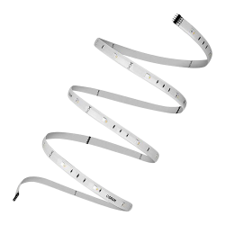|Osram|OSRAM LIGHTIFY Interior Flex RGBW||Tenga en cuenta que la información sobre el estado de este modelo no es en tiempo real (ya sea siguiendo un comando o solicitando explícitamente una actualización del mismo)||
|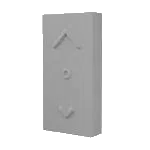|Osram|Lightify Switch Mini||||
||Osram|OSRAM SMART + Spot GU5.3 blanco sintonizable||||
||Osram|Enchufe OSRAM Smart +||||

# Owon

|Image|Marque|Nom|Type|Remarque|Lien|
|---|---|---|---|---|---|
|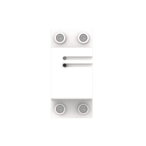|Owon|Relé Rail-Din 32A y contador de energía Zigbee|Contactor, contador||[Documentación](https://www.owon-smart.com/uploads/Quick-Start-Guide-CB432-Din-Rail-Relay1.pdf) |
||Owon|TERMOSTATO FAN COIL ZIGBEE (100V-240V)|Thermostat||[Documentación](https://www.owon-smart.com/uploads/Quick-Start-Guide-%E2%80%93-PCT504-ZigBee-Fan-coil-Thermostat.pdf) [Comprar](https://www.domadoo.fr/fr/peripheriques/6056-owon-thermostat-de-ventilo-convecteur-zigbee-100v-240v.html)|
||Owon|Sensor múltiple (movimiento/temperatura/humedad))|||[Documentación](https://www.owon-smart.com/uploads/Quick-Start-Guide-PIR323-ZigBee-Multi-Sensor.pdf) |
|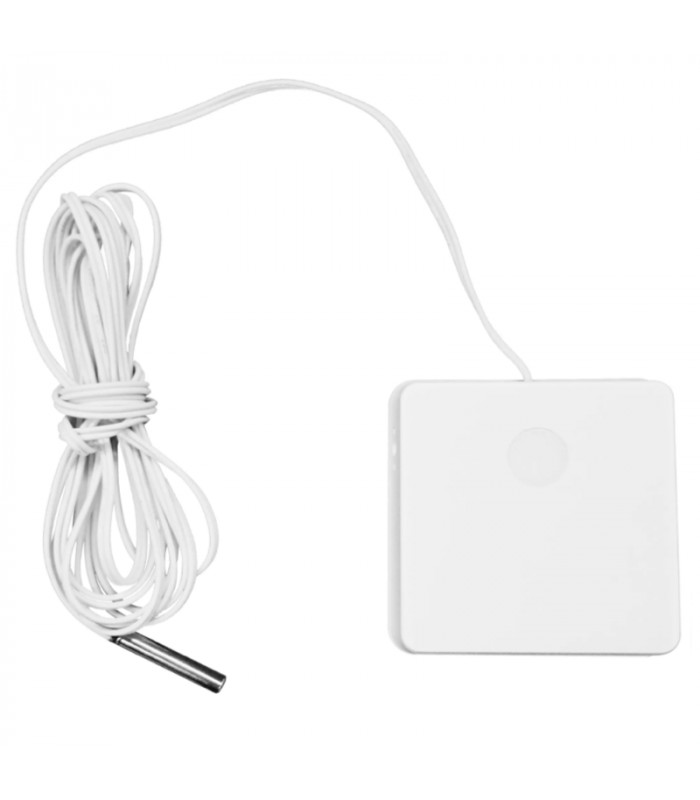|Owon|Sonda de temperatura remota en cable|||[Comprar](https://www.domadoo.fr/fr/peripheriques/5998-owon-sonde-de-temperature-deportee-sur-cable-zigbee.html)|

# Philips

|Image|Marque|Nom|Type|Remarque|Lien|
|---|---|---|---|---|---|
|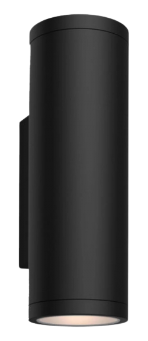|Philips|Aparece el ambiente de color y blanco de Philips Hue||||
||Philips|Hue blanco A60 E27||||
||Philips|Hue White and Color Ambiance A60 E27||||
||Philips|Hue LightStrip Plus||||
||Philips|Hue Outdoor Lily XL||||
||Philips|Bulbo de tono blanco y color||||
||Philips|Hue White y Color BR30 (1.a generación)||||
||Philips|Hue White y Color Ambiance Spot GU10||Tenga en cuenta que la información sobre el estado de este modelo no es en tiempo real (ya sea siguiendo un comando o solicitando explícitamente una actualización del mismo)||
||Philips|Hue White and Color Ambiance A19 E26 (Gen 2)||||
||Philips|Hue White and Color Ambiance A19 E26 (Gen 3)||||
||Philips|Hue White y Color Ambiance BR30 Colores más ricos||||
||Philips|Vela Hue White y Color Ambiance E12||||
||Philips|Hue White and Color Ambiance A19 E26||||
|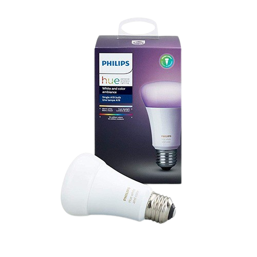|Philips|Hue White and Color Ambiance A19 E26||Tenga en cuenta que no hay comentarios de estado para este modelo, solo es posible enviar un pedido||
|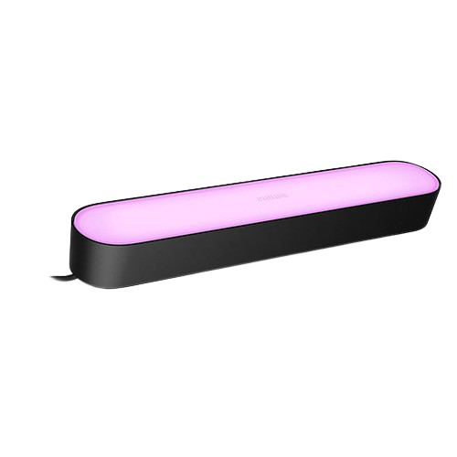|Philips|Barra de luces Play Hue White y Color Ambiance||||
|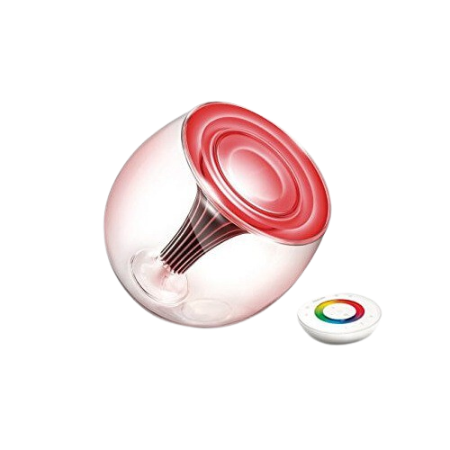|Philips|Hue LivingColors||||
||Philips|Hue LivingColors||||
||Philips|Hue LivingColors Iris, lámpara de mesa Gen3||||
||Philips|Hue LivingColors||||
||Philips|Lámpara de mesa Hue Iris||||
|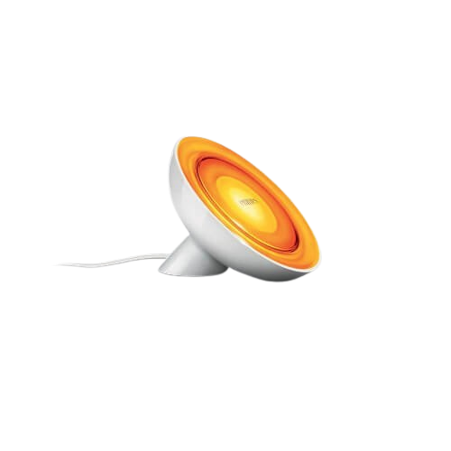|Philips|Paquete de inicio Hue Bloom Living Colors||Tenga en cuenta que la información sobre el estado de este modelo no es en tiempo real (ya sea siguiendo un comando o solicitando explícitamente una actualización del mismo)||
||Philips|Lámpara de mesa Hue Bloom||||
||Philips|Hue LivingColors||||
||Philips|Luz portátil Hue Go||||
|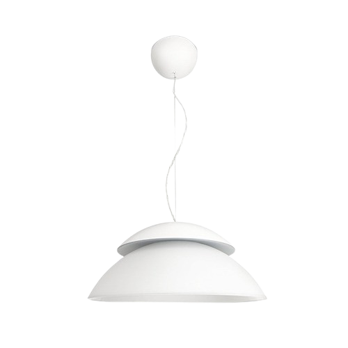|Philips|Luz de suspensión Hue Beyond||||
||Philips|Hue blanco y color||||
||Philips|Hue blanco y color||||
|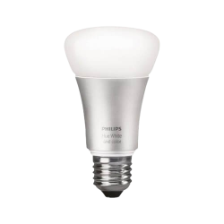|Philips|Hue blanco y color||||
||Philips|Enchufe inteligente Hue||||
||Philips|Enchufe inteligente Hue||||
|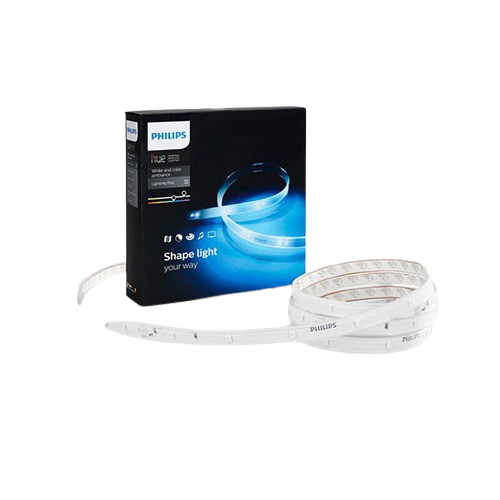|Philips|Hue LightStrip||||
||Philips|Hue LightStrip Plus||||
|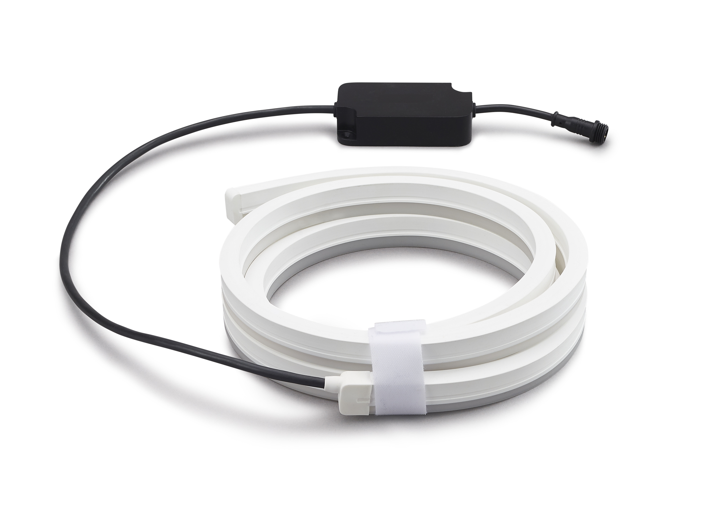|Philips|Hue LightStrip para exteriores||||
||Philips|Hue White E27 con Bluetooth||||
||Philips|Hue White Ambiance E14 con BT||||
||Philips|Hue blanco y color||Tenga en cuenta que no hay comentarios de estado para este modelo, solo es posible enviar un pedido||
||Philips|Hue White Ambiance A19 E26 / E27||Tenga en cuenta que la información sobre el estado de este modelo no es en tiempo real (ya sea siguiendo un comando o solicitando explícitamente una actualización del mismo)||
|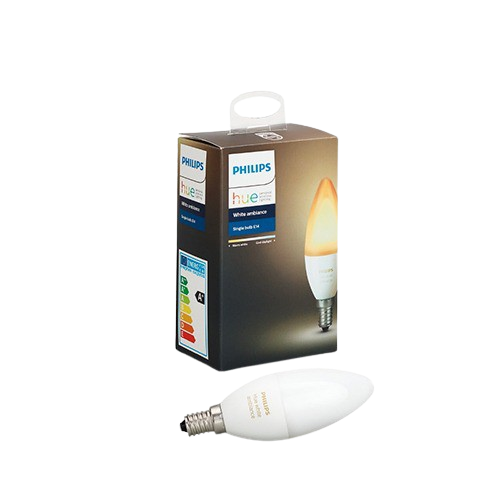|Philips|LTW012||Tenga en cuenta que la información sobre el estado de este modelo no es en tiempo real (ya sea siguiendo un comando o solicitando explícitamente una actualización del mismo)||
|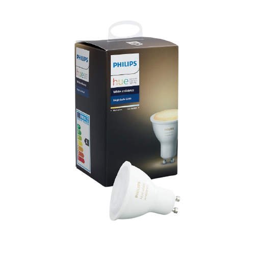|Philips|Bombilla inteligente GU10 blanca||Tenga en cuenta que la información sobre el estado de este modelo no es en tiempo real (ya sea siguiendo un comando o solicitando explícitamente una actualización del mismo)||
|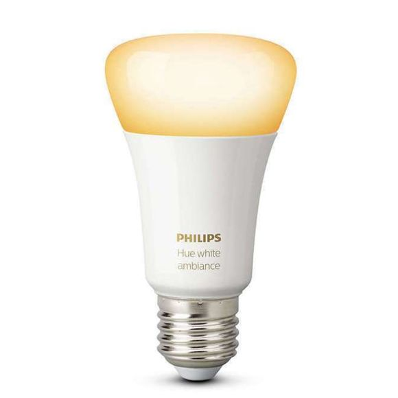|Philips|Hue White Ambiance E27||Tenga en cuenta que no hay comentarios de estado para este modelo, solo es posible enviar un pedido||
|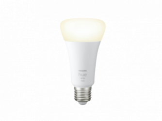|Philips|Hue Blanco A67 E27 1600 LM||Tenga en cuenta que no hay comentarios de estado para este modelo, solo es posible enviar un pedido||
||Philips|Hue blanco E27||Tenga en cuenta que no hay comentarios de estado para este modelo, solo es posible enviar un pedido||
||Philips|Bombilla blanca regulable E27 Philps Hue 9W 806 lm||||
|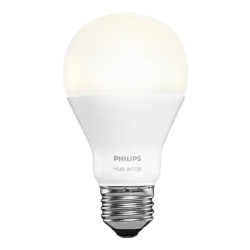|Philips|E27 Philps Hue 9W||||
||Philips|Hue blanco B22||Tenga en cuenta que no hay comentarios de estado para este modelo, solo es posible enviar un pedido||
||Philips|Vela Hue White E14||Tenga en cuenta que no hay comentarios de estado para este modelo, solo es posible enviar un pedido||
|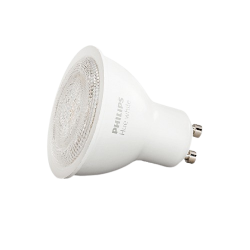|Philips|Hue blanco GU10||||
|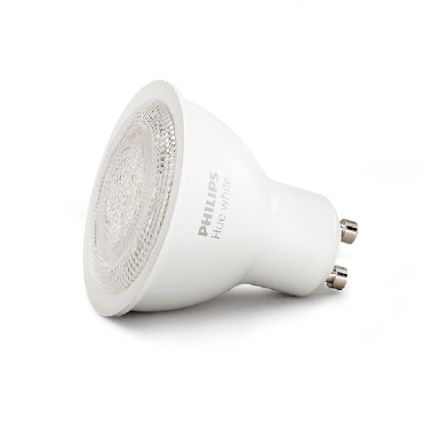|Philips|GU10 Philips HUE||||
|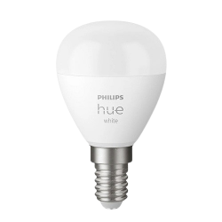|Philips|Tono E14 P45||||
||Philips|Bombilla de filamento blanco Hue ST64 E27||||
|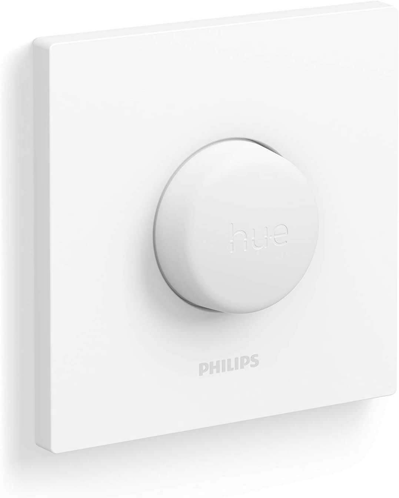|Philips|Variateur||||
||Philips|Mando a distancia de 4 botones||||
||Philips|Detector de movimiento interior Hue|Movimiento, brillo, temperatura|||
||Philips|Detector de movimiento exterior Hue|Movimiento, brillo, temperatura|||
|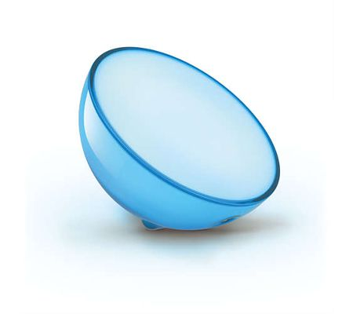|Philips|Hue Go||||
||Philips|Módulo de interruptor de pared Hue||||
||Philips|Mando a distancia de 4 botones||||

# Popp

|Image|Marque|Nom|Type|Remarque|Lien|
|---|---|---|---|---|---|
||Popp|Válvula Popp|Cabezal termostático|||

# Profalux

|Image|Marque|Nom|Type|Remarque|Lien|
|---|---|---|---|---|---|
||Profalux|Profalux MOT-C1Z06C||||
||Profalux|Profalux MOE||||

# Salus

|Image|Marque|Nom|Type|Remarque|Lien|
|---|---|---|---|---|---|
||Salus|Salus PS600 - Sonda aplicada conectada|||[Documentación](https://salus-controls.com/fr/files/PS600-WE-QG-V003.pdf) |

# Schneider

|Image|Marque|Nom|Type|Remarque|Lien|
|---|---|---|---|---|---|
||Schneider|Inserto de persiana PlusLink|Volets||[Documentación](https://download.schneider-electric.com/files?p_enDocType=System+user+guide&p_File_Name=Merten_PL_Wiser_TIs_DE.pdf&p_Doc_Ref=Merten_PL_Wiser_TIs_DE) |
|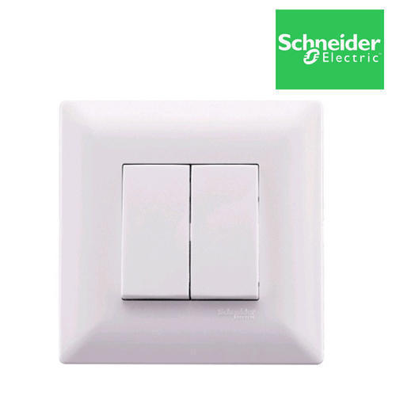|Schneider|Interruptor doble||||
||Schneider|Sensor de puerta / ventana más inteligente|Ouverture||[Documentación](https://download.schneider-electric.com/files?p_enDocType=User+guide&p_File_Name=MFR1569800.pdf&p_Doc_Ref=MFR1569800) |
|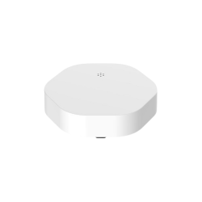|Schneider|Sensor de fugas de agua más inteligente|Fuite|||
|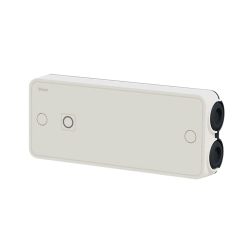|Schneider|Actuador de calentador eléctrico más sabio|||[Comprar](https://www.domadoo.fr/fr/chauffage-clim/5498-schneider-electric-actionneur-pour-radiateur-electrique-fil-pilote-zigbee-30-wiser-3606481914705.html)|
||Schneider|Controlador de empuje conectado Zigbee 3.0 ODACE MÁS SABIO|Interruptor, atenuador||[Documentación](https://download.schneider-electric.com/files?p_enDocType=Instruction+sheet&p_File_Name=S5x0522W_HW.pdf&p_Doc_Ref=S5x0522W_HW) [Comprar](https://www.domadoo.fr/fr/peripheriques/5716-schneider-electric-interrupteur-sans-fil-sans-pile-pour-eclairage-odace-sfsp-3606481019561.html)|
||Schneider|Interruptor de persiana enrollable conectado Zigbee 3.0 ODACE MÁS SABIO|Interruptor, Persianas||[Documentación](https://download.schneider-electric.com/files?p_enDocType=Instruction+sheet&p_File_Name=S5x0567W_HW.pdf&p_Doc_Ref=S5x0567W_HW) [Comprar](https://www.domadoo.fr/fr/peripheriques/5723-schneider-electric-interrupteur-volet-roulant-connecte-zigbee-30-wiser-odace-blanc-3606481019585.html)|
||Schneider|INTERRUPTOR CONECTADO ZIGBEE 3.0 ODACE MÁS SABIO|||[Documentación](https://download.schneider-electric.com/files?p_enDocType=Instruction+sheet&p_File_Name=S5x0530W_HW.pdf&p_Doc_Ref=S5x0530W_HW) [Comprar](https://www.domadoo.fr/fr/peripheriques/5719-schneider-electric-interrupteur-connecte-zigbee-30-wiser-odace-blanc-3606481019578.html)|
|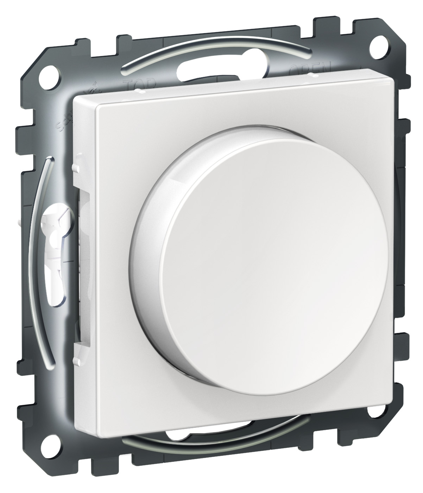|Schneider|Regulador giratorio Wiser Exxact|Variateur|||
||Schneider|Módulo micro dimmer más sabio|Variateur|||
|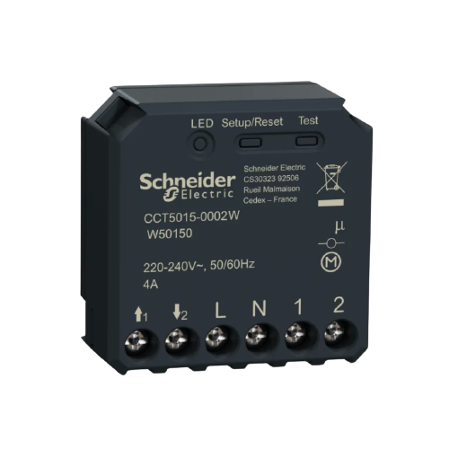|Schneider|Módulo conectado para persianas enrollables|Volets||[Documentación](https://download.schneider-electric.com/files?p_enDocType=Instruction+sheet&p_File_Name=CCT5xx5-xxx2_2W_HW.pdf&p_Doc_Ref=CCT5xx5-xxx2_2W_HW) [Comprar](https://www.domadoo.fr/fr/peripheriques/5724-schneider-electric-micromodule-volet-roulant-connecte-zigbee-30-wiser-3606481048189.html)|
||Schneider|Módulo de interruptor de encendido / apagado más sabio|Interrupteur|||
||Schneider|Módulo de interruptor de encendido / apagado de segunda edición más sabio|Interrupteur|||
||Schneider|Termostato de ambiente conectado más sabio|Termostato, Calefacción|Módulo no recomendado, parece ser muy complicado de operar y requiere todo el ecosistema de Schneider|[Comprar](https://www.domadoo.fr/fr/thermostats/5496-schneider-electric-thermostat-d-ambiance-connecte-zigbee-30-wiser-3606489710194.html)|
||Schneider|Cabezal de válvula termostático conectado más sabio|Cabezal termostático, Calefacción||[Comprar](https://www.domadoo.fr/fr/tetes-thermostatiques/5497-schneider-electric-tete-de-vanne-thermostatique-connectee-zigbee-30-wiser-3606489582821.html)|

# Sonoff

|Image|Marque|Nom|Type|Remarque|Lien|
|---|---|---|---|---|---|
|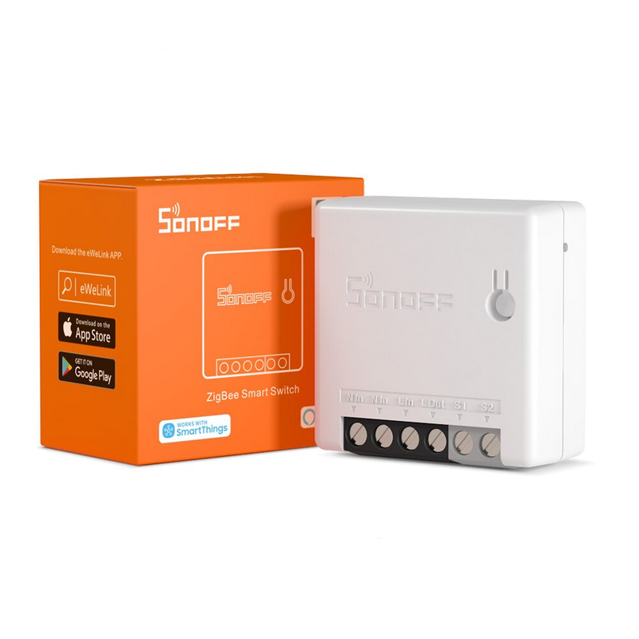|Sonoff|Interruptor de micromódulo conectado|Contactor, Luz||[Comprar](https://www.domadoo.fr/fr/peripheriques/5375-sonoff-micromodule-commutateur-connecte-zigbee.html)|
|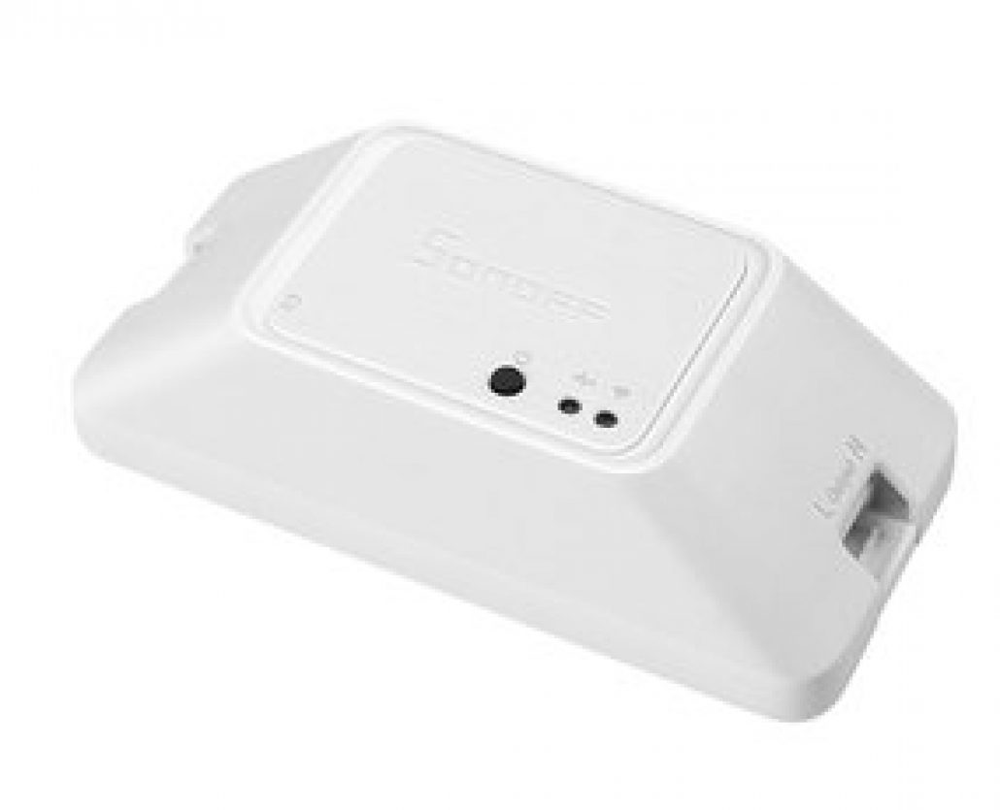|Sonoff|Interruptor de micromódulo 10A|Contacteur||[Documentación](http://dl.itead.cc/basiczbr3/BASICZBR3-user-manual-V-1-1.pdf) [Comprar](https://www.domadoo.fr/fr/peripheriques/5258-sonoff-module-commutateur-10a-zigbee-30.html)|
|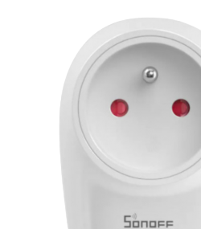|Sonoff|16A ENCHUFE INTELIGENTE|Prise||[Comprar](https://www.domadoo.fr/fr/peripheriques/5880-sonoff-prise-intelligente-16a-zigbee-30-version-fr.html)|
||Sonoff|Sensor de apertura de puerta / ventana|Sensor, apertura|Atención, hay un error en el firmware que hace que suba como módulo de temperatura y humedad, por lo tanto, después de la inclusión, es necesario restablecer el modelo correcto y quitar los controles de temperatura y humedad|[Documentación](http://dl.itead.cc/SNZB-04/Instructions/SNZB-04_V1.0_User_manual_20201116.pdf) [Comprar](https://www.domadoo.fr/fr/peripheriques/5320-sonoff-capteur-d-ouverture-de-portefenetre-zigbee.html)|
||Sonoff|Sensor de apertura de puerta / ventana|Sensor, apertura||[Documentación](http://dl.itead.cc/SNZB-04/Instructions/SNZB-04_V1.0_User_manual_20201116.pdf) [Comprar](https://www.domadoo.fr/fr/peripheriques/5320-sonoff-capteur-d-ouverture-de-portefenetre-zigbee.html)|
|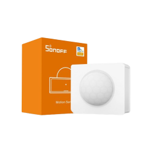|Sonoff|Detector de movimiento inteligente|Sensor, movimiento||[Documentación](http://dl.itead.cc/SNZB-03/Instructions/SNZB-03_V1.0_User_manual_20201116.pdf) [Comprar](https://www.domadoo.fr/fr/peripheriques/5261-sonoff-detecteur-de-mouvement-zigbee-30.html)|
||Sonoff|Sensor de temperatura y humedad|Sensor, humedad, temperatura||[Documentación](http://dl.itead.cc/SNZB-02/Instructions/SNZB-02_V1.0_User_manual_20201116.pdf) [Comprar](https://www.domadoo.fr/fr/peripheriques/5260-sonoff-capteur-de-temperature-et-d-humidite-zigbee-30.html)|
|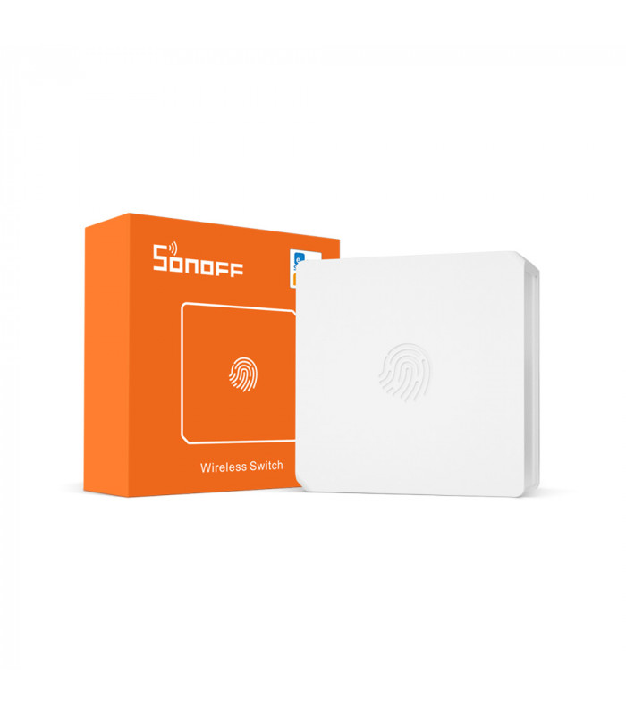|Sonoff|Interruptor de conexión inalámbrica|Interruptor, control remoto||[Documentación](http://dl.itead.cc/SNZB-01/Instructions/SNZB-01_V1.0_User_manual_20201116.pdf) [Comprar](https://www.domadoo.fr/fr/peripheriques/5259-sonoff-interrupteur-sans-fil-zigbee-30.html)|

# Sunricher

|Image|Marque|Nom|Type|Remarque|Lien|
|---|---|---|---|---|---|
|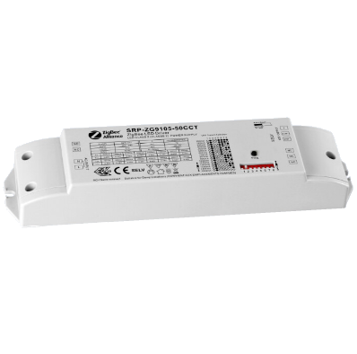|Sunricher|Iluminación CCT Sunricher||||
|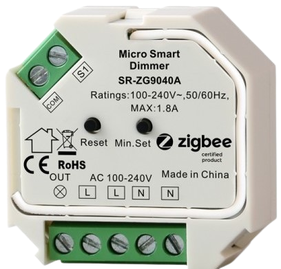|Sunricher|Módulo atenuador de 2 hilos|Atenuador, luz, potencia, medición||[Comprar](https://www.domadoo.fr/fr/peripheriques/5244-sunricher-module-variateur-2-fils-zigbee-30.html)|
||Sunricher|Regulador de intensidad giratorio|Atenuador, luz, potencia, medición||[Comprar](https://www.domadoo.fr/fr/peripheriques/5736-sunricher-interrupteur-variateur-rotatif-500w-zigbee-dimmer.html)|
|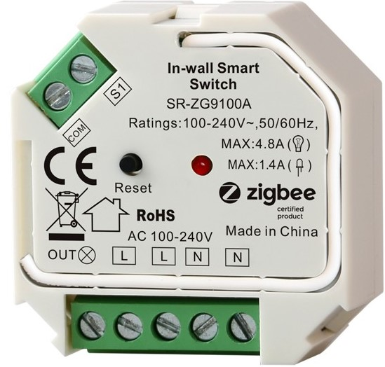|Sunricher|Módulo de encendido / apagado|Contactor, Luz||[Comprar](https://www.domadoo.fr/fr/peripheriques/5242-sunricher-module-onoff-zigbee-30.html)|
|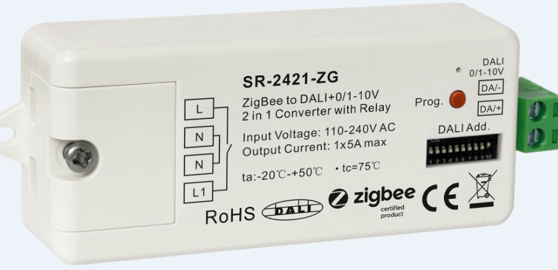|Sunricher|Sunricher Dali||||
|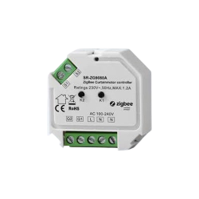|Sunricher|Módulo de persiana enrollable|Obturador, Tienda||[Comprar](https://www.domadoo.fr/fr/peripheriques/5245-sunricher-module-volet-roulant-zigbee-30.html)|
||Sunricher|Controlador LED 4 en 1 RGBW|Luz, RGBW, Atenuador||[Comprar](https://www.domadoo.fr/fr/peripheriques/5248-sunricher-controleur-led-rgbw-4-en-1-zigbee-30.html)|
||Sunricher|CONTROLADOR DE PARED INALÁMBRICO DE 4 BOTONES|||[Comprar](https://www.domadoo.fr/fr/peripheriques/5738-sunricher-controleur-mural-sans-fil-4-boutons-2-zones-zigbee.html)|
||Sunricher|CONTROLADOR DE PARED INALÁMBRICO DE 8 BOTONES|||[Comprar](https://www.domadoo.fr/fr/peripheriques/5739-sunricher-controleur-mural-sans-fil-8-boutons-4-zones-zigbee.html)|
|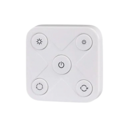|Sunricher|Sunricher RGB CCT Sun 3 en 1||||
||Sunricher|Mando a distancia 3 en 1|Control remoto||[Comprar](https://www.domadoo.fr/fr/peripheriques/5247-sunricher-telecommande-3-en-1-zigbee-30.html)|
|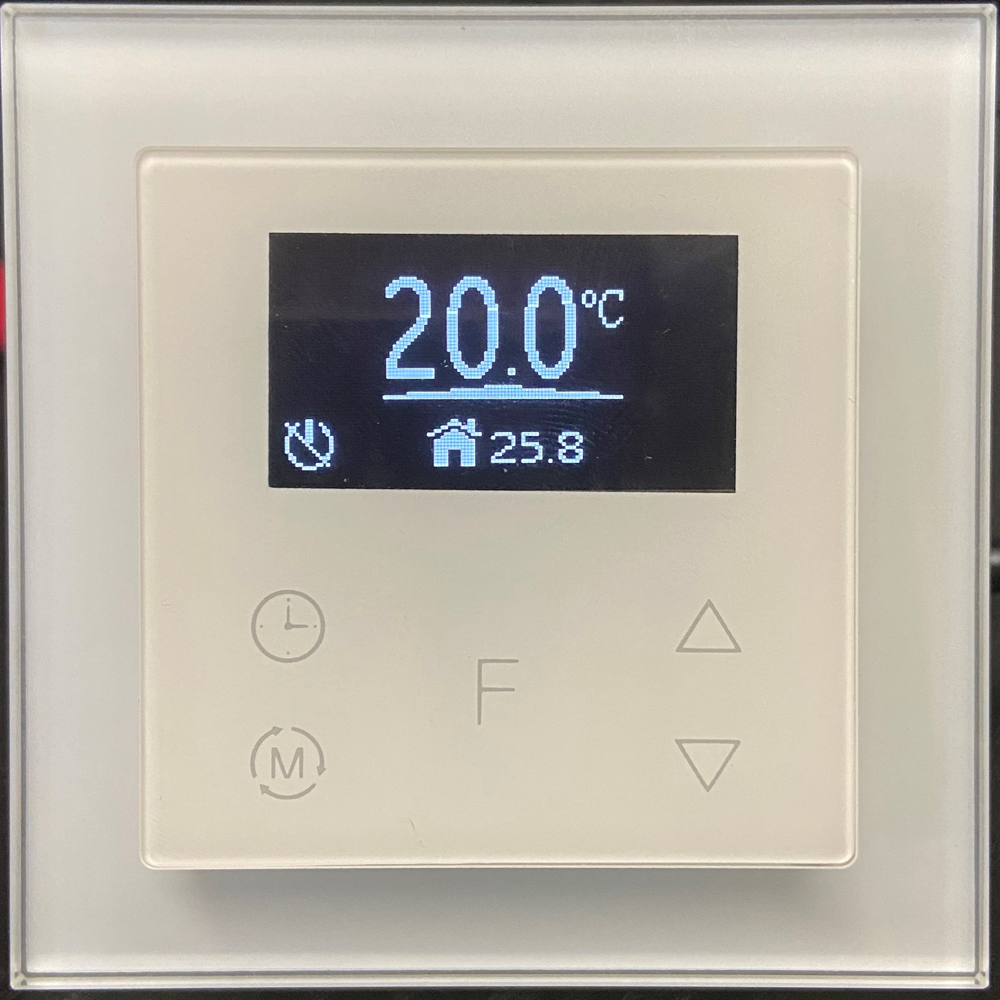|Sunricher|Termostato Sunricher||||
|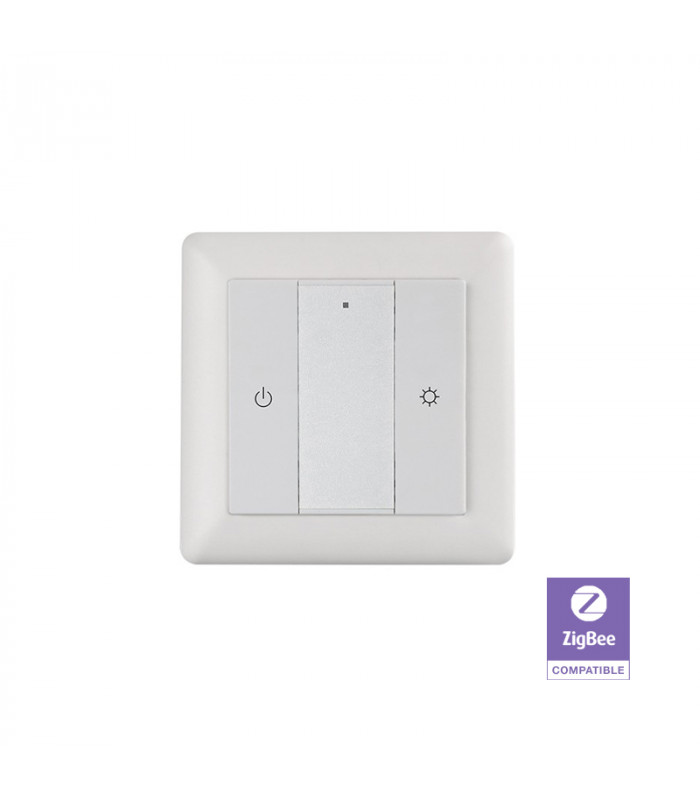|Sunricher|CONTROLADOR DE PARED INALÁMBRICO DE 2 BOTONES|||[Comprar](https://www.domadoo.fr/fr/peripheriques/5737-sunricher-controleur-mural-sans-fil-2-boutons-1-zone-zigbee.html)|
||Sunricher|Mando a distancia de 4 zonas|Control remoto||[Comprar](https://www.domadoo.fr/fr/peripheriques/5246-sunricher-telecommande-4-zones-zigbee-30.html)|

# Tryo2sys

|Image|Marque|Nom|Type|Remarque|Lien|
|---|---|---|---|---|---|
|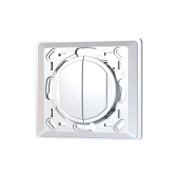|Tryo2sys|PTM 215 ZE||||

# Tuya

|Image|Marque|Nom|Type|Remarque|Lien|
|---|---|---|---|---|---|
|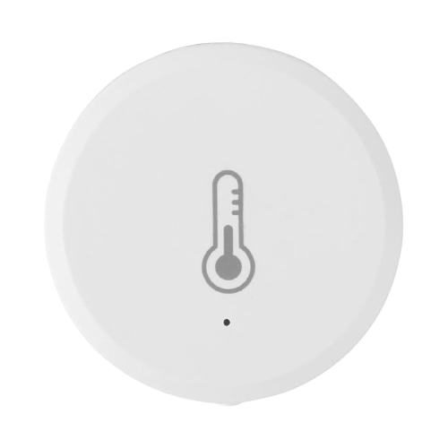|Tuya|Sensor de temperatura y humedad||||
||Tuya|Sensor inteligente de apertura de puertas o ventanas||||
||Tuya|Detector de movimiento inteligente||||
||Tuya|Sensor de vibración||||
||Tuya|TUYA - Sensor de luz|||[Comprar](https://fr.aliexpress.com/item/1005002117427752.html?spm=a2g0s.9042311.0.0.22206c37vgJYy8)|
|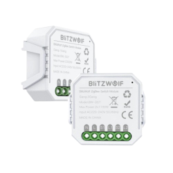|Tuya|Interruptor ON / OFF 2300W 1 canal||||
|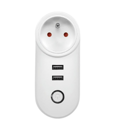|Tuya|Enchufe inteligente de ENCENDIDO / APAGADO y 2 puertos USB||||
|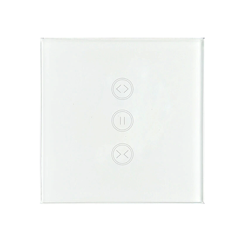|Tuya|Interruptor conectado para persiana enrollable||||
||Tuya|Mini sensor de movimiento||||
|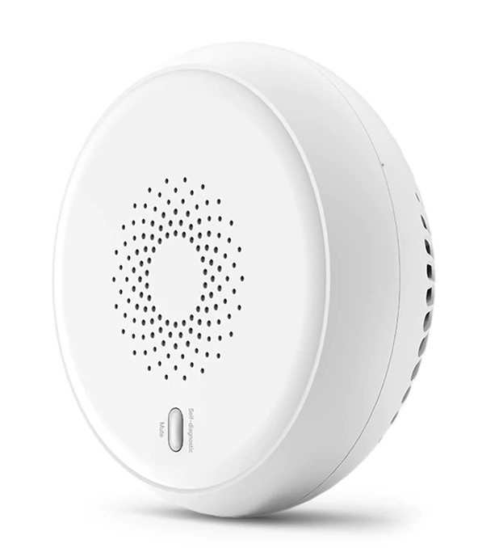|Tuya|Detector de humo||||
|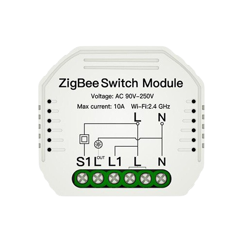|Tuya|Interruptor inteligente de ENCENDIDO / APAGADO||||
||Tuya|Detector de movimiento||||
||Tuya|Temperatura, brillo, humedad con pantalla||||
||Tuya|Interruptor triple||||
||Tuya|Interruptor de la puerta|Ouverture|||
||Tuya|Tuya Zigbee - Interruptor 16A||||
||Tuya|Interruptor inteligente de carga única||||
|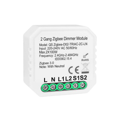|Tuya|MicroMódulo de luz Tuya ZigBee 3.0 doble atenuador||||
|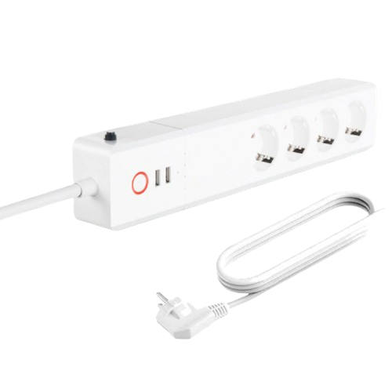|Tuya|USEELINK - Regleta conectada 4 enchufes y 2 puertos USB|||[Comprar](https://www.domadoo.fr/fr/peripheriques/5489-useelink-multiprise-connectee-16a-zigbee-ha-4-prises-2-ports-usb.html)|
||Tuya|Interruptor doble||||
|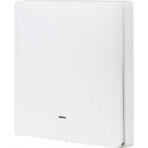|Tuya|Interruptor inteligente de carga única||||
||Tuya|Sensor inteligente de apertura de puertas o ventanas||||
|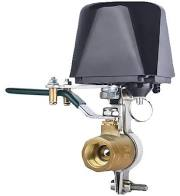|Tuya|Válvula de agua / gas||||
|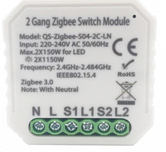|Tuya|Interruptor ON / OFF 2300W 2 canales||||
|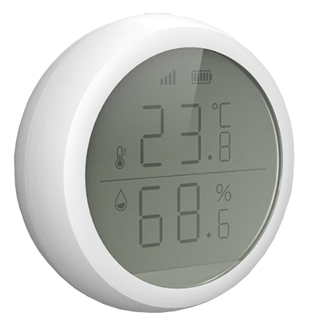|Tuya|Sensor de temperatura y humedad con display||||
||Tuya|MOES - Módulo de persiana enrollable Zigbee + RF|Volets|||
||Tuya|Controlador LED||||
||Tuya|Mando a distancia SOS||||
|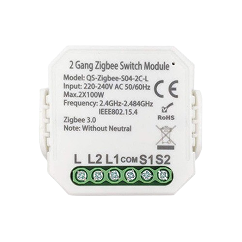|Tuya|Micromódulo doble sin neutro||||
||Tuya|Interruptor de 1 botón conectado|||[Comprar](https://www.domadoo.fr/fr/domotique/5785-moes-interrupteur-intelligent-sans-fil-zigbee-1-bouton.html)|
|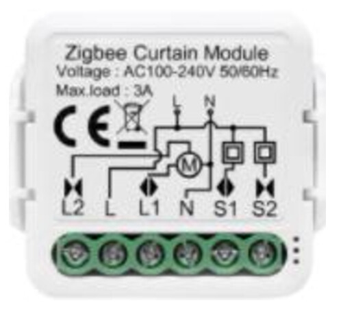|Tuya|Módulo inteligente para persiana enrollable (3)||||
||Tuya|Controlador de tira de LED||||
|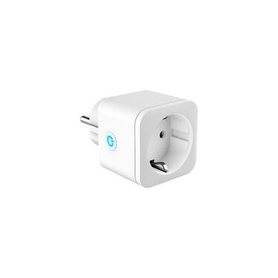|Tuya|Toma QONTROLS 16A con medición de consumos||||
|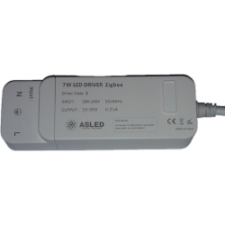|Tuya|Controlador LED||||
|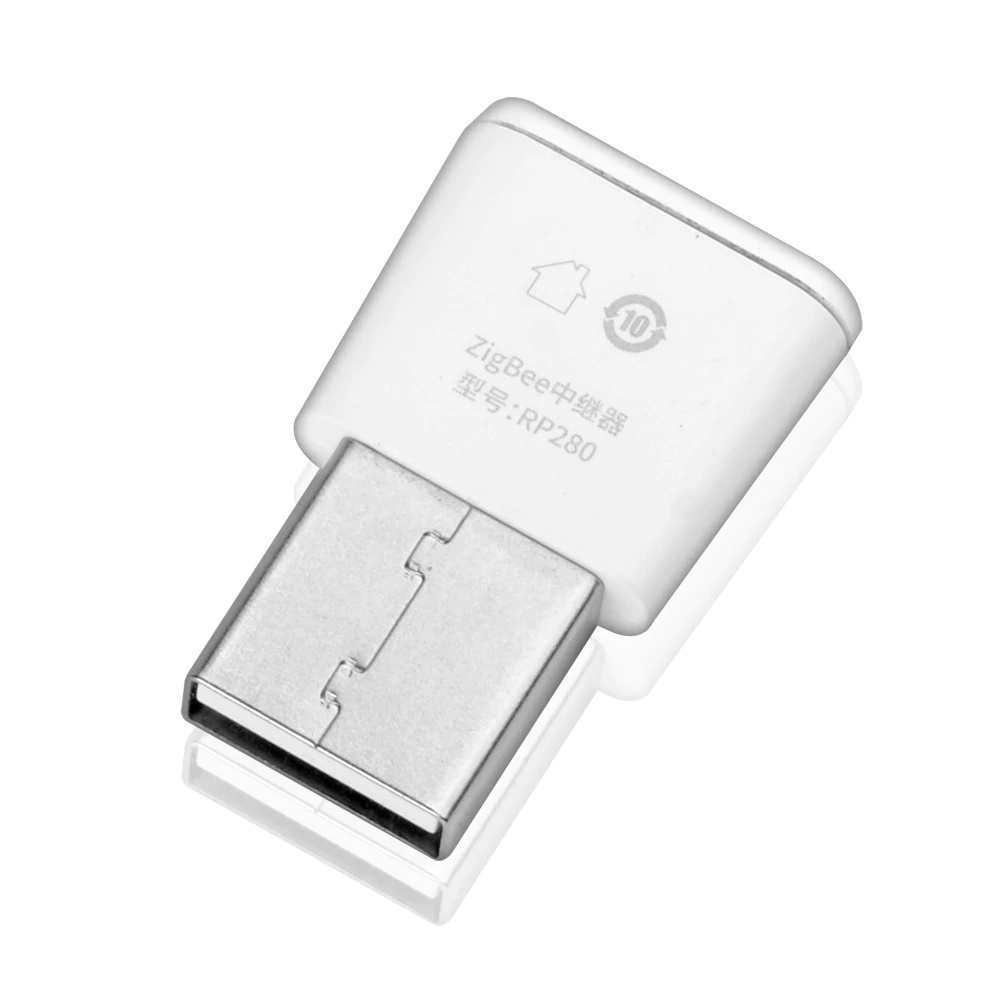|Tuya|Reloj de repetición||||
||Tuya|Interruptor conectado para cortina conectada||||
|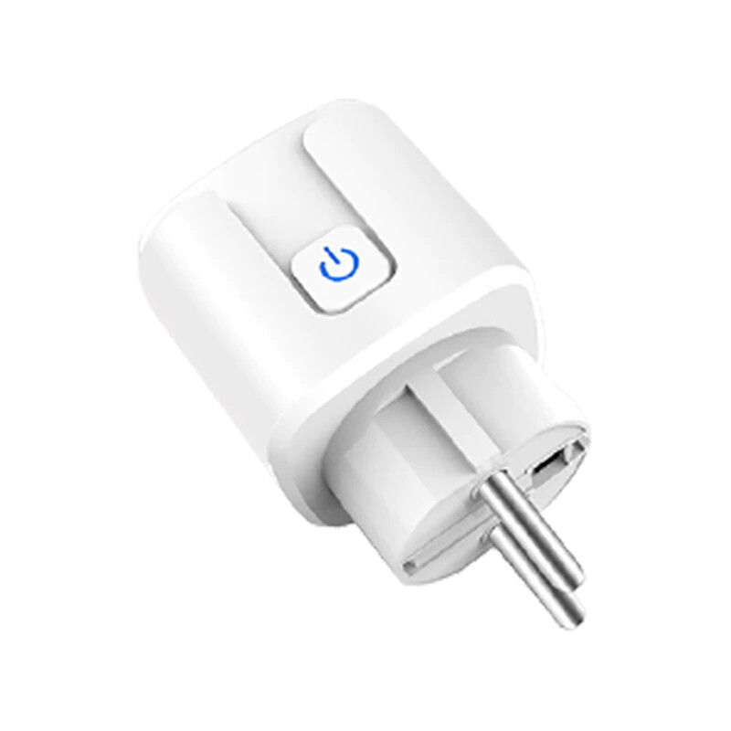|Tuya|Toma conectada|Zócalo, medidor, potencia, repetidor|||
|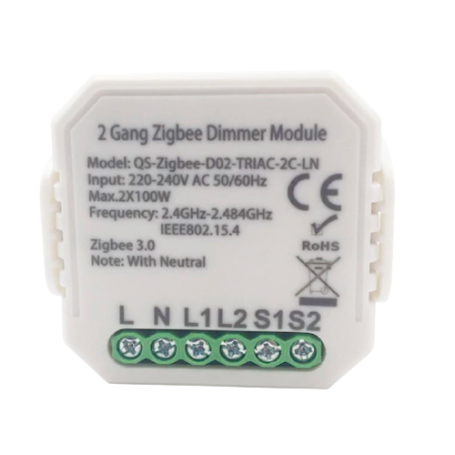|Tuya|Atenuador 2 voces||||
||Tuya|Interruptor conectado de 3 botones||||
|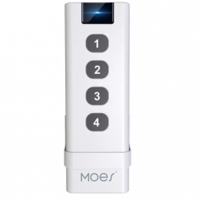|Tuya|Control remoto de escena 4 botones||||
|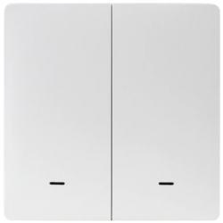|Tuya|Interruptor doble inteligente||||
||Tuya|Regleta de alimentación 16A 4000W 4AC + 2USB|Toma, Consumo, Potencia, Repetidor||[Comprar](https://fr.aliexpress.com/item/1005001408157771.html)|
|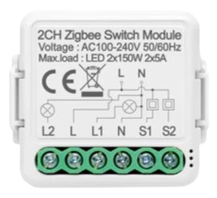|Tuya|Tuya Zigbee - Interruptor de 2 vías||||
|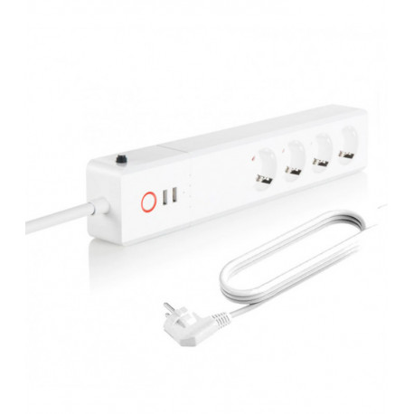|Tuya|Regleta conectada 4 enchufes y 2 puertos USB (2)||||
||Tuya|Toma conectada|Zócalo, medidor, potencia, repetidor|||
||Tuya|Toma conectada + USB|Prise||[Comprar](https://www.domadoo.fr/fr/prises-connectees/5840-moes-prise-connectee-zigbee-30-2-ports-usb-pilotables-version-schuko.html)|
|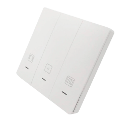|Tuya|Interruptor conectado para cortina conectada||||
||Tuya|Interruptor conectado 2 botones|||[Comprar](https://www.domadoo.fr/fr/domotique/5786-moes-interrupteur-intelligent-sans-fil-zigbee-2-boutons.html)|
|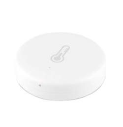|Tuya|Temperatura, humedad||||
||Tuya|Sensor de apertura|Ouverture|||
||Tuya|Interruptor ON / OFF 2300W 1 canal||||
||Tuya|Módulo de persiana enrollable inteligente (2)||||
|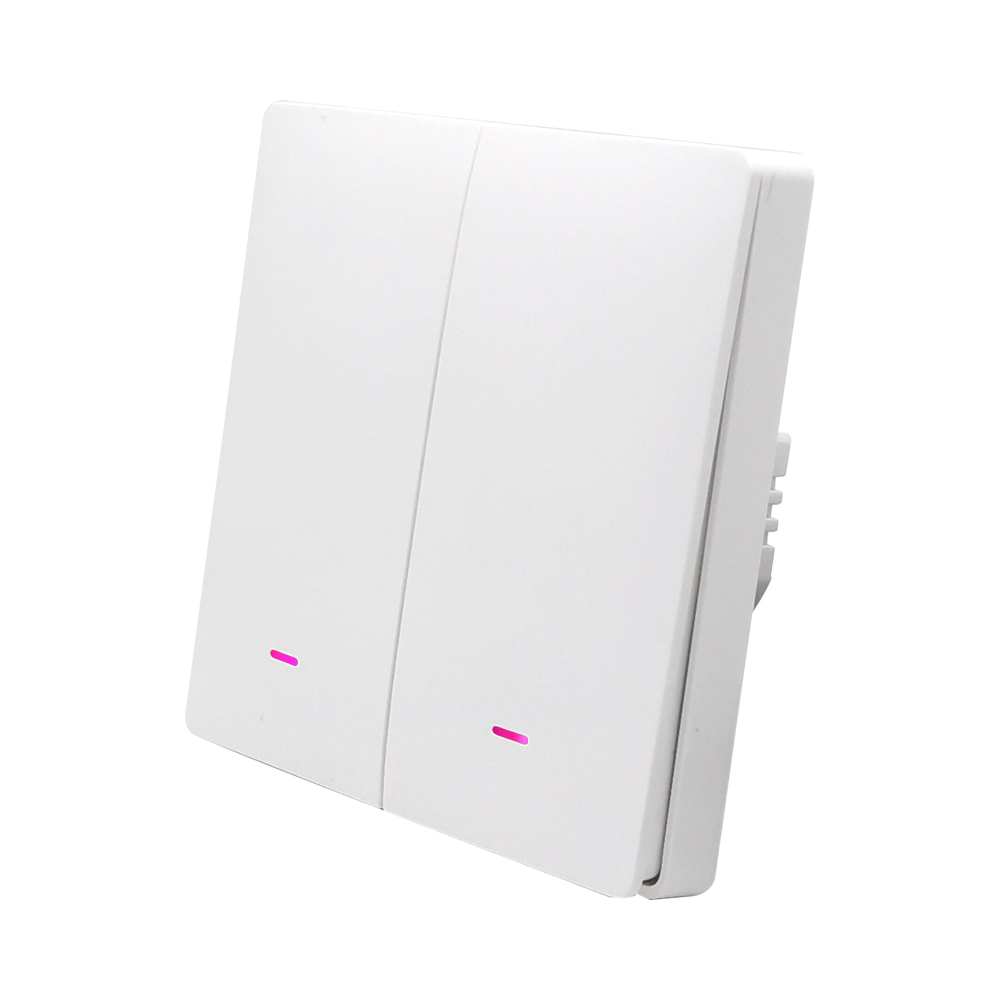|Tuya|Interruptor doble||||
||Tuya|BLITZWOLF - Enchufe inteligente EU 16A||||
|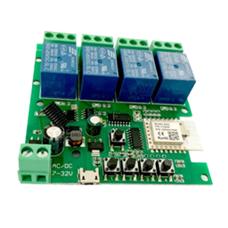|Tuya|Interruptor triple||||
||Tuya|Gigier JR-ZDS01||||
||Tuya|Mini controlador de tira de LED RGB||||
|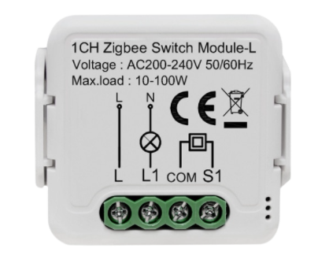|Tuya|Interruptor de módulo ON / OFF 10A|Toma, Consumo, Potencia, Repetidor||[Comprar](https://fr.aliexpress.com/item/1005003438720832.html)|
|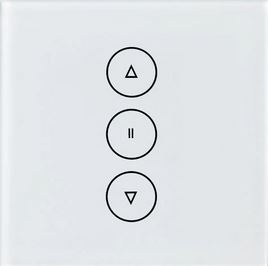|Tuya|Interruptor de persiana enrollable||||
||Tuya|Tuya Zigbee - Interruptor de 4 vías||||
|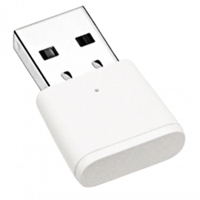|Tuya|Extensor de alcance||||
||Tuya|Micromódulo Zigbee 3.0 SKTE||||
||Tuya|Enchufe conectado simple ON / OFF|Zócalo, repetidor||[Comprar](https://fr.aliexpress.com/item/1005002761118194.html)|
||Tuya|Mini SMART - Módulo único conectado ENCENDIDO / APAGADO 16A|||[Comprar](https://fr.aliexpress.com/item/1005003167278697.html)|
|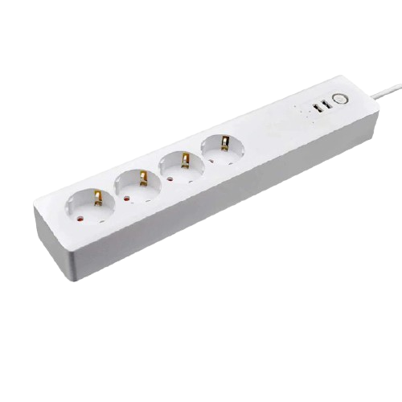|Tuya|Regleta de enchufes conectada 4 enchufes y 2 puertos USB||||
||Tuya|Tuya Zigbee - Controlador de válvula||||
||Tuya|Tuya Zigbee - Interruptor de 3 vías||||
|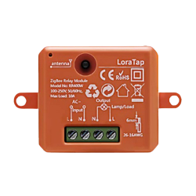|Tuya|Módulo conectado dual ON / OFF||||
|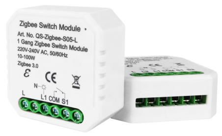|Tuya|Módulo conectado simple ON / OFF sin neutro||||
|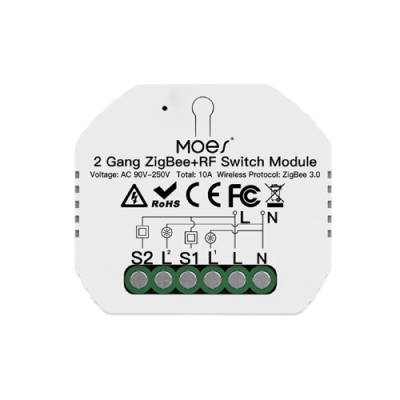|Tuya|MOES - Módulo conectado dual ON / OFF||||
||Tuya|Sensor de temperatura, humedad y luz con display||||
||Tuya|Detector de inundaciones|Fuite|||
||Tuya|Controlador de tira de LED RGBCCT||||
||Tuya|Interruptor inteligente de carga única||||
||Tuya|Interruptor triple inteligente||||
||Tuya|Toma con 2 puertos usb||||
|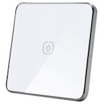|Tuya|Interruptor único inteligente||||
|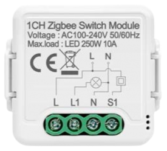|Tuya|Tuya Zigbee - Interruptor de 1 vía||||
||Tuya|SMART - Módulo conectado simple ON / OFF||||
||Tuya|Controlador de tira de LED RGBW||||
||Tuya|Módulo de persiana enrollable inteligente||||
|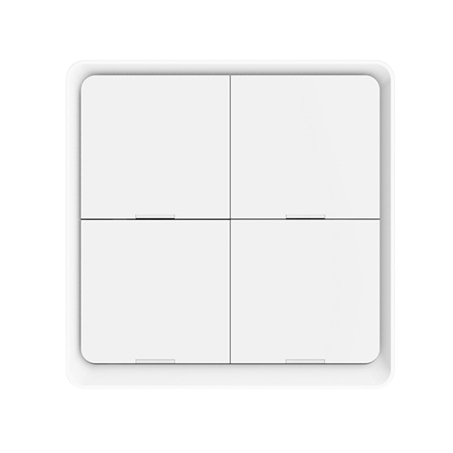|Tuya|Interruptor inteligente de 4 botones con baterías||||
||Tuya|Enchufe de conexión única ON / OFF 16A|Toma, Consumo, Potencia, Repetidor||[Comprar](https://fr.aliexpress.com/item/1005003444957152.html)|
||Tuya|Interruptor conectado de 3 botones|||[Comprar](https://www.domadoo.fr/fr/domotique/5787-moes-interrupteur-intelligent-sans-fil-zigbee-3-boutons.html)|
|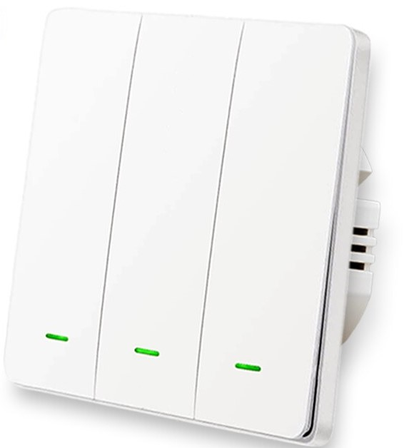|Tuya|Interruptor triple||||
|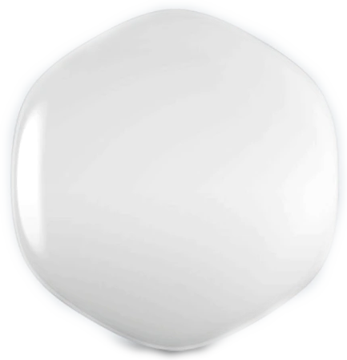|Tuya|Detector de inundaciones (2)|Fuite|||
|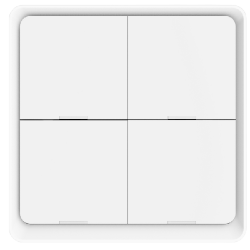|Tuya|Interruptor inteligente de 4 botones con baterías||||
||Doowifi|CONTROL DE PERSIANAS ZIGBEE DWF-0205ZB-PN-2|Volets|||
||Tuya|MOES - Módulo único conectado ON / OFF||||
||Tuya|Bombilla led 3.0, RGB+WW+CW E27||||
||Tuya|Interruptor conectado de 3 botones||||
|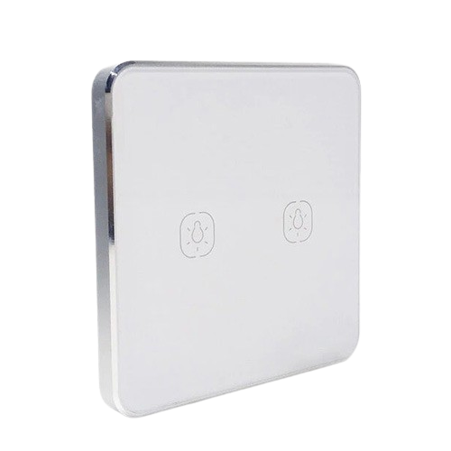|Tuya|Interruptor conectado 2 botones||||
||Tuya|Calidad del aire Tuya CO||||
|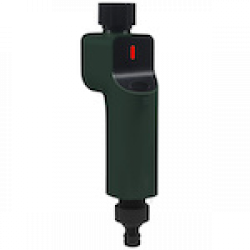|Tuya|Válvula de riego||Por el momento, es imposible controlar el temporizador correctamente, cuando está configurado en Encendido, la válvula permanece abierta durante 10 minutos y luego se apaga||
|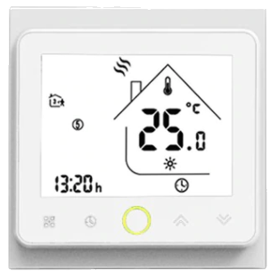|Tuya|Termostato inteligente||||
||Moes|MOES - Cabezal termostático inteligente (3)|||[Comprar](https://www.domadoo.fr/fr/tetes-thermostatiques/5783-moes-tete-thermostatique-intelligente-zigbee-30-blanc.html)|
|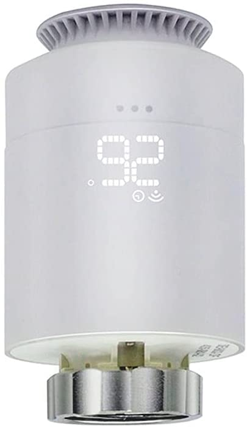|Tuya|Termostato inteligente||||
||Moes|MOES - Cabezal termostático inteligente||||
|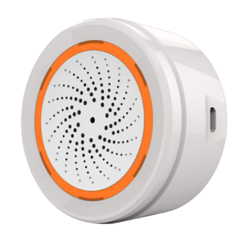|Tuya|Sirena inteligente con sensor de temperatura y humedad||||
|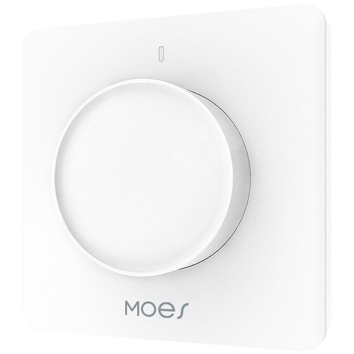|Tuya|MOES - Termostato inteligente||||
||Tuya|MOES - Termostato inteligente||||
||Tuya|Sensor de gas||||
||Tuya|MOES - Módulo regulador simple||||
||Tuya|Rodillo de cadena motorizado inteligente|Volets|||
|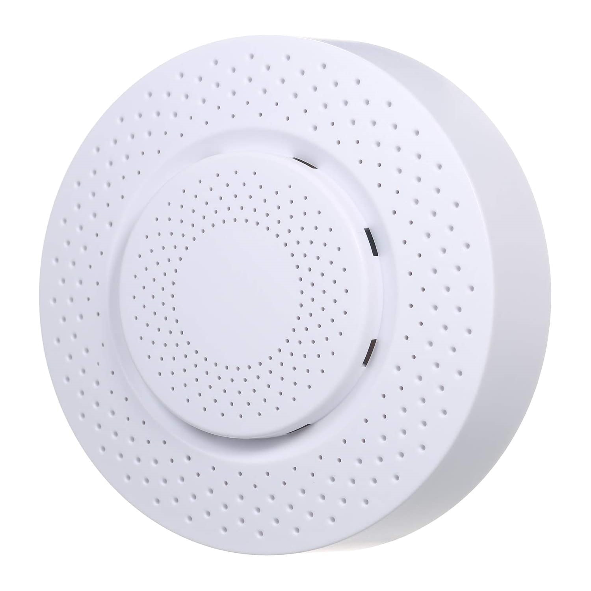|Tuya|Calidad del aire Tuya||||
||Moes|MOES - Cabezal termostático inteligente (2)||||
||Tuya|Sensor de movimiento Zigbee||||

# Woox

|Image|Marque|Nom|Type|Remarque|Lien|
|---|---|---|---|---|---|
||Woox|Detector de movimiento inteligente||||
||Woox|Sirena inteligente con LED|Sirena||[Comprar](https://www.domadoo.fr/fr/peripheriques/5682-woox-sirene-interieure-intelligente-zigbee-30-8435606701105.html)|
||Woox|Detector inteligente de apertura de puertas o ventanas||||
|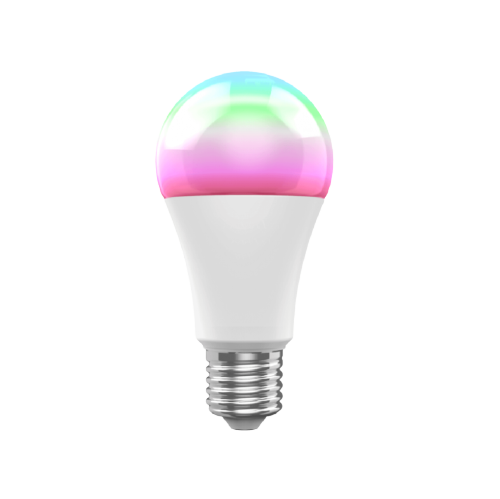|Woox|Bombilla LED E27 conectada - RGB + CCT|||[Comprar](https://www.domadoo.fr/fr/peripheriques/5680-woox-ampoule-connectee-zigbee-e27-rgb-cct-compatible-amazon-alexa-et-google-assistant-8435606703581.html)|
|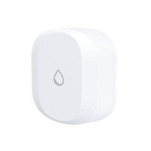|Woox|Detector de inundaciones inteligente||||
|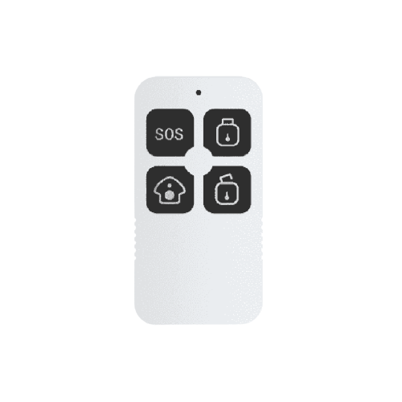|Woox|SOS de 4 botones / Armar / Desarmar / Control remoto doméstico|Control remoto||[Comprar](https://www.domadoo.fr/fr/peripheriques/5684-woox-telecommande-intelligente-4-boutons-zigbee-30-8435606701136.html)|
||Woox|Botón SOS|Botón, control remoto||[Comprar](https://www.domadoo.fr/fr/peripheriques/5683-woox-bouton-d-urgence-sos-zigbee-30-8435606701112.html)|
||Woox|Controlador inteligente de rociadores para exteriores ON / OFF |Aspersor, válvula||[Comprar](https://www.domadoo.fr/fr/peripheriques/5685-woox-controleur-d-arrosage-intelligent-onoff-zigbee-30-8435606701198.html)|
||Woox|Detector de humo inteligente||||
||Woox|Cabezal termostático inteligente con pantalla|Cabezal termostático|||

# Xiaomi

|Image|Marque|Nom|Type|Remarque|Lien|
|---|---|---|---|---|---|
||Xiaomi|XIAOMI AQARA - Monitor de calidad del aire Zigbee 3.0 (TEMPERATURA, HUMEDAD, TVOC)|Temperatura, humedad, calidad del aire||[Documentación](https://cdn.aqara.com/cdn/website/mainland/static/docs/TVOC-Air-Quality-Monitor_Manual_EN.pdf) [Comprar](https://www.domadoo.fr/fr/peripheriques/5751-xiaomi-aqara-moniteur-de-qualite-d-air-zigbee-30-temp-hum-covt-6970504214644.html)|
||Xiaomi|AQARA - Interruptor simple con neutro||||
|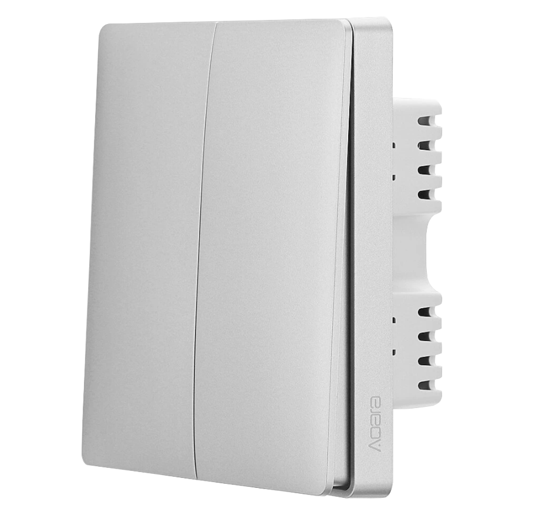|Xiaomi|AQARA - Interruptor doble con neutro||||
||Xiaomi|AQARA - Interruptor simple sin neutro||||
||Xiaomi|AQARA - Doble interruptor sin neutro||||
||Xiaomi|AQARA - Motorización inteligente para persianas enrollables de cadena|||[Comprar](https://www.domadoo.fr/fr/peripheriques/5892-xiaomi-aqara-motorisation-intelligente-pour-store-enrouleur-a-chainette-zigbee-30-rsd-m01-6970504215085.html)|
||Xiaomi|Motor de cortina||||
|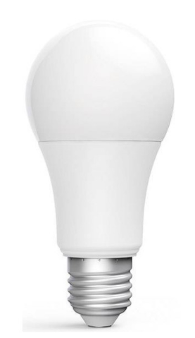|Xiaomi|AQARA - Bombilla LED conectada|||[Comprar](https://www.domadoo.fr/fr/peripheriques/5257-aqara-ampoule-led-zigbee-aqara-blanc-variable-0192784000144.html)|
|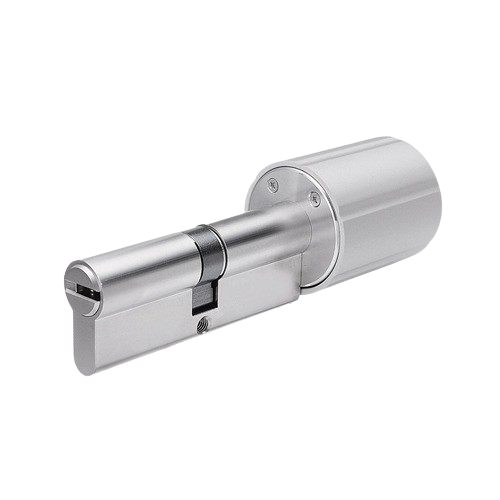|Xiaomi|MIJIA - Cerradura conectada|Serrure|||
||Xiaomi|AQARA - Detector de apertura inteligente (3)|||[Comprar](https://www.domadoo.fr/fr/peripheriques/4514-xiaomi-detecteur-d-ouverture-portefenetre-zigbee-aqara.html)|
|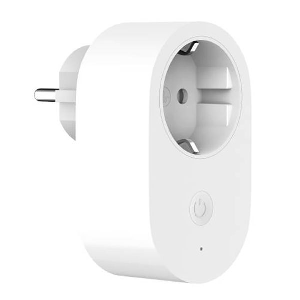|Xiaomi|MI - Enchufe inteligente ENCENDIDO / APAGADO||||
|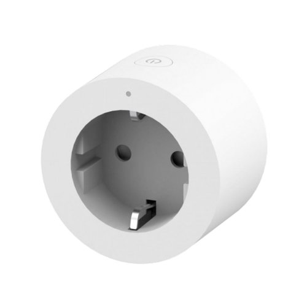|Xiaomi|AQARA - Toma de corriente conectada|||[Comprar](https://www.domadoo.fr/fr/peripheriques/5385-aqara-prise-connectee-zigbee-30-smart-plug-6970504210646.html)|
||Xiaomi|MI - Toma conectada ON / OFF + Medida de consumo|||[Comprar](https://www.domadoo.fr/fr/peripheriques/5305-xiaomi-prise-connectee-zigbee-mi-smart-plug-6934177706493.html)|
|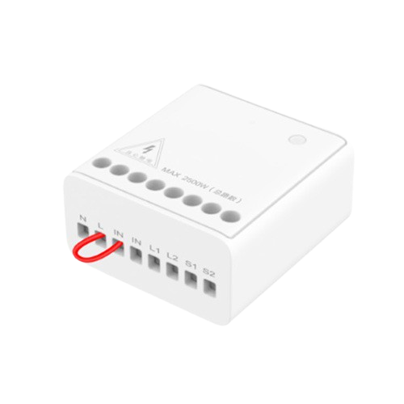|Xiaomi|AQARA - Módulo bidireccional inteligente||||
|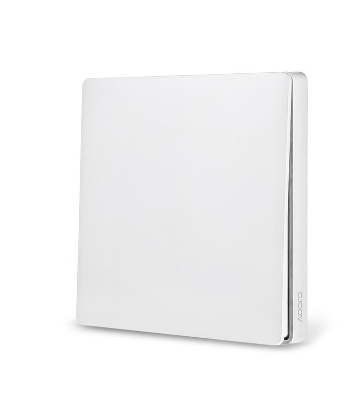|Xiaomi|AQARA - Interruptor único inalámbrico inteligente|||[Comprar](https://www.domadoo.fr/fr/peripheriques/4516-xiaomi-interrupteur-mural-simple-sans-fil-zigbee-aqara-6970504210)|
|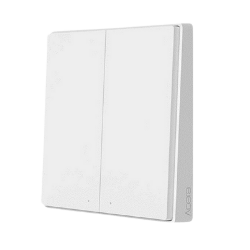|Xiaomi|AQARA - Interruptor único inalámbrico inteligente|||[Comprar](https://www.domadoo.fr/fr/peripheriques/4516-xiaomi-interrupteur-mural-simple-sans-fil-zigbee-aqara-6970504210)|
|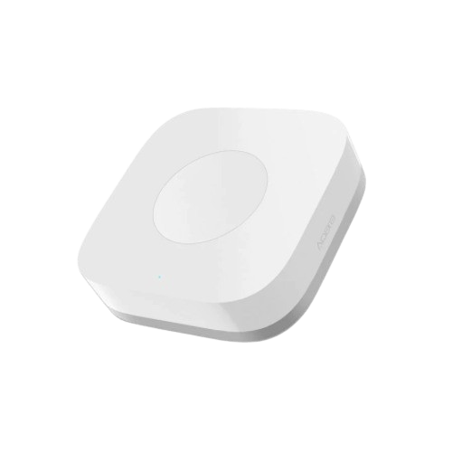|Xiaomi|AQARA - Interruptor inalámbrico inteligente (REV1)|Control remoto, interruptor||[Comprar](https://www.domadoo.fr/fr/peripheriques/4669-aqara-interrupteur-sans-fil-intelligent-zigbee-192784000052.html)|
||Xiaomi|AQARA - Doble interruptor inalámbrico||El módulo es un poco caprichoso tienes que estar muy cerca de la clave|[Comprar](https://www.domadoo.fr/fr/peripheriques/4517-xiaomi-interrupteur-mural-double-sans-fil-zigbee-aqara-6970504210042.html)|
|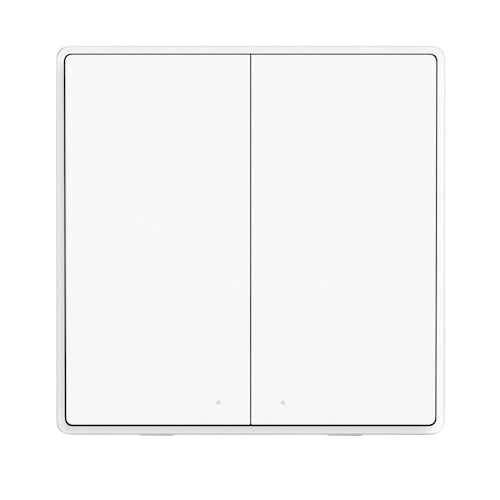|Xiaomi|AQARA - Doble interruptor inalámbrico|||[Comprar](https://www.domadoo.fr/fr/peripheriques/4517-xiaomi-interrupteur-mural-double-sans-fil-zigbee-aqara-6970504210042.html)|
||Xiaomi|AQARA - Interruptor inalámbrico 2||||
|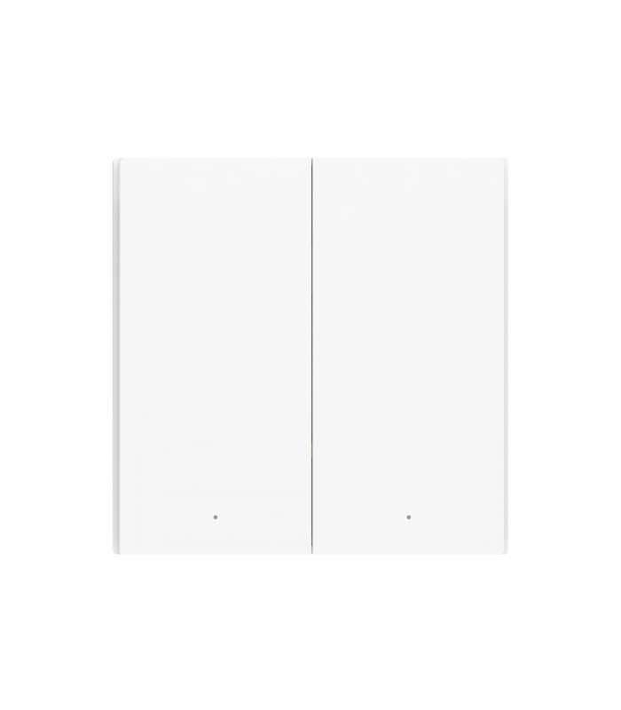|Xiaomi|XIAOMI AQARA - Interruptor de pared doble inalámbrico H1 ZigBee 3.0|Interruptor, control remoto|El módulo no distingue entre clics derecho e izquierdo, por lo que el segundo botón no se puede utilizar|[Documentación](https://cdn.aqara.com/cdn/website/mainland/static/docs/Wireless-Remote-Switch-H1_Manual_EN.pdf) [Comprar](https://www.domadoo.fr/fr/peripheriques/5725-xiaomi-aqara-interrupteur-mural-double-sans-fil-h1-zigbee-30-6970504215023.html)|
||Xiaomi|AQARA - Interruptor inalámbrico 4||||
|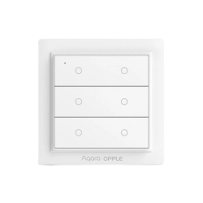|Xiaomi|AQARA - Interruptor inalámbrico inteligente de 6 botones OPPLE||||
||Xiaomi|MI - Sensor de luz|||[Comprar](https://www.domadoo.fr/fr/peripheriques/5486-xiaomi-mi-capteur-de-luminosite-zigbee-30-6934177710865.html)|
|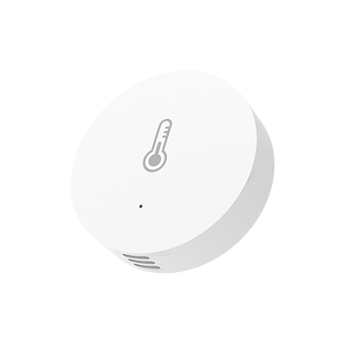|Xiaomi|MIJIA - Sensor de temperatura / humedad||||
|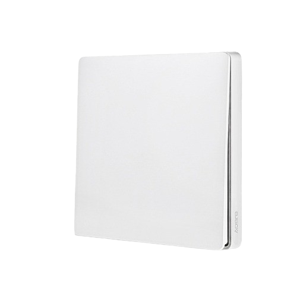|Xiaomi|AQARA - Interruptor único inalámbrico inteligente|||[Comprar](https://www.domadoo.fr/fr/peripheriques/4516-aqara-interrupteur-mural-simple-sans-fil-zigbee-6970504210035.html)|
||Xiaomi|AQARA - Interruptor doble inalámbrico inteligente|||[Comprar](https://www.domadoo.fr/fr/peripheriques/4517-xiaomi-interrupteur-mural-double-sans-fil-zigbee-aqara-6970504210042.html)|
||Xiaomi|AQARA - Controlador inteligente Magic Cube|Mando a distancia, controlador||[Comprar](https://www.domadoo.fr/fr/peripheriques/4668-aqara-controleur-intelligent-magic-cube-zigbee-0192784000045.html)|
|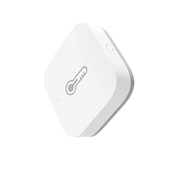|Xiaomi|AQARA - Sensor inteligente de temperatura y humedad|||[Comprar](https://www.domadoo.fr/fr/peripheriques/4515-aqara-capteur-de-temperature-et-d-humidite-zigbee-6970504212510.html)|
|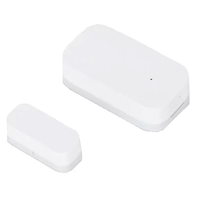|Xiaomi|AQARA - Sensor de apertura inteligente|||[Comprar](https://www.domadoo.fr/fr/peripheriques/4514-xiaomi-detecteur-d-ouverture-portefenetre-zigbee-aqara.html)|
||Xiaomi|MI - Sensor de apertura inteligente||||
||Xiaomi|AQARA - Sensor de movimiento inteligente|||[Comprar](https://www.domadoo.fr/fr/peripheriques/4518-xiaomi-detecteur-de-mouvement-zigbee-aqara-192784000090.html)|
|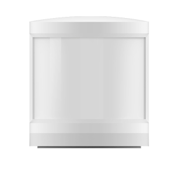|Xiaomi|AQARA - Sensor de movimiento inteligente|||[Comprar](https://www.domadoo.fr/fr/peripheriques/4518-aqara-detecteur-de-mouvement-zigbee-192784000090.html)|
|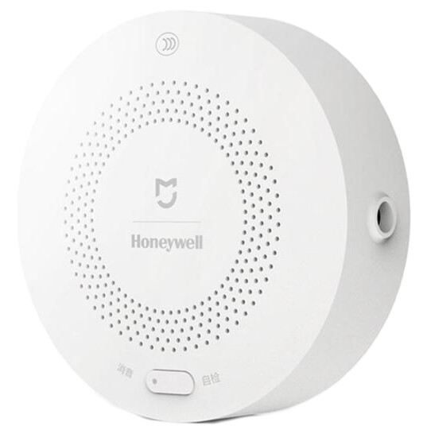|Xiaomi|Alarma de gas Honeywell||||
||Xiaomi|MIJIA - Detector de humo inteligente||||
|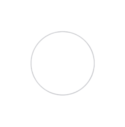|Xiaomi|AQARA - Interruptor inalámbrico inteligente|Control remoto, interruptor|||
|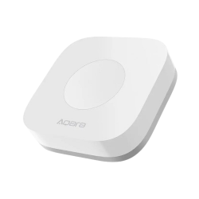|Xiaomi|AQARA - Interruptor inalámbrico inteligente (REV2)|Control remoto, interruptor||[Comprar](https://www.domadoo.fr/fr/peripheriques/4669-aqara-interrupteur-sans-fil-intelligent-zigbee-192784000052.html)|
||Xiaomi|AQARA - Interruptor inalámbrico inteligente (REV3)|Control remoto, interruptor|||
|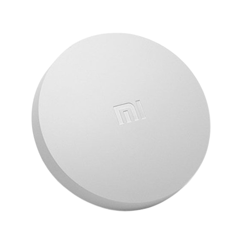|Xiaomi|MIJIA - Interruptor inalámbrico inteligente||||
|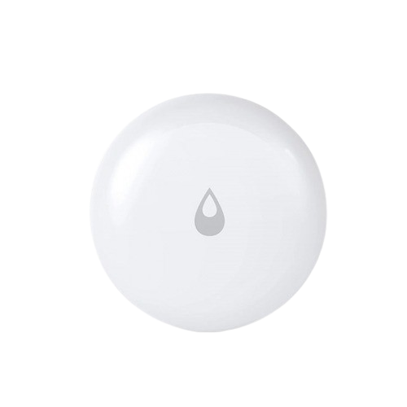|Xiaomi|AQARA - Detector de inundaciones inteligente|||[Comprar](https://www.domadoo.fr/fr/peripheriques/4519-xiaomi-capteur-d-eau-zigbee-aqara-6970504210257.html)|
||Xiaomi|AQARA - Doble interruptor sin neutro||||
|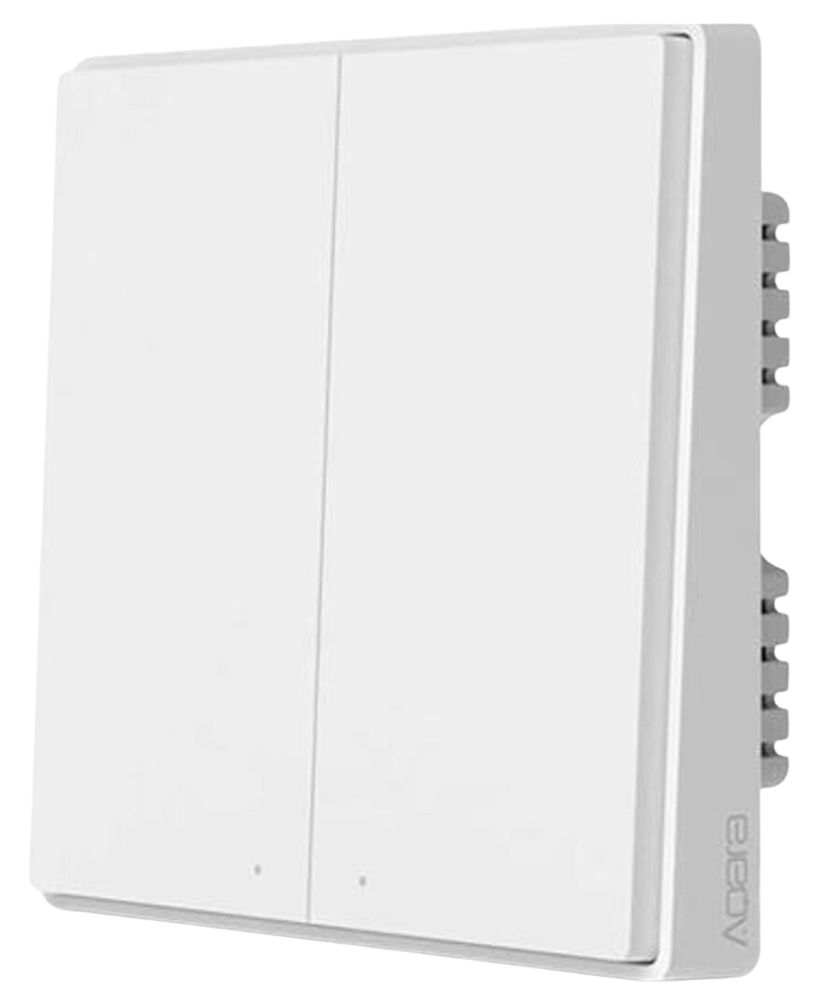|Xiaomi|AQARA - Interruptor de pared inteligente D1||||
||Xiaomi|AQARA - Micromódulo encendido / apagado sin neutro|Contactor, medidor, potencia||[Comprar](https://www.domadoo.fr/fr/peripheriques/5387-aqara-micromodule-onoff-zigbee-30-1250w-sans-neutre-6970504213302.html)|
||Xiaomi|XIAOMI AQARA - Interruptor de pared inteligente H1 ZigBee 3.0 (SIN NEUTRO)|Interruptor, Luz||[Documentación](https://cdn.aqara.com/cdn/website/mainland/static/docs/Smart-Wall-Switch-H1-No-Neutral_Manual_EN.pdf) [Comprar](https://www.domadoo.fr/fr/peripheriques/5726-xiaomi-aqara-interrupteur-mural-intelligent-h1-zigbee-30-sans-neutre-ws-euk01-6970504214774.html)|
||Xiaomi|XIAOMI AQARA - Interruptor de pared doble inteligente H1 ZigBee 3.0 (SIN NEUTRO)|Interruptor, Luz||[Documentación](https://www.aqara.com/userfiles/fileupload/202105/1392376227816738818.pdf) [Comprar](https://www.domadoo.fr/fr/peripheriques/5727-xiaomi-aqara-interrupteur-mural-double-intelligent-h1-zigbee-30-sans-neutre-6970504214781.html)|
|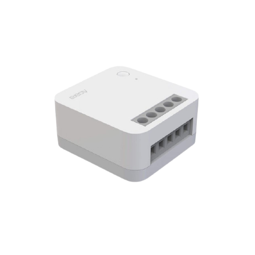|Xiaomi|AQARA - Micromódulo encendido / apagado con neutro|Contactor, medidor, potencia||[Comprar](https://www.domadoo.fr/fr/peripheriques/5386-aqara-micromodule-onoff-zigbee-30-2500w-avec-neutre-6970504213296.html)|
|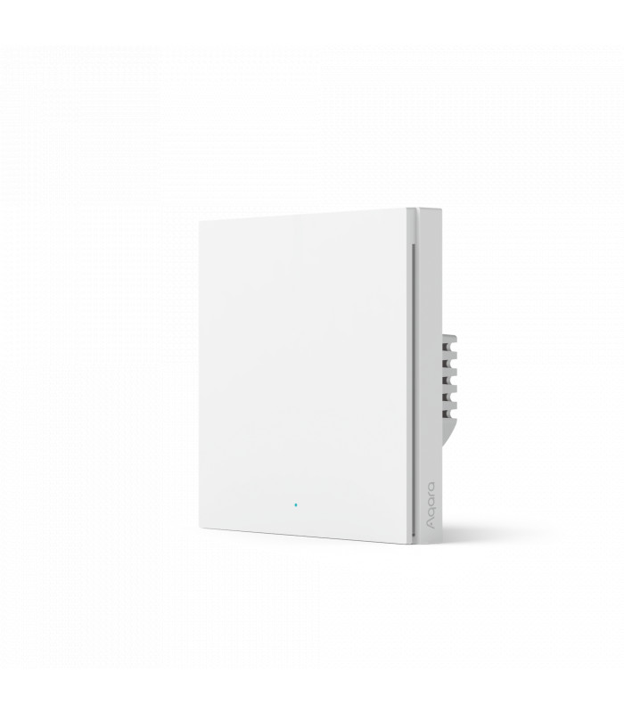|Xiaomi|||||
|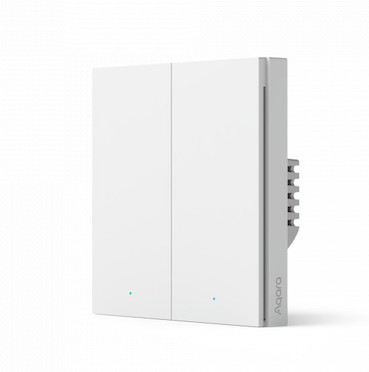|Xiaomi|XIAOMI AQARA - Interruptor de pared doble inteligente H1 ZigBee 3.0 (con neutro) + Medida de consumo|||[Documentación](https://cdn.aqara.com/cdn/website/mainland/static/docs/Smart-Wall-Switch-H1-With-Neutral_Manual_EN.pdf) [Comprar](https://www.domadoo.fr/fr/peripheriques/5729-xiaomi-aqara-interrupteur-mural-double-intelligent-h1-zigbee-30-avec-neutre-ws-euk04-6970504214804.html)|
||Xiaomi|AQARA - Sensor de vibraciones|Detector, puerta, vibración||[Comprar](https://www.domadoo.fr/fr/peripheriques/4667-xiaomi-capteur-de-vibration-zigbee-aqara-192784000113.html)|
|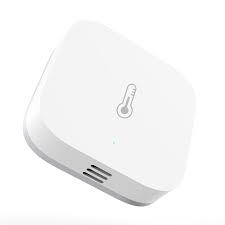|Xiaomi|AQARA - Sensor de temperatura / presión / humedad|||[Comprar](https://www.domadoo.fr/fr/peripheriques/4515-aqara-capteur-de-temperature-et-d-humidite-zigbee-6970504212510.html)|
||Xiaomi|AQARA - Sensor de luz||||
|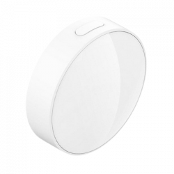|Xiaomi|MI - Sensor de luz|||[Comprar](https://www.domadoo.fr/fr/peripheriques/5486-xiaomi-mi-capteur-de-luminosite-zigbee-30-6934177710865.html)|
||Xiaomi|MI - Toma conectada ON / OFF + Medida de consumo|||[Comprar](https://www.domadoo.fr/fr/peripheriques/5305-xiaomi-prise-connectee-zigbee-mi-smart-plug-6934177706493.html)|
|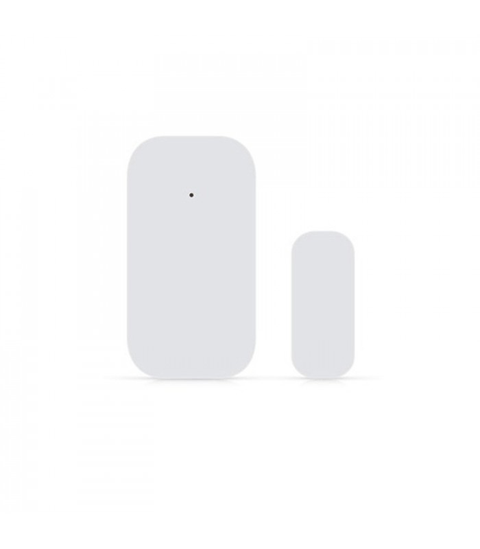|Xiaomi|AQARA - Detector de apertura inteligente|||[Comprar](https://www.domadoo.fr/fr/peripheriques/4514-xiaomi-detecteur-d-ouverture-portefenetre-zigbee-aqara.html)|
||Xiaomi|AQARA - Detector de movimiento inteligente v2|||[Comprar](https://www.domadoo.fr/fr/peripheriques/4518-xiaomi-detecteur-de-mouvement-zigbee-aqara-192784000090.html)|
|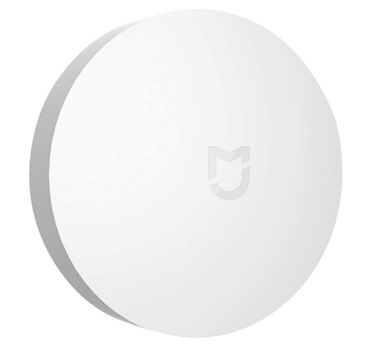|Xiaomi|MIJIA - Interruptor inalámbrico inteligente|Interruptor, control remoto|||
||Xiaomi|AQARA - Detector de inundaciones inteligente|||[Comprar](https://www.domadoo.fr/fr/peripheriques/4519-xiaomi-capteur-d-eau-zigbee-aqara-6970504210257.html)|
||Xiaomi|AQARA - Sensor de vibraciones|Detector, puerta, vibración||[Comprar](https://www.domadoo.fr/fr/peripheriques/4667-xiaomi-capteur-de-vibration-zigbee-aqara-192784000113.html)|

Esta lista se basa en los comentarios de los usuarios, por lo que el equipo de Jeedom no puede garantizar que todos los módulos de esta lista sean 100% funcionales

2022-03-14 01:32:12
