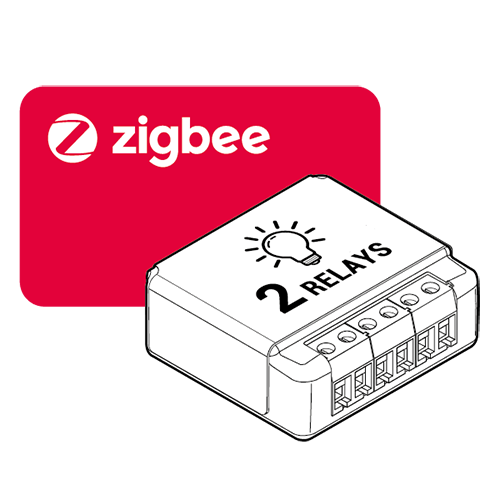

# Compatibilidad de los módulos Zigbee

# Eurotronic

|Image|Marque|Nom|Type|Remarque|Lien|
|---|---|---|---|---|---|
||Eurotronic|Válvula de espíritu||Válvula que tiende a no aceptar más órdenes (cambio de setpoint) a menos que se retiren las baterías y se vuelvan a colocar. Por otro lado, siempre retroalimenta la información de temperatura y el cambio manual del punto de ajuste||

# GR-SMARTHOME

|Image|Marque|Nom|Type|Remarque|Lien|
|---|---|---|---|---|---|
||GR-SMARTHOME|GR-SMARTHOME VÁLVULA DE 1/4 DE VUELTA|||[Comprar](https://www.domadoo.fr/fr/peripheriques/5264-gr-smarthome-motorisation-zigbee-30-pour-vanne-14-de-tour.html)|

# Legrand

|Image|Marque|Nom|Type|Remarque|Lien|
|---|---|---|---|---|---|
||Legrand|Salida de cable Legrand||||
||Legrand|Micro módulo Legrand||||
||Legrand|Toma móvil Legrand Céliane||||

# Alfawise

|Image|Marque|Nom|Type|Remarque|Lien|
|---|---|---|---|---|---|
||Alfawise|Temperatura / humedad Alfawise||||
||Alfawise|Alfawise lleva||||
||Alfawise|Alfawise lleva||||

# Danalock

|Image|Marque|Nom|Type|Remarque|Lien|
|---|---|---|---|---|---|
||Danalock|Danalock V3||Jeedom no recomienda este módulo que parece tener un error en el firmware que obliga a volver a incluir el módulo cada X horas o días|[Comprar](https://www.domadoo.fr/fr/controle-acces/4540-danalock-serrure-connectee-bluetooth-et-zigbee-danalock-v3-5712560000493.html)|

# Danfoss

|Image|Marque|Nom|Type|Remarque|Lien|
|---|---|---|---|---|---|
||Danfoss|Aliado de Danfoss|Cabezal termostático||[Documentación](https://assets.danfoss.com/documents/DOC353849556547/DOC353849556547.pdf) [Comprar](https://www.domadoo.fr/fr/peripheriques/5156-danfoss-tete-electronique-ally-zigbee-30-5702425245008.html)|

# Ecodim

|Image|Marque|Nom|Type|Remarque|Lien|
|---|---|---|---|---|---|
||Ecodim|Atenuador inteligente LED|Variateur|||

# Heiman

|Image|Marque|Nom|Type|Remarque|Lien|
|---|---|---|---|---|---|
||Heiman|Sensor de humo||||

# Icasa

|Image|Marque|Nom|Type|Remarque|Lien|
|---|---|---|---|---|---|
||Icasa|Bombilla Filamant||||
||Icasa|Atenuador de CA||||
||Icasa|Interruptor de CA||||
||Icasa|Controlador de pared Pulse 4S||||
||Icasa|Atenuador giratorio||||
||Icasa|Sunricher RGB||||

# Ikea

|Image|Marque|Nom|Type|Remarque|Lien|
|---|---|---|---|---|---|
||Ikea|Ikea fyrtur||||
||Ikea|Ikea Kadrilj||||
||Ikea|Conductor 30W||||
||Ikea|Bombilla E14 ópalo 600lm||||
||Ikea|Bombilla E27 CWS opal 600lm||||
||Ikea|Bombilla GU10 WS 400lm||||
||Ikea|Bombilla GU10 WW 400lm||||
||Ikea|Enchufe conectado Ikea TRADFRI|||[Documentación](https://www.ikea.com/fr/fr/manuals/tradfri-wireless-control-outlet__AA-2106602-1_pub.pdf) |
||Ikea|Ikea TRADFRI detector de movimiento inalámbrico blanco|||[Documentación](https://www.ikea.com/fr/fr/manuals/tradfri-wireless-motion-sensor__AA-2145280-2_pub.pdf) |
||Ikea|Mando a distancia Ikea TRADFRI 2 botones|Control remoto||[Documentación](https://www.ikea.com/fr/fr/assembly_instructions/tradfri-wireless-dimmer-white__AA-2175106-3_pub.pdf) |
||Ikea|Mando a distancia Ikea TRADFRI de 5 botones|Control remoto||[Documentación](https://www.ikea.com/fr/fr/manuals/tradfri-remote-control__AA-2144014-1_pub.pdf) |
||Ikea|Repetidor de Ikea||||
||Ikea|Tienda Ikea control remoto 2 botones||||

# Nodon

|Image|Marque|Nom|Type|Remarque|Lien|
|---|---|---|---|---|---|
||Nodon|SIN-4-1-01||||
||Nodon|SIN-4-2-01||||
||Nodon|PTM 216 Z||||

# Orvibo

|Image|Marque|Nom|Type|Remarque|Lien|
|---|---|---|---|---|---|
||Orvibo|Controlador RGB||||
||Orvibo|Reproducción multifuncional||||
||Orvibo|Conector del sensor||||
||Orvibo|Boton de emergencia||||
||Orvibo|Sensor de gas||||
||Orvibo|Temperatura / humedad||||
||Orvibo|Gotera de agua||||
||Orvibo|Detector de humo||||

# Osram

|Image|Marque|Nom|Type|Remarque|Lien|
|---|---|---|---|---|---|
||Osram|Bombilla LED OSRAM Smart + Connected - Base E27||||
||Osram|OSRAM SMART + Spot GU5.3 blanco sintonizable||||
||Osram|Enchufe OSRAM Smart +||||

# Philips

|Image|Marque|Nom|Type|Remarque|Lien|
|---|---|---|---|---|---|
||Philips|Hue White and Color Ambiance A60 E27||||
||Philips|Hue LightStrip Plus||||
||Philips|Bulbo de tono blanco y color||||
||Philips|Hue White y Color BR30 (1.a generación)||||
||Philips|Hue White y Color Ambiance Spot GU10||Tenga en cuenta que no hay comentarios de estado para este modelo, solo es posible enviar un pedido||
||Philips|Hue White and Color Ambiance A19 E26 (Gen 2)||||
||Philips|Hue White and Color Ambiance A19 E26 (Gen 3)||||
||Philips|Hue White y Color Ambiance BR30 Colores más ricos||||
||Philips|Vela Hue White y Color Ambiance E12||||
||Philips|Hue White and Color Ambiance A19 E26||||
||Philips|Hue White and Color Ambiance A19 E26||Tenga en cuenta que no hay comentarios de estado para este modelo, solo es posible enviar un pedido||
||Philips|Barra de luces Play Hue White y Color Ambiance||||
||Philips|Hue LivingColors||||
||Philips|Hue LivingColors||||
||Philips|Hue LivingColors Iris, lámpara de mesa Gen3||||
||Philips|Hue LivingColors||||
||Philips|Lámpara de mesa Hue Iris||||
||Philips|Paquete de inicio Hue Bloom Living Colors||||
||Philips|Lámpara de mesa Hue Bloom||||
||Philips|Hue LivingColors||||
||Philips|Luz portátil Hue Go||||
||Philips|Luz de suspensión Hue Beyond||||
||Philips|Hue blanco y color||||
||Philips|Hue blanco y color||||
||Philips|Hue blanco y color||||
||Philips|Enchufe inteligente Hue||||
||Philips|Hue LightStrip||||
||Philips|Hue LightStrip Plus||||
||Philips|Hue LightStrip para exteriores||||
||Philips|Hue blanco y color||Tenga en cuenta que no hay comentarios de estado para este modelo, solo es posible enviar un pedido||
||Philips|Hue blanco B22||Tenga en cuenta que no hay comentarios de estado para este modelo, solo es posible enviar un pedido||
||Philips|Variateur||||
||Philips|Mando a distancia de 4 botones||||
||Philips|Detector de movimiento interior Hue|Movimiento, brillo, temperatura|||
||Philips|Detector de movimiento exterior Hue|Movimiento, brillo, temperatura|||
||Philips|Hue Go||||

# Schneider

|Image|Marque|Nom|Type|Remarque|Lien|
|---|---|---|---|---|---|
||Schneider|Inserto de persiana PlusLink|Volets||[Documentación](https://download.schneider-electric.com/files?p_enDocType=System+user+guide&p_File_Name=Merten_PL_Wiser_TIs_DE.pdf&p_Doc_Ref=Merten_PL_Wiser_TIs_DE) |
||Schneider|Interruptor doble||||
||Schneider|Sensor de puerta / ventana más inteligente|Ouverture||[Documentación](https://download.schneider-electric.com/files?p_enDocType=User+guide&p_File_Name=MFR1569800.pdf&p_Doc_Ref=MFR1569800) |
||Schneider|Sensor de fugas de agua más inteligente|Fuite|||
||Schneider|Regulador giratorio Wiser Exxact|Variateur|||
||Schneider|Módulo micro dimmer más sabio|Variateur|||

# Sonoff

|Image|Marque|Nom|Type|Remarque|Lien|
|---|---|---|---|---|---|
||Sonoff|Sonoff Basic ZBR3|||[Comprar](https://www.domadoo.fr/fr/peripheriques/5258-sonoff-module-commutateur-10a-zigbee-30.html)|
||Sonoff|Sonoff viste||Atención, hay un error en el firmware que hace que suba como módulo de temperatura y humedad, por lo tanto, después de la inclusión, es necesario restablecer el modelo correcto y quitar los controles de temperatura y humedad|[Comprar](https://www.domadoo.fr/fr/peripheriques/5261-sonoff-detecteur-de-mouvement-zigbee-30.htm)|
||Sonoff|Sonoff viste|||[Comprar](https://www.domadoo.fr/fr/peripheriques/5261-sonoff-detecteur-de-mouvement-zigbee-30.htm)|
||Sonoff|Movimiento Sonoff|||[Comprar](https://www.domadoo.fr/fr/peripheriques/5261-sonoff-detecteur-de-mouvement-zigbee-30.html)|
||Sonoff|Sonoff Temperatura / humedad|||[Comprar](https://www.domadoo.fr/fr/peripheriques/5260-sonoff-capteur-de-temperature-et-d-humidite-zigbee-30.html)|
||Sonoff|Botón Sonoff|||[Comprar](https://www.domadoo.fr/fr/peripheriques/5259-sonoff-interrupteur-sans-fil-zigbee-30.html)|

# Sunricher

|Image|Marque|Nom|Type|Remarque|Lien|
|---|---|---|---|---|---|
||Sunricher|Controlador de motor Sunricher||||
||Sunricher|Sunricher RGB||||
||Sunricher|Sunricher ||||

# Tryo2sys

|Image|Marque|Nom|Type|Remarque|Lien|
|---|---|---|---|---|---|
||Tryo2sys|PTM 215 ZE||||

# Tuya

|Image|Marque|Nom|Type|Remarque|Lien|
|---|---|---|---|---|---|
||Tuya|Temperatura / humedad||||
||Moes|Actuador de radiador Moes||||

# Xiaomi

|Image|Marque|Nom|Type|Remarque|Lien|
|---|---|---|---|---|---|
||Xiaomi|Xinterruptor individual iaomi sin neutro||||
||Xiaomi|Xioami doble interruptor sin neutro||||
||Xiaomi|Xiaomi tomado||||
||Xiaomi|Xiaomi tomado||||
||Xiaomi|Xiaomi Aqara LLKZMK11LM Módulo inteligente de dos vías||||
||Xiaomi|Xioami doble interruptor|||[Comprar](https://www.domadoo.fr/fr/peripheriques/4517-xiaomi-interrupteur-mural-double-sans-fil-zigbee-aqara-6970504210042.html)|
||Xiaomi|Sensor de brillo||||
||Xiaomi|||||
||Xiaomi|Sensor de temperatura / humedad||||
||Xiaomi|Xsensor de apertura iaomi aquara|||[Comprar](https://www.domadoo.fr/fr/peripheriques/4514-xiaomi-detecteur-d-ouverture-portefenetre-zigbee-aqara.html)|
||Xiaomi|Xapertura del sensor iaomi||||
||Xiaomi|Xmovimiento iaomi aquara|||[Comprar](https://www.domadoo.fr/fr/peripheriques/4518-xiaomi-detecteur-de-mouvement-zigbee-aqara-192784000090.html)|
||Xiaomi|Xsensor de movimiento iaomi||||
||Xiaomi|Xiaomi Aquara interruptor Aq2||||
||Xiaomi|Xiaomi aquara interruptor||||
||Xiaomi|Xiaomi aquara inundación|||[Comprar](https://www.domadoo.fr/fr/peripheriques/4519-xiaomi-capteur-d-eau-zigbee-aqara-6970504210257.html)|
||Xiaomi|Xioami Aquara vibración|||[Comprar](https://www.domadoo.fr/fr/peripheriques/4667-xiaomi-capteur-de-vibration-zigbee-aqara-192784000113.html)|
||Xiaomi|Sensor de temperatura / presión / humedad||||
||Xiaomi|Xiaomi tomado||||
||Xiaomi|Xsensor de apertura iaomi aquara|||[Comprar](https://www.domadoo.fr/fr/peripheriques/4514-xiaomi-detecteur-d-ouverture-portefenetre-zigbee-aqara.html)|
||Xiaomi|Xmovimiento iaomi aquara|||[Comprar](https://www.domadoo.fr/fr/peripheriques/4518-xiaomi-detecteur-de-mouvement-zigbee-aqara-192784000090.html)|
||Xiaomi|Xiaomi aquara interruptor||||
||Xiaomi|Xiaomi aquara inundación|||[Comprar](https://www.domadoo.fr/fr/peripheriques/4519-xiaomi-capteur-d-eau-zigbee-aqara-6970504210257.html)|

Esta lista se basa en los comentarios de los usuarios, por lo que el equipo de Jeedom no puede garantizar que todos los módulos de esta lista sean 100% funcionales

2020-11-23 01:32:10
