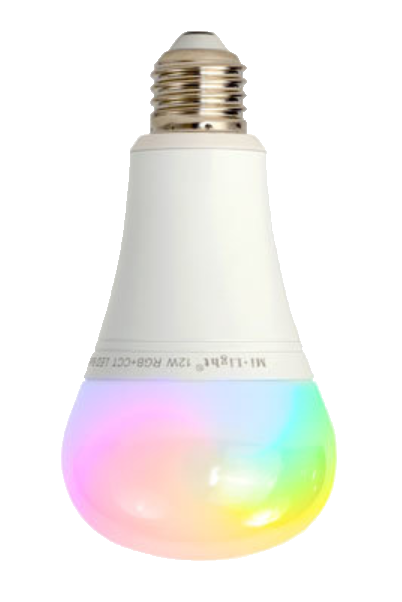
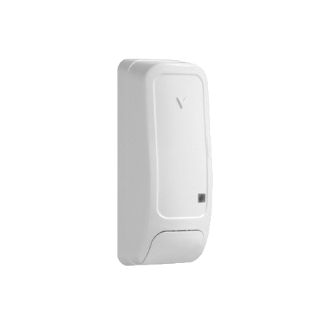

# Compatibilidad de los módulos Zigbee

# Eurotronic

|Image|Marque|Nom|Type|Remarque|Lien|
|---|---|---|---|---|---|
||Eurotronic|Válvula de espíritu||Válvula que tiende a no aceptar más un pedido a menos que se vuelva a incluir.||

# GR-SMARTHOME

|Image|Marque|Nom|Type|Remarque|Lien|
|---|---|---|---|---|---|
||GR-SMARTHOME|GR-SMARTHOME VÁLVULA DE 1/4 DE VUELTA|||[Comprar](https://www.domadoo.fr/fr/peripheriques/5264-gr-smarthome-motorisation-zigbee-30-pour-vanne-14-de-tour.html)|

# Legrand

|Image|Marque|Nom|Type|Remarque|Lien|
|---|---|---|---|---|---|
||Legrand|Salida de cable Legrand||||
||Legrand|Micro módulo Legrand||||
||Legrand|Toma móvil Legrand Céliane||||

# TZ2000

|Image|Marque|Nom|Type|Remarque|Lien|
|---|---|---|---|---|---|
||TZ2000|Temperatura / humedad||||

# Danalock

|Image|Marque|Nom|Type|Remarque|Lien|
|---|---|---|---|---|---|
||Danalock|Danalock V3||Jeedom no recomienda este módulo que parece tener un error en el firmware que obliga a volver a incluir el módulo cada X horas o días|[Comprar](https://www.domadoo.fr/fr/controle-acces/4540-danalock-serrure-connectee-bluetooth-et-zigbee-danalock-v3-5712560000493.html)|

# Danfoss

|Image|Marque|Nom|Type|Remarque|Lien|
|---|---|---|---|---|---|
||Danfoss|Aliado de Danfoss||Para restablecer la válvula, retire las baterías y vuelva a colocarlas presionando el botón hasta que la pantalla se encienda nuevamente.|[Comprar](https://www.domadoo.fr/fr/peripheriques/5156-danfoss-tete-electronique-ally-zigbee-30-5702425245008.html)|

# Generic

|Image|Marque|Nom|Type|Remarque|Lien|
|---|---|---|---|---|---|
||Generic|Luz RGB||Equipo genérico para una luz RGB||
||Generic|Encendido / apagado||Equipo genérico para un enchufe o cualquier módulo On / Off||
||Generic|Apertura / Movimiento||Equipo genérico para sensor de apertura o movimiento||

# Heiman

|Image|Marque|Nom|Type|Remarque|Lien|
|---|---|---|---|---|---|
||Heiman|Sensor de humo||||

# Icasa

|Image|Marque|Nom|Type|Remarque|Lien|
|---|---|---|---|---|---|
||Icasa|Bombilla Filamant||||
||Icasa|Atenuador de CA||||
||Icasa|Interruptor de CA||||
||Icasa|Controlador de pared Pulse 4S||||
||Icasa|Atenuador giratorio||||
||Icasa|Sunricher RGB||||

# Ikea

|Image|Marque|Nom|Type|Remarque|Lien|
|---|---|---|---|---|---|
||Ikea|Ikea fyrtur||Para la inclusión, es recomendable resetear la persiana (presionando los 2 botones hasta que se encienda el diodo), luego poner Jeedom en modo inclusión, quitar la betarie y reemplazar la batería de la persiana||
||Ikea|Ikea Kadrilj||Para la inclusión, es recomendable resetear la persiana (presionando los 2 botones hasta que se encienda el diodo), luego poner Jeedom en modo inclusión, quitar la betarie y reemplazar la batería de la persiana||
||Ikea|Conductor 30W||||
||Ikea|Bombilla E14 ópalo 600lm||||
||Ikea|Bombilla E27 CWS opal 600lm||||
||Ikea|Bombilla GU10 WS 400lm||||
||Ikea|Bombilla GU10 WW 400lm||||
||Ikea|Toma de Ikea||||
||Ikea|Sensor de movimiento ikea||||
||Ikea|[e1743] Control remoto de 2 botones de Ikea||||
||Ikea|Repetidor de Ikea||||
||Ikea|Tienda Ikea control remoto 2 botones||||
||Ikea|Control remoto Ikea de 5 botones||||

# Orvibo

|Image|Marque|Nom|Type|Remarque|Lien|
|---|---|---|---|---|---|
||Orvibo|Controlador RGB||||
||Orvibo|Reproducción multifuncional||||
||Orvibo|Conector del sensor||||
||Orvibo|Boton de emergencia||||
||Orvibo|Temperatura / humedad||||
||Orvibo|Gotera de agua||||
||Orvibo|Detector de humo||||

# Philips

|Image|Marque|Nom|Type|Remarque|Lien|
|---|---|---|---|---|---|
||Philips|Ambiente blanco y de color||||
||Philips|Variateur||||
||Philips|Mando a distancia de 4 botones||||
||Philips|Movimiento Philips||||

# Schneider

|Image|Marque|Nom|Type|Remarque|Lien|
|---|---|---|---|---|---|
||Schneider|Sensor de apertura||!! Atención el módulo no funciona !! La inclusión debe realizarse muy cerca de la clave, de lo contrario, el módulo se desplaza sobre la inclusión||
||Schneider|Sensor de inundación||!! Atención el módulo no funciona !! La inclusión debe realizarse muy cerca de la clave, de lo contrario, el módulo se desplaza sobre la inclusión||
||Schneider|Atenuador de disco||||

# Sonoff

|Image|Marque|Nom|Type|Remarque|Lien|
|---|---|---|---|---|---|
||Sonoff|Sonoff Basic ZBR3|||[Comprar](https://www.domadoo.fr/fr/peripheriques/5258-sonoff-module-commutateur-10a-zigbee-30.html)|
||Sonoff|Sonoff viste||Atención, hay un error en el firmware que hace que suba como módulo de temperatura y humedad, por lo tanto, después de la inclusión, es necesario restablecer el modelo correcto y quitar los controles de temperatura y humedad|[Comprar](https://www.domadoo.fr/fr/peripheriques/5261-sonoff-detecteur-de-mouvement-zigbee-30.htm)|
||Sonoff|Movimiento Sonoff|||[Comprar](https://www.domadoo.fr/fr/peripheriques/5261-sonoff-detecteur-de-mouvement-zigbee-30.html)|
||Sonoff|Sonoff Temperatura / humedad|||[Comprar](https://www.domadoo.fr/fr/peripheriques/5260-sonoff-capteur-de-temperature-et-d-humidite-zigbee-30.html)|
||Sonoff|Botón Sonoff|||[Comprar](https://www.domadoo.fr/fr/peripheriques/5259-sonoff-interrupteur-sans-fil-zigbee-30.html)|

# Sunricher

|Image|Marque|Nom|Type|Remarque|Lien|
|---|---|---|---|---|---|
||Sunricher|Controlador de motor Sunricher||||
||Sunricher|Sunricher RGB||||
||Sunricher|Sunricher ||||

# Xiaomi

|Image|Marque|Nom|Type|Remarque|Lien|
|---|---|---|---|---|---|
||Xiaomi|Xinterruptor individual iaomi sin neutro||||
||Xiaomi|Xioami doble interruptor sin neutro||||
||Xiaomi|Xiaomi tomado||||
||Xiaomi|Xiaomi Aqara LLKZMK11LM Módulo inteligente de dos vías||||
||Xiaomi|Xioami doble interruptor|||[Comprar](https://www.domadoo.fr/fr/peripheriques/4517-xiaomi-interrupteur-mural-double-sans-fil-zigbee-aqara-6970504210042.html)|
||Xiaomi|Sensor de brillo||||
||Xiaomi|Cube||||
||Xiaomi|Sensor de temperatura / humedad||||
||Xiaomi|Xapertura del sensor iaomi||||
||Xiaomi|Xsensor de movimiento iaomi||||
||Xiaomi|Xioami Aquara vibración|||[Comprar](https://www.domadoo.fr/fr/peripheriques/4667-xiaomi-capteur-de-vibration-zigbee-aqara-192784000113.html)|
||Xiaomi|Sensor de temperatura / presión / humedad||||
||Xiaomi|Xiaomi tomado||||
||Xiaomi|Xsensor de apertura iaomi aquara|||[Comprar](https://www.domadoo.fr/fr/peripheriques/4514-xiaomi-detecteur-d-ouverture-portefenetre-zigbee-aqara.html)|
||Xiaomi|Xmovimiento iaomi aquara|||[Comprar](https://www.domadoo.fr/fr/peripheriques/4518-xiaomi-detecteur-de-mouvement-zigbee-aqara-192784000090.html)|
||Xiaomi|Xiaomi aquara interruptor||||
||Xiaomi|Xiaomi aquara inundación|||[Comprar](https://www.domadoo.fr/fr/peripheriques/4519-xiaomi-capteur-d-eau-zigbee-aqara-6970504210257.html)|

Esta lista se basa en los comentarios de los usuarios, por lo que el equipo de Jeedom no puede garantizar que todos los módulos de esta lista sean 100% funcionales

2020-10-21 02:32:03
