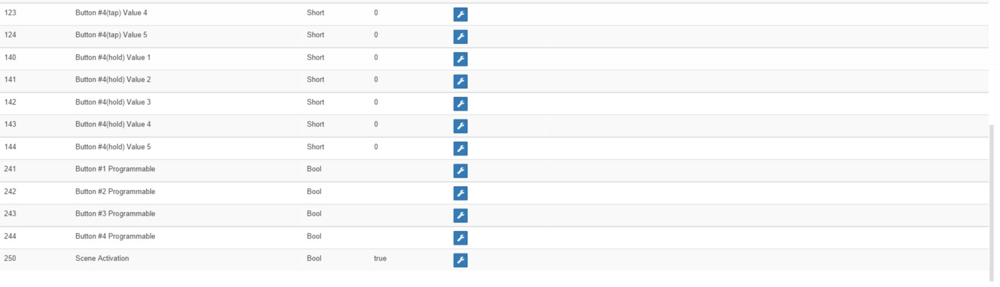

Llavero Aeotec 
=============

\

-   **El módulo**

\

\

-   **El visual de Jeedom**

\

\

Resumen 
------

\

El control remoto del llavero Aeon Labs con un diseño moderno y agradable
tiene 4 botones para controlar todo tipo de dispositivos
Z-Wave como lámparas, persianas, etc.

Con sus dimensiones muy pequeñas, puedes ponerlo fácilmente
en tu bolsillo. Fácil de usar y elegante, está equipado con un
anillo para adjuntarlo a las teclas, lo que lo hace disponible para
al salir de casa o al regresar a casa.

Cada botón le permite controlar dos dispositivos o escenas gracias a la
gestión de prensas cortas y largas. Este control remoto también puede ser
bien utilizado como controlador primario como secundario.

\

Funciones 
---------

\

-   Control remoto llavero

-   Controlador primario o secundario

-   Diseño ultra compacto y ultra

-   4 botones configurables

-   Gestiona hasta 8 dispositivos / escenas

-   Solapa de protección deslizante

-   Facilidad de uso e instalación.

\

Características técnicas 
---------------------------

\

-   Tipo de módulo : Transmisor de onda Z

-   Suministro : 1 batería de litio 3V CR2450

-   Duración de la batería : 1 año

-   Frecuencia: 868.42 MHz

-   Distancia de transmisión : 100m en campo abierto

-   Temperatura de funcionamiento : -10 ° C a 50 ° C

-   Dimensiones : 55 x 30 x 13 mm (largo x ancho x alto)

\

Datos del módulo 
-----------------

\

-   Hacer : Aeotec

-   Nombre : Llavero

-   ID del fabricante : 134

-   Tipo de producto : 1

-   ID del producto : 22

\

Configuración 
-------------

\

Para configurar el complemento OpenZwave y saber cómo poner Jeedom en
inclusión refiérase a esto
[Documentación](https://jeedom.fr/doc/documentation/plugins/openzwave/es_ES/openzwave.html).

\

> **Important**
>
> Para poner este módulo en modo de inclusión, presione el botón
> APRENDER, de acuerdo con su documentación en papel.

\

\

Una vez incluido, deberías obtener esto :

\

\

### Comandos 

\

Una vez que el módulo ha sido reconocido, los comandos asociados con los módulos serán
disponibles.

\

\

Aquí está la lista de comandos :

\

-   Botones : es el comando que empujará el botón hacia arriba

1 : Botón 1 pulsación corta

2 : Botón 1 pulsación larga

3 : Botón 2 presiones cortas

4 : Botón 2 prensas largas

5 : Botón 3 pulsaciones cortas

6 : Botón 3 pulsaciones largas

7 : Botón 4 pulsaciones cortas

8 : Botón 4 prensas largas

\

### Configuracion del modulo 

\

> **Important**
>
> Durante una primera inclusión, siempre active el módulo justo después
> inclusión.

\

Entonces, si desea configurar el módulo de acuerdo con
de su instalación, debe pasar por el botón
"Configuración "del complemento OpenZwave de Jeedom.

\

\

Llegará a esta página (después de hacer clic en la pestaña
Configuraciones)

\

\

Detalles del parámetro :

\

-   250: modo de funcionamiento del control remoto (absolutamente
    Escena para control remoto)

Todos los demás parámetros solo son útiles en caso de asociación directa
entre el control remoto y los módulos.

\

### Grupos 

\

Este módulo tiene un solo grupo de asociación. El es
indispensable.

\

\

Bueno saber 
------------

\

### Específicos 

Para usar este módulo como control remoto, proceda de la siguiente manera :

-   1 : Incluye control remoto

-   2 : Despierta el control remoto

-   3 : Cambie el parámetro 250 a verdadero (hágalo incluso si
    ya parece cierto)

-   4 : Active el control remoto y asegúrese de que el cambio haya sido
    tener en cuenta

-   5 : Cambie el modo de funcionamiento del control remoto mientras permanece
    presione los dos botones en la parte posterior durante 3 segundos.

Despertador 
------

\

Para activar este módulo, solo hay una forma :

-   mantenga presionado el botón APRENDIZAJE durante 3 segundos

\

Faq. 
------

\

Este módulo se activa presionando y manteniendo presionado el botón LEARN durante 3 segundos.

\

Este módulo es un módulo de batería, la nueva configuración no será
tenga en cuenta que si despierta el control remoto.

\

Nota importante 
---------------

\

> **Important**
>
> Tienes que despertar el módulo : después de su inclusión, después de un cambio
> de la configuración, después de un cambio de activación, después de un
> cambio de grupos de asociación

\

**@sarakha63**
