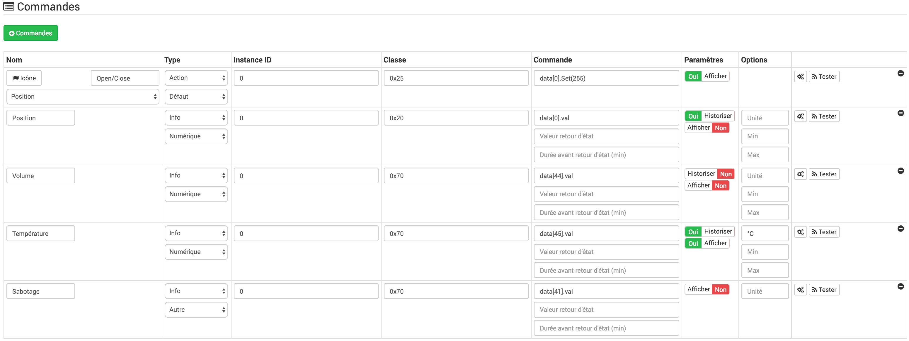

Controlador de puerta de garaje Aeotec 
====================================

-   **El módulo**

-   **El visual de Jeedom**

Resumen 
------

Fácilmente conectado al motor de la puerta existente, el controlador
la puerta del garaje la mejora con un conjunto de sensores de seguridad y
seguridad. El controlador de la puerta del garaje no solo permite
controla la puerta de tu garaje también te permite revisar
su condición. Ya sea utilizado por el motor o manualmente, el detector
inteligente viene con el controlador de puerta de garaje sabe si la puerta
está abierto o cerrado, y puede alertarlo cuando lo que está sucediendo no
no deberia.

Funciones 
---------

-   Controla y controla la puerta de tu garaje de forma remota.

-   Módulo de fácil instalación en el motor de su
    puerta actual.

-   Control local de la puerta mediante botón integrado.

-   Envía alertas de apertura / cierre al controlador Z-Wave.

-   Alertas audibles y visuales de apertura / cierre.

-   Volumen de alarma ajustable (105 dB máx.)

-   Puerto USB para cargar sus propios sonidos MP3.

-   LED de estado integrado en el botón.

-   Parte de la gama Gen5 de Aeon Labs.

-   Seguridad de la comunicación por radio a través del cifrado AES-128.

-   Integra el chip de la serie Z-Wave 500.

-   Comunicación 250% más rápida en comparación con los periféricos
    Z-Wave estándar.

-   Repetidor de mensaje Z-Wave.

-   Optimización de la antena, alcance 300 metros.

Características técnicas 
---------------------------

-   Tipo de módulo : Receptor y transmisor de la serie Z-Wave + 500

-   Suministro : Actuador : Sensor de 5 V CC (adaptador incluido) : Pile
    Litio 3V 800mA CR2

-   Consumo en espera : 1W

-   Consumo de alarma : 2W

-   Volumen máximo : 105 dB

-   Formatos de audio compatibles : mp3 y WMV a la frecuencia de 320 Kbps

-   Frecuencia : 868.42 Mhz

-   Distancia de transmisión : 300m en campo abierto

-   Temperatura de funcionamiento : -20 ° C a 50 ° C

-   Humedad de funcionamiento : 80%

-   Certifications: FCC, UL, CE, ROHS

Datos del módulo 
-----------------

-   Hacer : Aeotec

-   Nombre : Controlador de puerta de garaje (ZW062)

-   ID del fabricante : 134

-   Tipo de producto : 3

-   ID del producto : 62

Configuración 
-------------

Para configurar el complemento OpenZwave y saber cómo poner Jeedom en
inclusión refiérase a esto
[Documentación](https://doc.jeedom.com/es_ES/plugins/automation%20protocol/openzwave/).

> **Importante**
>
> Para poner este módulo en modo de inclusión, presione el botón
> Z-Wave, de acuerdo con su documentación en papel.

Una vez incluido, deberías obtener esto :

### Comandos 

Una vez que el módulo ha sido reconocido, los comandos asociados con el módulo serán
disponibles.

Aquí está la lista de comandos :

-   Abrir / cerrar : Abrir, cerrar o detener la puerta del garaje.

-   Posición : Posición actual de la puerta del garaje.

-   Volumen : Volumen actual del altavoz.

-   Temperatura : Temperatura de zona, sin ascenso automático.

-   Sabotaje : Estado de sabotaje de texto.

### Configuracion del modulo 

Entonces, si desea configurar el módulo de acuerdo con
de su instalación, debe pasar por el botón
"Configuración "del complemento OpenZwave de Jeedom.

Llegará a esta página (después de hacer clic en la pestaña
Configuraciones)

Detalles del parámetro :

-   34: Le permite iniciar la calibración del tiempo de apertura de
    la puerta.

-   41: Le permite restablecer el estado de sabotaje seleccionando "Aliviar
    el estado de alarma"

-   80: en granizo

-   255 : permite restablecer la configuración de fábrica

### Grupos 

Este módulo tiene dos grupos de asociación. El primer "Lifeline" es
indispensable.

Bueno saber 
------------

### Específicos 

Calibración del tiempo de apertura de la puerta del garaje:

-   1 : La puerta del garaje debe estar completamente cerrada.

-   2 : Active el parámetro 34 en "Realizar calibración".

-   3 : Comience la apertura de la puerta

-   4 : Espere hasta que la puerta esté completamente abierta.

-   5 : Comienza a cerrar la puerta

La calibración se ha completado

-   El parámetro 34 se actualizará a "Normal".

-   El parámetro 35 se actualizará con el tiempo de apertura calculado.

Reinicio de sabotaje:

-   1 : El sensor debe estar conectado correctamente.

-   2 : Active el parámetro 41 en "Libere el estado de alarma".

-   3 : Actualizar configuraciones.

La calibración se ha completado

-   El parámetro 41 se actualizará con "El sensor no se elimina".

Faq. 
------

**@nechry**
