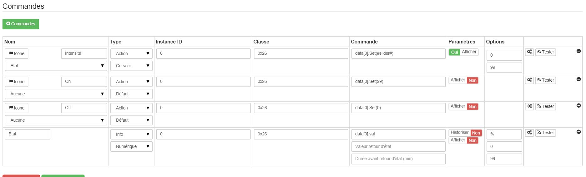
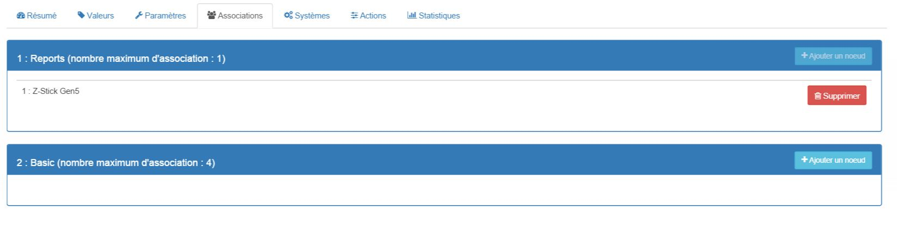

 
====================================

\

-   **El módulo**

\

\

-   **El visual de Jeedom**

\

\

Resumen 
------

\

apagar las luces y el equipo eléctrico de su

. 
.

qué controlador Z-Wave en su red.

\

Las funciones 
---------

\

-   

-   Módulo de enchufe que se integra directamente entre una toma de corriente y
    la carga a la orden

-   

-   Control de carga local mediante botón integrado.

-   Tecnología Z-Wave Plus

-   

-   LED de estado en el botón integrado

-   Función repetidora Z-Wave

\

Características técnicas 
---------------------------

\

-   Tipo de módulo : Receptor Z-Wave

-   Comida : 230 V, 50 Hz

-   El consumo : 0.6W

-   Potencia máxima : Carga resistiva : 
    :  : 6W

-   Frecuencia : 868.42 Mhz

-   Alcance : hasta 70 m en exteriores, hasta 30 m en edificios

-   Affichage: LED en el botón

-   Dimensiones : Longitud (enchufe incluido) : 74 mm de diámetro : 52mm

\

Datos del módulo 
-----------------

\

-   Hacer : Everspring

-   Apellido : Dimmer Miniplug

-   ID del fabricante : 96

-   Tipo de producto : 3

-   ID del producto : 3

\

Configuracion 
-------------

\

Para configurar el complemento OpenZwave y saber cómo poner Jeedom en
inclusión refiérase a esto
[documentación](https://jeedom.fr/doc/documentation/plugins/openzwave/es_ES/openzwave.html).

\

> **Important**
>
> Para poner este módulo en modo de inclusión, presione 3 veces en su
> botón, de acuerdo con su documentación en papel. Es importante
> tenga en cuenta que este módulo entra directamente en la inclusión cuando
> no pertenece a ninguna red y está alimentado

\

\

Una vez incluido, deberías obtener esto :

\

\

### Órdenes 

\

Una vez que el módulo ha sido reconocido, los comandos asociados con el módulo serán
disponibles.

\

\

Aquí está la lista de comandos :

\

-   Intensidad : Este es el comando utilizado para ajustar la intensidad de la
    prise

-   Nosotros : Este es el comando que enciende la salida

-   Apagado : Es el comando que hace posible extinguir la captura.

-   Estado : Es el comando que permite conocer el estado de la
    prise

\

Tenga en cuenta que en el tablero, el estado, ON / OFF, información de intensidad es
encontrado en el mismo icono.

\

### Configuracion del modulo 

\

Puede configurar el módulo de acuerdo con su
instalación Para hacer esto, vaya al botón "Configuración" del
Complemento Jeedom OpenZwave.

\

\

Llegará a esta página (después de hacer clic en la pestaña
Configuraciones)

\

\

Detalles del parámetro :

\

-   1 : Este parámetro define el comando de valor de estado, no es
    aconseja cambiar este valor.

-   2 : Este parámetro define el retraso en el envío del cambio de estado a
    grupo 1 (valor entre 3 y 25 segundos)

-   3 : Este parámetro se usa para definir si el socket reanudará su estado
    (ON u OFF) después de una recuperación de energía.

-   4 : Este parámetro le permite definir si la salida funcionará en
    variación o en modo encendido / apagado

### Grupos 

\

Este módulo tiene 2 grupos de asociación..

\

\

> **Important**
>
> Como mínimo, Jeedom debería terminar en el grupo 1 \

Bueno saber 
------------

\

### Específicos 

\

-   La retroalimentación de estado no se puede configurar por debajo de 3
    segundos. \

Despertador 
------

\

No hay noción de despertar en este módulo.

\

Faq. 
------

\

Sí, es el parámetro 2 y no se puede establecer por debajo de 3
secondes.

\

**@sarakha63**
