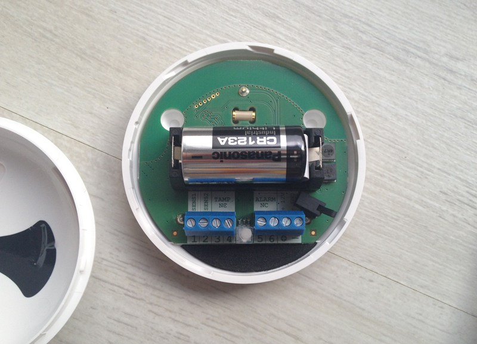

# Fibaro FGFS-101 "Sensor de inundación"

**El módulo**

**El visual de la libertad**

## Resumen

El sensor FGFS-101 es compacto y tiene una amplia variedad de funciones. Con su tecnología y precisión avanzadas, el sensor de inundación de Fibaro lo alerta de una inundación amenazante o de un rápido aumento o disminución de la temperatura.

Está equipado con un sensor de inclinación que envía inmediatamente una alerta a la red Z-Wave si el detector es movido o robado (informa la información de inclinación o movimiento al controlador Z-Wave)).

Este detector universal de inundación y temperatura puede funcionar con batería o con una fuente de alimentación externa de 12 o 24 V CC. Cuando se conecta a una fuente de alimentación externa, la batería actúa como fuente de alimentación de respaldo.

Gracias a su sensor de temperatura puedes controlar la temperatura de tu suelo. Es resistente al agua, en caso de inundación flota sobre la superficie del agua.

También tiene una alarma de sirena que puede sonar en caso de un problema. Puede conectar la salida de contacto seco a un sistema de alarma existente. Un LED frontal para verificar el estado del FGFS-101.

Este sensor incorpora un probador de rango de red Z-Wave, que le asegura el correcto funcionamiento del sensor durante su instalación.

## Funciones

-   Detector de inundaciones (presencia de agua a través de contactos)
-   Detector de temperatura
-   Detector de inclinación
-   Alarma audible y visual
-   Probador de rango Z-Wave
-   Repetidor de onda Z ?? (ver sección "Es bueno saberlo")

## Características técnicas

-   Tipo de módulo : Transmisor de onda Z
-   El módulo puede ser alimentado externamente : 12-24 VDC
-   Tipo de batería : CR123A
-   Duración de la batería : 2 años
-   Consumo en fuente de alimentación externa : 0,4W
-   Corriente máxima admitida en la salida (ALARMA NC, TAMP NC) :25mA
-   Tensión máxima soportada en la salida : 40V (CA o CC)
-   Frecuencia : 868.42 Mhz
-   Distancia de transmisión : 50m de campo libre, 30m en interiores
-   Dimensiones : 72 x 28 mm (diámetro x altura)
-   Temperatura de funcionamiento : 0-40 ° C (-20 ° C a 70 ° C si la fuente de alimentación externa)
-   Rango de medición de temperatura : -20 a 100 ° C
-   Precisión de medición : 0.5 ° C (en un rango de 0 a 40 ° C)
-   Normas : EMC 2004/108 / EC y R & TTE 199/5 / WE

## Datos del módulo

-   Hacer : Grupo Fibar
-   Modelo : Sensor de inundación FGFS101
-   Fabricante : Sistema FIBARO
-   ID del fabricante : 271
-   Tipo de producto : 2816
-   ID del producto : 4097

## Configuración

Para configurar el complemento OpenZwave y saber cómo incluir a Jeedom, consulte esto [Documentación](https://doc.jeedom.com/es_ES/plugins/automation%20protocol/openzwave/).

> **Importante**
>
> Para poner este módulo en modo de inclusión, presione el botón central de inclusión 3 veces, marcado TMP, de acuerdo con su documentación en papel (la pestaña negra).

Una vez incluido, deberías obtener esto :

### Comandos

Una vez que se reconoce el módulo, los comandos asociados con el módulo estarán disponibles.

Aquí está la lista de comandos :

-   Fuga : Este es el comando de alerta del módulo (para presencia de agua, inundaciones, etc.))
-   Temperatura : es el comando de medición de temperatura
-   Sabotaje : este es el comando de sabotaje. Señala la apertura del caso
-   Batería : es el comando de la batería

### Configuración du module

> **Importante**
>
> Durante una primera inclusión, siempre active el módulo justo después de la inclusión.

Entonces es necesario configurar el módulo de acuerdo con su instalación. Para hacer esto, vaya al botón "Configuración" del complemento OpenZwave de Jeedom.

Llegará a esta página (después de hacer clic en la pestaña Configuración)

Detalles del parámetro :

-   Despertador : Este es el intervalo de activación del módulo (valor recomendado 21600)
-   1 \. Retraso de cancelación de alarma después de la detección de una inundación : valeur de 0 à 3600 s (0 par défaut/ dès qu‘il n'y a plus de détection il s'arrête instantanément)
-   2 \. Elección del tipo de alarma. Valor :
  - 0 : Alarma audible y visual desactivada
  - 1 : Alarma sonora desactivada y alarma visual activada
  - 2 : Alarma sonora activada y alarma visual desactivada
  - 3 : Alarma audible y visual activada.
-   10 \. Tiempo de transferencia entre dos lecturas de temperatura : de 1 a 65535 s (300 por defecto). Tenga cuidado de no poner un valor de acarreo demasiado cercano bajo pena de ver la batería del módulo derretirse a cualquier velocidad ! (1800 se recomienda)
-   12 \. Diferencia de temperatura entre dos informes : de 1 a 1000 (por defecto 50 = 0.5 °). De acuerdo con el parámetro 10, también es posible gestionar la transferencia de temperatura en función de la variación de este último.
-   50 \. Configurar la alarma de baja temperatura : de -10000 a + 10000 (1500 por defecto = 15 ° C) Permite activar una alarma cuando la temperatura cae por debajo de cierto umbral.
-   51.Configurar la alarma de alta temperatura : de -10000 a + 10000 (3500 por defecto = 35 ° C) Permite activar una alarma cuando la temperatura supera un cierto umbral.
-   73 \. Compensación de temperatura : de -10000 a + 10000 (0 por defecto = 0 ° C) Le permite definir un desplazamiento entre la temperatura del sensor y la temperatura real
-   75 \. Establecer la duración de la alarma : de 0 a 65535s (0 por defecto, la alarma se detiene tan pronto como ya no detecta una falla.)

### Grupos

Para un funcionamiento óptimo de su módulo. Jeedom debe estar asociado al menos con los grupos 1, 4 y 5:

## Bueno saber

Alimentado desde el exterior, este módulo puede usarse como un repetidor de onda Z (información no confirmada actualmente)

Cableado para alimentación externa.

## Despertador

Para activar este módulo, presione el botón central 3 veces

## Faq.

Este módulo se activa presionando 3 veces en su botón de inclusión.

Este módulo es, por defecto, un módulo de batería, la nueva configuración se tendrá en cuenta en la próxima activación.

## Nota importante

> **Importante**
>
> Tienes que despertar el módulo : después de su inclusión, después de un cambio en la configuración, después de un cambio en la activación, después de un cambio en los grupos de asociación

Detalle de uso [aquí](http://blog.domadoo.fr/2014/12/18/jeedom-guide-dutilisation-du-detecteur-dinondation-fibaro-fgfs-001/)
Documentación de fibaro [Inglés](http://www.fibaro.com/manuals/en/FGFS-101-Flood-Sensor/FGFS-101-Flood-Sensor-en-2.1-2.3.pdf)
