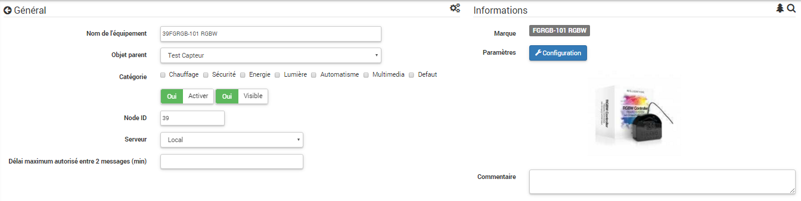
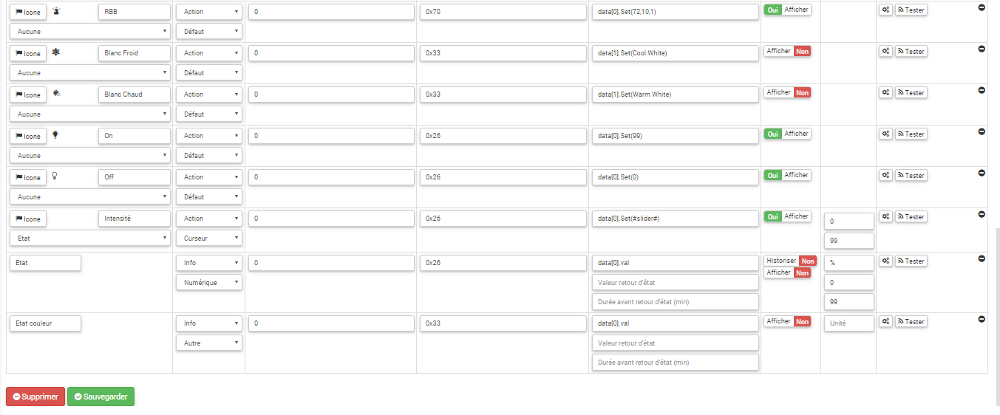

# 

-   ****

-   ****

## 

.

-   ).
-    :
-   
-   
-   .)
-   .
-   .
-   .
-   .

## Fonctions

-   )
-   
-   
-   
-   
-   

## 

-    : 
-    :
-   ),
-   . 
-    :
-   ),
-   )
-    : 
-    : 0,3W
-    : )
-    : 1mW
-    : 
-    : 
-    : 
-    : 
-   .

## 

-    : 
-    : 
-    : 271
-    : 2304
-    : 4096

## Configuration

 .

> ****
>
> .

 :

### Commandes

.

 :

-    : 
-    : 
-    : 
-    : )
-    : 
-    : 
-    : . ()
-    : . ()
-    : 
-    : 
-    : 

### 

. .

)

 :

.

### Groupes

.

## 

### 

.

> ****
>
> .

### 

## Wakeup

.
