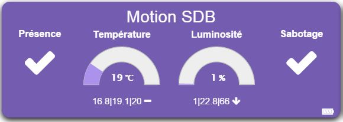

Philio PSP01 
============

\

-   **El módulo**

\

\

-   **El visual de Jeedom**

\

\

Resumen 
------

\

El detector PSP01 ofrece 3 funciones diferentes. : detección de
movimiento, sensor de temperatura y detector de luz.

Este detector puede usarse para seguridad o para
automatización Cuando el detector está asociado con
seguridad, sirve como disparador de alertas al detectar
cambios en los niveles de radiación infrarroja. Si una persona
se mueve en el campo de visión del detector, una señal de radio es
transmitido, que activa una alarma para disuadir a los intrusos.

El detector también se puede usar en combinación con un
Controlador Z-Wave para usos de domótica, detectando ambos
cambios en los niveles de radiación infrarroja (presencia) y
cambios en el nivel de brillo. Entonces podemos desencadenar un
iluminación cuando se detecta movimiento en la oscuridad.

El detector también aumentará el brillo y la temperatura, es decir.
cambio significativo, y cada vez que un movimiento es
detectado Se requiere un controlador Z-Wave (control remoto, dongle, etc.)
para integrar este detector en su red si ya tiene un
red existente.

\

Las funciones 
---------

\

-   Detector 3 en 1: movimiento, temperatura, luz

-   Adopta el reciente chip de la serie Z-Wave 400 para admitir
    operaciones multicanal y más rendimiento de datos
    alto (9.6 / 40 / 100kbps)

-   Utiliza el SDK de Z-Wave 6.02

-   Rango de antena optimizado

-   Uso para aplicaciones de domótica o seguridad

-   Botón para incluir / excluir el detector

-   Autoprotection

-   Indicación de batería baja

-   Pequeño, discreto y estético.

-   Facilidad de uso e instalación.

\

Características técnicas 
---------------------------

\

-   Tipo de módulo : Transmisor de onda Z

-   Comida : 1 batería CR123A 3V

-   Duración de la batería : 2 años

-   Frecuencia : 868.42 MHz

-   Distancia de transmisión : 30m en interiores

-   Sensor de temperatura : -10 a 70 ° C

-   Sensor de brillo : 0 a 500 lux

-   Ángulo de detección PIR : 90 °

-   Rango de detección PIR : 8 a 10m

-   Dimensiones : 28 x 96 x 23 mm

-   Peso : 39g

-   Temperatura de funcionamiento : -10 a 40 ° C

-   Humedad de funcionamiento : 85% HR máx.

-   Norma CE : EN300 220-1

-   Certificación Z-Wave : ZC08-13050003

\

Datos del módulo 
-----------------

\

-   Hacer : Philio Technology Corporation

-   Apellido : Philio PSP01

-   ID del fabricante : 316

-   Tipo de producto : 2

-   ID del producto : 2

\

Configuracion 
-------------

\

Para configurar el complemento OpenZwave y saber cómo poner Jeedom en
inclusión refiérase a esto
[documentación](https://jeedom.fr/doc/documentation/plugins/openzwave/es_ES/openzwave.html).

\

> **Important**
>
> Para poner este módulo en modo de inclusión, presione el botón 3 veces
> botón de inclusión, de acuerdo con su documentación en papel.

\

\

Una vez incluido, deberías obtener esto :

\

\

### Órdenes 

\

Una vez que el módulo ha sido reconocido, los comandos asociados con el módulo serán
disponibles.

\

\

Aquí está la lista de comandos :

\

-   Presencia : es el comando que detectará una detección de presencia

-   Apertura : es el comando que generará una detección
    d'ouverture

-   Temperatura : es el comando que permite subir el
    temperatura

-   Brillo : es el comando que hace posible aumentar el brillo

-   Sabotaje : Este es el comando de sabotaje (se activa en
    arrancando)

-   Batería : es el comando de la batería

\

Todos los módulos de la gama tienen los mismos identificadores, depende de usted mostrarlos
correspondiente a su módulo.

### Configuracion del modulo 

\

> **Important**
>
> Durante una primera inclusión, siempre active el módulo justo después
> inclusión.

\

Entonces, si desea configurar el módulo de acuerdo con
de su instalación, debe pasar por el botón
"Configuración "del complemento OpenZwave de Jeedom.

\

\

Llegará a esta página (después de hacer clic en la pestaña
Configuraciones)

\

\

Detalles del parámetro :

\

-   2: permite ajustar la señal enviada a los módulos en el grupo
    asociación 2

-   3: ajusta la sensibilidad del sensor de presencia (0 :
    discapacitado 99: máxima sensibilidad)

-   4: ajusta el nivel de brillo desde el cual
    la señal definida en el parámetro 2 se enviará a los módulos asociados con el
    grupo 2

-   5: modo de funcionamiento (no se recomienda cambiarlo : referir
    en la documentación del fabricante)

-   6: modo de funcionamiento multisensor (no se recomienda cambiarlo
    : consulte la documentación del fabricante)

-   9: permite definir después de cuánto tiempo será la señal OFF
    enviado a módulos asociados con el grupo 2

-   10: le permite definir la duración entre dos informes de batería (uno
    unidad = 30 minutos)

-   12: se usa para definir la duración entre dos informes de brillo
    (una unidad = 30 minutos)

-   13: le permite definir el tiempo entre dos informes de temperatura
    (una unidad = 30 minutos)

\

### Grupos 

\

Este módulo tiene dos grupos de asociación, solo el primero es
indispensable.

\

\

Bueno saber 
------------

\

### Específicos 

\

> **Tip**
>
> Este módulo tiene una particularidad, no tener un informe basado en el
> variaciones, pero solo con el tiempo, envía toda su información a
> cada detección. También envía la señal varias veces.
> detección de presencia como resultado. Por lo tanto, es aconsejable marcar el
> Cuadro "Evento en cambio" en presencia si usa esto
> comando en desencadenador de escenario.

\

### Visual alternativo 

\

\

Despertador 
------

\

Para activar este módulo, solo hay una forma :

-   suelte el botón de manipulación y presiónelo nuevamente

\

Faq. 
------

\

Este módulo se activa presionando su botón de manipulación.

\

Marque la casilla "Evento en cambio".

\

Este módulo es un módulo de batería, la nueva configuración será
tomado en cuenta en el próximo despertar.

\

Nota importante 
---------------

\

> **Important**
>
> Tienes que despertar el módulo : después de su inclusión, después de un cambio
> de la configuración, después de un cambio de activación, después de un
> cambio de grupos de asociación

\

**@sarakha63**
