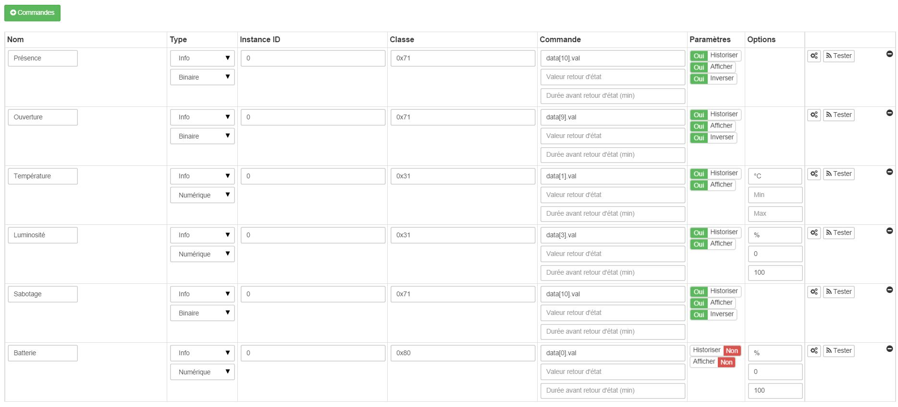

# Philio PST02 A - 4 en 1

**El módulo**

**La imagen de Jeedom**

## Resumen

El detector ZIP-PSM02-EU ofrece 4 funciones diferentes : detección de movimiento, detección de apertura, sensor de temperatura y sensor de luz. Está formado por dos partes : un detector y un imán. Están diseñadas para colocarse en una puerta o ventana con el imán fijado en la parte que abre y el detector en la parte fija.

Al abrir la puerta o la ventana, el imán se alejará del detector, lo que activará el detector que enviará una señal de alarma Z-Wave, si el sistema está armado (esta señal puede ser operada por una sirena o por una caja de automatización del hogar para ejemplo). Este detector se puede utilizar para la seguridad o para la automatización. Cuando se combina con dispositivos de seguridad, sirve como disparador de alerta al detectar cambios en los niveles de radiación infrarroja o aperturas de puertas/ventanas. Si una persona se mueve dentro del campo de visión del detector o abre una puerta/ventana, se transmite una señal de radio que activa una alarma para disuadir a los intrusos.

El detector también se puede utilizar junto con un controlador Z-Wave para fines de automatización del hogar, detectando tanto cambios en los niveles de radiación infrarroja (presencia) o apertura de puertas/ventanas como cambios en el nivel de brillo. Por lo tanto, la iluminación se puede activar cuando se detecta movimiento o se abre una puerta en la oscuridad.

El detector también aumentará la luminosidad y la temperatura, ya sea en caso de un cambio significativo, y cada vez que se detecte un movimiento o apertura/cierre. Se requiere un controlador Z-Wave (control remoto, dongle, etc.) para integrar este detector en su red si ya tiene una red existente.

## Fonctions

-   Detector 4 en 1: movimiento, apertura, temperatura, luz
-   Adopta el chip de la serie Z-Wave 400 reciente para admitir la operación multicanal y una velocidad de datos más alta (9.6/40/100 kbps)
-   Utiliza Z-Wave SDK 6.02
-   Rango de antena optimizado
-   Uso para aplicaciones de seguridad o domótica
-   Botón para incluir/excluir el detector
-   Autoprotection
-   Indicación de batería baja
-   Pequeño, discreto y estético
-   Facilidad de uso e instalación

## Características técnicas

-   Tipo de mod : Transmisor de onda Z
-   Alimento : 1 batería CR123A de 3 V
-   Duración de la batería : 2 años
-   Frecuencia : 868.42 MHz
-   Distancia de transmisión : 30m en interiores
-   Sensor de temperatura : -10 a 70°C
-   Sensor de luz : 0 a 500 lux
-   Ángulo de detección PIR : 90°
-   Rango de detección PIR : 8 a 10m
-   Dimensiones :
  -   Detector : 28x96x23mm
  -   Imán : 10x50x12mm
-   Peso : 52g
-   Temperatura de funcionamiento : -10 a 40°C
-   Humedad de funcionamiento : 85%HR máx
-   Norma CE : EN300 220-1
-   Certificación Z-Wave : ZC08-13050003

## Datos del módulo

-   Marca : Corporación de Tecnología Philio
-   Apellido : PST02-A 4 en 1 multisensor
-   Identificación del fabricante : 316
-   Tipo Producto : 2
-   Identificación de producto : 12

## Configuration

Para configurar el complemento OpenZwave y saber cómo incluir Jeedom, consulte este [documentación](https://doc.jeedom.com/es_ES/plugins/automation%20protocol/openzwave/).

> **Importante**
>
> Para poner este módulo en modo de inclusión, debe presionar el botón de inclusión 3 veces, de acuerdo con su documentación en papel.

Una vez incluido, debe obtener esto :

### Commandes

Una vez que se reconoce el módulo, los comandos asociados con el módulo estarán disponibles.

Aquí está la lista de comandos :

-   Presencia : este es el comando que reportará una detección de presencia
-   Apertura : este es el comando que reportará una detección de apertura
-   La temperatura : este es el comando que te permite subir la temperatura
-   Brillo : este es el comando que te permite aumentar el brillo
-   Sabotaje : este es el comando de sabotaje (se activa en caso de rotura)
-   Batería : este es el comando de la bateria

### Configuración del módulo

> **Importante**
>
> Durante una primera inclusión, siempre despierte el módulo justo después de la inclusión.

Luego, si desea configurar el módulo de acuerdo con su instalación, debe pasar por el botón "Configuración" del complemento Jeedom OpenZwave.

Llegará a esta página (después de hacer clic en la pestaña de configuración)

Detalles del parámetro :

-   2: ajusta la señal enviada a los módulos en el grupo de asociación 2
-   3: regula la sensibilidad del sensor de presencia (0 : discapacitado 99: sensibilidad máxima)
-   4: permite ajustar el nivel de brillo a partir del cual se enviará la señal definida en el parámetro 2 a los módulos asociados al grupo 2
-   5: modo de funcionamiento (consulte la documentación del fabricante) Valor recomendado : 8
-   6: modo de funcionamiento multisensor (consulte la documentación del fabricante) Valor recomendado : 4
-   7: modo de funcionamiento personalizado del multisensor (consulte la documentación del fabricante) Valor recomendado : 6 (para tener un retorno a OFF de la presencia)
-   8: le permite definir la duración en pasos de 8 segundos de redetección de movimiento
-   9: permite definir después de cuánto tiempo se enviará la señal de APAGADO a los módulos asociados al grupo 2
-   10: le permite definir la duración entre dos informes de batería (una unidad = parámetro 20)
-   11: le permite definir la duración entre dos relaciones de apertura automática (una unidad = parámetro 20)
-   12: le permite definir la duración entre dos informes de brillo automático (una unidad = parámetro 20) Valor recomendado : 3
-   13: se utiliza para definir la duración entre dos informes automáticos de temperatura (una unidad = parámetro 20) Valor recomendado : 2
-   20: duración de un intervalo para los parámetros 10 a 13 Valor recomendado : 10
-   21: valor de variación en °F de la temperatura para activar un informe
-   22: valor en % de variación de brillo para activar un informe Valor recomendado : 10

### Groupes

Este módulo tiene dos grupos de asociación, solo el primero es imprescindible.

## Wakeup

Para activar este módulo solo hay una forma de proceder :

-   suelte el botón de manipulación y vuelva a presionarlo

## Nota IMPORTANTE

> **Importante**
>
> Tienes que despertar el módulo : tras su inclusión, tras un cambio de configuración, tras un cambio de wakeup, tras un cambio de grupos de asociación
