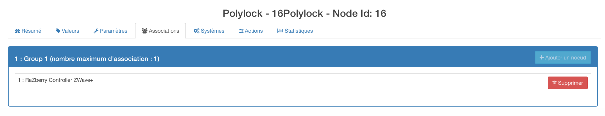

# PolyLock

**El módulo**

**El visual de Jeedom**

## Resumen

Asegure su hogar con la cerradura electrónica Z-Wave de Poly-Control !

La cerradura electrónica Poly-Lock está diseñada para adaptarse a casi cualquier puerta del mundo. Se monta muy fácilmente en 5 minutos, solo tiene que cambiar el cilindro de su puerta.

Una vez emparejado con su controlador Z-Wave (como los sistemas Vera de VeraControl), puede tener el control completo de su bloqueo desde cualquier computadora o teléfono inteligente, sin importar en qué parte del mundo se encuentre. También es posible usar la cerradura con el teclado inalámbrico Poly-Pad para abrir o bloquear la puerta.

Por lo tanto, es posible bloquear su casa de una manera similar a bloquear su automóvil: con un control remoto, con solo presionar un botón y su casa está segura. El bloqueo Poly-Control también puede funcionar con otras escenas de Z-Wave, donde se encienden las luces, y el sistema de alarma se desactiva cuando se desbloquea a través de su control remoto.

El sistema Poly-Control se puede utilizar en el hogar o en el trabajo. La cerradura Poly-Lock funciona con batería y se ha probado que funciona durante 1 año, sin reemplazar la batería.

## Fonctions

-   Controla tu puerta de entrada de forma remota
-   Se adapta a la mayoría de las puertas
-   Se puede integrar en escenas Z-Wave, por ejemplo, para un sistema de alarma
-   Adecuado para uso doméstico o comercial
-   Rueda para cierre manual
-   Instalación fácil

## Características técnicas

-   Suministro : Batería de cloruro de litio de 3.6V
-   Frecuencia : 868.42 Mhz
-   Alcance : hasta 100 m en exteriores, hasta 30 m en edificios
-   Dimensiones : 120 x 52 x 60 mm (largo x ancho x alto))
-   Peso : 370g

## Datos del módulo

-   Hacer : Poly-Control
-   Nombre : Polylock
-   ID del fabricante : 270
-   Tipo de producto : 1
-   ID del producto : 1

## Configuration

Para configurar el complemento OpenZwave y saber cómo incluir a Jeedom, consulte esto [Documentación](https://doc.jeedom.com/es_ES/plugins/automation%20protocol/openzwave/).

> **Importante**
>
> Para poner este módulo en modo de inclusión, presione el botón de inclusión una vez, de acuerdo con su documentación en papel.

Una vez incluido, deberías obtener esto :

### Commandes

Una vez que se reconoce el módulo, los comandos asociados con el módulo estarán disponibles.

Aquí está la lista de comandos :

-   Estado : es el comando que volverá a la última acción ejecutada (abrir / cerrar)
-   Abrir : es el comando que abre la cerradura
-   Cerca : es el comando que hace posible cerrar la cerradura
-   Batería : es el comando de la batería

### Configuracion del modulo

> **Advertencia**
>
> Aunque este módulo funciona con batería, utiliza la tecnología Flirs. Eso significa que no tiene el concepto de despertar y despertar. Recuperará cualquier cambio de configuración casi en tiempo real como un módulo de red.

Si desea configurar el módulo de acuerdo con su instalación, debe pasar por el botón "Configuración" del complemento Jeedom OpenZwave.

Llegará a esta página (después de hacer clic en la pestaña de parámetros)

Detalles del parámetro :

-   0: permite cambiar la dirección de rotación de los comandos de apertura / cierre
-   1: le permite definir cuánto tiempo se abrirá la cerradura para abrir (0 a 15 s)
-   2: le permite definir cuánto tiempo se cerrará la cerradura (0 a 15 s)
-   3: se usa para definir la velocidad de rotación de la cerradura (de 0 a 15, siendo 15 la más lenta)
-   4: le permite elegir entre diferentes modos de funcionamiento (par, fuerza, potencia, etc.))

### Groupes

Este módulo tiene solo un grupo de asociación.

## Ejemplos de uso

El disparador es el comando de evento en un teclado zipato (puede ser cualquier otra cosa). Si el valor es 6 (casa) cerramos la puerta. Acabamos de regresar para poder cerrar la puerta. De lo contrario (necesariamente 5) abrimos la puerta con una llave y 2 minutos después de cerrarla. De hecho, queremos salir, la puerta se abre y se cerrará nuevamente poco después.

## Bueno saber

### Específicos

> **Punta**
>
> Aunque este módulo funciona con batería, utiliza la tecnología Flirs. Eso significa que no tiene el concepto de despertar y despertar. Recuperará cualquier cambio de configuración casi en tiempo real como un módulo de red.

> **Punta**
>
> Este módulo no devuelve su estado; si opera el bloqueo manualmente, el estado seguirá siendo el mismo.

## Despertar

No hay concepto de despertar para este módulo.
