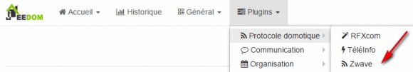
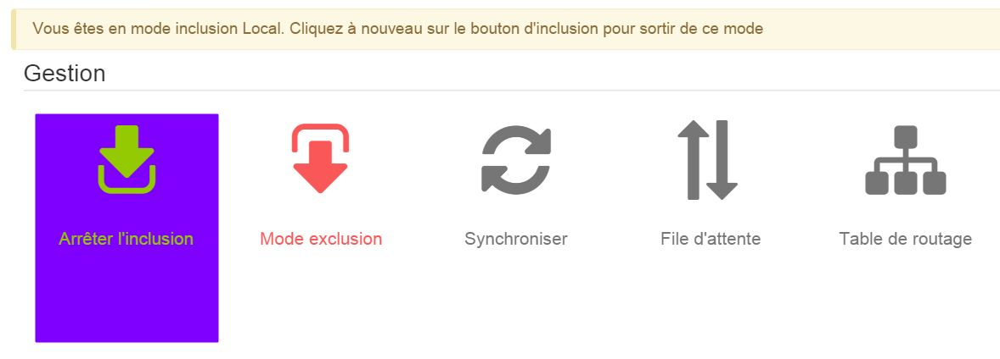

Inclusión del módulo. 
===================

\

Ahora debemos incluir el módulo, para eso, debemos ir a
le menu « Plugins », « Protocole Domotique » puis « Z-Wave ».

\

\

Una vez en esta página, encontrará un botón "Modo de inclusión",
simplemente haga clic en él para cambiar al modo de inclusión :

\

\

Après avoir cliqué sur « Mode inclusion », un message apparait pour vous
recuerda que estás en este modo.

\

\

Una vez que la inclusión está en progreso, aparece un mensaje, por lo que debe
espera mientras Jeedom integra el módulo. La configuración de
los comandos se realizan automáticamente una vez que Jeedom reconoce el módulo.

\

\

> **Punta**
>
> Es preferible hacer una exclusión antes de una inclusión. Para
> No excluya nada complicado, solo haga clic en
> « Mode exclusion » et d'exclure le module, un message apparaitra vous
> confirmando la exclusión del módulo.

\

