# Compatibilité des équipements Bluetooth

# Amazfit

|Image|Marque|Nom|Type|Remarque|Lien|
|---|---|---|---|---|---|
||Huami|Amazfit GTR|Santé|Uniquement de la présence pour le moment||

# Aqualin

|Image|Marque|Nom|Type|Remarque|Lien|
|---|---|---|---|---|---|
|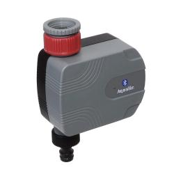|Aqualin|Bluetooth valve drip|Plante|||

# Awoxmesh

|Image|Marque|Nom|Type|Remarque|Lien|
|---|---|---|---|---|---|
||Awox Eglo|SmartLight Mesh|Lumières|Compatible avec Awox Mesh technologie.||
||Awox Eglo|Eglo Fueva|Lumières|Compatible avec Awox Mesh technologie.||
||Awox Eglo|Télécommande|Lumières|Compatible avec Awox Mesh technologie. Il faut activer le mode bluetooth pour utiliser les commande.||

# Beagle

|Image|Marque|Nom|Type|Remarque|Lien|
|---|---|---|---|---|---|

# Beewismartdoor

|Image|Marque|Nom|Type|Remarque|Lien|
|---|---|---|---|---|---|
||BeeWi|capteur d'ouverture|Capteurs|Capteurs d'ouverture de porte||

# Beewismartlite

|Image|Marque|Nom|Type|Remarque|Lien|
|---|---|---|---|---|---|
|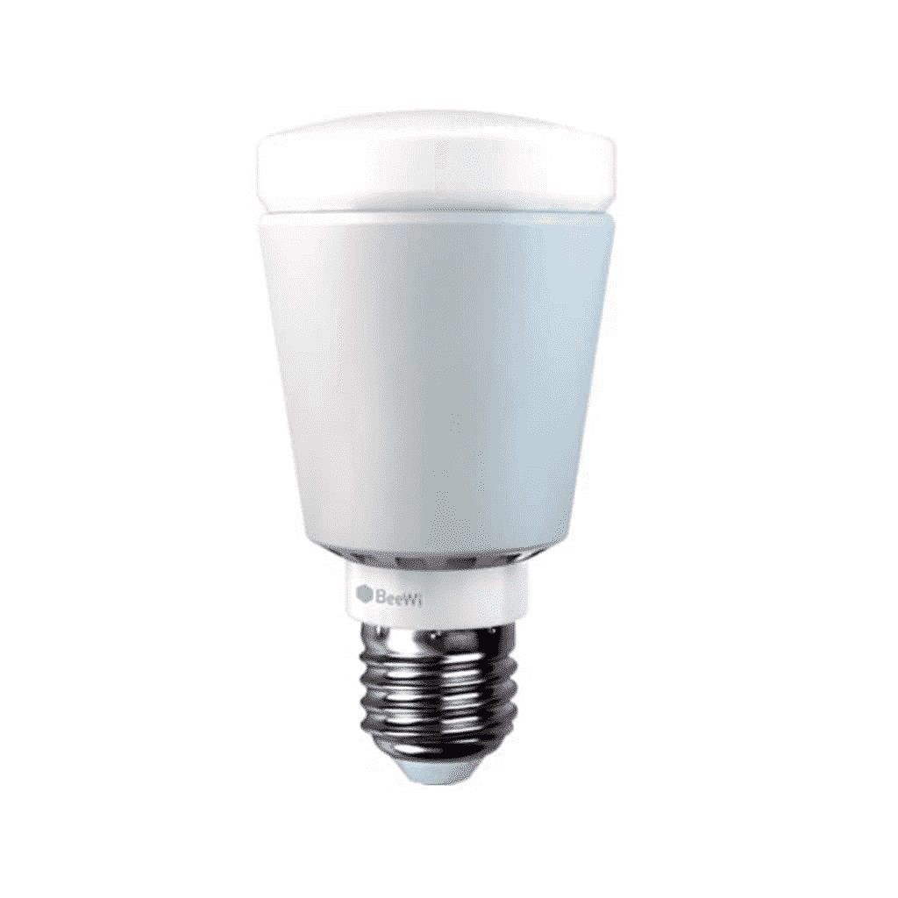|BeeWi|SmartLite BBL227|Lumières|Il faut valider l'appairage pendant la première minute après avoir allumé l'ampoule||

# Blpnr

|Image|Marque|Nom|Type|Remarque|Lien|
|---|---|---|---|---|---|
|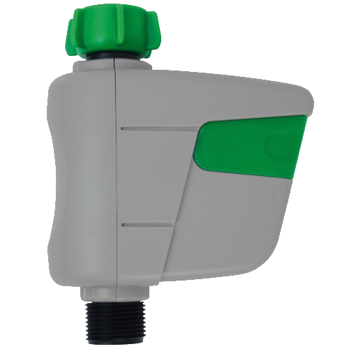|Jardibric|BLP NR|Plante|||

# Default

|Image|Marque|Nom|Type|Remarque|Lien|
|---|---|---|---|---|---|
||Inconnu|Inconnu|Defaut|Uniquement pour les équipements non encore rajouté dans le plugin, pour a minima avoir la présence et les rssi ainsi que la data brute||

# Divoompixoo

|Image|Marque|Nom|Type|Remarque|Lien|
|---|---|---|---|---|---|
||Divoom|Pixoo|Afficheur|Fonction garder la connection recommandée||

# Divoomtimeboxmini

|Image|Marque|Nom|Type|Remarque|Lien|
|---|---|---|---|---|---|
|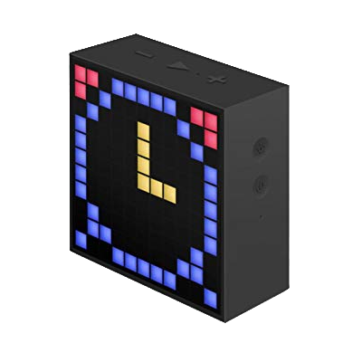|Divoom|TimeBox Mini|Afficheur|Fonction garder la connection obligatoire pour pas avoir le logo bluetooth||

# Dotti

|Image|Marque|Nom|Type|Remarque|Lien|
|---|---|---|---|---|---|
|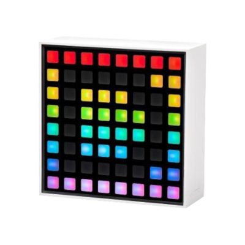|Dotti|Dotti|Afficheur|Fonctionnera beaucoup mieux avec option garder la connection||

# Dreamscreen

|Image|Marque|Nom|Type|Remarque|Lien|
|---|---|---|---|---|---|
||DreamScreen|DreamScreen|Lumières|||

# Fitbit

|Image|Marque|Nom|Type|Remarque|Lien|
|---|---|---|---|---|---|
||Fitbit|Badge|Bracelet|Uniquement pour de la présence||

# Flowerpower

|Image|Marque|Nom|Type|Remarque|Lien|
|---|---|---|---|---|---|
|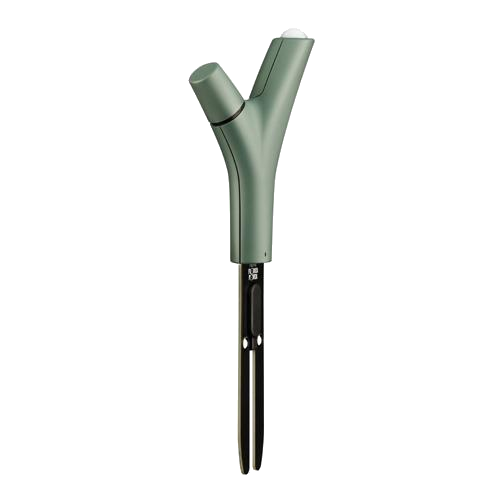|Parrot|Power Flower|Capteurs|Capteurs de plantes||

# Gigaset

|Image|Marque|Nom|Type|Remarque|Lien|
|---|---|---|---|---|---|
||Gigaset|G-Tag|Présence|Uniquement pour de la présence||

# Hector

|Image|Marque|Nom|Type|Remarque|Lien|
|---|---|---|---|---|---|
||Hector|Hector|Capteurs|Ne doit pas rester connecté en permanence sur votre téléphone si vous voulez l'interaction dans Jeedom||

# Ibbq4

|Image|Marque|Nom|Type|Remarque|Lien|
|---|---|---|---|---|---|
|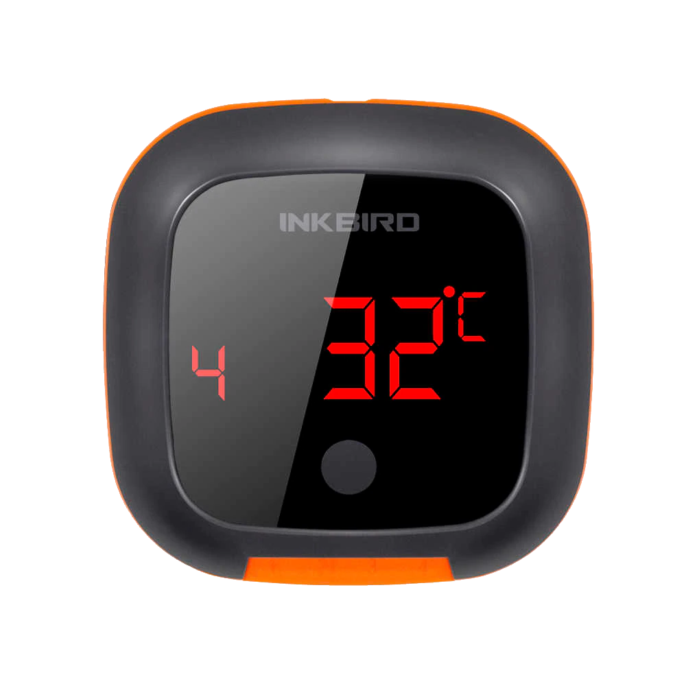|Inkbird|Inkbird IBT-4XS|Capteurs|Capteurs de Température barbecue||

# Ibbq6

|Image|Marque|Nom|Type|Remarque|Lien|
|---|---|---|---|---|---|
||Inkbird|Inkbird IBT-6XS|Capteurs|Capteurs de Température barbecue||

# Itag

|Image|Marque|Nom|Type|Remarque|Lien|
|---|---|---|---|---|---|
||Itag|Itag Noir|Boutons|Attention pour que le bouton fonctionne il faut cocher garder la connection, a partir de ce moment là la connection est gardée et le bouton n'est plus visible des autres antennes. La connection se fait dès que le bouton est visible dans un délai de 20 secondes (cela se confirme par l'arrêt du clignotement) et cela uniquement sur l'antenne choisi en emission (dans ce cas la il faut bien evidemment choisir la même en réception et émission)||
||Itag|Itag Blanc|Boutons|Attention pour que le bouton fonctionne il faut cocher garder la connection, a partir de ce moment là la connection est gardée et le bouton n'est plus visible des autres antennes. La connection se fait dès que le bouton est visible dans un délai de 20 secondes (cela se confirme par l'arrêt du clignotement) et cela uniquement sur l'antenne choisi en emission (dans ce cas la il faut bien evidemment choisir la même en réception et émission)||
||Itag|Itag Rose|Boutons|Attention pour que le bouton fonctionne il faut cocher garder la connection, a partir de ce moment là la connection est gardée et le bouton n'est plus visible des autres antennes. La connection se fait dès que le bouton est visible dans un délai de 20 secondes (cela se confirme par l'arrêt du clignotement) et cela uniquement sur l'antenne choisi en emission (dans ce cas la il faut bien evidemment choisir la même en réception et émission)||
||Itag|Itag Vert|Boutons|Attention pour que le bouton fonctionne il faut cocher garder la connection, a partir de ce moment là la connection est gardée et le bouton n'est plus visible des autres antennes. La connection se fait dès que le bouton est visible dans un délai de 20 secondes (cela se confirme par l'arrêt du clignotement) et cela uniquement sur l'antenne choisi en emission (dans ce cas la il faut bien evidemment choisir la même en réception et émission)||
||Itag|Itag Bleu|Boutons|Attention pour que le bouton fonctionne il faut cocher garder la connection, a partir de ce moment là la connection est gardée et le bouton n'est plus visible des autres antennes. La connection se fait dès que le bouton est visible dans un délai de 20 secondes (cela se confirme par l'arrêt du clignotement) et cela uniquement sur l'antenne choisi en emission (dans ce cas la il faut bien evidemment choisir la même en réception et émission)||

# Jinlin

|Image|Marque|Nom|Type|Remarque|Lien|
|---|---|---|---|---|---|
||Lyl Smart|Jinlin|Lumière|Uniquement pour de la présence (le reste viendra)||

# Kst1

|Image|Marque|Nom|Type|Remarque|Lien|
|---|---|---|---|---|---|
||Koogeek|Kst1|Santé|||

# Logiswitch

|Image|Marque|Nom|Type|Remarque|Lien|
|---|---|---|---|---|---|
|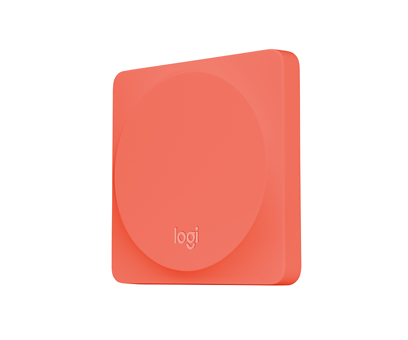|Logitech|Logitech Pop rouge|Boutons|Ne doit absolument pas être connecté sur un autre appareil||
||Logitech|Logitech Pop blanc|Boutons|Ne doit absolument pas être connecté sur un autre appareil||
||Logitech|Logitech Pop vert|Boutons|Ne doit absolument pas être connecté sur un autre appareil||
||Logitech|Logitech Pop gris|Boutons|Ne doit absolument pas être connecté sur un autre appareil||

# Lywsd02

|Image|Marque|Nom|Type|Remarque|Lien|
|---|---|---|---|---|---|
||Xiaomi|Température Humidité|Capteurs|Capteurs de Température Humidité avec écran (Lywsd02)||

# Lywsd03

|Image|Marque|Nom|Type|Remarque|Lien|
|---|---|---|---|---|---|
||Xiaomi|Température Humidité|Capteurs|Capteurs de Température Humidité avec écran (Lywsd03)||

# Meyerdom

|Image|Marque|Nom|Type|Remarque|Lien|
|---|---|---|---|---|---|
|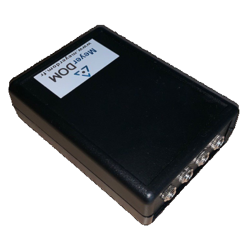|MeyerDom|2 Analogiques|Contacteurs|2 analogiques||
||MeyerDom|4 contacteurs|Contacteurs|4 contacteurs||
||MeyerDom|Contact Vocal|Contacteurs|Contacteur Vocal||

# Meyerdom4contacts

|Image|Marque|Nom|Type|Remarque|Lien|
|---|---|---|---|---|---|
||MeyerDom|4 contacteurs|Contacteurs|4 contacteurs et 2 analogiques||

# Miband

|Image|Marque|Nom|Type|Remarque|Lien|
|---|---|---|---|---|---|
|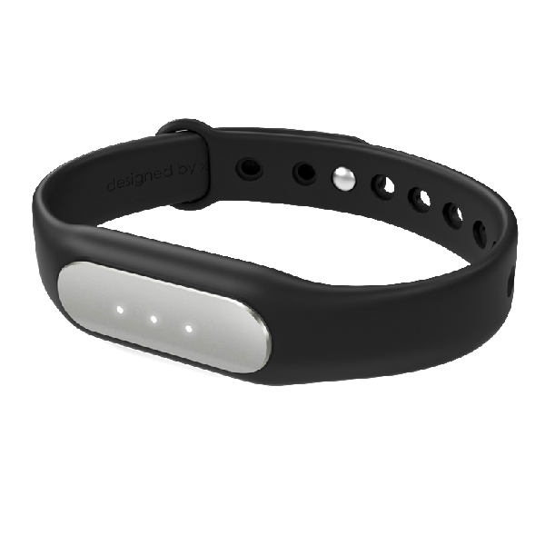|Xiaomi|Miband|Santé|Selon les firmwares peut ne plus fonctionner. Attention si le bracelet est connecté à votre smartphone il est plus visible en bluetooth||
||Xiaomi|Miband1s|Santé|Selon les firmwares peut ne plus fonctionner. Attention si le bracelet est connecté à votre smartphone il est plus visible en bluetooth||
||Xiaomi|Miband2|Santé|Selon les firmwares peut ne plus fonctionner. Attention si le bracelet est connecté à votre smartphone il est plus visible en bluetooth||
|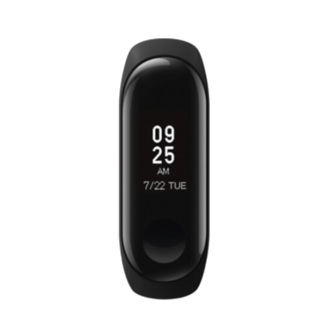|Xiaomi|Miband 3|Santé|Uniquement de la présence pour le moment||
|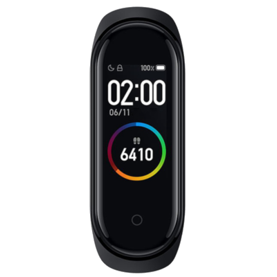|Xiaomi|Miband 4|Santé|Uniquement de la présence pour le moment||
||Xiaomi|Miband (avec led couleur)|Santé|Selon les firmwares peut ne plus fonctionner. Attention si le bracelet est connecté à votre smartphone il est plus visible en bluetooth||

# Miflora

|Image|Marque|Nom|Type|Remarque|Lien|
|---|---|---|---|---|---|
|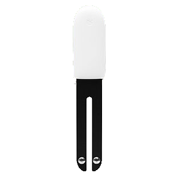|Xiaomi|Miflora|Capteurs|Capteurs de plantes||

# Miscale

|Image|Marque|Nom|Type|Remarque|Lien|
|---|---|---|---|---|---|
|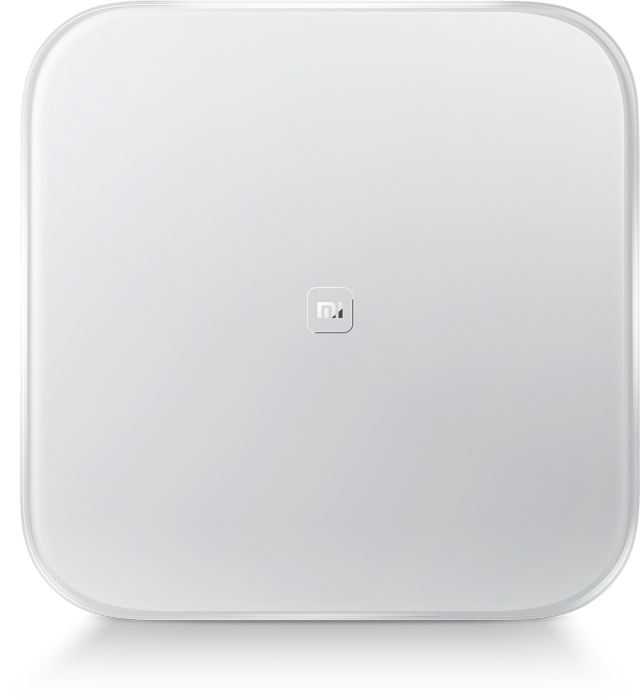|Xiaomi|MiScale|Scale|Gestion de profils complète||
||Xiaomi|MiScale 2019|Scale|Gestion de profils complète||

# Miscale2

|Image|Marque|Nom|Type|Remarque|Lien|
|---|---|---|---|---|---|
||Xiaomi|MiScale V2|Scale|Gestion de profils complète||

# Myfox

|Image|Marque|Nom|Type|Remarque|Lien|
|---|---|---|---|---|---|
|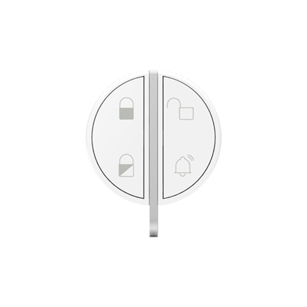|Myfox|Badge|Présence|Uniquement pour de la présence||

# Niu

|Image|Marque|Nom|Type|Remarque|Lien|
|---|---|---|---|---|---|
||Nodon|Niu Wazabi|Boutons|Disponible en plusieurs coloris||
||Nodon|Niu Gris|Boutons|Disponible en plusieurs coloris||
||Nodon|Niu Lagoon|Boutons|Disponible en plusieurs coloris||
||Nodon|Niu Softberry|Boutons|Disponible en plusieurs coloris||
||Nodon|Niu Techblue|Boutons|Disponible en plusieurs coloris||
||Nodon|Niu Blanc|Boutons|Disponible en plusieurs coloris||

# Noke

|Image|Marque|Nom|Type|Remarque|Lien|
|---|---|---|---|---|---|
||Noke|Noke|Cadenas|Visible que sur appui du bouton (peut fonctionner via un hack des trames pour récupérer la clé) mais ne sera pas fait car illégal||

# Nut

|Image|Marque|Nom|Type|Remarque|Lien|
|---|---|---|---|---|---|
||Nut|Nut|Présence|Uniquement pour de la présence||
||Nut|Nut Mini Bleu|Présence|||

# Parrotpot

|Image|Marque|Nom|Type|Remarque|Lien|
|---|---|---|---|---|---|
||Parrot|Parrot Pot|Capteurs|Capteurs de plantes||

# Playbulb

|Image|Marque|Nom|Type|Remarque|Lien|
|---|---|---|---|---|---|
||Playbulb|Sphère|Lumières|Portée capricieuse, qui peut justifier un traitement des actions un tout petit peu long. Peut être détecté à la place d'un autre playbulb si c'est le cas changez dans le menu déroulant||

# Ropot

|Image|Marque|Nom|Type|Remarque|Lien|
|---|---|---|---|---|---|
|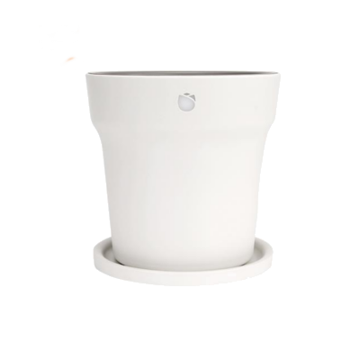|Xiaomi|Miflora|Capteurs|Capteurs de plantes||

# Ruuvi

|Image|Marque|Nom|Type|Remarque|Lien|
|---|---|---|---|---|---|
|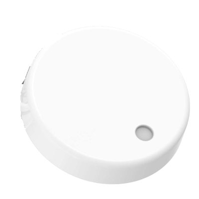|Ruuvi|Ruuvi|Beacon|Capteurs beacon||

# Smartplug

|Image|Marque|Nom|Type|Remarque|Lien|
|---|---|---|---|---|---|
|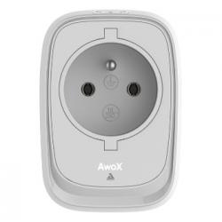|Awox|Smartplug|Prises|||

# Tb05

|Image|Marque|Nom|Type|Remarque|Lien|
|---|---|---|---|---|---|
|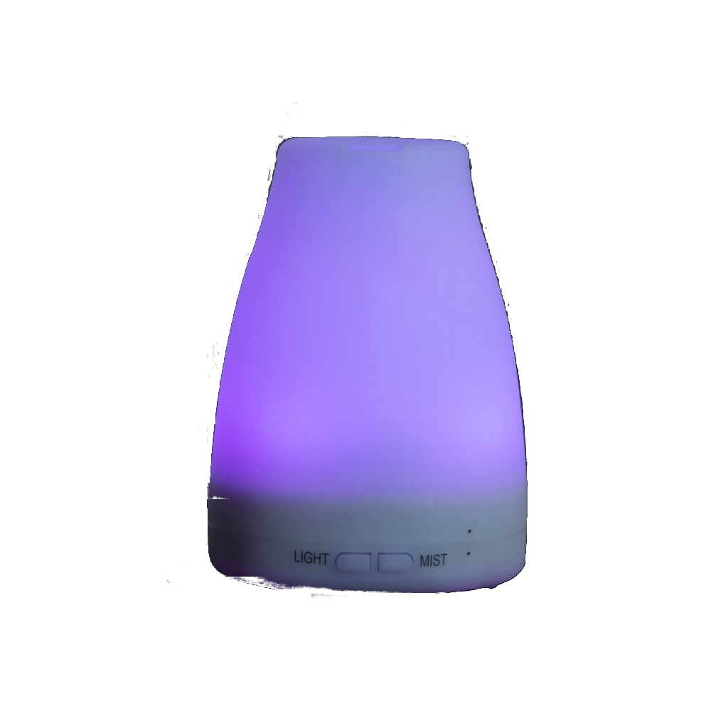|E-Diffuser|Tb05|Diffuseur|Il est recommandé d'utiliser l'option garder la connection. Obligatoire pour tenter expérimentalement l'accès au couleur direct||

# Ticatag

|Image|Marque|Nom|Type|Remarque|Lien|
|---|---|---|---|---|---|
||Tibe|Ticatag|Boutons|Le relachement est envoyé même après un appui simple ou appui double||

# Tile

|Image|Marque|Nom|Type|Remarque|Lien|
|---|---|---|---|---|---|
|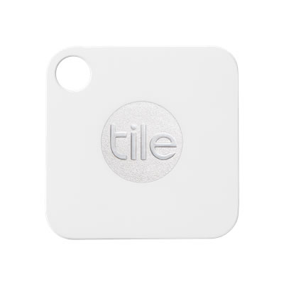|Tile|Tile|Présence|Uniquement pour de la présence||

# Wistiki

|Image|Marque|Nom|Type|Remarque|Lien|
|---|---|---|---|---|---|
||Wistiki|Wistiki|Présence|Uniquement pour de la présence||

# Xiaomiht

|Image|Marque|Nom|Type|Remarque|Lien|
|---|---|---|---|---|---|
||Xiaomi|Température Humidité|Capteurs|Capteurs de Température Humidité avec écran||
||Xiaomi|Température Humidité Cleargrass|Micromodule|Capteurs de Température Humidité avec écran e-ink||

# Yeelight

|Image|Marque|Nom|Type|Remarque|Lien|
|---|---|---|---|---|---|
||Yeelight|Bed|Lumières|Il faut valider l'appairage en appuyant sur le bouton. Si éteint il faut allumer avant de choisir une couleur||

Cette liste est basee sur des retours utilisateurs, l\'équipe Jeedom ne peut donc garantir que tous les modules de cette liste sont 100% fonctionnels

2024-08-12 02:21:03
