# Compatibilité des caméras

|Image|Nom|Remarque|Lien|
|---|---|---|---|
||IP_Linkcom/Alcatel portier video|||
||Android IP Webcam|||
||Axis|||
||Bluestork|||
|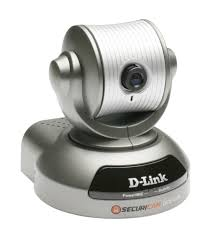|D-Link DCS-5300G|||
||D-Link DCS|||
||D-Link DCS|||
||D-Link DCS PTZ|||
||D-Link DSC-5020L && DCS-935L|||
||D-Link EyeOn baby Monitor|||
||Dericam H502W|||
||Ebode extérieure|||
|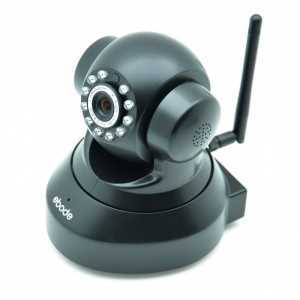|Ebode HD motorisée|||
|||||
||Foscam FI9803EP|||
||Foscam FI9803P|||
||Foscam R2|||
||Foscam HD|||
||Foscam HD motorisée|||
||Foscam motorisée|||
||Heden CAMHED05IPWN (V5.5), VISIONCAM22|||
||Heden VisionCam HD CAMHD08MD0|||
||Heden VisionCam CAMHED04IPWN|||
||Hikvision DS-7216HWI-SH/A (XXX = 101 pour le channel 1 / XXX = 202 pour le channe 2)|||
||Hikvision DS-2CD2132-I, DS-2CD3332-I, DS-2CD2232-I5, DS-2CD2732F-IS|||
||Karotz|||
||Konx portier vidéo|||
|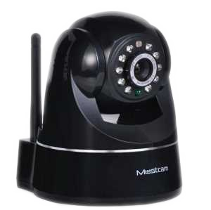|Mustcam HD motorisée|||
|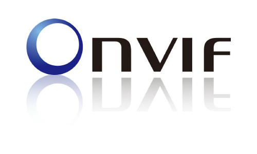|Onvif|||
||Openkarotz Camera|||
||Panasonic BL-C121|||
|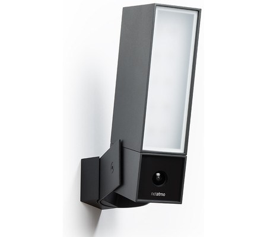|Netatmo Presence|||
||RPI Cam|||
|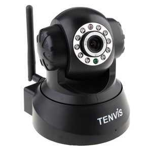|Tenvis|||
|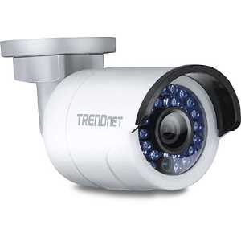|TrendNet TV-IP310PI|||
||TrendNet TV-IP672WI|||
||Vera Vista cam 700/Secomm/Homelive|||
|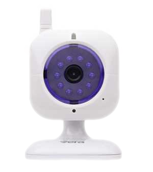|Vera Vista cam SD|||
||Vivotek 8xxx et 7xxx|||
||Wanscam HW0021|||
|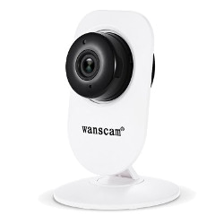|Wanscam HW0026|||
||Wanscam HW0036|||
|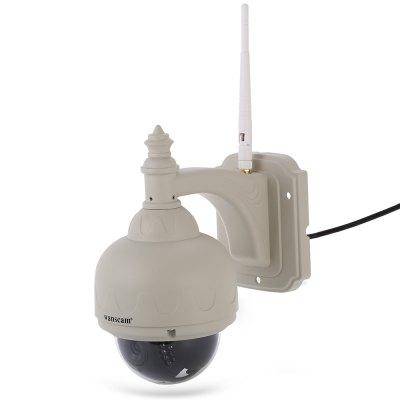||||
|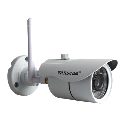|Wanscam HW0043|||
||Wanscam HW0045|||
||Wanscam HW0049|||
||Wanscam HW00XX|||
||Wanscam motorisée|||
|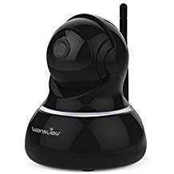|Wanscam q3(s)|||
||Netatmo Welcome|||
||Y-Cam|||
||Zavio F3115|||

Cette liste est basee sur des retours utilisateurs, l\'équipe Jeedom ne peut donc garantir que tous les modules de cette liste sont 100% fonctionnels
