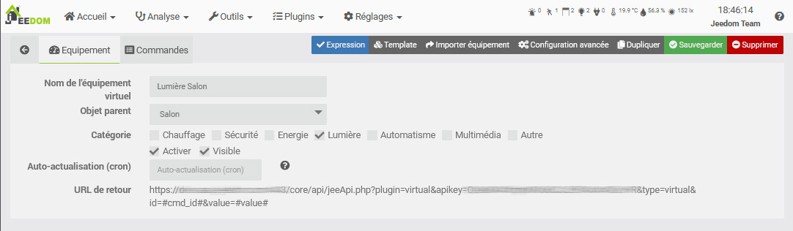

# Concept

Voici les principaux concepts de base de Jeedom. Cette documentation reste volontairement simple afin de vous aider à prendre en main votre domotique.

Les possibilités de Jeedom sont quasi infinies, puisque vous pouvez créer énormément de choses avec quelques scripts php, python ou autres, mais ce n'est pas le sujet ici.

> Tip
>
> Les liens ci-dessous pointent vers le Core v4.5. Une fois sur la page de documentation (Manuel d'utilisation ou de configuration) vous pouvez changer de version dans le menu en haut à gauche pour basculer sur la version correspondant au Core que vous souhaitez.

## Affichage

Jeedom permet d'interfacer de très nombreux périphériques ensemble, que ceux-ci soient basés sur les protocoles Z-Wave, Enocean, Zigbee etc, sur des APIs grâce à des plugins ou directement sous forme de scripts. Vous pouvez regarder sur le [Market](https://market.jeedom.com/) pour avoir un aperçu des périphériques supportés.

Vous pouvez afficher ces périphériques de plusieurs manières :

- Sur le [Dashboard](../core/4.5/dashboard)
- Sur la [Synthèse](../core/4.5/overview) (v4.5)
- Sur une [Vue](../core/4.5/view)
- Sur un [Design](../core/4.5/design)
- Sur un [Design 3D](../core/4.5/design3d)

Ceux-ci sont consultables dans un navigateur sur un ordinateur de bureau, sur un smartphone avec la WebApp ou l'application mobile : [Version Mobile](../mobile/index)

## Les Objets

Afin d'organiser vos périphériques, vous pouvez créer des [Objets](../core/4.5/object).

Ces objets peuvent représenter des pièces de l'habitation (Salon, Chambre, Atelier). Chaque objet peut avoir un objet parent. Cette hiérarchie servira à l'affichage sur le Dashboard. Par exemple, vous pouvez avoir un objet **Maison**, puis des objets **Salon** et **Chambre** enfants de l'objet **Maison**. Une fois sur le Dashboard, l'objet **Maison** affichera aussi, en dessous, ses objets enfants.

> **Conseil**
>
> Dans **Réglages → Préférences**, vous pouvez définir sur quel objet vous souhaitez arriver sur le Dashboard. [Préférences](../core/4.5/profils)

## Les Équipements et leurs commandes

### Commandes

Pour interagir avec notre domotique, il faut des commandes ! Celles-ci sont de deux types :

> Note
>
> Rassurez-vous, les commandes sont normalement créées automatiquement ! Ces explications sont pour une meilleure compréhension.

- Les commandes *info* :
Ces commandes stockent des informations issues de capteurs. Par exemple la température d'une sonde, un mouvement d'un capteur de présence, etc.
Ces commandes peuvent être historisées afin de conserver ces informations dans le temps sous forme de courbe : [Historique](../core/4.5/history)

Ces commandes peuvent aussi servir à déclencher des [scénarios](../core/4.5/scenario) afin d'automatiser des actions en fonction des informations remontées par vos capteurs. Par exemple, un capteur de mouvement détecte une présence, ce qui va déclencher un scénario qui allumera la lumière.

- Les commandes *action* :
Ces commandes permettent de piloter vos actionneurs. Par exemple, les commandes ``on`` et ``off`` d'une prise commandée vous permettront de l'allumer et de l'éteindre.

Les commandes action sont généralement liées à des commandes info. Ici, notre prise possède deux actions ``on`` et ``off``, généralement liées à une information **Etat**.

Ces deux types de commandes sont rattachées sous la forme d'un équipement. L'équipement possède donc des commandes info et/ou action, et c'est cet équipement qui aura pour parent un Objet, vous permettant de l'afficher où vous le souhaitez.

Chaque commande peux également posséder ce qu'on appelle un type générique, permettant à Jeedom et à certains plugins de connaitre le type de commande (Etat d'une prise, bouton d'une lumière, etc). [**Outils → Types d'équipement**](../core/4.5/types).

### Équipement

- Physiquement: J'ai une prise avec un bouton on/off et une led d'état, dans le salon.
- Dans Jeedom: J'ai un équipement avec deux actions on et off et une info état, dans l'objet Salon.

Ces équipements sont créés par des plugins. Par exemple, le plugin Z-Wave vous permettra d'inclure votre prise Z-Waze, ce qui créera un équipement avec ses commandes que vous pourrez nommer et lier à un Objet.

En terme d'affichage, chaque commande est affichée grâce à un Widget. Le Core propose les principaux Widgets, ainsi qu'un outil pour en créer (V4) : [Widgets](../core/4.5/widgets).

Ces commandes sont regroupées dans une tuile correspondant à votre équipement. Et cette tuile sera donc affichée sur le Dashboard dans l'Objet que vous lui aurez assigné.

Quel que soit votre périphérique, il sera donc créé sous forme d'un équipement, à partir d'un [Plugin](../core/4.5/plugin).

Ce périphérique comportera ses propres commandes *info* ou *action*. Ces commandes seront affichées sous forme de Widgets formant la tuile de l'équipement, dans son objet parent.

Vous verrez ensuite que chaque Objet, Équipement ou Commande possède de nombreuses options, en terme de fonctionnalités ou d'affichage. Mais chaque chose en son temps, maintenant vous devriez avoir compris les concepts de base de Jeedom et ainsi pouvoir commencer à organiser votre domotique en sachant où regarder.

## Mon premier scénario

L’intérêt de la domotique, au delà du contrôle centralisé et à distance de nos périphériques, réside surtout dans l'automatisation. Le but n'est pas de passer des heures devant son Dashboard ou son Design, mais au contraire que votre logement s'adapte à vos habitudes et se fasse oublier. Plus de volets à ouvrir et fermer tous les jours, plus de lumières à allumer et éteindre, être prévenu quand mettre la poubelle sur la rue, quand il y a du courrier dans la boîte aux lettres, le chauffage qui s'adapte en fonction des saisons et des conditions climatiques. Les possibilités sont infinies, et dépendent du mode de vie de chacun. Les scénarios sont là pour çà !

Un scénario est une suite d'actions définies qui s’exécuteront à certains moments de la journée. L’exécution peut-être programmée (tous les Lundis à telle heure), ou provoquée par un événement. Comme vue plus haut, cet événement peut par exemple être notre commande info *Présence* d'un détecteur de mouvement, suite à une détection.

Le but ici n'est pas d'être exhaustif mais de découvrir les scénarios au travers d'exemples simples. La [documentation du manuel d'utilisation](../core/4.5/scenario) est beaucoup plus complète.

### Allumage de la lumière sur détection de mouvement.

Admettons que nous ayons une lumière pilotée et un détecteur de mouvement dans la chambre.

- Allez dans **Outils → Scénarios**
- Cliquez sur *Ajouter* puis donnez un nom au nouveau scénario.
- A droite, dans la partie *Déclenchement*, vérifiez que le mode est bien en *Provoqué* puis cliquez sur *+ Déclencheur*.
- A l'aide du bouton *choisir une commande* à droite du champ *Evénement*, sélectionnez l'objet puis l’équipement et sa commande.

Le *Déclencheur* est ce qui va déclencher l’exécution de ce scénario. Ici, nous souhaitons le déclencher quand notre détecteur détecte une présence, nous allons donc utiliser la commande `#[Chambre][Détecteur Chambre][Présence]# == 1`.

Les `#` indiquent une commande, ensuite on trouve `[le nom de son objet parent]` puis `[le nom de l'équipement]` et enfin `[le nom de la commande]`. Ici, on ajoute ` == 1` car on veut que le scénario se déclenche seulement sur la détection d'une présence. Or sur un détecteur de présence, cette détection repasse à 0 quelques secondes après. Ce passage à 0 ne déclenchera donc pas une nouvelle fois notre scénario.

- Cliquez sur l'onglet *Scénario* puis sur le bouton en haut *Ajouter bloc*. Choisissez un bloc *Action* puis sur celui-ci, *Ajoutez* une *Action*. Cette action sera notre commande d'allumage de la lumière. Selon le même principe : `#[Chambre][Lumière Chambre][On]#`.

- Sauvegardez, et votre scénario est prêt !

Nous n'avons fait ici qu’effleurer les possibilités des scénarios. Vous pouvez ajouter des conditions (bloc *Si/Alors/Sinon*), temporiser des actions (bloc *Dans*), les programmer (bloc *A*) et même utiliser directement du code php (bloc *Code*).

Nous avons utilisé ici le mode de déclenchement *provoqué* avec une commande. Mais vous pouvez également utiliser (et combiner) le mode *programmé* pour exécuter un scénario tous les matins ou toutes les heures, etc.

### Programmation du jour.

Un sujet récurrent pour les débutants sur Jeedom, la programmation d’événements journaliers comme :

- Allumer la cafetière à 7h en semaine.
- Ouvrir les volets au lever du soleil.
- Fermer les volets au coucher du soleil, si je ne suis pas là.

Pour ce type de scénario, voici une très bonne introduction : [Programmation du jour](https://kiboost.github.io/jeedom_docs/jeedomV4Tips/Tutos/ProgDuJour/fr_FR/)
